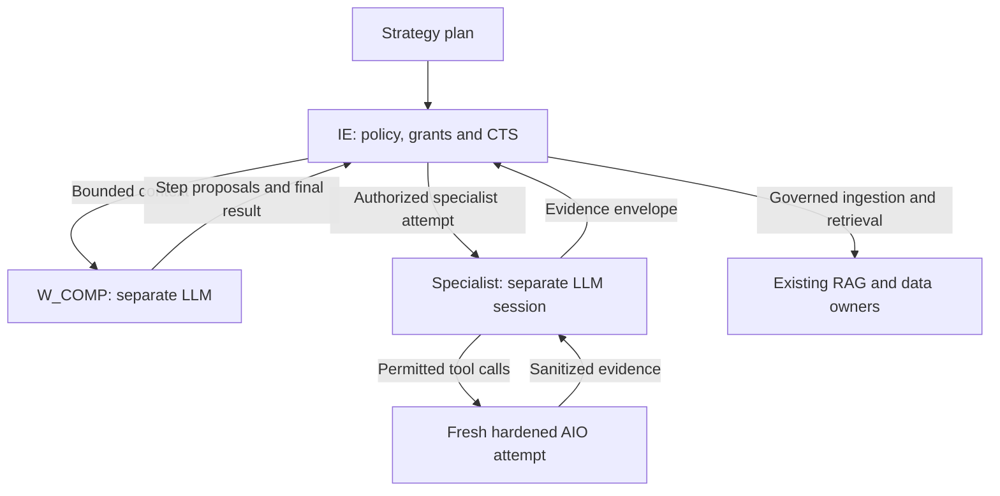

# W_COMP — Competitor Intel Engine implementation specification

Version 1.0 · Research checked 22 September 2026 · Scope: competitor intelligence for brand development and marketing

**Decision:** retain Model A and the existing Enterprise OS owners. `W_COMP` is a reasoning-only domain coordinator with no sandbox capability. Each of six specialists has its own instantiated LLM session and performs every research/tool operation in a fresh, bounded AIO-Sandbox attempt. IE authorizes execution, owns workflow state, brokers enterprise context, and accepts evidence for persistence. Strategy remains with `W_STRAT`.

**Evidence limit:** the attachments contain architecture text, a draw.io export, and repository listings—not Python implementations or deployed configuration contents. This document defines the target behavior and exact proposed paths. It does not claim verified function signatures, implemented security controls, a tested patch, or production readiness. Source-dependent modifications below have explicit inspection conditions; no repository or attachment was modified.

## 1. Inspection findings and precedence

Precedence for this design: the current user requirements → verified implementation when supplied → matching repository trees for placement → supplied architecture descriptions → upstream documentation for external behavior. A filename proves placement, not functionality.

| Inspected input | Observed evidence | Consequence |
|---|---|---|
| `File Tree-backend(6).tree` | Existing `app/agents/competitor_intel_engine/{__init__.py,competitor_intel.py}` and separate `app/agents/competitor_intel.py`; no competitor profiles, subagents, schema or dedicated tests listed | Extend the package. Inspect the separate worker file before deciding whether it is a compatibility facade, implementation, or duplicate |
| `File Tree-enterprise_os(5).tree` | Confirms those backend locations and `Agentic System Research/final/` documentation paths | Use repository-relative paths below, not the original author's workstation path |
| Both backend listings | Product Evidence already has `profiles.py`, six subagents, a domain schema and focused tests; Development and Creative also have specialist packages | This is a placement precedent only. Reuse compatible factories/contracts after inspecting their contents; no evidence supports consolidating the six requested competitor roles |
| `File Tree-sandbox(5).tree` and enterprise tree | Existing hardened compose, egress proxy, seccomp profiles, cleanup script and `s-scrape/{SKILL.md,scripts/run.py}` | Preserve these owners. Whether they enforce the required controls remains unverified |
| `Backend Hierarchy(5).md`, sections 2–3 | IE owns orchestration/context; shared grants, sandbox, artifact and provenance schemas exist; sandbox `client.py` wraps `agent_sandbox`; legacy competitor worker requests `S_SCRAPE` | Keep shared contracts and adapter ownership; remove direct W_COMP execution authority in the target design |
| `Final-Level Full Architecture(9).md`, sections 1–6 | Model A is explicit, but W_COMP has a direct `S_SCRAPE` edge and a “Yes” sandbox-access entry; blanket checklist gives all workers access | Correct only the competitor relationship and the blanket wording needed to describe its exception |
| `flowchart.drawio(9).html` | Decoded embedded graph: 94 cells. W_COMP node suffix `-119`, scraper `-128`, direct sandbox edge `-169`; IE `-100`; sandbox controller `-131` | Replace edge `6eGf833fTBYhiYYZQ1EN-169` when updating the canonical diagram; preserve other graph identities and renderability |
| Architecture security text | Treats namespaces/cgroups as micro-virtualization; asserts memory shredding and universal persistence of all intermediate data | These are claims, not verified deployment guarantees. W_COMP requires measured container isolation, controlled cleanup and policy-permitted evidence persistence; no private reasoning or credentials in logs |

The draw.io and Markdown also show `CDB → W_LEARN`, despite Model A's IE-only data mediation. Record this pre-existing inconsistency for its owner; do not refactor learning or telemetry within W_COMP. Its presence cannot justify competitor database access.

The sandbox listing contains a large SDK/generated-client surface. Nothing in those filenames proves that fresh attempts, authenticated caller binding, per-attempt egress, or credential mediation are implemented. The supplied docs refer to `governance_milestone.py`, but it is absent from the current backend tree; do not create or depend on it for this change.

## 2. Validated architecture and ownership



This is a logical flow, not a new service topology. The domain workflow is `DISCOVERY → {ADS, PRICE, SEARCH, POSITION} → SYNTH → W_COMP validation → IE acceptance`. IE's existing scheduler executes that graph; W_COMP may propose steps and inspect IE-supplied step results, but cannot commit task transitions, create executable grants, or control containers.

| Owner | Owns | Explicit exclusions |
|---|---|---|
| `W_STRAT` | Holistic plan, objectives, segmentation, media mix, campaign choices and budgets | W_COMP cannot revise the plan |
| IE plus existing policy/security/CTS services | Authorized context, attenuated child grants, admission, scheduling, retries, checkpoints, resource reservations, holds, result acceptance and persistence routing | No delegation of canonical state ownership |
| `W_COMP` | Interpret plan assumptions; produce bounded research-step proposals; check final brief against scope and evidence | No sandbox client, SDK, browser, HTTP client, MCP host, database/RAG/CMS/memory handle, publication or ad-management capability |
| Six specialists | Distinct domain interpretation and evidence work under an IE-issued attempt grant | No enterprise retrieval, persistence, direct sibling communication, strategy decisions or tool execution outside their attempt |
| Existing sandbox adapter/controller | Attested attempt lifecycle, tool dispatch, result transport, egress and cleanup | No business strategy, evidence truth or independent task-state authority |
| `COMP-SYNTH` | Competitor-domain normalization, conflicts, corroboration and brief production | Cannot replace IE-wide evidence acceptance or memory-promotion policy |
| Existing HITL | Reviews holds or escalation dossiers when policy requires | Approval does not override source terms, grant expiry or technical denials |

**Delegation without a privilege contradiction:** the W_COMP mandate contains a research scope and child capability ceilings, not an executable sandbox token. IE issues separately audience-bound grants to authorized specialists, within those ceilings. Thus W_COMP can request competitor research without acquiring a child's execution capability. Never derive a privileged child merely from an arbitrary worker-supplied role string.

**Seven separate reasoning profiles.** `profiles.py` declares immutable role configuration, output schema, prompt-template hash, permitted task types, budget limits and model configuration for W_COMP plus all six specialists. Instantiate a new logical LLM client/session per role invocation and per retry, with distinct instance ID and history. Sharing provider/model weights or a stateless transport pool is acceptable; sharing an agent object, conversation, tool registry, mutable cache, credentials or scratchpad is not. No singleton LLM agent.

**Execution placement:** use the existing backend LLM client for independently scoped cognition and the existing sandbox client for each specialist's tools. Backend role modules are trusted definitions/drivers; fetched content, parsers, browser operations, comparisons and executable payloads run only in that specialist's fresh sandbox. This avoids adding an in-sandbox MCP host or giving a container model-provider secrets. If inspected code instead already hosts specialist reasoning inside AIO, retain that placement only with an existing attempt-scoped inference transport and equivalent isolation. Do not introduce a new inference service or give general IE network access to satisfy it.

## 3. Specialist contracts and boundaries

All specialists receive an immutable `CompetitorAttemptInput`: IE grant reference, tenant/run/step/attempt identity, their role profile, relevant strategy assumption IDs, entity/source scope, market/locale/time window, resource limits, preauthorized baseline evidence bytes and policy decision references. An artifact URI alone is insufficient: IE materializes allowed bytes into read-only attempt input. Inputs never contain enterprise credentials, a database client or a general retrieval callback.

All return a `SpecialistResult` with typed observations/findings, evidence/artifact manifests, coverage records, failures, proposed follow-ups, resource usage and execution/provenance references. Every row below inherits the common failure vocabulary in section 7.

| Specialist / module | Specific input and LLM purpose | Required output and evidence | Sandbox operations and public egress | Failure and handoff |
|---|---|---|---|---|
| `COMP-DISCOVERY` / `discovery.py` | Plan market/category scope, approved seed entities/domains, IE-supplied watchlist. Resolve brands, advertisers, parent/subsidiary and reseller relationships; propose relevance with explanations | Entity candidates, aliases, platform IDs, relationship evidence, source map and proposed watchlist delta. Distinguish confirmed identity from name similarity | Approved search queries and bounded official-site/transparency lookups; hostname and entity normalization. Egress only to admitted seed origins, approved search provider and approved transparency endpoints | `ENTITY_AMBIGUOUS`, `SOURCE_UNAVAILABLE`, `SCOPE_EXHAUSTED`. Hand confirmed scoped entities to IE; ambiguous candidates remain separate and are not silently merged. New domains require IE admission before collection |
| `COMP-ADS` / `advertising.py` | Confirmed advertiser identities, platform/region filters, date range, authorized baseline snapshots. Interpret disclosed ad metadata and classify observed changes | Ad IDs, payer/advertiser IDs, preview reference, disclosed dates/status/targeting/reach where available; new/changed/not-observed events. Capture query and pagination evidence. Never infer spend, success or targeting from copy or longevity | Approved official transparency API reads or explicitly permitted public UI capture; parse JSON/DOM and compare normalized metadata. No paid-ad clicks, campaign APIs, reactions or reporting actions. Platform endpoints and necessary separately admitted asset origins only | `AUTH_REQUIRED`, `REGION_UNSUPPORTED`, `RATE_LIMITED`, `PAGINATION_INCOMPLETE`, `RESTRICTED_PREVIEW`. Submit partial evidence with limits; missing preview does not erase disclosed metadata. Disappearance is not campaign termination |
| `COMP-PRICE` / `pricing.py` | Confirmed products/variants, permitted catalog/pricing URLs, market, currency, quantity, purchase conditions and baseline | Product/variant/pack identity, decimal amount or range, currency, tax/shipping basis, billing interval, subscription/eligibility conditions, availability, promotion dates and bundle composition. Source selector or JSON pointer required. Trajectory only for comparable observations | Fetch admitted public product/pricing/promotional pages; extract, normalize units and compute deterministic deltas inside sandbox. Egress to approved merchant/brand origins; no carts, checkout or account access | `VARIANT_AMBIGUOUS`, `PRICE_NOT_DISCLOSED`, `CURRENCY_UNKNOWN`, `NOT_COMPARABLE`, `PARSER_DRIFT`. Retain original text; null unknown amounts, never zero. Hand comparable series and excluded comparisons to SYNTH via IE |
| `COMP-SEARCH` / `search_intel.py` | IE-provided keyword cohort, own-brand page inventory, competitor domains, country/language/device/location, provider, observation depth/window | Query-specific SERP rows with result type, observed rank and URL; provider-reported visibility/volume/KD only when supplied, marked estimates as appropriate. Content-gap evidence compares sampled competitor pages with the supplied brand inventory | Licensed/authorized SERP or search API and approved page fetches; deterministic sampled metrics and content mapping. Search-provider and admitted result origins only. No own-brand Search Console login or competitor analytics access | `PROVIDER_UNAVAILABLE`, `QUERY_TRUNCATED`, `LOCALE_UNVERIFIED`, `BASELINE_MISSING`. Report sampled visibility, not universal rankings/traffic. Missing brand inventory permits competitor evidence only, not a confirmed brand content gap |
| `COMP-POSITION` / `positioning.py` | Confirmed entities, approved home/product/about/offer pages, approved positioning taxonomy and baseline | Verbatim short messaging spans, placement and page version, stated value propositions/offer terms, evidence-linked positioning hypotheses and observed wording changes | Public page capture, bounded extraction and semantic/structural comparison. Approved competitor origins only | `MESSAGE_AMBIGUOUS`, `BASELINE_MISSING`, `PARSER_DRIFT`, `CONFLICTING_VARIANTS`. Separate “competitor states X” from X being true. No customer reviews, sentiment, personas or new creative assets |
| `COMP-SYNTH` / `synthesis.py` | IE-accepted immutable specialist outputs, baselines, coverage/failure records and strategy assumptions | Normalized evidence index, duplicate groups, conflict sets, freshness/confidence assessments, assumption verdicts, scoped market-change alerts, final evidence brief and evidence requests | Local schema/hash verification, normalization, matching, numeric calculations and lineage validation in its own fresh sandbox. **Zero research-network egress**; no new collection | `PROVENANCE_INVALID`, `EVIDENCE_INSUFFICIENT`, `UNRESOLVED_CONFLICT`, `STALE_INPUT`. Return partial/inconclusive brief or an IE-mediated bounded recheck request; never manufacture corroboration or fetch missing citations |

**W_COMP profile:** interpret the holistic plan only enough to identify competitor assumptions and research scope. Allowed verdicts are `supported`, `challenged`, `mixed`, `not_testable`, and `insufficient_evidence`. Output states what the evidence changes about an assumption and which Strategy-owned decision may need review. It cannot output recommended spend, campaign allocation, creative production, customer-voice analysis or attribution.

The adapter must map a closed competitor operation set onto existing runtime capabilities. These are proposed operation IDs, not new services: `public_page_capture`, `transparency_query`, `serp_query`, `entity_normalize`, `ad_extract_compare`, `price_extract_compare`, `serp_normalize_compare`, `position_extract_compare`, and `evidence_synthesize`. DISCOVERY may use the first three only within discovery-purpose source permissions plus `entity_normalize`; ADS uses transparency/page capture plus `ad_extract_compare`; PRICE uses page capture plus `price_extract_compare`; SEARCH uses SERP/page capture plus `serp_normalize_compare`; POSITION uses page capture plus `position_extract_compare`; SYNTH uses only `evidence_synthesize`. W_COMP has an empty operation set. Local modes have no network capability. Validate operation, source policy, audience and arguments together—an authorized role alone does not authorize every source or operation.

## 4. Deterministic runtime, recovery and resource control

“Deterministic” applies to admissible steps, transitions, budgets, retry decisions and accepted recorded inputs/outputs. Live sources and LLM text are not guaranteed reproducible. Replay uses captured evidence and recorded model responses, not new network calls.

1. **IE admission.** Require a versioned Strategy plan with stable assumption IDs, tenant/brand, research questions, explicit geographic/time scope and permitted source purposes. Bind hashes of plan, policy and context. Reject missing scope or expired/revoked grants before any LLM or network work.
2. **W_COMP interpretation.** Instantiate its own LLM. Produce a schema-bound `ResearchStepProposal` referencing only the six role IDs and allowed assumptions. Deterministic validation rejects strategy expansion, unsupported task types or invented source permission. No tool registry is attached to W_COMP.
3. **IE freeze and checkpoint.** Compile the fixed domain DAG into the existing scheduler/CTS representation; record the validated proposal and its hash. Existing source/rate/resource owners reserve budgets. The LLM cannot set its own concurrency or retry count.
4. **Discovery attempt.** IE authorizes a fresh specialist LLM session and fresh sandbox ID, stages permitted context, executes bounded discovery and validates its result. Store candidate evidence through IE. Admit new entities/sources separately; proposed scope is never automatically executable.
5. **Capture barrier.** Once entity/source admission is complete, IE schedules ADS, PRICE, SEARCH and POSITION independently. Use one permitted specialist/source/entity slice per bounded attempt; split larger workloads at declared limits. Acquisition is deduplicated by IE's run checkpoint: identical admitted capture requests have one designated collector and other consumers receive immutable captured inputs through IE.
6. **Per-attempt execution.** Authenticate tenant/role/attempt at the adapter, reserve limits, launch fresh AIO instance, apply effective egress policy, and stage inputs read-only. Permit only typed, allowlisted tools. Validate every URL, redirect, pagination request and browser subresource. Reject credentials or scope expansion in tool arguments.
7. **Per-attempt completion.** Extract and sanitize artifacts, validate schemas/hashes, collect controller attestation and return results to IE. IE records proposed observations, receipt, failures and lineage using existing owners. The controller tears down the sandbox on success, error, cancellation or timeout. Downstream acceptance requires cleanup confirmation; missing confirmation holds the attempt for infrastructure review.
8. **Barrier and synthesis.** Every planned capture step must reach a recorded terminal outcome: successful, partial, failed, denied or skipped with reason. IE passes accepted evidence plus coverage/failures into a new SYNTH LLM session and its own fresh offline sandbox. No open-ended agent debate or recursive spawning.
9. **Bounded corroboration round.** SYNTH may request a recheck for a specific source/claim/conflict. IE either declines it with reason or adds an allowed capture attempt followed by a fresh SYNTH attempt. Proposed default: at most one recheck round per run. It does not reset run limits.
10. **W_COMP validation.** Receive the IE-supplied synthesis envelope; check assumption coverage, scope and evidence links. Unsupported wording becomes an evidence gap or validation failure. Return the final brief and proposed state delta to IE without invoking a sandbox or persisting anything.
11. **IE acceptance.** Recheck grant/plan/policy validity, artifact integrity, lineage, completeness and scope. Commit accepted output references and CTS transition through existing services. Route review needs through existing HITL; send the accepted evidence brief back to Strategy through IE. No external publication, campaign changes or automatic memory promotion.

**Idempotency and checkpoints.** Logical step key = hash of tenant + run + step + role + plan/context/profile/policy versions + canonical input hashes + source/query/market/time-window identity. Retries retain that key and get a new attempt ID and sandbox ID. IE accepts at most one committed result per logical step using existing CTS compare-and-set/locking behavior. Late results from cancelled, superseded or expired attempts are audited and rejected. Recovery loads accepted artifact references through IE, never a worker's local files. Immutable source snapshots may be reused if still permitted and fresh; session/sandbox state may not.

**Proposed operating defaults—not measured capacity:** two concurrent capture attempts per run, one request in flight per origin, three total attempts per logical step, one discovery-expansion pass, one corroboration round, 30 acquisition requests and 10 MiB retained output per attempt, 180-second attempt deadline and 20-minute run deadline. IE must supply token and monetary compute caps before admission. Terms/provider limits and stricter existing limits always win. Pagination, retries, redirects and browser requests consume explicit applicable request/byte budgets; oversized tasks return partial coverage. Browser resource needs and these defaults require environment measurements before rollout.

**Retry decisions:** transient connection/5xx errors use IE-recorded capped backoff; 429 respects `Retry-After` and the shared origin/provider cooldown. If the next allowed execution is past the deadline, return a deferred/partial outcome. Auth failures, robots/terms/policy denials, unsupported region, entity ambiguity and schema/security violations are not blind retries. Parser drift requires a reviewed adapter change or authorized alternative source. A malformed LLM response may use the remaining attempt budget in a fresh attempt, without additional permissions. No sleeping container retained between retries.

## 5. Data and evidence contracts

Place domain types in `backend/app/schemas/competitor_intel.py`. Compose existing grant, artifact, sandbox-result and provenance types; do not copy them into a parallel envelope system. The names below are proposed logical types, not claims about existing class names. Bind to actual framework conventions after source inspection.

Common rules: versioned JSON contracts; reject unexpected privilege-bearing fields; UTC RFC 3339 timestamps with preserved source timezone/date precision; immutable validated values; decimal strings for monetary values; nonnegative counts; explicit `null` plus reason for unavailable data. Source dates are not retrieval dates. Tenant identity comes from the validated grant, never from source content.

| Contract | Required fields and validation |
|---|---|
| `CompetitorResearchContext` | `schema_version`, inherited grant identity, `run_id`, `brand_id`, `strategy_plan_ref`, `strategy_plan_hash`, `assumptions[{id,text,evidence_question}]`, `as_of`, `requested_window`, markets/languages/devices, scoped entities/keywords, `source_policies`, immutable baseline inputs, `limits`, `freshness_policy_version`. Plan/context hashes must match the IE grant |
| `ResearchStepProposal` | `proposal_id`, `input_hash`, ordered role/step/dependency specifications, scoped entity/source/assumption references and stop conditions. No executable grant, arbitrary code, model-selected tool names or free-form network permission |
| `CompetitorAttemptInput` | inherited authenticated execution grant, `run_id`, `step_id`, `attempt_id`, role/profile/LLM-instance IDs, immutable context and baseline manifest, approved operation IDs, source-policy references, effective limits, `input_hash`, deadline and replay indicator. The adapter verifies identity against trusted caller metadata; body fields cannot establish authority |
| `SourcePolicyRecord` | `source_id`, official/library/site/provider class, exact origins and endpoint/method templates, permitted purpose, query/field limits, coverage countries/ad types/date horizons, `terms_url`, `terms_checked_at`, policy decision ID and expiry, robots decision/reference where relevant, rate policy, retention/excerpt permissions, access mode and opaque credential binding. Unknown permission = disabled source |
| `CompetitorEntity` | stable IE-assigned entity ID or attempt-local candidate ID, names/aliases, domains/platform IDs, relationship kind, jurisdiction, identity evidence IDs, resolution state and unresolved alternatives. Names alone do not prove entity equality |
| `CaptureRequest` | role/attempt/grant reference, source policy reference, URL or endpoint + typed query, semantic operation `read`, method, market/language/device/filter/window, pagination limits, requested artifacts and baseline IDs. Secrets forbidden; reject URLs with userinfo and unauthorized query fields |
| `CoverageRecord` | source, queried entity/filters/window/market, capture start/end, `complete_for_query|partial|unsupported|denied|unavailable|not_requested`, pages/records obtained, declared provider total if provided, depth/cursor exhaustion, excluded scope, retention/availability limitations. “Complete” applies only to the admitted query, never the market |
| `EvidenceRecord` | `evidence_id`, tenant/run/attempt identity, entity/source IDs, original and final URL or stable external record ID, source title, source locator, `retrieved_at`, nullable published/modified/first-shown/last-shown times, target region and actual observation region, jurisdiction, language, validity interval and basis, content type, original-content hash where obtainable, retained-content hash, normalization version, artifact references, collection/terms/robots decision refs, tool/extractor/image/profile versions and lineage refs |
| `Observation` | ID, predicate, typed value, units/dimensions, subject ID, supporting evidence/locator, `observed|source_reported|provider_estimate`, observed/effective interval, limitations. A page stating a claim establishes the statement, not the underlying claim's truth |
| `Finding` | ID, assumption IDs, claim text, `observation_summary|derived_fact|estimate|inference|unknown`, supporting and contradicting evidence IDs, derivation activity/method, relevant market/window, confidence assessment, freshness state, uncertainty causes, alternatives, conflict IDs. Factual kinds require resolvable support; inference requires explicit rationale summary, not private reasoning |
| `ConflictSet` | claim key, competing observation IDs, dimension comparison, `unresolved|explained_by_scope|resolved_by_correction`, resolution reason/evidence and resolver activity. Never delete rejected alternatives |
| `MarketShiftAlert` | alert ID, affected entities/assumptions, change kind, comparable before/after evidence, detected time, interval in which change could have occurred, significance rule/version, confidence, scope/coverage limits, `candidate|review_required|validated_observation`. Notify IE only |
| `SpecialistResult` | step/attempt/profile IDs, input hash, `success|partial|no_observation|blocked|failed|cancelled`, observations/findings, artifact manifest, coverage, structured failures, resource use, lineage and controller-result reference. Success without required evidence/coverage is invalid |
| `CompetitiveEvidenceBrief` | run/plan/policy refs, as-of time, assumption verdicts, entity/source inventory, observations, findings, conflicts, pricing/ad/search/positioning changes, market alerts, evidence index, coverage/failure summary, stale/missing data, follow-up evidence requests and IE-only handoff. No strategy plan, media mix, spend recommendation or creative payload |

The existing sandbox result/controller receipt must expose, directly or through resolvable trusted references: tenant/role/grant/attempt binding; sandbox ID; image digest; effective security/egress policy hashes; input/output manifest hashes; start/end timestamps; resource use and exit reason; cleanup outcome/time; controller identity and existing integrity verification. Treat a specialist's self-reported `cleanup_succeeded` or `sandboxed=true` as untrusted. Do not add a second attestation schema if the existing result can already represent these fields.

**Artifact hashing:** use the existing hash algorithm and artifact-reference contract where compatible; prefer SHA-256 for new domain hash fields. Hash captured bytes before normalization when available. If only a DOM or screenshot is captured, state that representation; do not label its hash an HTTP-body hash. Sanitized/normalized artifacts get separate hashes and derivation links. A retrieval failure has no fabricated source-content hash; its failure envelope may have its own hash.

**Validity:** record `valid_from`/`valid_to` only when a source states the interval or a documented derivation supports it; otherwise null with `observed_only`. Record policy-based `fresh_until` separately. An observation's freshness deadline does not assert that a price or ad remained unchanged until then.

**Prices:** comparison key includes entity, product/variant, pack/quantity/unit, currency, market, tax/shipping basis, purchase/subscription conditions and billing period. Use exact decimal arithmetic. A sale price, “from” price, range and normal price are different value types. Same-key changes use `(new − old) / old` only if old > 0; otherwise percentage change is undefined. No currency conversion unless IE supplies a dated authorized FX observation and conversion is explicitly requested. No interpolation between observations; change time is bounded by captures, not known exactly.

**Search:** comparison key includes provider/search engine, normalized query, geography, language, device, logged-out/personalization setting, result type and depth. Keep paid and organic rows separate. “Not observed in first N results” cannot become “not ranked.” A sampled visibility ratio must disclose numerator, denominator, cohort hash and observation window; never call it total traffic or market share.

**Ad identity:** key by platform + advertiser ID + ad ID; version by normalized material-content hash and scoped disclosed dates/regions. Distinct ad IDs using the same creative remain distinct ads and may share a creative cluster. First retrieval is `first_observed_at`, not launch date. Ad count and runtime do not establish spend or effectiveness.

## 6. Provenance, confidence, freshness and immutability

Use the existing provenance schema/service/repository, with a lossless W3C PROV mapping: evidence snapshots, plans and briefs are `prov:Entity`; capture/extraction/normalization/synthesis are `prov:Activity`; IE, specialist instances and collectors are `prov:SoftwareAgent`. Record `used`, `wasGeneratedBy`, `wasDerivedFrom`, `wasAssociatedWith`, `actedOnBehalfOf`, and generation/start/end times. Attribute a published statement to its publisher separately from the software that captured it. Use `wasRevisionOf` for corrected artifacts and `specializationOf` for a time-specific snapshot where appropriate. PROV compatibility does not itself provide append-only storage or cryptographic integrity. [S2]

Each finding must traverse to accepted evidence and its capture activity. Activities identify the exact attempt, collector/tool/extractor version, LLM instance/model configuration and prompt-template/context hashes. Record concise decision summaries and permitted inputs/outputs; do not require private chain-of-thought. Controller events are ingested by IE's trusted path, never a ledger credential inside the sandbox. IE validates referential integrity, tenant alignment, acyclic derivation and plausible time order before acceptance. Missing source dates are valid uncertainty; missing capture identity or unresolved support is not.

**Deduplication has three levels:** (1) request key for shared acquisition, (2) representation hash for identical captured content, (3) entity/source/semantic key for comparable observations. Normalize URLs conservatively: preserve variant, locale and substantive query parameters; only strip explicitly identified tracking parameters. A hash match does not merge separate retrieval events, jurisdictions, rights or source identities. Syndicated/mirrored pages and articles citing the same origin form one independence group; they are not independent corroboration. Near-duplicate similarity only proposes a cluster.

**Confidence is an evidence assessment, not an LLM probability.** Store `insufficient|low|medium|high`, basis codes, source authority for the particular claim, identity certainty, directness, freshness, source independence and unresolved contradictions. No arbitrary “92% confidence” or statistical interval without a defensible model.

Deterministic proposed rules:

- `insufficient`: no admissible support, failed provenance, unresolved identity, or unavailable measurement. Do not create a factual conclusion.
- `low`: indirect evidence, partial extraction, stale current-state support, or unresolved same-scope conflict.
- `medium`: direct, fresh and identifiable evidence with disclosed limits; inference with independent support still remains inference.
- `high`: a narrowly scoped observation with direct source capture, exact locator, verified identity and complete extraction, or a deterministic derivation from such inputs, with no material conflict. A primary product page can support a high-confidence observed price; it cannot prove a broad market strategy.

Cross-competitor market-shift alerts require an explicit rule from IE: cohort, minimum coverage, comparable baselines, time span and significance threshold. Without it, return individual observed changes and candidate hypotheses only. Unresolved same-key conflicts block a validated directional alert; do not average contradictory prices.

**Freshness defaults proposed for IE policy:** price/promotion 24 h; ads and SERPs 24 h; positioning 7 d; entity/source mappings 30 d. These are design choices, not source guarantees. Historical observations remain usable as historical evidence after a freshness deadline, subject to retention rights. At synthesis and final IE acceptance, assess freshness against the requested claim/window; refresh only under a new admitted attempt. Record provider indexing lag separately. Do not re-date cached evidence as newly collected.

**Immutability:** accepted snapshots, findings and briefs are versioned artifacts through existing owners. Corrections append a new version and provenance relation; earlier accepted content is not overwritten. Immutable does not mean retain prohibited data forever: honor source/tenant retention and deletion policy through the existing artifact owner, keeping permitted audit metadata or tombstones. A source's public archive duration and Enterprise OS retention are distinct policies. Missing/deleted underlying bytes must be visible to downstream consumers.

## 7. Sandbox and source-access rules

Upstream AIO supplies a containerized execution payload and multiple tools. Its current quick start uses Docker with `seccomp=unconfined`, and documents API-key authentication. That example is not the hardened Enterprise OS deployment. Pin the deployed image by reviewed version/digest; do not copy quick-start security options. No micro-VM, hardware isolation or secure memory-shredding guarantee is established by the supplied files. [S1]

**Required enforcement—not verified current implementation:**

- Only IE-authorized specialist attempts may reach competitor execution capabilities. Reject direct W_COMP calls even if a caller supplies a specialist name. Bind identity to authenticated invocation/attempt credentials, not prompt text or a JSON role field. W_COMP gets no sandbox import/handle through its dependencies or base-class fallback.
- Fresh means distinct runtime/container identity, filesystem/workspace, browser profile/cookies/cache, process namespace and scoped execution credential for every attempt, including retries and offline synthesis. A new folder in a reused live browser/container is insufficient. Reuse immutable image layers only.
- Retain reviewed worker/browser seccomp profiles, non-root execution, dropped Linux capabilities, no-new-privileges, cgroup CPU/memory/PID limits, read-only base filesystem and bounded writable scratch. No host networking, Docker socket, device access, privileged mode, host mounts or persistent writable volumes. Verify actual launched settings; configuration filenames do not attest enforcement.
- Sandbox control APIs and browser/CDP/VNC/Jupyter services are private and authenticated; expose only those endpoints the adapter needs. Disable or deny shell/terminal, package installation, arbitrary computer control, nested sandboxes, MCP discovery and arbitrary code for competitor roles. Trusted versioned parsers may use the payload's execution facility internally; the model cannot submit arbitrary code or shell strings.
- Enforce DENY_ALL outside the effective attempt policy: deployment-approved destinations ∩ current IE grant ∩ specialist/source policy. Apply to redirects, subresources, downloads, WebSockets and DNS resolution, not merely the initial page. Prevent direct-IP bypass, rebinding, public-to-private redirects, loopback, link-local, metadata, internal ranges, sibling containers and enterprise services. Block proxy bypass and unauthorized DNS-over-HTTPS/QUIC paths. If the deployed proxy cannot enforce the intersection, disable affected network capabilities until its existing owner supplies a reviewed fix.
- Approved browser pages may execute source JavaScript within isolation, but cannot initiate unapproved endpoints or mutations. Deny forms, purchases, signups, comments, reactions, ad clicks and file uploads. A public page's script is untrusted input. A `GET` label alone is not proof of a harmless operation; use endpoint semantics. Read-only API `POST` queries are allowed only for exact admitted templates, such as TikTok's documented query endpoint. [S8]
- Credentials stay with the existing authenticated integration/secret owner. Pass opaque bindings, not reusable source, enterprise or model-provider secrets. Use an existing trusted transport's header injection or equivalent isolated credential mediation when supported. If absent, mark authenticated sources unavailable pending a narrowly scoped fix; never place shared tokens into prompts, generic browser cookies or another specialist's context.
- Tool outputs are tainted data: delimit source text, validate schemas, reject embedded instructions/tool calls, and prevent content from changing grants, roles or policy. Sanitize HTML, filenames, archives, logs and URLs; restrict MIME types, byte counts, decompression and path traversal. Store only permitted excerpts/snapshots. Never render active captured HTML directly in HITL.
- Controller extracts permitted output over the existing result channel, then destroys the attempt and revokes credentials. On cleanup failure, quarantine the attempt, deny reuse and hold downstream acceptance. Record cleanup outcome and infrastructure incident through existing owners. Do not promise physical RAM erasure from container deletion.

**Robots protocol.** Implement RFC 9309 matching, user-agent group selection, most-specific path rules, equal-match allow precedence, percent-encoding behavior and parseable-rule handling. Support at least five redirect hops when policy permits; check every destination. Cache robots rules no longer than 24 h in normal operation and support at least 500 KiB parsing. RFC 9309 permits access after certain 4xx “unavailable” responses; network/5xx “unreachable” means disallow. Robots rules are not access authorization. [S3]

Enterprise policy deliberately adds stricter behavior: 401/403 requires a hold, 429 invokes cooldown, disallowed cross-origin robots redirects cause denial, and expired/unknown source permission blocks capture. Do not use robots failure, an empty file, browser automation, a different IP, or authentication as permission to bypass terms. For official APIs apply documented API authorization and terms; do not treat a site's robots file as an API license. Record both robots applicability and access-policy outcome.

**Failure vocabulary and required action:**

| Category | Codes | Action |
|---|---|---|
| Governance | `GRANT_INVALID`, `GRANT_EXPIRED`, `POLICY_DENIED`, `SOURCE_TERMS_UNVERIFIED`, `ROBOTS_DENIED`, `EGRESS_DENIED`, `ROLE_DENIED` | Stop affected work; record denial; IE decides whether another permitted source is possible |
| Access/coverage | `AUTH_REQUIRED`, `REGION_UNSUPPORTED`, `SOURCE_UNAVAILABLE`, `RATE_LIMITED`, `PAGINATION_INCOMPLETE`, `LOCALE_UNVERIFIED`, `RESTRICTED_PREVIEW` | Record source/market/filter scope; retry only eligible transient failures; no zero-valued substitutes |
| Data/interpretation | `ENTITY_AMBIGUOUS`, `VARIANT_AMBIGUOUS`, `PRICE_NOT_DISCLOSED`, `CURRENCY_UNKNOWN`, `NOT_COMPARABLE`, `BASELINE_MISSING`, `MESSAGE_AMBIGUOUS`, `UNRESOLVED_CONFLICT`, `EVIDENCE_INSUFFICIENT`, `STALE_INPUT` | Preserve observations and uncertainty; suppress unsupported comparisons/verdicts |
| Runtime/validation | `PARSER_DRIFT`, `SCHEMA_INVALID`, `HASH_MISMATCH`, `PROVENANCE_INVALID`, `PROMPT_INJECTION_DETECTED`, `BUDGET_EXHAUSTED`, `DEADLINE_EXCEEDED`, `CLEANUP_FAILED`, `CANCELLED` | Reject or quarantine invalid artifacts; stop at limits; record partial coverage or hold as applicable |

`PROVIDER_UNAVAILABLE` maps to `SOURCE_UNAVAILABLE`; `QUERY_TRUNCATED` maps to partial coverage; `SCOPE_EXHAUSTED` maps to an explicit scope stop. Keep provider-native codes as metadata. Empty results from a completed valid query are `no_observation` with coverage, distinct from blocked/failed extraction. A legitimate zero price or count needs source evidence; missing data never defaults to zero.

## 8. Research-source policy and current validation

Priority: authorized official transparency API → explicitly permitted public transparency surface → competitor's public owned pages → approved licensed SERP/data provider → human-supplied lawful export through IE. Official does not imply complete or automatically authorized. Search discovery is a lead; obtain an admissible underlying record before asserting a fact. Do not use account-management adapters to obtain competitor-private data.

| Source | Verified facts and limitations as of research date | Implementation policy |
|---|---|---|
| Google Ads Transparency Center | Google describes advertiser/website search with date/location filters across its ad surfaces. Additional fields vary by region. API access is documented for EEA-served ads; outside-EEA API access may be provided to regulators/self-regulatory bodies. [S4] | Record verified/unverified advertiser status, payer identity, actual region and fields. General commercial archive retention and exact API onboarding/schema were not established here: mark TBD. Do not infer worldwide API coverage or competitor spend |
| Meta Ad Library / API | Official search-indexed API text states all ad types delivered in the UK or EU in the past year. Official transparency text describes active ads across Meta products. Full API fetch returned 403, transparency page 429 and help redirected to login in this research session. [S5] | This is indexed official evidence, not a completed API validation. Record worldwide active-library access separately from historical/API coverage. Revalidate the permitted purpose, current fields, retention by category, quotas and app eligibility before activation. Do not generalize political-ad archives to ordinary commercial ads or assume a US/non-EU historical archive |
| LinkedIn Ad Library / API | Public library supports advertiser/payer/keyword/country/date searches; ads remain one year after their last impression and include ads after 1 June 2023. EU-targeted ads expose additional information; restricted ads omit certain details. Official engineering documentation confirms an external API requested through the developer portal. [S6] | Prefer approved official API access where available. Its exact current product admission, endpoint schema and quotas remain TBD; the help API link did not resolve during this review. Preserve field restrictions and never fill missing targeting or impressions from conjecture |
| TikTok Commercial Content Library / API | Product overview says approved applicants may be worldwide while its initial dataset is EU-only; ads remain accessible while running and for one year after last shown. September 2026 endpoint documentation describes EEA support for commercial-content queries and excludes UK/Switzerland there. Query Ads has a one-year publication-date search constraint. [S7, S8] | Record coverage per endpoint, content type and country, not a single platform-wide list. Product overview and current endpoint descriptions differ; verify accepted country filters with authorized fixtures/live reads. Do not use the publication search window as proof that every older-running ad is queryable. UI coverage may differ and remains separately unverified |
| Competitor websites | No actual competitors/domains were provided | Capture only admitted public pages under current terms/robots rules; preserve market, variant, currency and retrieval context. Pricing can be personalized or location-dependent |
| Search/SEO providers | No provider, license, credentials or existing competitor-search implementation was supplied | Provider selection and access are TBD. Treat KD, volume and traffic estimates as provider estimates with date/method/source, or unavailable. No invented metrics and no unauthorized bulk search scraping |

Use endpoint registries as input records in the existing policy/configuration owner, not a new competitor source database. Example public source origins are `adstransparency.google.com`, `www.facebook.com`, `www.linkedin.com` and `library.tiktok.com`; these examples are **not** a deployable allowlist. TikTok documents `open.tiktokapis.com` for its API. API, auth, CDN and redirect origins must each be verified and narrowly admitted. Wildcard platform/CDN access is prohibited by default.

Manual exports are permitted only when rights and provenance are recorded: source URL/record ID, collector identity, original capture time, region/query scope, received time, file hash and any editing history. IE provides these as immutable inputs; specialists do not access a user's account or file store directly. Missing metadata remains a visible evidence limitation.

## 9. Exact change manifest and final hierarchy

All paths are relative to the Enterprise OS repository root. `ADD` means absent from the supplied current trees; `MODIFY` means a target change, not a claim that an unseen implementation is defective. Conditional changes require reading the actual file and its callers first. Existing correct code stays unchanged; do not create empty files merely to match a diagram.

### 9.1 Domain implementation

| Action | Exact path | Purpose / inspection condition |
|---|---|---|
| MODIFY, after source inspection | `backend/app/agents/competitor_intel_engine/competitor_intel.py` | Implement plan interpretation, typed step proposals and evidence-brief validation; remove direct sandbox calls if present; preserve compatible public interface |
| NO CHANGE by default; conditional MODIFY | `backend/app/agents/competitor_intel_engine/__init__.py` | Update exports only if the required public entry point is missing |
| ADD | `backend/app/agents/competitor_intel_engine/profiles.py` | Seven immutable purpose-specific reasoning configurations using the existing LLM factory conventions |
| ADD | `backend/app/agents/competitor_intel_engine/subagents/__init__.py` | Explicit specialist exports with no runtime initialization or side effects |
| ADD | `backend/app/agents/competitor_intel_engine/subagents/discovery.py` | Entity/source discovery driver and schema-bound reasoning; sandbox-only research execution |
| ADD | `backend/app/agents/competitor_intel_engine/subagents/advertising.py` | Transparency metadata capture requests and ad change interpretation |
| ADD | `backend/app/agents/competitor_intel_engine/subagents/pricing.py` | Pricing/product comparability and trajectory workflow |
| ADD | `backend/app/agents/competitor_intel_engine/subagents/search_intel.py` | Scoped SERP/keyword/content-gap evidence workflow |
| ADD | `backend/app/agents/competitor_intel_engine/subagents/positioning.py` | Competitor messaging/offer evidence workflow |
| ADD | `backend/app/agents/competitor_intel_engine/subagents/synthesis.py` | Offline normalization, conflicts, evidence confidence and final brief workflow |
| ADD | `backend/app/schemas/competitor_intel.py` | Domain contracts in section 5, composed with existing shared envelopes |
| NO CHANGE by default; conditional MODIFY | `backend/app/agents/competitor_intel.py` | If already a correct re-export, preserve. If it contains a legacy implementation, retain a compatible facade forwarding to the package and remove duplicate behavior. Inspect imports, registrations and old return types before changing |

### 9.2 Existing integration and governance owners

| Action | Exact path | Required decision |
|---|---|---|
| NO CHANGE initially; conditional ADD | `backend/app/integrations/sandbox/s_scrape_core.py` | Add only if existing `micro_tools.py`, `client.py` and `s-scrape` cannot express the typed competitor operations without duplication. It may contain deterministic codecs/validators/normalizers staged into the sandbox; no HTTP client, persistence, LLM factory, scheduler or second sandbox lifecycle. Do not run raw source parsers on the backend |
| Conditional MODIFY | `backend/app/integrations/sandbox/capabilities.py` | If current mappings authorize W_COMP directly or lack audience-bound specialist operation IDs, add the six scoped roles and deny W_COMP execution. SYNTH permits only offline competitor operations; leave unrelated roles unchanged |
| Conditional MODIFY | `backend/app/integrations/sandbox/client.py` | Only if missing required typed operation dispatch, fresh-attempt lifecycle, authenticated identity binding or sanitized result/cleanup handling. Reuse SDK wrapper; no direct SDK imports in agents |
| Conditional MODIFY | `backend/app/integrations/sandbox/sandbox_policy.py` | Only to express missing competitor profile restrictions with current policy mechanisms |
| Conditional MODIFY | `backend/app/orchestration/intelligence_engine.py` | Register/route domain entry point and IE-owned specialist requests if existing generic registration is insufficient. Inspect composition first |
| Conditional MODIFY | `backend/app/orchestration/context_assembly.py` | Add bounded Strategy-plan, assumption, baseline and permitted source-policy projection only if missing |
| Conditional MODIFY | `backend/app/schemas/agent_contracts.py` and `backend/app/schemas/sandbox.py` | Only if actual shared types cannot carry required typed domain payloads or authenticated child-grant identity. Preserve existing serialization/API compatibility; add optional versioned extension fields or use current extension mechanism |
| Conditional MODIFY at the actual missing check | `backend/app/security/authorization_boundary.py` | Only if existing authenticated identity/delegation checks cannot distinguish reasoning-only W_COMP from executable specialist audiences. Do not spread duplicate authorization checks across workers |
| NO CHANGE unless implementation gap is demonstrated | `backend/app/integrations/llm/client.py` | Reuse factory/session creation. A proven global mutable-session defect requires the smallest isolated fix and regression test, not a provider rewrite |
| NO CHANGE | `backend/app/agents/base.py` | Do not broadly refactor workers. If the base unavoidably grants sandbox access, compose the competitor implementation using the existing interface without exposing that dependency; inspect compatibility before any exception |

The domain module declares step specifications; do not add `competitor_scheduler.py`, `competitor_state_machine.py`, a source registry service, a memory store, a database repository, a competing MCP host or separate HITL service. Existing `dag_scheduler.py`, `task_state_machine.py`, `services/task_state.py`, `services/hitl.py`, `services/provenance.py`, `services/audit_validator.py`, artifact/provenance repositories and IE-wide evidence synthesis keep their owners. Changes to these are not justified by the supplied listings alone.

### 9.3 Sandbox infrastructure and architecture documents

| Action | Exact path | Condition / precise scope |
|---|---|---|
| NO CHANGE pending content inspection | `sandbox/docker/hardened/skills/s-scrape/SKILL.md` | Modify only if allowed typed competitor read/parse/compare operations or specialist restrictions are absent/conflicting. A runtime skill is not a substitute for enforced authorization |
| NO CHANGE pending content inspection | `sandbox/docker/hardened/skills/s-scrape/scripts/run.py` | Modify only if the current runner lacks required deterministic operation modes or safe inputs/outputs. Reuse it for all admitted competitor modes; no six duplicate scraper services |
| NO CHANGE pending source admission | `sandbox/docker/hardened/egress-proxy/allowed-domains.txt` | Add only a verified required origin currently missing; no blanket list of every platform/CDN. Keep per-attempt narrowing |
| NO CHANGE pending enforcement evidence | `sandbox/docker/hardened/egress-proxy/tinyproxy-allowlist.conf` | Preserve; if it cannot enforce required boundaries, disable network execution and specify the smallest existing-owner fix from source inspection |
| NO CHANGE | `sandbox/docker/hardened/seccomp/worker-seccomp.json` and `sandbox/docker/hardened/seccomp/chromium-seccomp.json` | Retain hardened profiles; never relax to `unconfined` for browser compatibility |
| NO CHANGE | `sandbox/docker/hardened/scripts/cleanup.sh` and `sandbox/docker/hardened/docker-compose.hardened.yaml` | Verify effective controls and cleanup. Configuration changes need demonstrated gaps; no generic infrastructure rewrite |
| MODIFY: document conflict demonstrated | `Agentic System Research/final/Backend Hierarchy.md` | Replace the W_COMP direct `S_SCRAPE` description with reasoning-only parent plus IE-granted specialist attempts; show current competitor package and compatibility facade |
| MODIFY: document conflict demonstrated | `Agentic System Research/final/Final-Level Full Architecture.md` | Correct competitor edge, component/data-flow rows and blanket worker sandbox checklist; distinguish payload from verified boundary; clarify competitor evidence persistence through IE |
| MODIFY: diagram conflict demonstrated | `Agentic System Research/final/flowchart.drawio.html` | Replace edge `-169`; label W_COMP reasoning-only and represent the six specialists and fresh attempts with IE authorization. Preserve other edges; validate draw.io XML and rendered export |

The three document paths are mapped from the enterprise tree to the correspondingly named supplied copies. Verify they are still the canonical versions before applying edits. This specification does not modify those uploaded copies. No change to marketing-actuation integrations, CMS, database schema/migrations, memory promotion, unrelated workers, frontend or third-party SDK internals is planned.

### 9.4 Final target tree

`[existing]` marks paths listed today. All other entries are proposed additions. The optional adapter is explicitly excluded from the mandatory tree.

```text
backend/
├── app/
│   ├── agents/
│   │   ├── competitor_intel.py                         [existing; preserve facade]
│   │   └── competitor_intel_engine/
│   │       ├── __init__.py                             [existing]
│   │       ├── competitor_intel.py                     [existing; target update]
│   │       ├── profiles.py
│   │       └── subagents/
│   │           ├── __init__.py
│   │           ├── discovery.py
│   │           ├── advertising.py
│   │           ├── pricing.py
│   │           ├── search_intel.py
│   │           ├── positioning.py
│   │           └── synthesis.py
│   ├── schemas/
│   │   └── competitor_intel.py
│   └── integrations/
│       └── sandbox/
│           ├── client.py                               [existing; reuse]
│           ├── capabilities.py                         [existing; inspect]
│           ├── micro_tools.py                          [existing; reuse]
│           └── sandbox_policy.py                       [existing; inspect]
└── tests/
    └── competitor_intel_engine/
        ├── __init__.py
        ├── fixtures/
        │   └── evidence_cases.json
        ├── test_contracts.py
        ├── test_profiles_and_llm_isolation.py
        ├── test_discovery.py
        ├── test_advertising.py
        ├── test_pricing.py
        ├── test_search_intel.py
        ├── test_positioning.py
        ├── test_synthesis.py
        ├── test_runtime_recovery.py
        ├── test_sandbox_security.py
        └── test_ie_roundtrip.py
```

If source inspection proves the need, add exactly `backend/app/integrations/sandbox/s_scrape_core.py` alongside the existing sandbox adapters. Keep shared test fixtures in `evidence_cases.json` unless binary/network fixtures prove necessary. No per-agent Docker image, separate source database or new dependency is justified at this stage.

## 10. Tests and acceptance gates

These are required tests to implement, not tests already run. Use deterministic fake LLM responses and source fixtures for contract tests; real hardened sandbox execution for isolation tests. Never make CI depend on unrestricted live scraping. Source access/schema smoke tests are separately enabled only with approved credentials and quotas.

| Exact proposed test path | Required assertions |
|---|---|
| `backend/tests/competitor_intel_engine/test_contracts.py` | Domain/shared-envelope compatibility; unknown privilege fields rejected; grant/context hashes and tenant binding; timestamps/decimal/null rules; evidence locators; missing-data failures cannot become observations; forbidden strategy output fields rejected |
| `backend/tests/competitor_intel_engine/test_profiles_and_llm_isolation.py` | Seven unique purpose profiles and distinct instance/history IDs; retries create fresh sessions; no singleton/history/tool leakage between roles or tenants; provider failure cannot fall back to the parent/sibling session |
| `backend/tests/competitor_intel_engine/test_discovery.py` | Same-name unrelated brands, parent/subsidiary/reseller distinction, source deduplication, unapproved newly found domain, confirmed versus proposed watchlist entries |
| `backend/tests/competitor_intel_engine/test_advertising.py` | IDs versus creative duplication; field restrictions; scoped empty result; pagination truncation; disappeared ad versus proven inactivity; retrieval time versus launch date; reach ranges remain ranges; no fabricated spend/targeting |
| `backend/tests/competitor_intel_engine/test_pricing.py` | Variant/pack/currency/tax/billing mismatch; “from”/range/member prices; missing currency; free price versus missing price; exact decimal delta; zero-baseline percentage; dated observations and no interpolation |
| `backend/tests/competitor_intel_engine/test_search_intel.py` | Country/device/language/provider cohort mismatch; organic/paid separation; unobserved rank at depth; provider estimate labeling; absent brand inventory; sampled denominator and coverage |
| `backend/tests/competitor_intel_engine/test_positioning.py` | Quoted statement versus verified truth; same-page region variants; baseline absence; semantic change versus cosmetic text difference; review/sentiment and creative-generation requests rejected |
| `backend/tests/competitor_intel_engine/test_synthesis.py` | Stale/current distinction; source-family independence; unresolved conflicts preserved; missing/dangling/cross-tenant provenance; input/output hash mismatch; inference labeled; no unsupported market alert; offline-only tools |
| `backend/tests/competitor_intel_engine/test_runtime_recovery.py` | Fixed DAG/barrier; idempotency; concurrent duplicate/late results; expiry/revocation; plan version change; bounded retries and Retry-After; budget reservations across parallel work; checkpoint resume without runtime reuse; single recheck-round limit |
| `backend/tests/competitor_intel_engine/test_sandbox_security.py` | Real direct W_COMP denial; forged role denied; fresh runtime/FS/browser IDs; no sibling cookie/file access; denied SDK fallback; approved-origin success and denied redirect/subresource/private-IP/metadata/DNS bypass; seccomp/capabilities/limits attested; cancellation/cleanup and credential redaction |
| `backend/tests/competitor_intel_engine/test_ie_roundtrip.py` | Strategy context → IE grant → W_COMP proposal → IE specialist execution → SYNTH → W_COMP brief → IE acceptance. Only IE-owned services commit artifacts/provenance/CTS; partial-source failure survives to brief; no persistence, campaign change or memory promotion by any competitor component |

Extend existing tests at these **exact paths**, only where assertions do not already cover the new roles:

| Existing test path | Target addition |
|---|---|
| `backend/tests/integration/test_worker_sandbox_boundary.py` | Replace any universal worker-access expectation with W_COMP denial and authorized specialist execution; preserve checks for other workers |
| `backend/tests/integration/test_model_a_data_access.py` | Include W_COMP and every specialist in direct RAG/database/CMS/memory denial and bounded-context tests |
| `backend/tests/integration/test_provenance_persistence.py` | IE ingestion of capture/extraction/synthesis/correction lineage; rejected artifacts cannot become accepted findings |
| `backend/tests/integration/test_security_boundaries_negative.py` | Role spoofing, revoked grant, credential leakage and attempted worker actuation |
| `backend/tests/integration/test_outbound_after_approval.py` | Competitor principals cannot actuate, including with an unrelated approval token; legitimate existing post-HITL actuation stays intact |
| `backend/tests/integration/test_phase5_governance_certification.py` | New role audience, attenuation, holds and unchanged policy authority |
| `backend/tests/acceptance/test_governed_end_to_end_flow.py` | Integrate accepted competitor brief into existing governed flow without broadening W_COMP scope |

Add RFC fixtures to the focused security tests: robots longest/equal matches, case/percent encoding, parseable lines, 404 policy decision, 401/403 hold, 429 cooldown, 5xx/network disallow, redirect limits and cached rules. Add source-response fixtures for 200-with-error-body, malformed JSON, restricted preview, pagination cursor expiration, changed terms, expired signed asset URLs and HTML prompt injection. HTTP success alone is not source success.

Run existing backend lint/type/test commands discovered from `pyproject.toml`, Makefile and scripts. Do not invent a test framework or claim results until these files are read. Production acceptance requires both fixture tests and effective sandbox/network enforcement tests; mocks alone cannot prove isolation.

## 11. Implementation order and remaining evidence gates

1. Read actual source at the domain, shared-contract, IE registration, sandbox adapter, LLM factory and security paths listed above. Inspect Product Evidence's profile/subagent implementation as a pattern, not a dependency. Classify each existing component `keep`, `modify minimally`, or `retain as compatibility facade`; record the line/symbol supporting every change.
2. Add domain contracts and role profiles. Implement package behavior while preserving the registered worker interface. Wire fixed step proposals through IE's existing scheduler and context assembly. Do not add a new control plane.
3. Reuse existing typed sandbox operations; add the optional deterministic adapter only after proving a gap. Disable each source until its permission, credentials, endpoint contract and egress route are validated.
4. Implement the focused tests, then the required existing integration/governance cases. Update the three demonstrated legacy document relationships and validate draw.io rendering. Run limited authorized source smoke checks and hardened-runtime tests before enabling live research.

| Evidence gap / TBD | Exact evidence needed | Effect until resolved |
|---|---|---|
| Repository revision and actual implementations | Actual files at manifest paths plus revision identifier; current imports and registration | Specification is source-binding pending; do not claim a drop-in patch |
| Existing worker API and compatibility | Legacy facade, package entry point, `base.py`, call sites, serialization and return contracts | Preserve paths; no guessed renames/signatures |
| LLM isolation and configuration | `integrations/llm/client.py`, established factories, approved model/provider and per-role budgets | No shared-session shortcut; no invented model choice |
| IE step registration, CTS transitions and result atomicity | Scheduler/state/service contracts, deduplication and artifact/provenance commit behavior | Use existing states; proposed domain outcomes must map to actual states. Missing consistency guarantee blocks successful completion |
| Fresh AIO lifecycle and deployed boundary | Pinned runtime/image, adapter code, effective compose settings, seccomp/network/cleanup test results | No claim of hardened isolation; live tools disabled if required controls cannot be attested |
| Per-attempt egress and credentials | Proxy enforcement, DNS handling, authenticated caller binding and existing credential mediation | Public approved sources only; authenticated or insufficiently isolated routes disabled |
| Existing `s-scrape` behavior | Skill and runner source, micro-tool dispatch and current tests | Optional `s_scrape_core.py` remains conditional |
| Source eligibility, terms and regional support | Current official API access grants, allowed research purpose, versioned schemas, quotas, verified country filters and sample responses | Report source unavailable/unsupported; no fallback circumvention |
| Real research scope | Brand/category, competitor seeds, Strategy plan/assumptions, markets, languages, watch cadence and own-brand inventory | No real competitor measurements or market findings can be produced yet |
| Freshness/significance/resource defaults | IE owner-selected policies and measured browser/provider limits | Defaults in this document are proposals; IE must bind effective values into grants |
| Retention and legal constraints | Existing tenant retention policy, source storage rights, approval rules and redaction conventions | Persist only allowed artifacts and metadata; no blanket permanent raw-content archive |

**Final architecture decision:** approve the six-specialist competitor domain design with a separate reasoning-only W_COMP parent. IE remains the sole orchestrator, MCP host, data broker, policy and state authority. Specialists alone receive bounded execution grants and fresh AIO tool attempts. Reuse current infrastructure and change only the demonstrated competitor paths and legacy relationships; bind source-dependent changes to inspected implementation before coding or rollout.

## Sources and evidence status

All web sources below were checked on 22 September 2026. They support external facts only; the proposed contracts, limits, confidence rules and repository changes are design decisions. Access limitations are stated rather than treated as absence of capability.

- **[S1] AIO Sandbox, official repository:** [README and quick start](https://github.com/agent-infra/sandbox), [upstream compose](https://github.com/agent-infra/sandbox/blob/main/docker-compose.yaml). Confirms quick-start `seccomp=unconfined`; does not verify this repository's deployed hardening.
- **[S2] W3C:** [PROV-O Recommendation](https://www.w3.org/TR/prov-o/). Entity/activity/agent and derivation/delegation semantics.
- **[S3] RFC Editor:** [RFC 9309 — Robots Exclusion Protocol](https://www.rfc-editor.org/rfc/rfc9309.html). Matching, retrieval, redirects, cache and authorization distinction.
- **[S4] Google:** [Ads transparency](https://support.google.com/adspolicy/answer/13733850?hl=en). Regional disclosures and API access scope.
- **[S5] Meta:** [Ad Library API](https://www.facebook.com/ads/library/api/) and [Ad Library tools](https://transparency.meta.com/researchtools/ad-library-tools/). Official indexed text retrieved; full-page access blocked/rate-limited during this review. Treat full API contract and entitlement validation as pending.
- **[S6] LinkedIn:** [Ad Library help](https://www.linkedin.com/help/linkedin/answer/a1517918), [official engineering description of library/API](https://www.linkedin.com/blog/engineering/trust-and-safety/enhancing-transparency-with-linkedins-ad-library). The help-linked API detail page failed to resolve in this review.
- **[S7] TikTok:** [Commercial Content API overview](https://developers.tiktok.com/products/commercial-content-api), [Getting started](https://developers.tiktok.com/docs/en/commercial-content-api-getting-started). Access approval and overview coverage/retention.
- **[S8] TikTok:** [Query Ads](https://developers.tiktok.com/docs/en/commercial-content-api-query-ads), [Query Commercial Content](https://developers.tiktok.com/docs/en/commercial-content-api-query-commercial-content), [Supported Countries](https://developers.tiktok.com/docs/en/commercial-content-api-supported-countries). Current endpoint constraints; do not infer coverage uniformity from the broad country list.

Local evidence: all six supplied attachments were inspected through their supplied workspace copies; the HTML graph was decoded rather than inferred from its filename. The three tree files were parsed across all entries for path placement. Actual repository code and runtime tests were not available.
