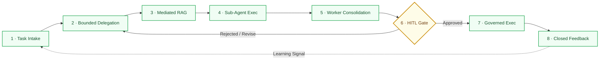

# Governed Multi-Brand Agentic AI System

## Surface Architecture Specification & Flowchart

---

### Core Architectural Invariant

> **Governed access and planning are centralized through the Intelligence Engine; execution is distributed across bounded Worker Agents and isolated Sub-Agents. Durable data remains centrally governed, and no agent may expand its authority or access data directly.**

1. **Monotonic Attenuation:** Authority narrows strictly down the hierarchy ($\text{Sub-Agent} \subseteq \text{Worker} \subseteq \text{Orchestrator}$). Depth of delegation cannot manufacture new permissions.
2. **Strict Separation of Control and Data:** A generated recommendation is not an authorization; a retrieved document is not an instruction; an MCP tool catalog listing is not a security clearance; and an agent's completion claim is not a verified business state.
3. **Decoupled Context vs. Durable Authority:** Model context windows are transient, lossy working memory. Canonical task state, enterprise knowledge, audit trails, and artifacts reside strictly outside the context window and are accessed only via mediated interfaces.

---

## 1. Surface Architecture Flowchart (Mermaid.js)

```mermaid
flowchart TB
%% =============================================================
%% STYLING & CLASS DEFINITIONS
%% =============================================================
classDef gov fill:#fef2f2,stroke:#dc2626,stroke-width:2px,color:#991b1b;
classDef orch fill:#f5f3ff,stroke:#7c3aed,stroke-width:2px,color:#4c1d95;
classDef data fill:#eff6ff,stroke:#2563eb,stroke-width:2px,color:#1e40af;
classDef worker fill:#f0fdf4,stroke:#16a34a,stroke-width:1.5px,color:#14532d;
classDef subagent fill:#fffbeb,stroke:#d97706,stroke-width:1.5px,stroke-dasharray:3 3,color:#78350f;
classDef ext fill:#f8fafc,stroke:#475569,stroke-width:1.5px,color:#0f172a;
classDef audit fill:#fdf4ff,stroke:#c026d3,stroke-width:2px,color:#701a75;
classDef gate fill:#fefce8,stroke:#ca8a04,stroke-width:2.5px,color:#713f12;

%% =============================================================
%% 1. GOVERNANCE & HITL DECISION PLANE
%% =============================================================
subgraph SUB_GOV ["1 · Governance, Policy & Human Authority Plane"]
    direction LR
    OWNER["Brand Stakeholder / Portfolio Owner<br/><i>(Objectives, Scope Envelopes &amp; Budgets)</i>"]:::gov
    POLICY["Enterprise Policy Engine<br/><i>(Multi-Tenant Constraints, Legal &amp; Claim Rules)</i>"]:::gov
    HITL{"Human-in-the-Loop (HITL) Gate<br/><i>(Explicit Sign-Off: Financial, Legal &amp; Deployments)</i>"}:::gate
end

%% =============================================================
%% 2. CENTRAL CONTROL PLANE
%% =============================================================
subgraph SUB_ORCH ["2 · Central Control Plane (Governable Orchestrator)"]
    IE["Intelligence Engine (Central Orchestrator / MCP Host)<br/>• Canonical Task State Machine &amp; Global Decomposition<br/>• Dynamic Brand Persona &amp; Context Assembly<br/>• Monotonic Attenuation &amp; Tool Allowlisting<br/>• Upward Synthesis, Reconciliation &amp; Final Acceptance"]:::orch
end

%% =============================================================
%% 3. DATA ACCESS LAYER & SYSTEMS OF RECORD
%% =============================================================
subgraph SUB_DATA ["3 · Governed Data Access, RAG &amp; Systems of Record"]
    RAG["Agentic RAG &amp; Access Layer<br/><i>(Query Rewriting, Tenant Filtering, Freshness Checks &amp; Schema Validation)</i>"]:::data
    MCP_DATA["Governed MCP Data Boundary<br/><i>(Tenant-Scoped, Mediated Gateway)</i>"]:::data
    
    subgraph STORES ["Centralized Storage (Single Source of Truth)"]
        direction LR
        CDB[("Central Enterprise DB<br/><i>(Catalogs, SKUs, Customer Data)</i>")]:::data
        CMS[("Headless CMS &amp; Web Store<br/><i>(Page Models, Schemas, Assets)</i>")]:::data
        MEM[("Memory &amp; Knowledge Store<br/><i>(Long-Term Learnings, Brand Books)</i>")]:::data
        ART[("Artifact Registry<br/><i>(Deliverables by URI / UUID)</i>")]:::data
    end
end

%% =============================================================
%% 4. BOUNDED WORKER AGENT LAYER
%% =============================================================
subgraph SUB_WORKERS ["4 · Worker Agent Layer: Bounded Domain Execution"]
    direction TB
    W_PROD["Product / Knowledge &amp; Evidence Engine<br/><i>(Specs, Claims, Compliance Dossiers)</i>"]:::worker
    W_VOICE["Customer Voice Engine<br/><i>(Reviews, CX Tickets, Sentiment Mining)</i>"]:::worker
    W_COMP["Competitor Intel Engine<br/><i>(Pricing, Ad Libraries, Market Shifts)</i>"]:::worker
    W_STRAT["Strategy Engine<br/><i>(Omnichannel Plans, Funnel Prioritization)</i>"]:::worker
    W_CREAT["Creative &amp; Content Engine<br/><i>(Hooks, Ad Copy, Visual Briefs)</i>"]:::worker
    W_DEV["Development Engine<br/><i>(CMS Schemas, UI Layouts, Code Diffs)</i>"]:::worker
    W_LEARN["Learning &amp; Performance Engine<br/><i>(Attribution, Decay &amp; ROAS Modeling)</i>"]:::worker
end

%% =============================================================
%% 5. AGENT-SPECIFIC SUB-AGENTS
%% =============================================================
subgraph SUB_AGENTS ["5 · Specialist Sub-Agent Layer: Ephemeral Executors"]
    direction LR
    S_VAL["Claim / Schema Validator<br/><i>(Micro-tool: Compliance Linter)</i>"]:::subagent
    S_PARSE["Sentiment / Ticket Parser<br/><i>(Micro-tool: Intent Classifier)</i>"]:::subagent
    S_SCRAPE["Price / Ad Scraper<br/><i>(Micro-tool: External Tracker)</i>"]:::subagent
    S_COPY["Copy Drafter<br/><i>(Micro-tool: Variant Generator)</i>"]:::subagent
    S_ATTR["Attribution Modeler<br/><i>(Micro-tool: Decay Analyzer)</i>"]:::subagent
end

%% =============================================================
%% 6. OUTBOUND ACTUATION & PLATFORM SURFACES
%% =============================================================
subgraph SUB_EXT ["6 · Outbound Actuation &amp; Public Channel Surfaces"]
    MCP_ACT["Outbound Actuation MCP Boundary<br/><i>(API Security, Signed Grants &amp; Dispatch)</i>"]:::ext
    CH_ADS["Paid Ad Platforms<br/><i>(Meta, Google, TikTok Ads)</i>"]:::ext
    CH_STORE["Live Storefront &amp; CMS<br/><i>(Headless Frontend, Blog, Pages)</i>"]:::ext
    TELEMETRY["Omnichannel Telemetry Feed<br/><i>(Webhooks, Traffic, Conversions, ROAS)</i>"]:::ext
end

%% =============================================================
%% 7. AUDIT & PROVENANCE
%% =============================================================
subgraph SUB_AUDIT ["7 · Audit, Lineage &amp; Provenance Registry"]
    AUDIT[("Immutable W3C PROV Ledger<br/><i>(Activities, Entities, Delegations, Approvals, Tool Calls)</i>")]:::audit
end

%% =============================================================
%% CONTROL & DATA FLOW CONNECTIONS
%% =============================================================

%% Governance & Control Plane
OWNER -->|"Objective &amp; Tenant Scope"| IE
POLICY -->|"Policy Envelope &amp; Personas"| IE
IE <-->|"Action Previews &amp; Sign-off"| HITL

%% Central Data Mediation
IE <-->|"Authorized Queries &amp; Canonical State Sync"| RAG
RAG <--> MCP_DATA
MCP_DATA <--> CDB
MCP_DATA <--> CMS
MCP_DATA <--> MEM
MCP_DATA <--> ART

%% Downward Task Grants (Monotonic Attenuation)
IE ==>|"Bounded Task Grant (Scope, Budget, Rules)"| W_PROD
IE ==>|"Bounded Task Grant"| W_VOICE
IE ==>|"Bounded Task Grant"| W_COMP
IE ==>|"Bounded Task Grant"| W_STRAT
IE ==>|"Bounded Task Grant"| W_CREAT
IE ==>|"Bounded Task Grant"| W_DEV
IE ==>|"Bounded Task Grant"| W_LEARN

%% Worker to Sub-Agent Delegations
W_PROD -.->|"Narrow Verification"| S_VAL
W_VOICE -.->|"Narrow Classification"| S_PARSE
W_COMP -.->|"Narrow Scrape"| S_SCRAPE
W_CREAT -.->|"Narrow Drafting"| S_COPY
W_DEV -.->|"Narrow Syntax Lint"| S_VAL
W_LEARN -.->|"Narrow Modeling"| S_ATTR

%% Sub-Agent Upward Evidence Returns
S_VAL -.->|"Claim Proofs"| W_PROD
S_PARSE -.->|"Sentiment Tags"| W_VOICE
S_SCRAPE -.->|"Market Signals"| W_COMP
S_COPY -.->|"Draft Variants"| W_CREAT
S_VAL -.->|"Linting Reports"| W_DEV
S_ATTR -.->|"Decay Metrics"| W_LEARN

%% Worker Upward Evidence Envelopes
W_PROD -->|"Evidence Envelopes (Artifact UUIDs, Delta Proposals)"| IE
W_VOICE -->|"Customer Voice Envelopes"| IE
W_COMP -->|"Market Benchmark Envelopes"| IE
W_STRAT -->|"Proposed Budget &amp; Channel Splits"| IE
W_CREAT -->|"Candidate Copy Packages"| IE
W_DEV -->|"Staged Code &amp; Schema Diffs"| IE
W_LEARN -->|"Attribution Insights"| IE

%% Post-HITL Governed Actuation
HITL -->|"Post-Approval Release Grant"| IE
IE ==>|"Authorized Directives"| MCP_ACT
MCP_ACT -->|"Campaign Invocations"| CH_ADS
MCP_ACT -->|"Staged Releases"| CH_STORE

%% Continuous Feedback Loop
CH_ADS -->|"Performance Logs"| TELEMETRY
CH_STORE -->|"Conversion Data"| TELEMETRY
TELEMETRY -->|"Telemetry Ingestion"| W_LEARN
W_LEARN -.->|"Continuous Learning Loop (Memory Deltas)"| IE

%% Immutable Audit Capture
IE -.- AUDIT
HITL -.- AUDIT
RAG -.- AUDIT
MCP_ACT -.- AUDIT

```



---

## 2. Roles, Ownership & Boundaries Matrix

| Component / Layer | Primary Ownership | Permitted Access & Capabilities | Non-Negotiable Prohibitions |
| --- | --- | --- | --- |
| **Intelligence Engine (Orchestrator)** | Enterprise AI Core / Systems Architect | **Inbound:** Objectives from Stakeholders, policy rules, HITL decisions, Worker evidence envelopes.**Outbound:** Attenuated task grants, mediated queries to RAG, authorized dispatch to Outbound MCP. | **Cannot** alter underlying business data definitions or source permissions directly; **cannot** execute unverified actions; **cannot** bypass HITL for high-impact/financial side effects. |
| **Agentic RAG & Access Layer** | Central Enterprise Data Platform | **Inbound:** Query intent from Intelligence Engine.**Outbound:** Read/Write mediation via MCP Data Boundary to Database, CMS, and Memory Registries. | **Cannot** set business strategy; **cannot** delegate tasks; **cannot** approve actions; **cannot** expose unpartitioned cross-tenant data. |
| **Product / Knowledge & Evidence Engine** | Regulatory, R&D & Product Management | **Inbound:** Task grants from Intelligence Engine.**Outbound:** Filtered catalog/registry queries via IE; sub-agent delegation to Claim Validators; verified dossiers to IE. | **Cannot** alter compliance rules or canonical product formulas; **cannot** communicate laterally with peer engines. |
| **Customer Voice Engine** | CX, Support Operations & VOC Domain | **Inbound:** Task grants from Intelligence Engine.**Outbound:** Anonymized feedback queries via IE; sub-agent delegation to Sentiment Parsers; thematic summaries to IE. | **Cannot** access, process, or export unredacted PII; **cannot** publish outward customer communications directly. |
| **Competitor Intel Engine** | Market Research & Pricing Analytics | **Inbound:** Task grants from Intelligence Engine.**Outbound:** Scrape mandates to Sub-Agents via external MCP tools; pricing/ad library benchmarks to IE. | **Cannot** access internal customer transaction records; **cannot** modify live pricing on production storefronts. |
| **Strategy Engine** | Omnichannel Marketing & Media Planning | **Inbound:** Task grants and consolidated market dossiers from Intelligence Engine.**Outbound:** Omnichannel plans, funnel allocations, and budget proposals to IE. | **Cannot** self-approve ad spend; **cannot** deploy ad campaigns directly to external ad networks. |
| **Creative & Content Engine** | Creative Direction & Copywriting Domain | **Inbound:** Creative briefs, brand kits, and claim boundaries from Intelligence Engine.**Outbound:** Sub-agent delegation to Copy Drafters; candidate copy and visual briefs to IE. | **Cannot** publish assets directly to production CMS or external social platforms; **cannot** violate Brand Persona rules. |
| **Development Engine** | Web Engineering & CMS Operations | **Inbound:** Architectural task grants from Intelligence Engine.**Outbound:** Staging schemas, sandbox preview environments, linting tasks to Sub-Agents, code diffs to IE. | **Cannot** push migrations or code diffs directly to production repositories or live headless CMS endpoints without approval. |
| **Learning & Performance Engine** | Data Science & Marketing Science Domain | **Inbound:** Channel telemetry feeds and historical conversion logs.**Outbound:** Attribution models, decay curves, and proposed memory optimization updates to IE. | **Cannot** adjust live bid parameters directly; **cannot** overwrite historical transactional records or audit ledgers. |
| **Agent-Specific Sub-Agents** | Parent Worker Agent *(Lifecycle: Ephemeral)* | **Inbound:** Micro-task specification and minimal isolated context slice from parent Worker.**Outbound:** Atomic execution results, lint errors, and artifact references to parent Worker. | **Cannot** alter canonical state; **cannot** write to durable memory; **cannot** call tools outside assigned micro-scope; **cannot** communicate laterally. |
| **Human-in-the-Loop (HITL) Gate** | Authorized Human Stakeholders *(Legal, Brand, Finance)* | **Inbound:** Complete action previews, evidence dossiers, uncertainty intervals, risk tiers, and delegation chains from IE.**Outbound:** Cryptographically signed approvals, revisions, pauses, or rejection directives to IE. | **Cannot** be bypassed by automated retry or fallback heuristics; **cannot** be implemented as passive, non-blocking asynchronous notifications. |

---

## 3. Governed Data Access, Memory & MCP Perimeter

### Centralized Data Model

The **Central Enterprise Database** and **Headless CMS** serve as the singular system of record. Every stored record, vector chunk, content model, and artifact must carry mandatory governance metadata:


$$\text{Record Metadata} = \langle \text{Tenant/Brand ID},\, \text{Owner},\, \text{Schema Version},\, \text{Freshness Timestamp},\, \text{Access Policy},\, \text{Lineage},\, \text{Retention Metadata} \rangle$$


Uncontrolled local data replication across agents is strictly prohibited. Intermediate results and local state are discarded after execution; all durable entities reside centrally.

### Memory & Information Hierarchy

```
[Invocation Context]       --> Ephemeral: Single model turn, strictly scoped.
[Agent-Local Working State]--> Private Scratchpad: In-memory, non-shared, task-local.
[Session / Short-Term]     --> Active Workstream: Scoped to current DAG execution lifecycle.
[Long-Term Memory]         --> Validated Enterprise Knowledge: Promoted strictly via governed review.
[Canonical Task State]     --> Authoritative State Machine: Owned exclusively by Intelligence Engine.
[Artifacts & Evidence]     --> Immutable Deliverables: Persisted externally, referenced by URI/UUID.
[Audit & Provenance]       --> W3C PROV Immutable Ledger: Cryptographic traceability across all actions.

```

### Model Context Protocol (MCP) Perimeter & Routing

* **Host / Client Separation:** The **Intelligence Engine acts as the central MCP Host**. Worker Agents operate as dedicated MCP clients projecting only the tools approved for their bounded task grant. Sub-Agents possess client capabilities only when explicitly delegated.
* **Discovery $\neq$ Authorization:** Advertised tools, resources, and prompts represent technical availability, not operational authority. Effective routing is computed per invocation:

$$\text{Effective Route} = \text{IE Policy} \cap \text{Worker Task Grant} \cap \text{Sub-Agent Scope} \cap \text{Server Authorization}$$


* **Skills Over MCP:** Skills provide procedural workflow guidance and context via structured markdown/instructions. Activating a skill **cannot** grant new tool permissions, widen data scopes, or bypass policy checks.

---

## 4. End-to-End Workflow Walkthrough (8-Stage Lifecycle)



### Step 1: Task Intake & Registration

A business trigger (e.g., product launch, campaign planning, inventory re-indexing) enters the Intelligence Engine. The engine validates the objective against approved purposes, binds it to an authenticated `Tenant/Brand ID`, loads brand persona constraints, assigns an accountable owner, and initializes the canonical task Directed Acyclic Graph (DAG).

### Step 2: Bounded Downward Delegation

The Intelligence Engine decomposes the DAG into domain objectives and issues **Bounded Task Grants** to eligible Worker Agents. Grants enforce monotonic attenuation: specifying exact token/compute budgets, permitted MCP capability allowlists, data scope boundaries, and explicit stop conditions.

### Step 3: Mediated Agentic RAG Retrieval

Workers request necessary domain knowledge (e.g., clinical evidence, past performance, competitor prices). Queries route to the **Agentic RAG & Access Layer**, which filters candidates at retrieval time by tenant identity, row-level policy, and sensitivity level (PII masking). Results return as structured evidence envelopes with source timestamps, index version, and provenance metadata.

### Step 4: Specialist Sub-Agent Execution

Worker Agents spin up ephemeral Sub-Agents for narrow, least-privilege operations (e.g., Creative Engine spawns a Copy Drafter; Product Engine spawns a Claim Verifier; Development Engine spawns a Schema Validator). Sub-Agents operate in isolated sandboxes with a single assigned micro-tool and a minimal context slice, returning atomic outputs to the parent Worker before terminating.

### Step 5: Worker Consolidation & Validation

Worker Agents validate Sub-Agent outputs against acceptance criteria, identify conflicts or uncertainty, and assemble a domain-specific deliverable. The Worker packages this into an **Upward Evidence Envelope** (containing candidate artifact UUIDs, confidence intervals, and proposed state deltas) and submits it to the Intelligence Engine.

### Step 6: HITL Quality & Release Gate

The Intelligence Engine synthesizes inputs across engines and checks whether the proposed action carries financial, legal, brand, or operational side effects. If an action exceeds the configured autonomy threshold, execution halts in a `BLOCKED_HITL` state. An authorized human reviewer inspects an **Action Preview** (lineage, target, evidence, uncertainty, reversibility) and issues an explicit, cryptographically signed approval, rejection, or revision directive.

### Step 7: Governed Execution & Actuation

Following verified authorization and human sign-off, the Intelligence Engine issues execution directives to the **Outbound Actuation MCP Boundary**. The gateway authenticates against external endpoints (Meta, Google, TikTok, Headless CMS) using service-side credentials, applies rate limits, monitors execution, and commits the resulting transaction IDs to the immutable audit log.

### Step 8: Continuous Feedback Loop

External channels and headless storefronts emit telemetry (conversions, ROAS, click-through rates, page performance). The **Learning & Performance Engine** ingests the event stream, computes attribution and creative fatigue scores, and extracts heuristic deltas. Validated insights pass upward to the Intelligence Engine to refine long-term brand memory and adjust parameters for subsequent planning cycles.

---

## 5. Multi-Brand Tenant Isolation Summary

The system supports diverse brand portfolios—ranging across e-commerce storefronts, distinct marketing personas, product categories, and headless CMS models—within a unified architecture through four isolation planes:

```
[Tenant Plane: Brand A (DTC Health)]   [Tenant Plane: Brand B (Apparel)]   [Tenant Plane: Brand C (Earthen Arch)]
                   │                                  │                                  │
                   ▼                                  ▼                                  ▼
┌────────────────────────────────────────────────────────────────────────────────────────┐
│                        DYNAMIC BRAND PERSONA & POLICY INJECTION                        │
│   Clinical Tone • Style Guides • Regulatory Rules • Design Tokens (Injected at Intake)  │
├────────────────────────────────────────────────────────────────────────────────────────┤
│                       DATA ACCESS & SCHEMA ISOLATION (AGENTIC RAG)                     │
│    Mandatory Tenant/Brand ID Predicates • Isolated Namespaces • Row-Level Enforcement  │
├────────────────────────────────────────────────────────────────────────────────────────┤
│                      CAPABILITY & OUTBOUND ACTUATION PROFILES                          │
│     Dedicated Ad Accounts • Isolated CMS Endpoints • Sandboxed Production Tokens       │
└────────────────────────────────────────────────────────────────────────────────────────┘

```

1. **Dynamic Persona & Policy Injection:** Brand identity is configuration data, not hard-coded logic. The Intelligence Engine resolves the brand's persona, voice guidelines, design tokens, and compliance rules at intake, injecting them as immutable constraints into task grants.
2. **Schema & Data Partitioning:** The Agentic RAG Layer enforces tenant separation at retrieval time. Every query automatically inherits the `Tenant/Brand ID` filter. Cross-tenant joins are blocked at the data access gateway; Worker Agents operating on Brand A cannot observe Brand B records or vector embeddings.
3. **Headless CMS & Catalog Decoupling:** Schemas, content models, and catalog trees are partitioned by brand namespace within the central database and CMS. The Development and Creative Engines operate within brand-scoped staging environments, preventing cross-brand asset contamination.
4. **Isolated Channel Actuation:** The Outbound MCP Boundary maps execution strictly to brand-specific credentials (isolated Meta ad accounts, dedicated Google profiles, distinct CMS production webhooks). Telemetry streams are tagged with the originating brand ID, ensuring attribution models update only the appropriate brand memory namespace.