### Architectural Reconciliation & Design Reasoning

To unify the enterprise multi-agent architecture (`flowchat.txt`) with the cross-industry consensus from Microsoft, Google Cloud, AWS, and IBM, we map the **Human Analogy & Cognitive Loop** directly onto the system’s formal boundaries without introducing redundant modules:

```
Human Analogy       Industry Standard               Enterprise System Equivalent
──────────────────────────────────────────────────────────────────────────────────────────
Goal / Request      Goal                            Owner / Business Stakeholder (Layer 1)
Eyes & Ears         Perception & Context Ingress    Task Intake & Dynamic Context Assembly (Layer 2)
Manager             Orchestrator                    Intelligence Engine & Task State Ledger (Layer 2)
Brain               AI Model / LLM Reasoning        Brand Persona & Cognitive Reasoning Core (Layer 2)
Rules & Security    Guardrails (Policy/Validate)    Policy & Authorization Boundary + HITL Gate (Layers 1 & 2)
Making a Plan       Planner & Strategy              Task Graph Decomposition & Strategy Engine (Layers 2 & 5)
Memory              Short/Long-Term Memory          Canonical State, Session Scratchpad & Memory Store (Layers 2, 4)
Knowledge           Agentic RAG / Data Layer        Agentic RAG Controller & Central Database (Layers 3 & 4)
Hands               Tools & Skills                  Sub-Agents, Micro-Tools & MCP Gateways (Layers 5, 6, 7)
Doing the Work      Action & Execution              Actuation MCP & External Runtimes (Layers 7 & 8)
Checking the Work   Feedback, Evaluation & Loop     Telemetry Engine & Performance/Learning Engine (Layers 5 & 8)
Accountability      Audit & Lineage                 W3C PROV Immutable Registry (Layer 9)

```

---

### Key Architectural Modifications

1. **Explicit Cognitive Control Separation within Layer 2:**
The Central Control Plane now reflects the functional division between **Orchestration / Process Management** (The Manager), **LLM Reasoning & Persona** (The Brain), and **Context Assembly / Perception** (The Eyes & Ears), avoiding monolithic conflation while preserving central governance.
2. **Dual-Loop Feedback Integration:**
* **Inner Cognitive Loop (Task-Local):** Bounded worker engines execute an internal *Plan $\rightarrow$ Act $\rightarrow$ Observe $\rightarrow$ Reflect* cycle with sub-agent micro-tools before emitting candidate evidence.
* **Outer Operational Loop (Enterprise-Wide):** Real-world runtimes emit telemetry into the central database, which the *Performance & Learning Engine* (The Evaluator) converts into attribution weights, drift detection, and memory deltas routed back to the Orchestrator for strategic re-planning.


3. **Structured Guardrail Enforcement:**
Guardrails are organized into two sequential checkpoints:
* **Pre-Execution Permission Gate:** Handled by the *Policy & Authorization Boundary* (evaluating identity, tenant scope, and monotonic attenuation).
* **Pre-Actuation Safety & Impact Gate:** Handled by the *HITL Gate* and *MCP Gateway* (enforcing cryptographic approvals and argument schema validation).


---

### Final Architecture Flowchart

```mermaid
flowchart TB
%% =========================================================================
%% STYLING & CLASS DEFINITIONS
%% =========================================================================
classDef gov fill:#fef2f2,stroke:#dc2626,stroke-width:2px,color:#991b1b;
classDef orch fill:#f5f3ff,stroke:#7c3aed,stroke-width:2.5px,color:#4c1d95;
classDef rag fill:#dbeafe,stroke:#1d4ed8,stroke-width:2px,color:#0f172a;
classDef store fill:#ede9fe,stroke:#6d28d9,stroke-width:2.5px,color:#2e1065;
classDef worker fill:#f0fdf4,stroke:#16a34a,stroke-width:2px,color:#14532d;
classDef sub fill:#fffbeb,stroke:#d97706,stroke-width:1.5px,stroke-dasharray:3 3,color:#78350f;
classDef mcp fill:#f1f5f9,stroke:#475569,stroke-width:2px,color:#0f172a;
classDef ext fill:#f8fafc,stroke:#475569,stroke-width:1.5px,color:#0f172a;
classDef audit fill:#fdf4ff,stroke:#c026d3,stroke-width:2px,color:#701a75;
classDef gate fill:#fefce8,stroke:#ca8a04,stroke-width:2.5px,color:#713f12;
classDef edgebus fill:#ffffff,stroke:#6b7280,stroke-width:1.5px,stroke-dasharray:4 4,color:#374151;

%% =========================================================================
%% LAYER 0: GOVERNANCE, POLICY & HUMAN AUTHORITY PLANE
%% =========================================================================
subgraph L0["1 · Governance, Policy & Human Authority Plane (Goal & Guardrails)"]
    direction LR
    OWNER["<b>Brand / Business Owner</b><br/><i>[GOAL / REQUEST]</i><br/>Strategic Objectives • Budget Envelopes • Risk Appetite"]:::gov
    POLICY["<b>Enterprise Policy Engine</b><br/><i>[RULES & CONSTRAINTS]</i><br/>Brand Rules • Autonomy Tiers • Regulated Claims • Prohibitions"]:::gov
    HITL{"<b>Human-in-the-Loop (HITL) Gate</b><br/><i>[SAFETY & PERMISSION GATE]</i><br/>Spend, Legal, Creative & Deployment Clearances"}:::gate
end

%% =========================================================================
%% LAYER 1: CENTRAL CONTROL PLANE (INTELLIGENCE ENGINE)
%% =========================================================================
subgraph L1["2 · Central Control Plane: Governable Intelligence Engine (Manager & Brain)"]
    direction TB
    IE["<b>Intelligence Engine (Central Orchestrator / MCP Host)</b><br/><i>[ORCHESTRATOR / MANAGER]</i><br/>• Workflow Control • Workstream Routing • Lifecycle Supervision<br/>• Monotonic Attenuation • Synthesis • Acceptance & Recovery"]:::orch
    
    subgraph BRAIN_BOX["Cognitive Core & State Subsystems"]
        direction LR
        REASON["<b>AI Reasoning & Persona Core</b><br/><i>[THE BRAIN]</i><br/>LLM Inference • Brand Persona Resolution<br/>Strategic Intent • Decision Formulation"]:::orch
        CTS[["<b>Canonical Task State Ledger</b><br/><i>[TASK STATE MACHINE]</i><br/>DAG Dependencies • Checkpoints • Active Locks"]]:::orch
        PAB["<b>Policy & Authorization Boundary</b><br/><i>[GUARDRAILS / PERMISSION GATE]</i><br/>Identity Checks • Tenant Scoping • Risk Tiers"]:::orch
    end
    
    IE <--> REASON
    IE <--> CTS
    IE <--> PAB
end

OWNER -->|"1. Goal, Budget & Tenant Context"| IE
POLICY -->|"Versioned Policy Envelopes & Guardrails"| PAB
IE <-->|"Action Previews • Evidence Dossiers • Uncertainty Flags"| HITL

%% =========================================================================
%% LAYER 2: AGENTIC RAG & GOVERNED KNOWLEDGE LAYER
%% =========================================================================
subgraph L2["3 · Agentic RAG & Governed Knowledge Layer (Perception & Evidence)"]
    direction TB
    RAG["<b>Agentic RAG Controller</b><br/><i>[PERCEPTION & CONTEXT INGRESS]</i><br/>Query Decomposition • Semantic Search • Freshness Verification<br/>Tenant Partitioning • Row-Level Security • Provenance Tagging"]:::rag
    MCP_DATA["<b>Data Access MCP Boundary</b><br/>Mediated Read-Only Capability Facades • Protocol Isolation"]:::mcp
    RAG <--> MCP_DATA
end

IE <-->|"<b>Authorized Read-Only Inquiries</b><br/>[Tenant Filtered • Scoped Evidence Requests]"| RAG

%% =========================================================================
%% LAYER 3: CENTRAL ENTERPRISE DATA LAYER (SYSTEMS OF RECORD)
%% =========================================================================
subgraph L_DATA["4 · Central Enterprise Database & Systems of Record (Memory & Knowledge)"]
    direction LR
    CDB[("<b>Central Enterprise Database</b><br/><i>[ENTERPRISE TRUTH]</i><br/>Catalogs • SKUs • Specs • Chunks<br/>Reviews • Feedback • Scraped Intel<br/>Briefs • Bids • Code Diffs • Logs")]:::store
    CMS[("<b>Headless CMS & Web Store</b><br/><i>[CONTENT & ASSETS]</i><br/>Product Models • Schemas • Tokens")]:::store
    MEM[("<b>Institutional Memory Store</b><br/><i>[LONG-TERM MEMORY]</i><br/>Promoted Learnings • Decay Models • Brand Rules")]:::store
    ART[("<b>Artifact & Evidence Registry</b><br/><i>[IMMUTABLE DELIVERABLES]</i><br/>Versioned Deliverables (UUID) • Hashes")]:::store
end

MCP_DATA <-->|"Grounded Retrieval & Indexed Schema Sync"| CDB
MCP_DATA <-->|"Catalog Query & Staged Content Sync"| CMS
MCP_DATA <-->|"Governed Heuristics & Persona Query"| MEM
MCP_DATA <-->|"Artifact Resolution by URI / Hash"| ART

%% =========================================================================
%% INGRESS / EGRESS BUSES
%% =========================================================================
GRANT["<b>Bounded Task Grants (Downward)</b><br/><i>[PLANNING & BOUNDED MANDATES]</i><br/>Scope Boundary • Token Budget • Tool/Skill Allowlist • Stop Rules"]:::edgebus
EVID["<b>Evidence Envelopes (Upward)</b><br/><i>[FINDINGS & STATUS FEEDBACK]</i><br/>Validated Findings • Confidence Scores • Artifact UUIDs • State Deltas"]:::edgebus

IE ==> GRANT
GRANT ==> L3_WORKERS
L3_WORKERS ==> EVID
EVID ==> IE

%% =========================================================================
%% LAYER 4: BOUNDED WORKER AGENT LAYER
%% =========================================================================
subgraph L3_WORKERS["5 · Worker Agent Layer: Bounded Domain Execution (Specialized Thinking & Planning)"]
    direction TB
    W_PROD["<b>Product / Knowledge & Evidence Engine</b><br/>Formulation Specs • Clinical Proof • Regulatory Compliance"]:::worker
    W_VOICE["<b>Customer Voice Engine</b><br/>CX Feedback • Ticket Mining • Sentiment • Objections"]:::worker
    W_COMP["<b>Competitor Intel Engine</b><br/>Pricing Trajectories • Ad Libraries • Market Shifts"]:::worker
    W_STRAT["<b>Strategy Engine</b><br/><i>[PLANNER]</i><br/>Omnichannel Allocations • Funnel Architecture • Budgets"]:::worker
    W_CREAT["<b>Creative & Content Engine</b><br/>Hooks & Angles • Multi-Channel Copy • Visual Briefs"]:::worker
    W_DEV["<b>Development / Website & CMS Engine</b><br/>UI Components • Schema Migrations • Code Diffs"]:::worker
    W_PERF["<b>Performance & Learning Engine</b><br/><i>[EVALUATION & ADAPTATION]</i><br/>Attribution Models • Ad Fatigue Detection • Decay Weights"]:::worker
end

%% Mediated Knowledge Access (Read-Only)
W_PROD -.->|"Mediated Retrieval"| RAG
W_VOICE -.->|"Mediated Retrieval"| RAG
W_COMP -.->|"Mediated Retrieval"| RAG
W_STRAT -.->|"Mediated Retrieval"| RAG
W_CREAT -.->|"Mediated Retrieval"| RAG
W_DEV -.->|"Mediated Retrieval"| RAG
W_PERF -.->|"Mediated Retrieval"| RAG

RAG -.->|"Policy-Filtered Context & Citations"| L3_WORKERS

%% =========================================================================
%% LAYER 5: AGENT-SPECIFIC SUB-AGENTS (SPECIALIST EXECUTION)
%% =========================================================================
subgraph L4_SUBS["6 · Agent-Specific Sub-Agents (Ephemeral Specialist Execution / Hands)"]
    direction LR
    S_VAL["<b>Claim / Schema Validator</b><br/><i>[TOOL / HANDS]</i><br/>Linter & Proof Checker"]:::sub
    S_PARSE["<b>Sentiment / Ticket Parser</b><br/><i>[TOOL / HANDS]</i><br/>Intent Classifier"]:::sub
    S_SCRAPE["<b>Price & Ad Scraper</b><br/><i>[TOOL / HANDS]</i><br/>External Tracker"]:::sub
    S_ALLOC["<b>Budget / Media Allocator</b><br/><i>[TOOL / HANDS]</i><br/>Optimization Modeler"]:::sub
    S_COPY["<b>Copy Drafter & Critic</b><br/><i>[TOOL / HANDS]</i><br/>Variant Generator"]:::sub
    S_CODE["<b>Component Coder</b><br/><i>[TOOL / HANDS]</i><br/>Syntax & Unit Checker"]:::sub
    S_ATTR["<b>Attribution Modeler</b><br/><i>[TOOL / HANDS]</i><br/>ROAS Decay Estimator"]:::sub
end

W_PROD <-->|"Narrow Verification / Evidence Check"| S_VAL
W_VOICE <-->|"Narrow Parsing / Categorized Signals"| S_PARSE
W_COMP <-->|"Narrow Scraping / Market Snapshots"| S_SCRAPE
W_STRAT <-->|"Narrow Allocation / Media Plan Models"| S_ALLOC
W_CREAT <-->|"Narrow Drafting / Candidate Copy Packs"| S_COPY
W_DEV <-->|"Narrow Linting / Component Diffs"| S_CODE
W_PERF <-->|"Narrow Modeling / Attribution Weights"| S_ATTR

%% =========================================================================
%% LAYER 6: OUTBOUND EXECUTION GATEWAYS
%% =========================================================================
subgraph L5_GATEWAY["7 · Governed Execution Gateways (Validation & Clearance)"]
    direction TB
    MCP_ACT["<b>Actuation & Publishing MCP Gateway</b><br/><i>[GUARDRAILS / DISPATCH GATEWAY]</i><br/>Payload Validation • Packaging • Protocol Security • Signed Dispatch"]:::mcp
end

HITL -->|"Signed Execution Grants (Post-Approval)"| IE
IE ==>|"Validated Execution Directives"| MCP_ACT

%% =========================================================================
%% LAYER 7: EXTERNAL RUNTIMES & CLOSED-LOOP TELEMETRY
%% =========================================================================
subgraph L6_EXT["8 · External Runtimes, Endpoints & Telemetry (Action & Feedback)"]
    direction LR
    CH_STORE["<b>Live Website / CMS / Storefront</b><br/><i>[ACTION]</i><br/>Production Store • Blog • Web App"]:::ext
    CH_ADS["<b>Paid Ad Platforms</b><br/><i>[ACTION]</i><br/>Meta • Google • TikTok • LinkedIn Ads"]:::ext
    CH_SOC["<b>Organic Social Channels</b><br/><i>[ACTION]</i><br/>Instagram • X • YouTube • TikTok"]:::ext
    TELEMETRY["<b>Omnichannel Telemetry Engine</b><br/><i>[PERCEPTION / OBSERVATION]</i><br/>Webhooks • Conversions • ROAS • Event Logs"]:::ext
end

MCP_ACT -->|"Staged Code & CMS Releases"| CH_STORE
MCP_ACT -->|"Campaign Invocations & Budgets"| CH_ADS
MCP_ACT -->|"Scheduled Media & Copy Posts"| CH_SOC

CH_STORE -.->|"Traffic & Order Events"| TELEMETRY
CH_ADS -.->|"Ad Spend & Attribution Data"| TELEMETRY
CH_SOC -.->|"Engagement & Reach Signals"| TELEMETRY

TELEMETRY -.->|"Raw Telemetry Ingestion"| CDB
CDB -.->|"Timeseries Telemetry Feed"| W_PERF
W_PERF -.->|"<b>Continuous Learning Loop</b><br/><i>[EVALUATE & RE-PLAN]</i><br/>Validated Insights • Attribution Weights • Memory Deltas"| IE

%% =========================================================================
%% LAYER 8: IMMUTABLE AUDIT & PROVENANCE LEDGER
%% =========================================================================
subgraph L_AUDIT["9 · Immutable Audit, Provenance & Lineage Ledger (Accountability)"]
    AUDIT[("<b>W3C PROV Immutable Registry</b><br/>• Delegations & Invocations • Policy Decisions & Denials<br/>• HITL Approvals & Overrides • Tool Executions & Dispatches")]:::audit
end

IE -.->|"Record State Deltas & Task Contracts"| AUDIT
PAB -.->|"Log Policy Evaluations & Boundary Crossings"| AUDIT
HITL -.->|"Store Signatures, Overrides & Reviewer Identity"| AUDIT
RAG -.->|"Log Retrieval Queries, Freshness & Access Filters"| AUDIT
MCP_ACT -.->|"Record Dispatched Payloads & External IDs"| AUDIT

```



---

### Verification of Architectural Invariants

* **Goal & Intake:** `OWNER` injects intent and bounds into the `IE` at Layer 1.
* **Brain vs. Manager:** Layer 2 separates workflow orchestration (`IE`) from reasoning (`REASON`), task state tracking (`CTS`), and security validation (`PAB`).
* **Memory vs. Knowledge:** Persistent operational records, content models, long-term heuristics, and immutable artifacts are consolidated in Layer 4 (`L_DATA`), while Layer 3 (`RAG`) acts as the policy-filtered perception mechanism.
* **Planning vs. Hands:** Layer 5 workers plan and synthesize bounded workstreams, while Layer 6 sub-agents act as ephemeral hands running single-purpose micro-tools.
* **Action vs. Feedback:** Outbound mutations execute exclusively via Layer 7 (`MCP_ACT`) into Layer 8 runtimes. Runtime observations flow via `TELEMETRY` through Layer 5 (`W_PERF`) to drive evaluation, re-planning, and memory promotion.
* **Guardrails & Audit:** The system enforces dual-boundary gates (`PAB` at control ingress, `HITL` and `MCP_ACT` at actuation egress) with full cryptographic lineage logged to Layer 9 (`AUDIT`).