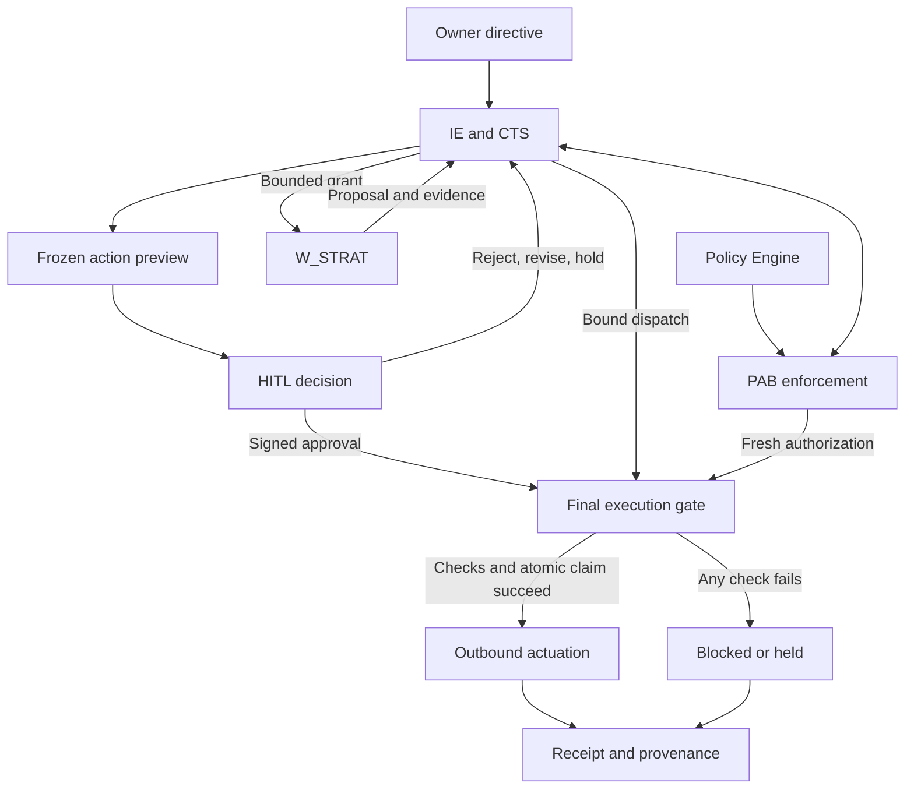

**Layer 1 should use the existing shared governance modules.** Keep policy authority, HITL, and authorization outside `backend/app/agents/strategy_engine/`. `W_STRAT` owns strategy and allocation proposals; IE owns their governed progression toward execution.

This is a design and change specification. No code was implemented, and no tests were executed.

**1. Requirements, gaps, and inconsistencies**

Evidence references used below:

| Reference | Supplied source                                                                                               |
| --------- | ------------------------------------------------------------------------------------------------------------- |
| **A**     | `Final-Level Full Architecture(20260924-081137).md`, especially component table, data-flow table, and Model A |
| **B**     | `Backend Hierarchy(8).md`, especially module responsibilities and assumptions                                 |
| **T**     | Backend and enterprise file trees                                                                             |
| **S**     | Sandbox file tree                                                                                             |
| **F**     | Embedded Mermaid and graph structure extracted from the supplied draw.io HTML                                 |

**Evidence limit:** the attachments contain architecture descriptions and file inventories, not backend source code. Therefore, a listed file is an **existing surface**, not proof that its required behavior is implemented.

| Finding                                                                                                                | Evidence                                         | Required resolution                                                                                                                                                    |
| ---------------------------------------------------------------------------------------------------------------------- | ------------------------------------------------ | ---------------------------------------------------------------------------------------------------------------------------------------------------------------------- |
| Layer 1 already has three defined components: Owner, Policy Engine, and HITL.                                          | A §2; F                                          | Preserve these responsibilities through existing shared modules.                                                                                                       |
| Shared governance routes, schemas, services, enforcement modules, repositories, and tests already appear in the trees. | B; T                                             | Extend them only where source inspection proves a missing behavior.                                                                                                    |
| Strategy is a bounded Layer-5 worker producing roadmaps, campaign proposals, and budget plans.                         | A §2–4; F                                        | Strategy may propose spend; it cannot authorize or execute spend.                                                                                                      |
| The old hierarchy presents flat worker files, while current trees contain both flat files and engine packages.         | B versus T                                       | Inspect imports and registrations. Preserve compatibility wrappers; do not assume duplicate implementation or delete either path.                                      |
| `orchestration/governance_milestone.py` appears in B’s first hierarchy but not the current backend tree.               | B; T                                             | Do not add it merely to reproduce the older hierarchy. Existing CTS and governance tests provide the relevant surfaces.                                                |
| PAB uses `Allow / Deny / Escalate`, while this request requires `allow / deny / review`.                               | A §2; current requirements                       | Use the requested canonical enum. Treat legacy “escalate” as a migration concern, never as permission to execute.                                                      |
| Policy Engine is described as producing envelopes while having read-only access to its policy store.                   | A §2; B                                          | Separate reading/evaluating approved policy from activating revisions. IE coordinates authorized persistence; evaluation cannot silently rewrite policy.               |
| Owner “Read/Write to Task Registry” could imply direct storage access.                                                 | A §2 versus F                                    | Interpret this as authenticated API capability through IE, not database credentials or direct task-state mutation.                                                     |
| Diagram and data-flow table show `CDB → W_LEARN`.                                                                      | A §1, §3; F                                      | Correct the documentation to IE-mediated delivery. Do not use this arrow to justify any direct worker data access.                                                     |
| “Exclusive” RAG storage access coexists with named control-plane repositories and direct audit streams.                | A §2–4; B                                        | Distinguish governed enterprise retrieval from trusted control-plane bookkeeping. Exact call routing still needs source inspection; no worker gains either capability. |
| Approval fields, expiry rules, replay consumption, revocation, and concurrent budget handling are unspecified.         | A/B describe outcomes, not enforceable contracts | Define them explicitly below.                                                                                                                                          |
| Development has its own approval-token and provenance schemas.                                                         | T                                                | Check for duplicate security semantics. Preserve development-specific fields while making shared contracts authoritative.                                              |
| Universal persistence and ephemeral sandbox storage are described together.                                            | A §5–6                                           | Persist required sanitized outputs and audit evidence through trusted services. Do not give sandbox agents persistence access.                                         |
| Architecture checklist marks controls complete, but no runtime evidence accompanies it.                                | A §6                                             | Treat the checklist as intended architecture until tests and implementation prove it.                                                                                  |
| Strategy research and a validated patch are listed, but their actual contents were not supplied or recovered.          | T; prior-context lookup                          | Preserve the documented Strategy boundary; do not claim exact compatibility with unseen research.                                                                      |

The backend subtree in the enterprise tree agrees with the standalone backend tree on the relevant application and test paths. The sandbox inventories also establish an existing hardened runtime and `s-alloc` skill; neither needs a new Layer-1 implementation.

**2. Validated architectural decisions**

Labels below distinguish **project requirements [P]**, **externally validated principles [V]**, and **recommended implementation choices [R]**.

| Decision                                                                                                                                                                     | Classification and basis                                                                                                                                                                              |
| ---------------------------------------------------------------------------------------------------------------------------------------------------------------------------- | ----------------------------------------------------------------------------------------------------------------------------------------------------------------------------------------------------- |
| Governance remains shared infrastructure. No governance package under Strategy.                                                                                              | **[P]** Current invariant; A/B/F                                                                                                                                                                      |
| `services/policy_engine.py` owns policy interpretation and deterministic decision semantics; `orchestration/policy_evaluator.py` coordinates evaluation within IE workflows. | **[R]** Minimal allocation of the existing responsibilities                                                                                                                                           |
| PAB enforces decisions, and the outbound gateway performs the final execution check. Neither contains a competing policy implementation.                                     | **[P/R]** Existing boundaries, made explicit                                                                                                                                                          |
| Separate policy decision from enforcement.                                                                                                                                   | **[V]** OPA documents this separation; it does not require adopting OPA here. ([Open Policy Agent][1])                                                                                                |
| Persist policy revision, input identity, result, and decision ID.                                                                                                            | **[P/V]** OPA decision logs demonstrate revision and decision-ID traceability. ([Open Policy Agent][2])                                                                                               |
| HITL authorization is specific to the reviewed operation, expires, and is checked at execution.                                                                              | **[P/V]** OWASP calls for meaningful transaction review, protection against mutation, operation-specific authorization, limited validity, and a final execution gate. ([OWASP Cheat Sheet Series][3]) |
| W3C PROV supplies lineage semantics, not storage immutability.                                                                                                               | **[V/R]** Map entities, activities, and responsible agents; separately enforce append-only storage and tamper evidence. ([w3.org][4])                                                                 |
| No OPA dependency is justified by the supplied evidence.                                                                                                                     | **[R]** Existing Python boundaries can express the required contract; their implementation remains unverified.                                                                                        |
| An LLM may assist drafting policy proposals, but cannot determine authoritative allow/deny outcomes or activate policy.                                                      | **[R]** Required to make enforcement deterministic and authority-controlled                                                                                                                           |
| Every live outbound action retains mandatory HITL under the supplied architecture. Internal bounded analysis may proceed under policy alone.                                 | **[P]** A/B/F; autonomy tiers cannot silently remove this gate                                                                                                                                        |

**2.1 Contract definitions**

These are proposed fields within the existing schemas, not claims about current class names. Reuse equivalent existing fields after source inspection.

All security-bearing records require a schema version, tenant identity, stable record ID, correlation/task references where applicable, and UTC timestamps. Security inputs must reject unknown action types, malformed values, and unsupported schema versions.

| Contract and owner                                             | Required content                                                                                                                                                                                                                                                                                                        | Enforced meaning                                                                                                                            |
| -------------------------------------------------------------- | ----------------------------------------------------------------------------------------------------------------------------------------------------------------------------------------------------------------------------------------------------------------------------------------------------------------------- | ------------------------------------------------------------------------------------------------------------------------------------------- |
| **OwnerDirective** — `schemas/governance.py`                   | Directive ID/revision; authenticated owner reference; enterprise objectives; operational targets; tenant/brand/resource scope; budget caps and periods; risk envelope; requested autonomy; effective/expiry times; superseded-directive reference                                                                       | A statement of intent within the owner’s authority. It cannot grant privileges the owner lacks or override enterprise prohibitions.         |
| **GovernanceEnvelope** — `schemas/governance.py`               | Envelope ID/hash; source directive revision; policy ID/revision/hash; policy provenance/attestation; effective scope; permitted actions/tools; autonomy limits; claim/legal restrictions; budget/risk limits; approval requirements; validity interval                                                                  | An immutable, versioned combination of applicable constraints. Missing authority or conflicting mandatory constraints blocks authorization. |
| **PolicyDecision** — `schemas/governance.py`                   | Decision ID; `allow \| deny \| review`; evaluation phase; policy/envelope revision and hashes; input digest; action hash where applicable; principal/delegation references; scope; limits; reason codes; unmet obligations; evaluation time/expiry; evaluator version; authoritative state-version references           | Records one evaluation. An `allow` is necessary but insufficient for live dispatch.                                                         |
| **ActionPreview** — `schemas/action_preview.py`                | Preview ID/revision/hash; operation ID; exact operation manifest; action hash; artifact IDs/hashes; target account/resource/environment; spend and currency; schedule; claims/code/content changes; risks; evidence references; preconditions; policy decision reference; expiry                                        | The human-readable view is rendered from the frozen manifest that execution will use. A summary alone is insufficient.                      |
| **HITLDecision / ApprovalGrant** — `schemas/action_preview.py` | Decision ID; `approve \| reject \| revise \| hold`; tenant; reviewer identity and authority reference; issuer/audience; preview ID/revision/hash; operation ID/action hash; artifact-manifest hash; policy/envelope binding; authorized scope/limits; nonce; issued/not-before/expiry times; signature metadata; reason | Only `approve` carries execution authorization. Other decisions are signed records with no executable grant.                                |
| **ExecutionDirective** — `schemas/dispatch.py`                 | Dispatch ID; operation ID; tenant; exact action/artifact hashes; immutable payload reference; approval reference/hash; fresh policy-decision reference; delegation/scope; budget-reservation reference; target/audience; idempotency key; preconditions; validity; IE signature                                         | IE-issued instruction to the existing gateway. Neither a worker output nor an approval alone is a dispatch command.                         |
| **ProvenanceEvent** — `schemas/provenance.py`                  | Event ID; tenant; entity/activity/agent references; typed relations; directive/policy/decision/preview/approval/dispatch references; content hashes; event time; outcome/reason; integrity metadata                                                                                                                     | Immutable linkage across decisions, transformations, approvals, and execution outcomes.                                                     |

**Policy determinism**

The authoritative evaluation is a function of:

`validated request + active policy revision + authority snapshot + budget/risk state + explicit evaluation time`.

Requirements:

* The same complete input produces the same outcome, reasons, scope, limits, and obligations.
* Unique decision IDs and recording timestamps are metadata; they need not be identical between evaluations.
* No unrecorded network lookup, model judgment, or implicit clock access may change the result.
* Explicit prohibition or invalid security evidence produces `deny`.
* A valid request requiring human authorization produces `review`.
* `allow` means applicable requirements for that evaluation phase are satisfied.
* Denial takes precedence over review. Human approval cannot override a hard deny.
* Unavailable policy or authoritative state produces a blocked decision, never a permissive fallback.

Suggested reason codes include:

`POLICY_MISSING`, `POLICY_INVALID`, `POLICY_STALE`, `SCOPE_EXCEEDED`, `TENANT_MISMATCH`, `BUDGET_EXCEEDED`, `RISK_EXCEEDED`, `REVIEW_REQUIRED`, `SIGNATURE_INVALID`, `APPROVAL_EXPIRED`, `PREVIEW_CHANGED`, `APPROVAL_REPLAY`, `AUTHORITY_REVOKED`, and `AUDIT_UNAVAILABLE`.

**Action binding and signing**

Use one versioned canonicalization contract for the operation manifest, preview, and signed authorization payload. RFC 8785 provides a suitable JSON canonicalization reference; merely sorting Python dictionary keys is not sufficient to claim conformance. ([RFC Editor][5])

Recommended binding:

* `action_hash`: hash of the canonical operation manifest.
* `artifact_manifest_hash`: hash of the exact artifact IDs, versions, and content hashes.
* `preview_hash`: hash of the frozen review dossier, including both hashes above.
* Signature: covers the entire decision payload, including tenant, reviewer, audience, scope, nonce, validity, and bindings.

The manifest must bind the target account, resource, environment, operation type, parameters, schedule, spend, and relevant resource-version preconditions. Mutable URLs or artifact IDs alone are insufficient.

Use the existing vetted signing implementation if suitable. Pin accepted algorithms, trusted issuers, audiences, key IDs, and key status. Reject unsigned grants, unknown keys, altered claims, and untrusted algorithm choices. Private keys never enter workers or sandboxes.

The HITL service may sign an attestation of an authenticated human decision; this must not be misrepresented as a personal cryptographic signature by the reviewer.

**Budget, risk, and attenuation**

Recommended enforcement rules:

* Represent money using exact decimal/minor-unit semantics and an explicit currency. Avoid binary floating-point money.
* Bind each cap to a tenant, budget account, period, and applicable channel/resource.
* Verify each relevant cap against **settled expenditure + outstanding commitments + new commitment**, without double-counting converted reservations.
* Reserve budget atomically before dispatch. Parallel sibling tasks cannot each spend the same remaining balance.
* A task’s planning allocation is a proposal, not a financial reservation.
* Reject unknown currency conversion, missing cost bounds, invalid amounts, or unclassified risk.
* Check allocation limits for compute/token budgets independently from external spend.
* Child scopes, tools, validity, and consumable limits may only narrow parent authority.
* Multiple children must share an enforced aggregate allowance; copying the parent limit into every child is unsafe.

For PostgreSQL-backed repositories, row locking or an equivalent correctly implemented conditional transaction can prevent concurrent updates from spending the same balance. The exact mechanism depends on the current database implementation. ([postgresql.org][6])

**Policy and approval lifecycle**

* New policy revisions are immutable records with activation, supersession, and revocation history.
* A directive amendment is a new directive revision, not an edit to historical evidence.
* Approval does not activate a new policy revision.
* Recommended conservative default: a changed effective directive, policy revision, scope, operation, or reviewed artifact invalidates pending execution and requires reevaluation and renewed review.
* `revise` creates a new proposal/preview revision; it never edits an approved manifest in place.
* `hold` prevents dispatch until an explicit authorized transition.
* Reviewer authority and revocation status are checked when recording the decision and immediately before execution.

**Provenance mapping**

| Enterprise OS item                                                                                                | W3C PROV mapping                               |
| ----------------------------------------------------------------------------------------------------------------- | ---------------------------------------------- |
| Directive revision, policy revision, evidence artifact, preview, approval, execution directive, execution receipt | **Entity**                                     |
| Policy evaluation, strategy generation, preview assembly, review, dispatch, reconciliation                        | **Activity**                                   |
| Owner, reviewer, policy service, IE, worker identity, outbound gateway                                            | **Agent**                                      |
| Evaluation reads a policy revision                                                                                | `used(activity, entity)`                       |
| Review produces a signed approval                                                                                 | `wasGeneratedBy(approval, review_activity)`    |
| Review responsibility belongs to the human reviewer                                                               | `wasAssociatedWith(review_activity, reviewer)` |
| Revised proposal transforms an earlier proposal                                                                   | `wasDerivedFrom(new_proposal, old_proposal)`   |
| Worker performs bounded work under IE delegation                                                                  | `actedOnBehalfOf(worker, IE, activity)`        |

These relations follow W3C PROV’s entity/activity/agent model. A PROV delegation relation records responsibility; it is not an authorization credential. ([w3.org][4])

Append corrections and revocations as new events. Do not overwrite historical decisions. Protect signing secrets from audit payloads. Hash chaining alone does not establish immutability against a privileged database operator.

**3. Layer-1 component responsibility and access matrix**

| Component                    | Owns                                                                                                                    | Permitted access                                                                                | Forbidden authority                                                                        |
| ---------------------------- | ----------------------------------------------------------------------------------------------------------------------- | ----------------------------------------------------------------------------------------------- | ------------------------------------------------------------------------------------------ |
| **Brand / Business Owner**   | Objectives, targets, requested scope, caps, risk appetite                                                               | Authenticated directives API; authorized status and review views                                | Direct database/CTS edits, sandbox access, bypassing enterprise restrictions               |
| **Enterprise Policy Engine** | Versioned envelope production/validation; deterministic policy decisions                                                | Trusted policy and authority inputs through established control-plane boundaries                | Strategy generation, human approval, outbound execution, self-authorized policy activation |
| **HITL Gate**                | Review and signed approve/reject/revise/hold decisions                                                                  | Tenant-authorized immutable previews; reviewer authority checks; audit through service boundary | Payload mutation after approval, policy overrides, direct worker invocation, dispatch      |
| **IE**                       | Workflow ownership; grants; context delivery; policy/HITL coordination; persistence orchestration; dispatch preparation | Existing services, CTS, governed data paths, approved gateway                                   | Widening policy or owner authority                                                         |
| **PAB**                      | Identity, delegation, scope, signature, and policy enforcement                                                          | Authoritative verification inputs and existing security services                                | Independent strategy or alternative policy semantics                                       |
| **CTS and repositories**     | Durable lifecycle, reservations, replay/dispatch state, concurrency controls                                            | Trusted service identities with tenant-scoped operations                                        | Worker-facing persistence interfaces                                                       |
| **W_STRAT / S_ALLOC**        | Strategy and allocation proposals, evidence                                                                             | IE-bounded read-only context; existing permitted sandbox computation                            | Policy store, RAG, persistence, HITL, signing keys, live outbound systems                  |
| **Outbound gateway**         | Final authorization check and controlled actuation                                                                      | Frozen payload; IE/PAB validation; existing adapters                                            | Rewriting approved semantics or trusting worker-provided permission claims                 |
| **Provenance service**       | Recording and validating immutable lineage                                                                              | Append-only repository operations and authorized audit reads                                    | Granting authority or rewriting history                                                    |

Layer-1 components have **no sandbox capability**. Existing worker sandbox boundaries remain unchanged.

**4. Control/data flow**



The HITL-to-gate arrow represents approval evidence carried in IE’s dispatch; it is not a direct HITL execution channel.

| Step                            | Required control and durable result                                                                                                                                                                                            |
| ------------------------------- | ------------------------------------------------------------------------------------------------------------------------------------------------------------------------------------------------------------------------------ |
| **1. Accept directive**         | Authenticate owner; derive tenant membership from trusted identity; validate requested scope and caps; persist directive revision and provenance.                                                                              |
| **2. Establish envelope**       | Resolve approved active policy; validate its integrity, validity, and applicability; derive effective constraints. Missing or contradictory mandatory inputs block progress.                                                   |
| **3. Delegate analysis**        | IE/PAB authorize a bounded grant. Strategy receives only the required policy/budget/risk projection and permitted evidence.                                                                                                    |
| **4. Validate proposal**        | IE validates returned evidence, artifact hashes, budget arithmetic, and scope. Worker “compliant” labels are evidence claims, not permissions.                                                                                 |
| **5. Evaluate proposed action** | Policy engine returns a decision. `deny` blocks; `review` routes to HITL. Live outbound actions remain subject to the mandatory approval gate.                                                                                 |
| **6. Freeze review material**   | Resolve exact artifacts and execution parameters; create immutable manifest and preview; persist hashes and decision links.                                                                                                    |
| **7. Record human decision**    | Authenticate and authorize reviewer against the pending preview. Persist signed decision. Only an eligible `approve` can advance.                                                                                              |
| **8. Prepare dispatch**         | IE binds the approved operation to an execution directive. Queueing or scheduling does not extend approval validity.                                                                                                           |
| **9. Revalidate and claim**     | At the gateway, check current policy, owner/reviewer authority, revocations, signatures, scope, hashes, expiry, resource preconditions, budget/risk state, and task status. Atomically claim the operation and reserve budget. |
| **10. Actuate and reconcile**   | Send the frozen operation through the existing adapter; record provider receipt or uncertain outcome; reconcile commitments; append provenance and update CTS.                                                                 |

**Replay, concurrency, and TOCTOU requirements**

The existing persistence boundary must provide an atomic operation that:

1. Confirms the task and approval are still eligible.
2. Confirms expected policy/authority/state versions.
3. Claims the approval nonce for one operation/dispatch.
4. Reserves the required budget.
5. Records the dispatch intent and required audit linkage.

A uniqueness constraint and durable compare-and-set/state transition must enforce this across processes and restarts. An in-memory nonce set is insufficient.

Do not queue work after treating a preflight check as final. Any delayed delivery must pass the execution gate again.

A retry of the **same** claimed dispatch may use the same provider idempotency key after revalidation; it must not mint another operation or consume budget twice. If a timeout leaves the remote outcome unknown, hold and reconcile before retrying.

Local authorization and an external API side effect cannot generally share one atomic transaction. Define the local dispatch claim as the authorization linearization point; revocation that precedes that point blocks execution. Resource versions/conditional requests and provider idempotency reduce the remaining external race. Where the provider cannot support the required safety property, hold the action rather than claim guaranteed exactly-once execution.

**5. Final minimal file/folder hierarchy**

`[MODIFY]` means the designated location for a required behavior change **if absent after source inspection**. Already-correct implementation remains `[REUSE]`.

The tree below is a scoped path inventory; unrelated existing files remain in place.

```text
backend/
  app/
    api/routes/
      directives.py                         [MODIFY]
      approvals.py                          [MODIFY]

    schemas/
      governance.py                         [MODIFY]
      action_preview.py                     [MODIFY]
      dispatch.py                           [MODIFY]
      provenance.py                         [MODIFY]
      agent_contracts.py                    [MODIFY]
      task_state.py                         [MODIFY]
      artifact.py                           [REUSE]
      development/
        approval_token.py                   [REUSE; inspect shared binding]
        provenance.py                       [REUSE; inspect shared mapping]

    orchestration/
      intelligence_engine.py                [MODIFY]
      policy_evaluator.py                   [MODIFY]
      hitl_preview_generator.py             [MODIFY]
      task_state_machine.py                 [MODIFY]
      context_assembly.py                   [MODIFY]
      dag_scheduler.py                      [REUSE]
      evidence_synthesis.py                 [REUSE]
      rag_query_dispatch.py                 [REUSE]

    services/
      policy_engine.py                      [MODIFY]
      hitl.py                               [MODIFY]
      task_state.py                         [MODIFY]
      provenance.py                         [MODIFY]
      audit_validator.py                    [MODIFY]

    security/
      authorization_boundary.py             [MODIFY]
      cryptographic_validator.py            [MODIFY]
      scope_evaluator.py                    [MODIFY]

    persistence/
      database.py                           [MODIFY]
      repositories/
        operational.py                      [MODIFY]
        task_state.py                       [MODIFY]
        provenance.py                       [MODIFY]
        artifact.py                         [REUSE]

    mcp/
      outbound_gateway.py                   [MODIFY]
      data_gateway.py                       [REUSE]
      host.py                               [REUSE]

    core/
      settings.py                           [MODIFY]

    agents/
      strategy.py                           [REUSE; inspect entry-point role]
      strategy_engine/
        __init__.py                         [REUSE]
        strategy.py                         [MODIFY: bounded inputs/outputs]
        subagents/
          __init__.py                       [REUSE]
          allocation.py                     [REUSE: computation only]

    integrations/sandbox/                   [REUSE]
    integrations/ads/                       [REUSE; verify dispatch semantics]
    integrations/social/                    [REUSE; verify dispatch semantics]
    integrations/cms/                       [REUSE; verify dispatch semantics]

  tests/unit/                               [MODIFY existing tests in §8]
  tests/integration/                        [MODIFY existing tests in §8]
  tests/acceptance/
    test_governed_end_to_end_flow.py         [MODIFY]

  pyproject.toml                            [REUSE]

sandbox/                                    [REUSE; no Layer-1 changes]
```

**[ADD]: none justified as a new application module or service.** Database constraints or records may require a migration, but no migration framework/path is established in the supplied evidence. Determine its exact location from the repository before adding a file.

**[REMOVE]: none justified.** Do not delete flat worker modules, development schemas, or research patches based on their names.

Required documentation corrections belong in the existing canonical architecture and hierarchy documents listed under `Agentic System Research/final/`. Do not create a competing architecture document.

**6. Strategy Engine Layer-1 integration hierarchy/touchpoints**

| Existing touchpoint                                                             | Layer-1 integration responsibility                                                                                            |
| ------------------------------------------------------------------------------- | ----------------------------------------------------------------------------------------------------------------------------- |
| `app/agents/strategy.py`                                                        | Preserve its current registration or compatibility role after inspection. It must not become a governance facade.             |
| `app/agents/strategy_engine/strategy.py`                                        | Receive IE-authorized constraints; formulate strategy and spend proposals; return evidence and assumptions.                   |
| `app/agents/strategy_engine/subagents/allocation.py`                            | Calculate candidate allocations within the supplied bounded mandate. It cannot reserve or commit money.                       |
| `app/schemas/agent_contracts.py`                                                | Carry envelope/decision references, scoped constraint projection, parent grant, resource limits, expiry, and permitted tools. |
| `app/orchestration/context_assembly.py`                                         | Deliver the minimum authorized budget/risk/policy context; exclude approval tokens, signing material, and store credentials.  |
| `app/orchestration/intelligence_engine.py`                                      | Validate Strategy output, persist artifacts, evaluate policy, route HITL, and prepare dispatch.                               |
| `app/integrations/sandbox/{client,capabilities,s_alloc_core,sandbox_policy}.py` | Preserve the existing S_ALLOC execution path and isolation contract.                                                          |
| `sandbox/docker/hardened/skills/s-alloc/`                                       | Preserve existing sandbox computation; no Layer-1 ownership.                                                                  |

**Strategy input:** objectives, authorized tenant/resource scope, planning horizon, permitted channels, budget/risk constraints, applicable claim restrictions, evidence, and a bounded grant.

**Strategy output:** proposed allocations and actions, expected outcomes, assumptions, evidence references, uncertainty, and proposed state deltas.

A proposed state delta becomes authoritative only through IE/CTS validation. Strategy output must not contain a self-issued approval or executable authority.

Shared policy/HITL/security code must not import `strategy_engine` to make decisions. IE performs worker dispatch through existing orchestration interfaces.

**7. Exact necessary per-file modifications**

Paths are relative to `backend/`. These are behavioral requirements, not invented callable signatures.

| File                                          | Necessary modification when missing                                                                                                                                                                           |
| --------------------------------------------- | ------------------------------------------------------------------------------------------------------------------------------------------------------------------------------------------------------------- |
| `app/api/routes/directives.py`                | Validate authenticated owner and tenant authority; accept versioned directive submissions/amendments; reject cap or scope escalation; delegate to IE; make request retries idempotent.                        |
| `app/api/routes/approvals.py`                 | Authorize preview reads and decisions; resolve the server-stored preview; reject client substitutions of tenant, reviewer, action, or scope; accept all four decisions; delegate signing/persistence to HITL. |
| `app/schemas/governance.py`                   | Define or extend directive, envelope, policy-decision, scoped limit, validity, and reason-code contracts.                                                                                                     |
| `app/schemas/action_preview.py`               | Define frozen operation/preview binding and signed human-decision/grant contracts. Avoid a separate Strategy approval schema.                                                                                 |
| `app/schemas/dispatch.py`                     | Bind execution to operation, approval, fresh decision, target, budget reservation, idempotency key, audience, and expiry.                                                                                     |
| `app/schemas/provenance.py`                   | Represent typed PROV relations and full governance correlation identifiers with integrity fields.                                                                                                             |
| `app/schemas/agent_contracts.py`              | Add bounded constraint references/projections without exposing governance capabilities or stores.                                                                                                             |
| `app/schemas/task_state.py`                   | Represent required review, hold, invalidation, claim, and uncertain-outcome semantics using existing states where equivalent.                                                                                 |
| `app/orchestration/intelligence_engine.py`    | Sequence directive validation, grants, proposal validation, policy evaluation, preview/HITL, persistence, and post-approval dispatch. Prevent alternate outbound paths.                                       |
| `app/orchestration/policy_evaluator.py`       | Collect trusted evaluation inputs and call the single policy service; persist/link decisions; fail closed on errors. No second rule engine.                                                                   |
| `app/orchestration/hitl_preview_generator.py` | Build review material from immutable action/artifact snapshots; display all significant effects; bind manifest and evidence hashes.                                                                           |
| `app/orchestration/task_state_machine.py`     | Enforce permitted transitions; prevent dispatch from review/rejected/held/expired/superseded states; invalidate dependent authorization on revision.                                                          |
| `app/orchestration/context_assembly.py`       | Project applicable constraints into worker grants while preserving tenant and authority attenuation.                                                                                                          |
| `app/services/policy_engine.py`               | Implement deterministic envelope validation/evaluation, explicit precedence, revision binding, expiry, and reason codes. Separate evaluation from authorized revision activation.                             |
| `app/services/hitl.py`                        | Verify reviewer eligibility; issue signed decisions; handle revision/hold/rejection; expose approval validity and revocation information to IE/PAB.                                                           |
| `app/services/task_state.py`                  | Coordinate durable operation claim, approval consumption, budget reservation, task transition, and recovery under one transaction boundary where supported.                                                   |
| `app/services/provenance.py`                  | Generate linked audit events for success, denial, revision, approval, dispatch, and reconciliation; require durable authorization/intent evidence before outbound execution.                                  |
| `app/services/audit_validator.py`             | Validate lineage completeness, reference types, tenant consistency, hash bindings, and required approval/decision relationships.                                                                              |
| `app/security/authorization_boundary.py`      | Enforce caller/delegation validity, current policy obligations, tenant, authority, and approval requirements at delegation and execution.                                                                     |
| `app/security/cryptographic_validator.py`     | Validate canonical payload/signature binding, trusted key/issuer/audience, allowed algorithms, validity, and token purpose. Delegate replay-state mutation to persistence.                                    |
| `app/security/scope_evaluator.py`             | Enforce subset relationships over tenant, brand, resources, actions, tools, limits, and validity. Reject missing or unsupported scope terms.                                                                  |
| `app/persistence/database.py`                 | Provide the transaction/unit-of-work needed for concurrent reservation and execution claims. Reuse the existing driver/ORM.                                                                                   |
| `app/persistence/repositories/operational.py` | Persist directive/policy revisions, governance records, budget commitments, and dispatch intent using existing record models where possible. Enforce tenant-scoped keys and revision integrity.               |
| `app/persistence/repositories/task_state.py`  | Implement durable compare-and-set, approval-use/operation uniqueness, dispatch claims, and recovery state.                                                                                                    |
| `app/persistence/repositories/provenance.py`  | Append immutable audit records; enforce application-role write restrictions; preserve sequence/integrity links and reject cross-tenant references.                                                            |
| `app/mcp/outbound_gateway.py`                 | Perform final revalidation and atomic claim; load frozen payload; check target/preconditions; dispatch with stable idempotency; record receipt or uncertain result.                                           |
| `app/core/settings.py`                        | Configure trust/key references, permitted algorithms, issuer/audience, maximum validity, clock tolerance, and fail-closed defaults. Do not embed secrets.                                                     |
| `app/agents/strategy_engine/strategy.py`      | Consume constrained input and return proposal/evidence fields only; remove any direct authority path if source inspection discovers one.                                                                      |

**Conditional changes, not automatic edits:**

* `schemas/development/approval_token.py`: modify only if its authorization semantics diverge from the shared grant.
* `schemas/development/provenance.py`: modify only if it conflicts with shared PROV linkage.
* `agents/strategy.py`: modify only if the real entry point cannot pass the updated contract through.
* Existing outbound adapters: modify only where they mutate approved semantics, bypass the gateway, or lack required idempotency/precondition propagation.
* Existing artifact repository: modify only if hash-addressed immutable resolution is absent.
* Composition/configuration files: change only where required to wire the established services.
* Database migration: add only after identifying the existing migration mechanism and missing constraints.

Documentation updates must clarify the Layer-1 boundary, normalize decision terminology, remove the direct `CDB → W_LEARN` implication, and explain the policy-publication and trusted persistence paths.

**8. Test/validation matrix**

All named test files already appear in the supplied backend tree. Extend their assertions rather than creating another test hierarchy.

| Test category                    | Existing file(s) under `backend/tests/`                                                        | Required proof                                                                                                                                                                    |
| -------------------------------- | ---------------------------------------------------------------------------------------------- | --------------------------------------------------------------------------------------------------------------------------------------------------------------------------------- |
| Policy contracts and determinism | `unit/test_policy_authorization.py`                                                            | Same complete inputs yield the same semantic decision; malformed, missing, expired, conflicting, or unknown policy denies; hard deny dominates review.                            |
| Authority attenuation            | `unit/test_policy_authorization.py`; `integration/test_security_boundaries_negative.py`        | Child scope/tools/expiry cannot widen; worker-supplied privilege claims cannot affect trusted authority.                                                                          |
| Tenant isolation                 | `integration/test_model_a_data_access.py`; `integration/test_security_boundaries_negative.py`  | Cross-tenant directive, preview, approval, artifact, budget, and dispatch references fail, including valid signatures for another tenant.                                         |
| Preview integrity                | `unit/test_action_preview_verification.py`                                                     | Change amount, account, content, schedule, artifact bytes, resource version, or manifest field after review: dispatch fails.                                                      |
| HITL outcomes                    | `unit/test_hitl_gate.py`; `unit/test_hitl_signoff_verification.py`                             | Only eligible `approve` advances; reject/revise/hold cannot execute; revised preview needs a new decision.                                                                        |
| Signature validation             | `unit/test_hitl_signoff_verification.py`; `integration/test_security_boundaries_negative.py`   | Reject wrong key, issuer, audience, token purpose, algorithm, expiry, future validity, tampered payload, and revoked key/reviewer.                                                |
| Canonicalization                 | `unit/test_action_preview_verification.py`                                                     | Stable canonical bytes for equivalent valid input; reject ambiguous/invalid encoding; preserve meaningful array order; test Unicode and exact monetary representations.           |
| CTS transitions and recovery     | `unit/test_task_state_machine.py`; `unit/test_task_state_service_and_recovery.py`              | No skipped gate; stale revisions cannot execute; process restart retains holds, claims, reservations, and replay state.                                                           |
| Replay                           | `integration/test_outbound_after_approval.py`                                                  | Sequential and concurrent reuse of one nonce cannot create a second operation; repeat approval submission is idempotent, not a second grant.                                      |
| Budget races                     | `integration/test_outbound_after_approval.py`                                                  | Parallel operations that jointly exceed a cap cannot both reserve; sibling allocations cannot duplicate remaining allowance; retry does not double-reserve.                       |
| TOCTOU                           | `integration/test_outbound_after_approval.py`; `unit/test_outbound_actuation_boundary_t25.py`  | Change policy, reviewer authority, revocation, budget, hold state, or resource version between review and execution: final check blocks. Use controlled synchronization barriers. |
| Retry and uncertain outcome      | `unit/test_outbound_actuation_boundary_t25.py`; `unit/test_task_state_service_and_recovery.py` | Timeout after provider acceptance does not trigger a blind duplicate; same operation retains idempotency; ambiguous outcomes remain held for reconciliation.                      |
| Model A and sandbox boundary     | `integration/test_model_a_data_access.py`; `integration/test_worker_sandbox_boundary.py`       | Workers/sub-agents cannot access policy stores, persistence, RAG, HITL, signing keys, or live adapters; existing sandbox path remains intact.                                     |
| Strategy integration             | `integration/test_strategy_integration.py`; `unit/test_strategy_allocation_verification.py`    | W_STRAT receives only authorized constraints; S_ALLOC returns calculations; proposal output cannot authorize or commit spend.                                                     |
| Provenance semantics             | `unit/test_audit_lineage_validator_t33.py`; `integration/test_provenance_persistence.py`       | Reconstruct directive → policy decision → proposal → preview → approval → dispatch → receipt with correct Entity/Activity/Agent relationships.                                    |
| Audit integrity and failure      | `integration/test_provenance_persistence.py`                                                   | Historical mutation/deletion is rejected for runtime roles; missing or cross-tenant links fail; required audit/intent persistence failure blocks sending.                         |
| Shared development compatibility | `development_engine/test_hitl_gateway.py`; `development_engine/test_development_provenance.py` | Development tokens and audit records cannot bypass or contradict the shared governance contracts.                                                                                 |
| Governance regression            | `integration/test_phase5_governance_certification.py`                                          | Existing spend, claims, code, and publishing gates still apply after the changes.                                                                                                 |
| End-to-end acceptance            | `acceptance/test_governed_end_to_end_flow.py`                                                  | Directive → bounded Strategy work → reviewed proposal → signed approval → fresh checks → one governed dispatch → durable receipt and lineage. Repeat with each gate failing.      |

Use a real instance of the repository’s supported database for transaction/replay tests. Mocked repositories cannot prove concurrency safety. External adapters may be controlled test doubles, but they must record exact requests and simulate acceptance, rejection, and ambiguous timeout.

A passing security test must assert both **the correct failure state** and **zero unauthorized side effects**.

**9. Unresolved evidence gaps**

| Gap                                                       | What remains unproven                                                                                                                                   |
| --------------------------------------------------------- | ------------------------------------------------------------------------------------------------------------------------------------------------------- |
| Backend source is absent                                  | Whether the named modules contain complete logic, stubs, duplicate rules, or alternate execution paths.                                                 |
| Strategy research and patch contents are unavailable      | Exact S_ALLOC contracts, Strategy entry points, and compatibility requirements.                                                                         |
| Authentication and reviewer authorization are unspecified | Identity provider, tenant membership checks, owner/reviewer roles, separation-of-duty rules, and authentication strength.                               |
| Policy publication is underspecified                      | Who may activate/revoke a revision and how that authority is persisted and audited. Owner status alone must not imply enterprise-policy administration. |
| Storage routing is ambiguous                              | Exact relationship between IE services, repositories, RAG, and the governed data gateway for policy, CTS, approvals, and audit.                         |
| Database models and migration mechanism are absent        | Exact tables, transaction support, uniqueness constraints, tenant isolation, and migration filenames.                                                   |
| Cryptographic infrastructure is unspecified               | Signing library, key custody/rotation/revocation, token format, and existing canonicalization behavior.                                                 |
| Budget and risk definitions are incomplete                | Cap periods, currencies, fees, commitment accounting, risk taxonomy, aggregation, and freshness thresholds.                                             |
| Provider behavior is unverified                           | Idempotency support, conditional updates, request transformation, reconciliation APIs, and enforceable remote spend ceilings.                           |
| Audit backing implementation is unknown                   | Durability, append-only permissions, tamper detection, privileged-admin threat model, and atomicity with dispatch records.                              |
| Review UI is not supplied                                 | Whether humans can actually inspect the exact significant operation fields being signed.                                                                |
| Test contents and results are absent                      | No supplied evidence proves policy, replay, budget, TOCTOU, or provenance controls currently pass.                                                      |

The hierarchy and contracts above define where the required behavior belongs. Exact patches and any migration additions must follow source inspection; the supplied evidence does not justify new governance services, Strategy-owned policy code, or sandbox changes.

[1]: https://www.openpolicyagent.org/docs?utm_source=chatgpt.com "Open Policy Agent (OPA)"
[2]: https://www.openpolicyagent.org/docs/management-decision-logs?utm_source=chatgpt.com "Decision Logs"
[3]: https://cheatsheetseries.owasp.org/cheatsheets/Transaction_Authorization_Cheat_Sheet.html?utm_source=chatgpt.com "Transaction Authorization"
[4]: https://www.w3.org/TR/prov-dm/?utm_source=chatgpt.com "PROV-DM: The PROV Data Model"
[5]: https://www.rfc-editor.org/rfc/rfc8785?utm_source=chatgpt.com "RFC 8785: JSON Canonicalization Scheme (JCS)"
[6]: https://www.postgresql.org/docs/current/explicit-locking.html?utm_source=chatgpt.com "PostgreSQL: Documentation: 18: 13.3. Explicit Locking"
