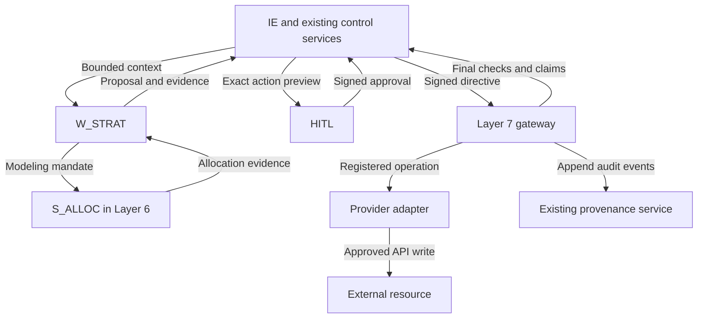

# Layer 7 — Governed Outbound Actuation/Egress Perimeter

Implementation specification for Enterprise OS and Strategy Engine (`W_STRAT`)

Date: 28 September 2026. Status: design ready for implementation against live source; implementation and runtime test results are not claimed.

## 1. Decision and evidence boundaries

Retain the existing architecture. Layer 7 is deterministic, post-HITL security and API actuation infrastructure implemented through the existing outbound gateway, shared contracts, security validators, HITL/CTS/provenance services, and registered integration adapters. It has no LLM, browser, shell, GUI, sandbox, autonomous agent, or sub-agent.

`W_STRAT` proposes strategy, funnels, channel roles, media plans, budgets, and campaign architecture. Its only Strategy specialist is `S_ALLOC`, for sandboxed modeling/allocation. Neither component receives provider credentials, outbound capabilities, enterprise-data clients, or authority to approve or execute its proposals.

### 1.1 What was actually inspected

| Ref | Supplied source | Confirmed finding |
| --- | --- | --- |
| S1 | `File Tree-backend(20260928-142913).tree` | The five requested Strategy package files already appear at lines 78–84. A separate `app/agents/strategy.py` also appears at line 93. The shared gateway, security, schema, service, integration, repository, and test paths below are listed. File contents are unavailable. |
| S2 | `Backend Hierarchy(20260928-142904).md` | Describes `schemas/dispatch.py` as signed post-HITL directives, `outbound_gateway.py` as signed/rate-limited with final TOCTOU checks, and existing HITL, security and provenance responsibilities. Its final section explicitly leaves framework, drivers, CMS vendor, authentication details and ledger implementation unspecified. |
| S3 | `Final-Level Full Architecture(20260928-142904).md` | Layer 7, lines 147–168 and component/data-flow tables, receives signed post-HITL directives from IE and writes to CMS, ads and social. Model A requires IE-mediated worker data access. Layer 7 reads approved payload buffers and emits audit records. |
| S4 | `flowchart.drawio(20260928-142904).html` | Embedded draw.io graph was parsed. Confirms Strategy ↔ allocator, worker context requests → IE, HITL → IE clearance, IE → outbound gateway, gateway → external surfaces, and gateway → audit. |
| S5 | `File Tree-sandbox(20260928-142913).tree` | Lists existing `docker/hardened/skills/s-alloc/{SKILL.md,scripts/run.py}`, hardened compose, seccomp and egress-proxy files. No Layer-7 sandbox component is justified. |

Only these five reference files were available. No runnable backend, module contents, dependency lock, deployment configuration, database schema contents, or separate Strategy research document was supplied. A tree confirms a listed path; it does not establish its behavior, completeness, security, or passing tests. All proposed symbols and field names below are design contracts, not discovered Python APIs.

Classification throughout: **existing/reuse** = listed or documented seam; **modify** = required behavior to implement only if absent; **add** = justified new schema elements or conditional migration; **remove** = prohibited behavior to remove if discovered. No deletion is asserted necessary from filenames alone.

### 1.2 Source conflicts resolved without redesign

| Issue | Resolution |
| --- | --- |
| Older hierarchy lists only `agents/strategy.py`; detailed backend tree includes both entry point and package | Use the detailed tree for physical layout. Inspect imports and registration before changes. Keep the older entry point as a compatibility facade if needed; exactly one Strategy implementation and one registered worker. |
| CMS is both a Layer-4 content store and a Layer-8 production surface | Reuse the same CMS integration with separate capabilities. IE-governed staging/model access remains Layer 3/4. Publishing or any staging mutation that changes live content must pass Layer 7. No data-gateway publish bypass. |
| Architecture has broad universal-persistence/full-context wording | Preserve required evidence through existing owners, but never log provider secrets, bearer grants, credentials, authorization headers, cookies or signing keys. Layer-7 audit records contain redacted metadata and immutable references. |
| A diagram/table shows CDB → learning worker directly | Treat this as a logical feed, constrained by the explicit Model-A rule. It creates no direct worker database permission. No unrelated learning redesign belongs in this change. |

## 2. External validation and its limits

The following are standards-backed design inputs. The implementation choices in later sections are proposed applications of those inputs, not claims that the standards prescribe this particular repository or schema.

| Ref | Primary source | Validated point and design consequence |
| --- | --- | --- |
| E1 | [NIST SP 800-207A](https://csrc.nist.gov/pubs/sp/800/207/a/final), [publication](https://nvlpubs.nist.gov/nistpubs/SpecialPublications/NIST.SP.800-207A.pdf) | Service/application identity complements network controls; proxies/gateways enforce policy. Require authenticated IE identity and a deny-by-default actuation boundary. A new service mesh is not required. |
| E2 | [RFC 9421](https://www.rfc-editor.org/rfc/rfc9421.html), especially §§1.4, 3.2.1, 7.2 | HTTP signatures require an application profile defining covered components, expected signers, freshness and replay handling. Sign the content-digest field, enforce nonce uniqueness and expiry, and retain TLS. |
| E3 | [RFC 9530](https://www.rfc-editor.org/rfc/rfc9530.html), §§2, 6 | `Content-Digest` hashes actual HTTP message content. It does not itself authenticate the sender or define JSON canonicalization. Keep transport-content integrity distinct from the approved-action digest. |
| E4 | [RFC 8785](https://www.rfc-editor.org/rfc/rfc8785.html), §3 | JCS provides deterministic JSON serialization; duplicate names and invalid Unicode must fail. Use a conformant implementation; ordinary sorted-key JSON is insufficient. |
| E5 | [RFC 9110](https://www.rfc-editor.org/rfc/rfc9110.html), §§9.2.2, 10.2.3, 13.1.1 | Conditional writes use server-evaluated preconditions; `If-Match` uses strong comparison. Do not blindly retry non-idempotent requests. Provider support still requires endpoint-specific verification. |
| E6 | [W3C PROV-DM](https://www.w3.org/TR/prov-dm/) | Entity, Activity, Agent and their relationships represent execution lineage. PROV vocabulary alone does not provide immutable or tamper-evident storage. |
| E7 | [OWASP API4:2023](https://api-security.owasp.org/editions/2023/en/0xa4-unrestricted-resource-consumption/) | Bound payloads, operation frequency and resource/cost consumption. Apply limits to requests, retries, reads and reconciliation. |
| E8 | [RFC 7515](https://www.rfc-editor.org/rfc/rfc7515.html) | JWS supports durable signed JSON content. Use it for the persisted HITL approval attestation and for a non-HTTP IE envelope if the existing transport needs one. |

No vendor endpoint capability, quota value, ETag support, idempotency retention period, provider hard-spend guarantee, or reconciliation endpoint has been established by the supplied adapter filenames. Each operation remains disabled until its capability profile is documented and tested against its actual API/version.

## 3. Validated architecture and responsibility boundaries



The return edge to IE denotes narrow, deterministic control operations on existing IE-owned services. It does not invoke an LLM or create general data retrieval for Layer 7. There is no worker → gateway, worker → provider, or sandbox → provider write path.

| Component | Responsibility | Prohibited authority |
| --- | --- | --- |
| `W_STRAT` | Synthesize IE-provided evidence into strategy and proposed actions; request bounded allocation modeling; return evidence references and proposals to IE | Approval, signing execution grants, provider calls, persistence, direct RAG/MCP data access |
| `S_ALLOC` | Compute and explain allocation scenarios within the existing sandbox boundary; return sanitized results | Enterprise retrieval, provider access, HITL, execution, shared state ownership |
| IE + PAB | Validate proposals, coordinate deterministic preparation, own canonical task state and enterprise access, issue bounded dispatch authorization | Treat worker output or a valid signature as sufficient policy approval |
| HITL | Present exact normalized action, target, spend exposure, scope and revision; authenticate reviewer; sign approval; support hold/reject/revoke | Blanket approval of unspecified future payloads |
| Layer 7 | Verify evidence of authorization, exact payload integrity, scope and provider constraints; claim execution; enforce budgets/limits; call registered adapters; report outcomes | Plan strategy, broaden authority, fetch arbitrary enterprise data, rewrite approved business content, run tools/processes |
| Adapters | Fixed API routing and authentication; strict request/response validation; operation-specific preconditions, idempotency and reconciliation | Dynamic URL/method/credential execution or independent retry/approval policy |
| Existing CTS/HITL/provenance services | Own approval status, durable dispatch facts, budget reservations and lineage through existing governed persistence | A second Strategy-specific ledger or Layer-7 workflow engine |

## 4. Exact relevant file hierarchy

Paths are relative to `backend/`. This is a relevant subset, not a replacement for the supplied project tree. `[R]` means existing/reuse, `[M]` means existing/modify if missing behavior, and `[A?]` is conditional add. Unlisted files remain outside scope.

```text
app/
├── agents/
│   ├── strategy.py                              [R/M] compatibility entry point only if needed
│   └── strategy_engine/
│       ├── __init__.py                          [R]
│       ├── strategy.py                          [M]
│       ├── profiles.py                          [M]
│       └── subagents/
│           ├── __init__.py                      [R]
│           └── allocation.py                    [M]
├── api/routes/approvals.py                      [M]
├── core/
│   ├── settings.py                             [M]
│   └── logging.py                              [M]
├── schemas/
│   ├── dispatch.py                             [M]
│   ├── governance.py                           [M]
│   ├── action_preview.py                       [M]
│   ├── strategy.py                             [M]
│   ├── task_state.py                           [M]
│   └── provenance.py                           [M]
├── orchestration/
│   ├── intelligence_engine.py                  [M]
│   ├── hitl_preview_generator.py               [M]
│   ├── policy_evaluator.py                     [M]
│   ├── task_state_machine.py                   [M]
│   └── dag_scheduler.py                        [R/M] bounded wakeups/recovery if needed
├── mcp/
│   ├── host.py                                 [M]
│   ├── data_gateway.py                         [R/M] verify CMS publish separation
│   └── outbound_gateway.py                     [M]
├── security/
│   ├── authorization_boundary.py               [M]
│   ├── cryptographic_validator.py              [M]
│   └── scope_evaluator.py                      [M]
├── services/
│   ├── hitl.py                                 [M]
│   ├── task_state.py                           [M]
│   ├── provenance.py                           [M]
│   ├── audit_validator.py                      [R/M]
│   └── telemetry.py                            [R/M]
├── integrations/
│   ├── ads/
│   │   ├── base.py                             [M]
│   │   ├── google.py                           [M]
│   │   ├── linkedin.py                         [M]
│   │   ├── meta.py                             [M]
│   │   └── tiktok.py                           [M]
│   ├── cms/client.py                           [M]
│   ├── social/
│   │   ├── base.py                             [M]
│   │   ├── instagram.py                        [M]
│   │   ├── tiktok.py                           [M]
│   │   ├── x.py                                [M]
│   │   └── youtube.py                          [M]
│   └── sandbox/
│       ├── client.py                           [R]
│       ├── capabilities.py                     [R/M] verify S_ALLOC grant
│       ├── sandbox_policy.py                   [R/M] verify no actuation capability
│       └── s_alloc_core.py                     [R]
└── persistence/
    ├── database.py                             [R/M] existing transaction facility
    └── repositories/
        ├── operational.py                      [M]
        ├── task_state.py                       [M]
        └── provenance.py                       [M]
migrations/sql/
└── 0007_layer7_dispatch_guards.sql              [A?]
pyproject.toml                                  [R/M] dependencies only after inspection
```

The sandbox's existing `docker/hardened/skills/s-alloc/` remains unchanged for Layer 7. Do not create an outbound sandbox skill or broaden its egress allowlist. Package `__init__.py` files outside the exact Strategy package are omitted for brevity, not removed.

### 4.1 Minimal modifications and justification

| Classification | Existing location | Necessary change / justification |
| --- | --- | --- |
| existing/reuse | Five-file Strategy package | Already matches requested hierarchy. `strategy.py` orchestrates proposals; `profiles.py` grants only Strategy/S_ALLOC capabilities; `allocation.py` uses the existing sandbox interface. No new Strategy specialist. |
| modify | `schemas/dispatch.py` | Add/extend strict immutable action, scope, approval binding, directive, adapter capability and result types. Shared types avoid divergent authorization formats. |
| modify | `schemas/{governance,action_preview,strategy,task_state,provenance}.py` | Reuse budgets/scopes/evidence IDs; expose exact review digest and action IDs; add missing outcome/event fields without copying existing types. |
| modify | `security/cryptographic_validator.py` | Canonicalization/digest helpers, durable approval verification, transport signature verification, trusted-key/algorithm handling. Reuse existing crypto primitives. |
| modify | `security/{authorization_boundary,scope_evaluator}.py` | Authenticated IE caller, signer-role checks, target/account binding, current policy and field-aware attenuation. |
| modify | `services/hitl.py`, approval route, preview generator | Freeze normalized action before review; atomic approval version/revocation handling; bind actual review session to digest; never accept arbitrary reviewer IDs from request bodies. |
| modify | IE, policy evaluator, MCP host, CTS modules | Register only IE-callable actuation; prepare and sign bounded directives; coordinate narrow final authorization/claim methods and existing task transitions. |
| modify | `mcp/outbound_gateway.py` | Fixed registry, final integrity/authority gates, admission limits, dispatch/reconciliation loop, normalized outcomes and provenance calls. Keep deterministic helpers here unless live code already offers shared equivalents. |
| modify | Existing adapters/base modules | Per-operation capability declarations, exact serialization, credentials from trusted bindings, provider error normalization, safe retries/preconditions/reconciliation. Modify only operations actually enabled. |
| modify | Existing operational/task/provenance repositories | Tenant-scoped unique constraints, atomic action claims/reservations, attempts, append-only audit events and durable recovery markers. Called through IE-owned services, never directly by workers or the gateway. |
| add, conditional | `migrations/sql/0007_layer7_dispatch_guards.sql` | Only if existing schema lacks required uniqueness/transaction/audit guarantees. It is the next filename in the supplied snapshot; rebase its number if live migrations have advanced. Extend existing records first; do not edit applied migrations. |
| modify | Settings/logging/telemetry/audit validator | Finite limits, trusted provider/account/key bindings, secret redaction, failure metrics and complete lineage validation. |
| remove, conditional | Any discovered bypass | Remove unsigned dispatch fallback, direct worker provider clients, arbitrary HTTP forwarding, post-approval payload rewriting, unbounded/hidden SDK retries, mutable audit updates, or duplicate Strategy registration if actually present. No blanket file deletion. |

No new runtime service, queue technology, gateway repository, credential store, Strategy state machine, ledger, database, agent framework or generic plugin loader is justified. Reuse the existing HTTP client, identity mechanism, DB transaction support and scheduling mechanism if sufficient. A vetted JCS/signature implementation is a dependency gap to inspect in `pyproject.toml`, not an assertion that a package is missing. Pin and validate only the smallest missing maintained dependency; do not hand-roll cryptography or name unverified package versions.

## 5. Typed contracts

The notation below is a Python-oriented field specification to adapt to the project's actual schema framework. It does not assert Pydantic, a particular Python version or an existing class name. Wire objects reject unknown fields, coercions, duplicate JSON properties, invalid UTF-8, non-finite numbers and over-limit nesting. All collections and nested objects are immutable after validation; a shallow `frozen=True` wrapper around mutable dictionaries is insufficient.

### 5.1 Primitive and shared types

```python
OpaqueId = str           # nonempty, length-bounded, validated per namespace
Sha256 = str             # exactly 64 lowercase hex characters
UTCInstant = str         # one strict RFC3339 UTC form selected by schema
UInt = int               # nonnegative, reject bool and numeric coercion
RegistryId = str         # exact configured enum/key; no wildcard/import path

class Money:
    currency: str        # configured currency code; no implicit FX
    units: str           # canonical unsigned base-10 integer, no leading zeros
    scale: UInt          # amount = units / 10**scale; configured for operation

class Target:
    provider: RegistryId # distinguish ads.tiktok from social.tiktok
    environment: RegistryId
    account_id: OpaqueId
    resource_type: RegistryId
    resource_id: OpaqueId  # existing object, or exact parent for a create

class Revision:
    kind: Literal['strong_etag', 'provider_version']
    value: str           # preserved opaque value, bounded and header-safe

class SpendLimit:
    budget_scope_id: OpaqueId
    ceiling: Money
    period_start: UTCInstant
    period_end: UTCInstant
    basis: Literal['incremental_liability', 'total_liability']

class ExecutionScope:
    tenant_id: OpaqueId
    service_audiences: tuple[RegistryId, ...]  # permitted internal recipients
    targets: tuple[Target, ...]
    operations: tuple[RegistryId, ...]
    channels: tuple[RegistryId, ...]
    marketing_audience_digest: Sha256 | None  # exact normalized targeting
    spend: SpendLimit | None
    max_logical_actions: UInt

class ArtifactBinding:
    artifact_id: OpaqueId
    version: OpaqueId
    sha256: Sha256
    size_bytes: UInt
    media_type: str
```

Money uses exact integer arithmetic internally. Decimal strings avoid JCS floating-point precision loss. Validate maximum precision/range, fixed currency/scale and provider units; perform any conversion before approval. Reuse existing Money/scope types if they meet these requirements.

### 5.2 Approved action and signed HITL record

```python
class ApprovedAction:
    schema_version: Literal['approved-action.v1']
    action_id: OpaqueId
    tenant_id: OpaqueId
    task_id: OpaqueId
    target: Target
    operation: RegistryId
    channel: RegistryId
    authorized_scope: ExecutionScope
    provider_payload: StrictOperationPayload
    assets: tuple[ArtifactBinding, ...]
    expected_revision: Revision | None
    adapter_contract_version: str
    adapter_config_digest: Sha256   # nonsecret routing/semantic configuration
    evidence_refs: tuple[ArtifactBinding, ...]

class ApprovalBinding:
    schema_version: Literal['approval-binding.v1']
    issuer: RegistryId             # trusted HITL authority
    approval_id: OpaqueId
    approval_version: UInt
    reviewer_subject: OpaqueId
    tenant_id: OpaqueId
    task_id: OpaqueId
    action_id: OpaqueId
    payload_digest: Sha256
    scope_digest: Sha256
    preview_digest: Sha256         # binds what the reviewer saw
    issued_at: UTCInstant
    not_before: UTCInstant
    expires_at: UTCInstant
    max_executions: Literal[1]

class SignedApproval:
    compact_jws: str               # encoded ApprovalBinding; strict size cap
```

`StrictOperationPayload` is a closed discriminated union of the enabled adapter's explicit request schemas. It is not a free-form dictionary accepted by all providers. The approval scope's target, operation, channel and spend cover the exact action. Large assets arrive through IE-approved immutable buffers/references whose bytes are verified; an artifact ID or mutable URL alone is insufficient.

One approval authorizes one logical action. A campaign with several external mutations uses existing IE DAG child tasks and individually bound actions/approvals; a review screen may approve a displayed fixed collection together, but every child requires its own exact binding and shares the applicable aggregate budget ceiling. Do not implement a new batch-plan engine inside Layer 7.

### 5.3 Execution directive and transport envelope

```python
class ExecutionDirective:
    schema_version: Literal['execution-directive.v1']
    directive_id: OpaqueId
    issuer: RegistryId             # trusted IE issuer
    subject_service_id: RegistryId # must equal authenticated IE caller
    audience: RegistryId           # exact intended gateway/service
    tenant_id: OpaqueId
    approval_id: OpaqueId
    approval_version: UInt
    approval_binding_digest: Sha256
    task_id: OpaqueId
    action_id: OpaqueId
    target: Target
    operation: RegistryId
    canonicalization: Literal['RFC8785']
    digest_algorithm: Literal['sha-256']
    payload_digest: Sha256
    authorized_scope: ExecutionScope
    channels: tuple[RegistryId, ...]
    spend_ceiling: SpendLimit | None
    issued_at: UTCInstant
    not_before: UTCInstant
    expires_at: UTCInstant
    nonce: str                     # CSPRNG, at least 128 bits, bounded encoding
    idempotency_key: str           # stable for this logical action
    expected_resource_revision: Revision | None
    policy_version: OpaqueId
    adapter_contract_version: str

class DispatchEnvelope:
    directive: ExecutionDirective
    approval: SignedApproval
    approved_action: ApprovedAction
```

The HTTP request carrying `DispatchEnvelope` is signed by IE with HTTP Message Signatures. For a non-HTTP MCP transport, carry a JWS over the same canonical envelope with equivalent audience, identity, expiry and replay checks; do not invent an HTTP request solely for signature syntax. Neither transport trusts unsigned detached dictionaries.

Every repeated field must match its authoritative signed counterpart. `payload_digest` binds the entire `ApprovedAction`, including target, payload, scope, assets and expected revision. Directive scope may only restrict execution admission; it cannot modify the approved action. If a tighter cap makes the original payload impermissible, deny and return it to IE/HITL instead of editing it.

### 5.4 Adapter capabilities, attempt and result types

```python
class OperationCapability:
    provider: RegistryId
    operation: RegistryId
    api_version: str
    adapter_contract_version: str
    target_type: RegistryId
    idempotency: Literal['inherent', 'provider_key', 'none']
    idempotency_retention_seconds: UInt | None
    revision_guard: Literal['strong_etag', 'atomic_version', 'not_applicable', 'none']
    reconciliation: RegistryId | None  # fixed, bounded status/lookup handler
    hard_spend_bound: bool
    configured_limits_id: RegistryId
    enabled: bool
    evidence_reference: str            # reviewed official API/version evidence

class DispatchAttempt:
    execution_id: OpaqueId
    attempt_id: OpaqueId
    ordinal: UInt
    claim_generation: UInt
    payload_digest: Sha256
    wire_body_digest: Sha256
    started_at: UTCInstant
    provider_request_id: str | None

class ItemOutcome:
    item_id: OpaqueId
    outcome: Literal['succeeded', 'failed_no_effect', 'pending', 'unknown']
    external_resource_id: str | None
    provider_revision: str | None

class DispatchResult:
    execution_id: OpaqueId | None  # absent for denials before a claim exists
    tenant_id: OpaqueId
    task_id: OpaqueId
    action_id: OpaqueId
    approval_id: OpaqueId
    payload_digest: Sha256
    outcome: Literal['denied', 'deferred', 'succeeded', 'failed_no_effect',
                     'pending', 'unknown', 'partial']
    reason_code: RegistryId
    item_outcomes: tuple[ItemOutcome, ...]
    provenance_event_ids: tuple[OpaqueId, ...]
    next_check_at: UTCInstant | None
```

An `OperationCapability` is trusted static configuration reviewed with its adapter, never user-supplied. `hard_spend_bound` must be backed by the actual operation's documented maximum exposure, not a label that bypasses the spend checks.

## 6. Canonical approval and signing profile

This section defines the proposed Enterprise OS application profile. Its field selection, strictness and lifecycle are local design requirements built on E2–E4/E8.

### 6.1 Freeze before review

1. IE validates the Strategy proposal and requests any missing enterprise context through its existing data path.
2. A registered adapter's pure preparation/validation function normalizes the exact operation payload before review. Materialize business defaults, currency units, targeting, schedules, resource identifiers and revision guards now. Preparation cannot perform an external write.
3. IE obtains any permitted resource/revision read through its governed integration path. These narrow operational reads do not give Strategy or Layer 7 general enterprise retrieval.
4. Create `ApprovedAction` and its exact immutable asset bindings. Produce `payload_digest = hex(SHA256(JCS(ApprovedAction)))` and `scope_digest = hex(SHA256(JCS(ApprovedAction.authorized_scope)))`.
5. Persist the frozen action and preview via existing IE-owned persistence. The preview visibly identifies account/environment/resource, operation, marketing audience, budget exposure, schedule, exact content/media references and revision. Its digest identifies the review dossier, not just a screenshot of selected fields.
6. The authenticated reviewer approves that stored version. The approval route resolves the server-side preview and digest; a client cannot swap the payload or submit another person's identity. HITL signs canonical `ApprovalBinding` bytes only after current reviewer authority is checked and the approval event is durable.
7. IE emits the signed dispatch envelope referencing that exact approval. Any revision to content, assets, target, scope, audience, schedule, budget, adapter semantics or expected provider revision creates a new action/version and requires renewed HITL approval.

JCS key ordering and whitespace normalization mean formatting-only changes may produce the same approved canonical bytes. A semantic payload change must change the digest. Do not normalize Unicode, reorder meaningful arrays, round amounts or insert defaults after approval. Set-like lists are normalized before review and then frozen. Treat omitted fields and explicit null according to the versioned schema; never silently interchange them.

### 6.2 Durable HITL signature

Use the existing signer if it satisfies this profile; otherwise implement it in the existing HITL/crypto modules. The selected representation is compact JWS with canonical `ApprovalBinding` as its payload. Protect `alg`, `kid` and an application-specific approval `typ`; reject unprotected security-critical headers, `alg=none`, unsupported algorithms, unknown critical headers and duplicate members. Algorithms and key roles come from trusted configuration, not caller preference. Bind `kid` to the configured HITL issuer and allowed tenant/delegation scope. Do not fetch caller-provided `jku`, `x5u`, URLs or keys.

HITL attestation and IE dispatch authority are separate roles. IE signing keys cannot manufacture human approval; the HITL service signs only a verified human decision. Gateway runtime holds verification keys and provider credentials, not HITL/IE private signing keys. Expiry/revocation/key-compromise checks remain mandatory even for cryptographically valid historical signatures.

### 6.3 HTTP IE → gateway signature

For an HTTP MCP hop, require RFC 9421 `Signature-Input` and `Signature`, covering at least `@method`, `@target-uri`, `content-type` and `content-digest`. Include any additional header whose value affects authorization or routing, or reject/ignore that header entirely. All directive fields reside in the signed-content body. Require signed `created`, `expires`, `nonce`, `keyid`, `alg` and an application `tag`; the trusted signer role and key binding determine authority, not the signature label.

Set RFC 9530 `Content-Digest` over the actual HTTP message-content bytes. Verify it against received bytes and then verify the signature and semantic action digest independently. The application digest over `ApprovedAction` is not a substitute for the digest of the enclosing HTTP body. If content coding is allowed, specify hashing at the correct content layer and verify before transformations; the smallest profile rejects request compression and unexpected content encodings.

Require TLS and authenticated service identity, using the existing suitable workload mechanism (for example mTLS or audience-bound service tokens). Verify caller identity equals the directive subject, IE issuer is trusted, signature key belongs to that identity, and signed audience names this gateway/environment. Never treat a network address or self-asserted `X-Tenant`/`X-Service` header as identity. Configure any trusted proxy reconstruction explicitly; do not trust arbitrary forwarded-host headers.

Require the signed HTTP nonce to equal the directive nonce. Bound signature creation/expiry by the directive window, and bound that window by the approval and delegation windows: `dispatch_expires <= min(approval_expires, delegation_expires, policy_deadline)`. Validate `not_before <= now < expires_at`, a configured maximum lifetime and permitted issuance clock skew; skew tolerance must not silently extend write authority past expiry. Use a trusted clock and monotonic local deadlines. If clock validity cannot be established, deny. Compute `approval_binding_digest` from the canonical decoded approval binding, never from an unverified client copy; require its JWS payload bytes to equal that canonical encoding.

### 6.4 Final comparisons

Immediately before each state-changing attempt, reparse with strict rules and recompute JCS/hash from the immutable approved bytes; compare against both the HITL binding and IE directive. Recheck all asset hashes, approval version/status, expiry, caller/delegation, current policy, account ownership, adapter/config version, scope and resource precondition. Byte buffers used after verification must not reference mutable shared objects.

Transport-only authentication material, a fixed provider idempotency header and the signed expected revision may be attached by the trusted adapter. They cannot change business semantics. Serialize the validated provider payload deterministically; forbid SDK defaults or middleware mutations that would change approved content. Record the final wire-body digest and compare it to the adapter's precomputed rendering. For multipart/binary payloads, bind each part's exact bytes/media type in the approved manifest and use a stable approved encoding; a mutable remote media URL is not a verified asset.

No HTTP-signature support is presumed at an external provider. Use its supported authentication and TLS, and use message signatures/digests externally only where that endpoint supports them. The internal approval guarantee still applies.

## 7. Monotonic authority and target enforcement

For each dispatch require `actual_effect ⊆ directive_scope ⊆ approved_scope ⊆ IE_delegation ∩ current_policy`. This is a field-aware authorization predicate, not a string-prefix or generic JSON-subset operation.

| Dimension | Exact rule |
| --- | --- |
| Tenant | Authenticated tenant context, task, evidence, approval, action, directive, credential binding, reservation and audit partition agree. Tenant cannot be changed or treated as a set to broaden. |
| Service audience | Exact permitted gateway recipient; do not confuse service-token audience with advertising targeting. |
| Provider/account/environment | Match the signed target and trusted tenant-account binding; distinguish production/test and paid/organic adapters. No automatic fallback account/provider. |
| Resource/operation | Exact object or approved create parent; allowlisted resource type and operation pair. Reject alternate resource IDs hidden in nested payload fields. |
| Channel | Explicit configured identifiers; no wildcards or cross-channel expansion. |
| Marketing audience | Version-one profile requires exact digest equality. A future narrowing relation requires an operation-specific, proven subset evaluator; do not infer subset from targeting JSON. |
| Budget | Same currency/scale/budget scope/period; effect stays within every applicable cap and current committed-plus-reserved exposure. Missing spend authority means no spend permission. |
| Approval | Exact action digest, active approval version and one logical execution. A new nonce, directive ID or idempotency key cannot reuse the approval for another action. |
| Policy/revision | Apply the current policy as an additional restriction. Invalid/stale policy or required revision mismatch blocks execution. A policy widening never increases signed authority. |

Layer 7 can reduce attempt counts, wait, deny or apply a stricter admission limit. It cannot silently reduce or rewrite a signed campaign budget/audience, because even a seemingly safer payload edit invalidates the exact approval. Return such edits to IE for a new preview and approval.

Registry routing is a fixed mapping from provider + operation + API version to a specific handler and request schema. Raw endpoint URLs, HTTP methods, arbitrary headers, executable module names, code strings and credentials are absent from the directive schema. Resource IDs must be validated and safely encoded; reject path traversal, query injection and alternate-account identifiers.

Trusted configuration owns endpoint origins, TLS verification, token endpoints and tenant/account credential references. Disable redirects by default; permit only an explicitly documented fixed-origin redirect rule if essential and never forward credentials across origins. Prevent DNS/SSRF access to internal or metadata addresses. Business URLs such as a landing-page link are inert typed content, not gateway destinations. Do not fetch caller-supplied media URLs; use IE-supplied, hash-verified assets. If a provider requires URL-based upload, enable it only with a reviewed, immutable, approved asset-delivery mechanism.

Provider credentials exist only inside trusted adapter/gateway runtime configuration or its existing secret integration. Workers and sandboxes must lack them, including environment variables. OAuth refresh, if used, is a fixed credential-maintenance operation within the same trusted account binding, never a request-supplied token flow.

## 8. Deterministic dispatch and persistence flow

### 8.1 Existing control-service methods to extend

Define these capabilities as methods on existing IE/CTS/HITL services; proposed names may be adapted to live APIs. No additional service process or generic data-access port is implied.

| Method | Required behavior |
| --- | --- |
| `prepare_action(...)` | IE-owned deterministic preparation and immutable preview/action persistence; no external write. |
| `authorize_and_claim(...)` | PAB/HITL/current-policy check plus tenant-scoped approval/action/idempotency/nonce claim, all budget reservations and durable authorization event. |
| `begin_attempt(...)` | Recheck approval/revocation/policy/expiry, assert exclusive current claim, acquire bounded rate/concurrency admission, and append durable pre-send attempt record. |
| `record_observation(...)` | Persist sanitized provider response/uncertainty and append provenance; update the existing CTS projection and reservations transactionally. |
| `schedule_reconciliation(...)` | Use existing DAG/task recovery mechanism for a bounded status read. No autonomous agent and no independent state machine. |

Layer 7 receives approved buffers and invokes only these execution-control operations plus provenance append. IE remains the enterprise-data/RAG authority. Repositories are dependencies of the existing trusted control services, not of Strategy, S_ALLOC, adapters or the outbound gateway. A service implementation may transact through the existing authorized persistence path, but cannot accept arbitrary queries, artifact IDs unrelated to the action, or caller-selected tenant scopes.

### 8.2 Required durable records

Use existing operational/task/provenance records if their schemas and constraints suffice. Otherwise extend them through the conditional migration. Logical records below do not require one new physical table each.

| Record | Required identity/constraint |
| --- | --- |
| Immutable approval binding/action | Composite tenant + approval/version/action IDs; immutable approved bytes/digests; append-only decision history and current status/version projection |
| Nonce admission | Unique `(tenant_id, issuer, audience, nonce)`; atomic insert; retention through the full acceptable signature window and configured skew |
| Logical execution | Unique `(tenant_id, approval_id, approval_version, action_id)` and `(tenant_id, action_id)` for the action's lifetime; one execution independent of nonce/key changes |
| Idempotency binding | Unique `(tenant_id, provider, account_id, operation, idempotency_key)` bound to approved action/approval/target/adapter fingerprint; conflicting fingerprint is denied |
| Attempt | Unique `(tenant_id, execution_id, ordinal)` and attempt ID; claim generation, start marker, hashes and outcome observations |
| Budget commitment | Tenant/budget scope/currency/period; reserved, committed and unresolved exposure; nonnegative exact arithmetic and atomic multi-cap checks |
| Admission counters/leases | Tenant/provider/account/operation plus applicable global/provider limits; bounded rate counters and concurrency claims shared across replicas |
| Provenance event | Tenant-scoped unique event ID, entity/activity/agent links, immutable payload and ordering/tamper-evidence metadata |

Use composite foreign keys and tenant-scoped uniqueness where applicable; IDs are not authorization. Reuse the Layer-4 RLS/privilege foundations listed in S1 and prove them in tests. No durable replay protection may depend solely on process memory.

`authorize_and_claim` must atomically validate the active approval/version, insert the execution/nonce/idempotency claim, reserve all relevant budgets and durably record the authorization decision. Lock rows or use serializable/CAS transactions in a consistent order. Concurrent actions sharing one budget must not both pass using the same balance. If existing data-gateway primitives cannot express this transaction, extend a narrow command in the existing governed path; do not implement a sequence of unrelated CRUD calls.

Keep approval decisions and audit history append-only. CTS/execution status is a mutable projection updated with version/CAS guards and reconstructed from events where supported. It is not a competing Layer-7 source of truth. If the audit store is separate, a durable event/outbox record in the existing control transaction is required before send, followed by idempotent ledger delivery. Do not claim atomicity across a remote provider and local storage.

### 8.3 Ordered execution

1. **Authenticate and bound input.** Reject wrong service identity, wrong gateway audience, oversized body/assets, unsupported content type, duplicate properties and unknown schema versions before costly processing.
2. **Verify cryptography.** Validate the IE transport/envelope signature and content digest; verify the independent HITL attestation and trusted signer roles. Check nonce format, signature times and key validity/revocation.
3. **Verify exact action.** Recompute canonical action/scope/approval-binding hashes, compare all repeated fields, validate evidence/artifact tenant bindings and adapter contract/config version.
4. **Enforce policy and routing.** Check current IE delegation, active HITL approval, provider/account ownership, explicit registry operation, payload schema, target, marketing audience, resource revision capability and spend bound.
5. **Claim once.** Atomically reserve approval/action identity, nonce/idempotency identity and budget exposure via IE-owned services. An existing logical execution never triggers another write merely because a new request was submitted.
6. **Admit an attempt.** Acquire shared rate and concurrency admission within a finite deadline. Deferred work is recorded by CTS; it must repeat freshness/revocation/policy checks on wakeup. Do not hold a database transaction while waiting for a provider.
7. **Final dispatch check.** Re-canonicalize/re-hash the immutable approved action; verify all bytes to be sent, current authorization, expiry, claim ownership and revision guard. Persist the pre-send attempt marker. From this point, a crash is potentially an uncertain write.
8. **Send once.** Call only the fixed adapter handler using trusted credentials, original stable provider idempotency mechanism and expected revision. No shell, process, browser, sandbox or LLM call occurs.
9. **Classify the observation.** Strictly validate bounded response metadata/body. A timeout or malformed response after send is `unknown`; HTTP 202 is ordinarily `pending`, not completed. Handle any per-item results explicitly.
10. **Persist and report.** Append the attempt observation/outcome, update the CTS projection and budget exposure, then return `DispatchResult` to IE. A successful external write without durable local completion remains pending recovery, never a clean local failure that invites replay.
11. **Reconcile or retry within bounds.** Schedule fixed status lookups, preserve action identity and original digest, and re-run authorization before every permitted write attempt. Final results return to IE and existing telemetry/provenance owners.

### 8.4 Replay, duplication and crash recovery

A repeated signed nonce is rejected as replay, including byte-identical transport resubmission. It causes no second effect. The authenticated IE can inspect the existing task/result through the existing status path. An IE request with a fresh nonce but the same logical action is deduplicated against the durable action/approval claim; a different digest under the same idempotency key is a conflict. A changed key cannot bypass the action/approval uniqueness constraint.

Internal provider retries are attempts of the already admitted execution, not a way to re-admit the old nonce. They preserve the logical action, payload, stable provider key and applicable approval validity. If IE refreshes an expired transport authorization, it must bind the same execution; an expired/revoked HITL approval cannot be extended by IE alone. A genuinely renewed human approval must still reconcile the prior action before any replacement write.

On restart, a record with a pre-send marker and no durable outcome is `unknown`, even if the process may have crashed before opening the socket. Reconcile; do not infer failure from an expired lease. Once an attempt is marked started, never let lease expiry alone launch a competing attempt. Drain/terminate the prior local attempt and establish a safe result or provider idempotency protection before reattempting. A fencing counter prevents stale local updates but is not a remote provider fencing token unless the provider enforces it.

### 8.5 Revocation and TOCTOU semantics

Approval revocation and `begin_attempt` must serialize on the same authoritative approval/version state. If revocation wins, no attempt starts. If attempt admission wins, it is recorded as in flight; recheck immediately at send, stop future attempts, and attempt transport cancellation when possible. Do not report an in-flight write as undone simply because approval was revoked.

No client-side protocol can guarantee that a request already delivered to an external provider will be cancelled by a later local revocation. The enforceable boundary is a documented dispatch linearization point plus provider-enforced conditional writes. Where immediate remote revocation or atomic target updates are required but unavailable, that operation must remain disabled. This limitation is a release constraint, not a permission to weaken fail-closed handling.

## 9. Provider correctness, retry and resource controls

### 9.1 Operation capability registry

Provider keys below map only to paths confirmed in S1. Actual operations must be registered by exact API/version after inspection; an empty allowlist means disabled.

| Registry namespace | Existing adapter |
| --- | --- |
| `cms` | `app/integrations/cms/client.py` |
| `ads.google` | `app/integrations/ads/google.py` |
| `ads.meta` | `app/integrations/ads/meta.py` |
| `ads.tiktok` | `app/integrations/ads/tiktok.py` |
| `ads.linkedin` | `app/integrations/ads/linkedin.py` |
| `social.instagram` | `app/integrations/social/instagram.py` |
| `social.x` | `app/integrations/social/x.py` |
| `social.tiktok` | `app/integrations/social/tiktok.py` |
| `social.youtube` | `app/integrations/social/youtube.py` |

Each enabled operation needs reviewed facts for: endpoint/method/API version; exact request/response schemas; account/resource authorization; authentication; side effects including implicit defaults; idempotency scope/retention; atomic revision support; partial-success behavior; status lookup and consistency delay; maximum spend exposure; rate/throttle signaling; request/response size and deadlines. Unknown capabilities are never interpreted as supported.

### 9.2 Stale-write prevention

For resource updates, carry the approved strong ETag in `If-Match` where supported. Reject weak ETags; `If-Match: *` proves existence rather than a particular revision and does not satisfy revision equality. With an atomic provider version/CAS parameter, send the exact signed version through that mechanism. Preserve the same original precondition on retries; do not fetch a new revision and silently overwrite the newer resource.

A preflight GET followed by an unguarded update is not an atomic version check. Local resource locks serialize Enterprise OS writers only, not provider-console users or other clients. If no atomic guard/equivalent provider lock exists, revision-dependent updates remain disabled under the requested strict TOCTOU guarantee. A documented create/idempotent operation for which revision checking truly does not apply may use `not_applicable`; this is an adapter decision backed by evidence, never a caller escape hatch.

A 412/precondition rejection produces `stale_revision`, returns to IE, and requires fresh review/approval for a changed target revision. If a timeout precedes a later precondition response, reconcile the first attempt before concluding that nothing happened. Never broaden the precondition to `*` or omit it after failure.

### 9.3 Idempotency and bounded retry

| Observation | Required action |
| --- | --- |
| Local denial before attempt start | No provider write. Release only reservations proven unused; retain denial lineage. |
| Definitively not transmitted | Retry only under the enabled operation's inherent idempotency or tested idempotency mechanism, within all current authorizations and limits. |
| 429 / throttle response | Honor valid provider delay signals; retry only if adapter proves no effect or reconciliation resolves it, and the write is retry-safe. |
| 5xx, connection reset after send, deadline timeout, invalid/truncated response | Treat as uncertain unless the endpoint contract proves no effect. Reconcile before any write retry. |
| 401/403 | Stop the action for authorization/credential handling. Fixed token refresh may occur under existing trusted policy, but never widen credentials or accounts. |
| Validation/policy error | Terminal denial or confirmed no-effect failure; no payload repair or automatic content rewrite. |
| 202 / remote job handle | Record `pending`; bounded poll or authenticated provider event through existing ingestion. Do not resubmit the original mutation. |
| Confirmed success | Persist returned IDs/revision and terminal result; never repeat the business action. |
| Partial success | Persist each successful/failed/unknown item. Stop dependent work; reconcile unknown items. Never replay the whole batch. |
| No trustworthy reconciliation mechanism | Hold `unknown` for IE/HITL review; no blind retry. |

Reconciliation is a fixed, read-only, tenant/account/action-scoped adapter lookup and must be authorized through existing IE control. Correlate provider request/job ID, stable idempotency key or documented unique external action reference. An eventually consistent “not found” is not proof of non-execution until the provider's documented visibility window and guarantees establish that conclusion. If reconciliation remains inconclusive, preserve the hold.

Provider idempotency headers count only when the endpoint actually supports their semantics. Reuse the identical provider key for safe retries, keep local deduplication longer than the provider retry window, and refuse retry after remote key retention expires. Local deduplication alone does not make an uncertain remote POST safe to repeat. Reconciliation may prove prior success or confirmed non-application; only the latter plus tested retry safety permits another mutation. There is no universal exactly-once guarantee.

SDK, HTTP-client, proxy and service-mesh automatic retries for writes must be disabled or routed through these same checks. One recorded gateway attempt must represent one known network mutation attempt, including multi-step SDK calls. Compensating rollback/pause/delete is a new external write: it requires an exact, already approved contingency action or renewed IE → HITL → Layer-7 authorization. No discretionary auto-rollback.

Do not conceal a multi-call publishing or campaign-creation workflow inside one adapter attempt. Every separately state-changing API call needs its own exact approved action and attempt record, coordinated by the existing IE DAG. If a later request requires an ID only returned by an earlier create/upload, prepare its actual payload after that result and obtain the corresponding HITL binding before dispatch. A native single-call provider batch may be one approved action only when every item, item limit and aggregate exposure is frozen and individually traceable; no dynamic additions or substitutions are allowed.

### 9.4 Finite consumption limits

Require explicit finite configuration in existing settings for each enabled tenant/provider/account/operation: requests per window, burst, in-flight ceiling, queue capacity/age, connect/read/total deadline, request bytes, response bytes, asset bytes, JSON depth/list size, maximum items, mutation attempts, reconciliation attempts and total execution time. Missing or invalid policy disables the operation rather than applying an unlimited default. Actual values require provider/account limits and operational requirements; this specification invents none.

Use shared atomic counters/leases across gateway replicas, reusing the existing transactional store unless a proven existing limiter is available. Enforce provider-global and account ceilings as well as tenant fairness. Count retries, preflight/status reads and reconciliation against the relevant limits. A limiter/store outage fails closed; process-local counters cannot preserve global limits. A circuit-open status defers work within a finite lifetime, never creates an unbounded retry queue.

For eligible retry `n`, use full jitter `U(0, min(max_backoff, base_backoff * 2**n))`. Wait at least a valid provider `Retry-After`/reset interval; never reduce a requested delay to fit a local cap. If the delay exceeds remaining authorization/deadline, defer to IE or stop. Use the existing scheduler rather than sleeping while holding DB locks or scarce slots. Re-check authorization, quotas and budget before each attempt.

### 9.5 Spend safeguards

Rate limits constrain calls; spend controls constrain financial exposure. Validate that the exact approved provider payload cannot create greater liability than any applicable tenant, plan, approval, account, resource and period ceiling. Reserve exposure atomically before dispatch, including overlapping active campaigns and unresolved attempts. Do not rely on delayed observed-spend telemetry for admission.

For a create/activation, reserve its maximum permitted liability over the approved period. For an update, reserve any increase only when prior commitments and target revision are authoritative; otherwise conservatively retain/reserve the larger bound or deny. Bind campaign schedule, currency, time zone and provider budget units before approval. Reject unlimited duration, automatic budget expansion, currency conversion or defaults that defeat a finite approved cap.

The provider's maximum enforceable spend may differ from a displayed daily budget because of pacing, overdelivery, fees or billing semantics. The adapter must account for documented maximum exposure, or use a real supported hard limit. If no bound can satisfy the signed ceiling, do not activate spend-bearing operations. Alerts and later pause actions cannot substitute for this guarantee.

Commit successful liability; retain unresolved liability after timeout, partial success or expired approval. Release only when cancellation/non-application/ended exposure is authoritatively established. Repeated budget updates must not release the old reservation before the new resource state is confirmed. Any remedial external write still needs authorization. Read-only reconciliation may continue under separately authorized bounded IE recovery access after write approval expires; it cannot revive write permission.

## 10. Append-only execution provenance

Extend `schemas/provenance.py`, `services/provenance.py`, the existing provenance repository and audit validator. Use PROV semantics without adding an RDF server or graph database.

| PROV concept | Enterprise OS mapping |
| --- | --- |
| Entity | Immutable IE task/grant version, Strategy evidence, S_ALLOC result, approved action/asset manifest, review preview, signed approval binding, signed directive, sanitized provider-result record |
| Activity | Allocation run, Strategy synthesis, human approval, authorization verification, attempt, provider status reconciliation, terminal outcome recording |
| Agent | Human reviewer, IE service identity, W_STRAT run identity, S_ALLOC run identity, gateway identity and adapter software/version |
| `used` | Dispatch attempt used the exact action, approval, directive and policy version |
| `wasGeneratedBy` | Result record generated by the dispatch/reconciliation activity |
| `wasDerivedFrom` | Approved action derived from Strategy evidence; proposal derived from allocation output |
| `wasAssociatedWith` | Activity associated with the responsible authenticated human/service/worker identity |
| `wasInformedBy` | Dispatch informed by approval verification; reconciliation informed by the uncertain attempt |

Calling deterministic gateway software a PROV Agent expresses responsibility; it does not introduce an autonomous Layer-7 agent.

Each control event includes: tenant; event/activity/entity IDs; IE task/action/approval/version/directive IDs; evidence references; authenticated actor and trusted issuer/key identifier; authorization outcome/reason and policy version; canonicalization/hash version; payload and scope digests; provider/account/resource/operation/channel identifiers; revision precondition; execution/attempt ordinal; idempotency correlation (redacted/keyed hash if sensitive); timestamps; quota/budget decision; sanitized provider status/error/request/job/resource IDs; wire-body digest; retry/reconciliation links; and final outcome. Avoid raw marketing-audience PII; use digest/reference unless a protected audit field is required.

Append events for authorization success and denial, claimed execution, attempt start, response/timeout, retry decision, reconciliation observations, partial outcomes, hold, revocation and terminal outcome. A denial before task binding may record only the safely established identity/correlation metadata; it must not invent a verified tenant or permit cross-tenant inspection.

Enforce append-only application privileges and reject UPDATE/DELETE for audit roles. Hash-chain/sign/checkpoint events using the existing ledger capability, if implemented; sequencing must be concurrency-safe per tenant/stream. Hash chains alone do not stop a privileged attacker rewriting all history, so independently protected checkpoints/retention controls are a production verification requirement. PROV vocabulary itself is not an immutability guarantee. Reuse existing storage/keys and retention controls; introduce no new ledger technology without a demonstrated gap.

Never include provider access/refresh tokens, private keys, cookies, authentication headers, secret-bearing URLs, raw credential exceptions, reusable signed grants or full provider response dumps in logs. Store actual signed approval material only in the protected existing approval record; audit contains its digest/reference and verification result. Hashes are not permission to retain secret-containing bodies.

Before send, the authorization and attempt-start evidence must be durable. If that write fails, do not call the provider. If result persistence fails after a provider call, retain the pre-send marker, suspend new mutations for that execution and recover by bounded reconciliation. If the main ledger is temporarily unavailable, only an already verified durable transactional event/outbox path may preserve the event; do not claim success from an in-memory log. Retry audit delivery idempotently and alert on delivery lag. A storage outage before any attempt may prevent a denial audit entry, but must never permit an unaudited provider write.

## 11. Failure contract and security invariants

Use stable typed reason codes, sanitized for the caller. These are proposed registry entries, not confirmed existing exception names.

| Reason family | Representative codes | Write behavior |
| --- | --- | --- |
| Identity/signature | `unauthenticated`, `wrong_service`, `wrong_audience`, `unsigned`, `signature_invalid`, `key_untrusted`, `key_revoked` | Deny before provider access |
| Integrity/freshness | `payload_mismatch`, `scope_digest_mismatch`, `asset_mismatch`, `expired`, `not_yet_valid`, `clock_untrusted`, `approval_revoked`, `approval_version_stale` | Deny; no automatic repair |
| Authority | `tenant_mismatch`, `target_mismatch`, `scope_escalation`, `budget_exceeded`, `policy_denied`, `approval_required` | Deny; return to IE |
| Registry/preconditions | `operation_unregistered`, `provider_disabled`, `adapter_version_mismatch`, `precondition_unsupported`, `stale_revision` | Deny/hold; fresh review where payload/revision changes |
| Replay/duplicate | `nonce_replay`, `idempotency_conflict`, `action_already_claimed` | No new effect; authorized status retrieval only |
| Consumption | `payload_too_large`, `rate_limited`, `concurrency_exhausted`, `queue_full`, `deadline_exceeded` | Reject/defer within signed lifetime |
| Provider/recovery | `provider_pending`, `provider_timeout`, `provider_response_invalid`, `partial_success`, `outcome_unknown`, `retry_exhausted` | Preserve known effects, reconcile, hold unresolved exposure |
| Storage/control | `approval_store_unavailable`, `limiter_unavailable`, `audit_unavailable`, `claim_lost` | No new write; preserve uncertain in-flight history |

Mandatory invariants:

1. Every external mutation is performed by one registered adapter under an authenticated, signed IE directive and valid exact HITL approval.
2. Successful signature verification never replaces current policy, approval-status, tenant or provider-account authorization.
3. Exact canonical action, scope and immutable asset bytes match the reviewed version before every mutation attempt.
4. Authority never expands; narrowing permission does not authorize post-approval payload editing.
5. A logical action/approval is admitted once across processes, restarts, nonce changes and duplicate deliveries.
6. An unknown outcome is neither failure nor permission to retry; unresolved spend remains reserved.
7. No revision-sensitive write proceeds without a genuine atomic remote precondition/equivalent guard.
8. Provider credentials and destinations are resolved only from trusted tenant-bound configuration.
9. Worker and sandbox capabilities cannot reach the actuation boundary, credential material or provider write endpoints.
10. Every provider call has durable prior lineage and a recoverable outcome record; provenance is append-only and secret-free.
11. Limits apply to all mutations, reads, retries and reconciliation across replicas. Failure of control stores fails closed.
12. Layer 7 never instantiates an LLM, sandbox, shell/process runner, browser, GUI, planner or autonomous task owner.

Import rules and MCP registration are necessary but not sufficient for invariant 9. Python modules sharing unrestricted memory, environment credentials and network access are not a hard security boundary. Inspect the real workload deployment: provider credentials and egress must be confined to the trusted gateway/integration workload, with IE-only authenticated ingress; worker/sandbox workloads must be denied provider-write egress and secret access. Reuse existing workload identity/network policy/deployment infrastructure. Its file paths were not supplied, so no deployment file is invented here. If co-location exposes secrets or arbitrary Python execution, the bypass-resistance criterion cannot be certified until that isolation gap is fixed.

## 12. Required tests mapped to existing files

These tests are required implementation work, not results obtained in this session. Reuse the listed files and their framework. Provider fakes must independently model errors, races and committed-but-timeout outcomes; a mock that simply echoes gateway assumptions is insufficient. Tests must assert provider call counts and durable state, not only returned exceptions.

### 12.1 Exact relevant test hierarchy

All files below appear in S1. Extend them before adding test modules.

```text
tests/
├── unit/
│   ├── test_action_preview_verification.py
│   ├── test_hitl_gate.py
│   ├── test_hitl_signoff_verification.py
│   ├── test_policy_authorization.py
│   ├── test_outbound_actuation_boundary_t25.py
│   ├── test_website_cms_deployment_t26.py
│   ├── test_paid_media_deployment_t27.py
│   ├── test_social_media_deployment_t28.py
│   ├── test_audit_lineage_validator_t33.py
│   ├── test_task_state_machine.py
│   └── test_task_state_service_and_recovery.py
├── strategy_engine/
│   ├── test_contracts.py
│   ├── test_allocation.py
│   ├── test_ie_roundtrip.py
│   ├── test_provenance.py
│   └── test_sandbox_security.py
├── integration/
│   ├── test_strategy_integration.py
│   ├── test_outbound_after_approval.py
│   ├── test_security_boundaries_negative.py
│   ├── test_model_a_data_access.py
│   ├── test_worker_sandbox_boundary.py
│   └── test_provenance_persistence.py
└── acceptance/
    └── test_governed_end_to_end_flow.py
```

### 12.2 Unit coverage

| ID | Test and required assertion | Existing owner file(s) |
| --- | --- | --- |
| U01 | Valid canonical action → matching HITL binding → valid IE signature → admission. Exactly one authorized adapter call. | `test_outbound_actuation_boundary_t25.py` |
| U02 | Missing signature, bad signature, wrong key role, unknown/revoked key, altered covered header/body, missing critical coverage, wrong service/audience, unsigned security header. All denied. | `test_outbound_actuation_boundary_t25.py`, `test_policy_authorization.py` |
| U03 | Mutate approved content, spend, audience, target/account, asset bytes, scope, revision or adapter version. Digest/binding check fails before network I/O. | `test_action_preview_verification.py`, `test_hitl_signoff_verification.py` |
| U04 | JCS known vectors: property order/whitespace equivalence; meaningful array/string/null differences; duplicate keys, invalid Unicode, NaN/infinity, precision overflow and coercion rejection. Exact Money conversions. | `test_outbound_actuation_boundary_t25.py` |
| U05 | Expired/not-yet-valid grants, excessive clock skew, expired approval, active signature with revoked/held/stale approval, issuer mismatch, unauthorized reviewer. No write. | `test_hitl_gate.py`, `test_hitl_signoff_verification.py` |
| U06 | Each authority dimension escalated independently, nested resource substitution, cross-account credentials, tenant mismatch and unsupported audience-subset claim. All denied. | `test_policy_authorization.py` |
| U07 | Payload mutation after verification using a shared nested object or changing asset buffer. Frozen bytes/final hash check prevents send. | `test_outbound_actuation_boundary_t25.py` |
| U08 | Arbitrary URL/method/header/credential/code, dynamic import path, redirect, path traversal, alternate-account ID and metadata-network target rejected. Inert landing URL is never fetched. | `test_outbound_actuation_boundary_t25.py` |
| U09 | Missing limits, oversized/deep payload, too many assets/items, response overflow, token/quota exhaustion, concurrency saturation and queue expiry. No unbounded work. | `test_outbound_actuation_boundary_t25.py` |
| U10 | Finite retries, full-jitter bounds, Retry-After longer than remaining validity, provider cooldown and disabled hidden SDK retry. No late or extra write. | `test_outbound_actuation_boundary_t25.py` |
| U11 | Strong ETag/atomic-version success; weak/wildcard/missing guard rejected for revision-sensitive operations; stale response holds; unsupported guard disables operation. | `test_website_cms_deployment_t26.py`, provider deployment test files |
| U12 | Spend create/update exposure, exact currency/scale, aggregate commitments, unlimited duration/default expansion, uncertain reservation retention, unsupported hard cap. No cap violation. | `test_paid_media_deployment_t27.py` |
| U13 | Classify 202, 429, 4xx, 5xx, timeout, malformed/truncated response and per-item partial results using provider contract. Never equate transport failure with no effect. | CMS/paid/social deployment test files |
| U14 | Reconciliation finds success, confirms no effect, remains eventually inconsistent, or is unsupported. Only authorized and proven-safe outcomes permit retry. | `test_outbound_actuation_boundary_t25.py` |
| U15 | Logs/audit/errors redact tokens, cookies, credentials, signed grants and secret URLs; complete Entity/Activity/Agent references remain. | `test_audit_lineage_validator_t33.py` |
| U16 | W_STRAT outputs a proposal, not a signed directive; only S_ALLOC is allowed; Strategy and allocation identities have no actuation tools. | Strategy `test_contracts.py`, `test_allocation.py`, `test_sandbox_security.py` |

### 12.3 Integration and adversarial coverage

| ID | Scenario and oracle | Existing owner file(s) |
| --- | --- | --- |
| I01 | Actual approval API authenticates reviewer and signs server-stored reviewed version; replacing client payload/digest or replaying another review session cannot approve it. | `test_outbound_after_approval.py` |
| I02 | Concurrent identical directives on separate gateway instances; same nonce replay, fresh nonce duplicate, changed idempotency key. Exactly one logical claim and at most one unsafe mutation. | `test_outbound_after_approval.py` |
| I03 | Same key with changed action/target fails; tenant A cannot read tenant B's prior result by guessing IDs or colliding keys. Verify real DB constraints/RLS. | `test_security_boundaries_negative.py` |
| I04 | Concurrent distinct campaigns individually under cap but collectively over budget. Atomic reservation admits only a valid total; shared rate/concurrency limits hold across replicas. | `test_outbound_after_approval.py` |
| I05 | Revoke/hold between admission and send; after queue wait; between retries; concurrently with begin-attempt. Assert documented ordering, zero calls when revocation wins, and no second attempt after revocation. | `test_outbound_after_approval.py`, `test_task_state_service_and_recovery.py` |
| I06 | Provider changes revision after client preflight and before mutation. Remote CAS/If-Match rejects it; preflight-only adapter is disabled. | `test_outbound_after_approval.py` |
| I07 | Provider commits then times out. Restart gateway before local outcome persistence. Status reconciliation resolves prior success; no duplicate create and no budget release. | `test_task_state_service_and_recovery.py`, `test_outbound_after_approval.py` |
| I08 | Crash before claim, after claim, after pre-send marker, after response, and during ledger delivery. Claims/events recover without dropped evidence or repeat write; audit append is idempotent. | `test_provenance_persistence.py`, `test_task_state_service_and_recovery.py` |
| I09 | Lease expires while old request remains live; stale worker resumes. No concurrent replacement send; stale state writes rejected; provider deduplication used only if supported. | `test_outbound_after_approval.py` |
| I10 | Native batch partially succeeds; one item uncertain. Persist each result, retain unresolved liability, stop dependencies, and never replay successful items or auto-compensate. | `test_outbound_after_approval.py` |
| I11 | Idempotency retention expires; “not found” is eventual; status API unavailable. Hold unknown, do not invent success/failure or regenerate provider key. | `test_outbound_after_approval.py` |
| I12 | Approval, policy, limiter or audit store unavailable; key rotated/revoked; service identity unavailable. Fail closed before new write; recover in-flight outcomes separately. | `test_security_boundaries_negative.py`, `test_provenance_persistence.py` |
| I13 | Worker/sandbox attempts direct gateway, adapter, data-store, credential and provider-write access. Assert real identity/network/secret denial as well as import/MCP restrictions. | `test_model_a_data_access.py`, `test_worker_sandbox_boundary.py`, `test_security_boundaries_negative.py` |
| I14 | CMS data/staging path attempts a live publish or uses shared write credentials to bypass gateway. Deny or route through post-HITL Layer 7. | `test_model_a_data_access.py`, `test_security_boundaries_negative.py` |
| I15 | Strategy → S_ALLOC evidence → IE → exact preview → approval → gateway → provider result round trip preserves tenant, IDs and evidence hashes. | `test_strategy_integration.py`, Strategy `test_ie_roundtrip.py`, `test_provenance.py` |

### 12.4 End-to-end acceptance

Extend `tests/acceptance/test_governed_end_to_end_flow.py` with:

1. A Strategy allocation proposal using bounded IE context and S_ALLOC, an exact reviewed action, authenticated human approval, signed IE directive, one approved provider write and complete audit lineage to the returned resource/revision.
2. The same flow without HITL, with a tampered payload, wrong tenant, wrong target, expired/revoked grant, audience or budget escalation, replay, stale revision and exhausted quota. Every case asserts zero new unauthorized external effects.
3. A provider commit followed by timeout and gateway restart. The existing execution reaches reconciled success without a duplicate or lost reservation.
4. A multi-action campaign with partial/uncertain success. Successful items remain recorded; dependent actions are held; uncertain exposure remains reserved; remediation requires its own approval.
5. Trace validation from IE task → Strategy/S_ALLOC evidence → approved action and exact digest → HITL binding → directive → attempt/reconciliation → external result, with no secrets and no cross-tenant links.

Use a real transactional test database for uniqueness, isolation, RLS and crash recovery; deterministic fake provider servers for faults and races; and the deployment identity/network configuration for bypass tests. Before enabling a specific provider operation, run contract tests against its permitted non-production/test mode when available. Where a provider offers no safe test mode, do not label fake tests as proof of its production semantics; reviewed official endpoint documentation and an explicitly authorized controlled validation remain outstanding. Tests must never spend real money or publish real content by default.

## 13. Implementation sequence and release evidence

The requested lifecycle is expressed as concrete outputs. The current deliverable completes source understanding, decomposition, targeted research, design and specification review. Live implementation and runtime gates follow in the supplied repository when source access is available.

| Step | Phase | Essential work | Predecessor | Completion evidence | Resource / owner |
| --- | --- | --- | --- | --- | --- |
| L7-01 | Understand → Decompose → Research | Inspect actual contents/imports of every relevant seam; compare existing dispatch/HITL/security/test behavior with this spec; inspect migration and dependency contents; document enabled provider operation/version capabilities and workload isolation. | Supplied sources | Gap list with reuse/modify/add/remove classifications; no unsupported provider capability claims | Backend owner + security/integration owners |
| L7-02 | Design → Implement: approval and authority | Extend shared contracts, canonicalization/signatures, exact preview binding, authenticated human signoff and current-policy/tenant checks. Preserve Strategy package and compatibility entry point. | L7-01 | Tamper/expiry/revocation/scope unit gates pass; no duplicate Strategy worker | Backend/security owners; HITL owner |
| L7-03 | Implement: durable execution and adapters | Add missing atomic claims/reservations/attempt records through existing services/repositories; conditional migration only if needed; fixed registry, provider auth, revision guards, limits, reconciliation and retries. | L7-02 | Concurrent/duplicate/uncertain outcome tests pass for each enabled operation | Backend + integration owners |
| L7-04 | Validate → Test → Review | Run acceptance and fault/race tests, audit/secret inspection, identity/network bypass tests and provider-specific contract validation; review source diff for unnecessary abstractions. | L7-03 | All acceptance criteria met for enabled operations; unsupported operations disabled; migration/rollback assessed | Security reviewer + test owner + platform owner |
| L7-05 | Observe → Improve | Release enabled operations with explicit finite policies and existing observability; monitor rejects, uncertainty, spend reservations and audit lag; tighten limits/capability profiles through reviewed changes. | L7-04 | Operational alerts and recovery procedures exercised; new capabilities require the same tests and review | Operations + integration owners |

Do not enable actuation until required gates pass. No feature flag may bypass HITL, signature verification, exact digest checking, current-policy checks or durable claims, including in a production “debug” mode. A transport authorization renewal cannot revive expired human approval.

Existing telemetry should record counts/rates for denials by reason, nonce replays, duplicate suppressions, revision conflicts, provider throttling, retry attempts, pending/unknown/partial outcomes, retained exposure, audit backlog and time to reconciliation. Use bounded metric labels; task/account IDs belong in protected traces, not unbounded metric dimensions. Alert on growing unknown queues, audit gaps, control-store failure, credential-binding failure and cap pressure. Do not auto-widen budgets, permissions or allowlists in response to alerts.

Improvement uses observed evidence to adjust finite timeouts, throttles, error mappings and operator recovery procedures through normal review. Any changed adapter semantics, payload, target, scope or expected revision invalidates the prior action approval. Preserve old code/config versions needed to verify historical lineage; disable rather than silently reinterpret in-flight actions.

## 14. Release blockers and non-assumptions

| Unverified item | Required resolution | Behavior until resolved |
| --- | --- | --- |
| Actual module behavior and imports | Inspect live source; adapt proposed symbols to existing APIs and retain passing compatible behavior | Specification only; no implementation/test completion claim |
| Strategy research attachment | Supply it only if further Strategy-specific requirements must be incorporated; current design uses explicit prompt and five available sources | Do not invent additional specialists or responsibilities |
| Framework, DB driver, signer/JCS dependencies | Inspect `pyproject.toml`, lock/config and existing validator code | No guessed package additions/versions |
| Atomic approval/claim/budget transaction support | Prove DB constraints and narrow governed transaction path | No actuation when state guarantees cannot be enforced |
| Runtime worker/gateway identity, secret and egress isolation | Inspect deployment and test actual process/workload boundaries | Bypass-resistance criterion remains unverified |
| CMS vendor and provider operation/API versions | Complete per-operation capability profile from current official docs and controlled validation | Unknown operations disabled |
| Provider revision/idempotency/reconciliation support | Demonstrate endpoint-specific semantics, windows and failure behavior | Unsafe update/retry disabled; uncertainty held |
| Spend guarantees and fee/overdelivery exposure | Establish a genuine finite maximum liability within approval | Spend-bearing activation disabled if the cap cannot be enforced |
| Immutable ledger/checkpoints and post-send recovery | Demonstrate append-only rights, durable pre-send events, protected checkpoints and reconciliation | No new write if required evidence cannot be retained |
| Concrete rate/time/size/retry values | Approve finite values based on account/provider capability and operational requirements | Missing limit is a disabled operation, not unlimited |

The justified baseline is **zero new runtime Python modules, zero new Strategy files, zero new agents/services, and at most one conditional SQL migration**, with changes concentrated in the existing shared modules and tests. This is a design conclusion from the supplied structure; source inspection may reduce the edit list. The final release claim must be limited to the operations and deployment boundaries actually verified.
