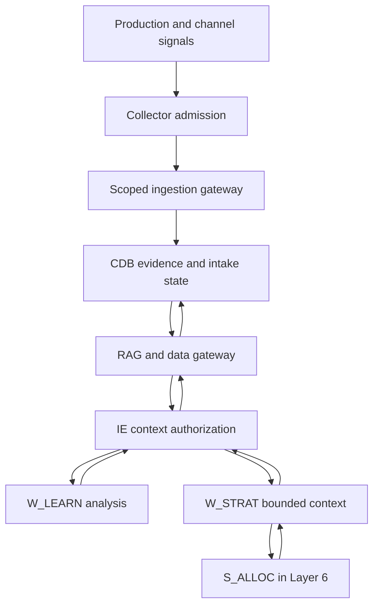

# Layer 8 — Public Surfaces & Telemetry Collector

Implementation specification for Enterprise OS • 28 September 2026

**Status:** research and design complete; implementation, migration execution, deployment, and runtime testing have not been performed. Only architecture documents and file trees were supplied. All change labels below are proposed work, subject to source inspection. No source file is assumed defective merely because a requirement is absent from a tree.

## 1. Scope and evidence

Implement the existing Layer 8 boundary: production surfaces emit signals; deterministic collection services authenticate, validate, normalize, and persist them; IE supplies governed evidence to Learning and Strategy. No Layer 8 LLM agent, new website, sandbox runtime, or replacement orchestrator is required.

### Attachment register

| ID | Supplied attachment | Evidence used |
|---|---|---|
| A1 | `Final-Level Full Architecture(20260928-153558).md` | Sections 1–3: layers, component/access tables, actuation and telemetry arrows. Section 4: Model A. Sections 5–6: sandbox and persistence requirements. |
| A2 | `Backend Hierarchy(20260928-153558).md` | Sections 1–2: transport, services, adapters, gateway, repositories, tests. Section 3: sandbox dependency boundary. Section 4: unspecified framework, database driver, CMS, credentials, and storage details. |
| A3 | `flowchart.drawio(20260928-153558).html` | Embedded Mermaid graph: `MCP_ACT → WEBSITE/CH_ADS/CH_SOC`, sources → `TELEMETRY → CDB`, `CDB → W_LEARN`, and Model A worker-context arrows. |
| A4 | `File Tree-enterprise_os(20260928-155231).tree` | Project roots and placement of backend, sandbox, research, and workspaces. No separate production storefront application is established by this tree; sandbox frontend/docs directories are not production-site evidence. |
| A5 | `File Tree-backend(20260928-155146).tree` | Existing telemetry services, schemas, integrations, storage migrations, Strategy package, and relevant tests. More detailed path inventory than A2. |
| A6 | `File Tree-sandbox(20260928-155147).tree` | Existing sandbox dependency, hardened configuration, `s-alloc` skill, SDK and browser/shell tooling. These remain outside Layer 8. |

**Evidence labels:** attachment-backed facts use A1–A6; official technical references use E1–E19 in Section 15. Choices introduced here are **proposed design decisions**, not descriptions of inspected code. Platform entitlements and configured versions remain unverified.

## 2. Conflict resolutions and ownership decisions

| ID | Conflict or gap | Required resolution | Owner |
|---|---|---|---|
| D1 | A1/A3 show `CDB → W_LEARN`, while Model A forbids direct worker retrieval. | Interpret the arrow as a logical feed. Physical retrieval is `IE → RAG → MCP Data Gateway → CDB`, returning a bounded context envelope through IE. Apply the same rule to Strategy and all specialists. | IE / data-access owners |
| D2 | The collector writes to CDB, while the architecture describes exclusive governed data access. | Add or reuse a dedicated **service-ingestion capability inside the existing data gateway**. IE/PAB provisions source-bound authority; deterministic services execute it. This is an explicit infrastructure-ingestion clarification, not general CRUD or agent authority. Do not route every event through LLM reasoning. | Architecture, PAB, gateway, persistence owners |
| D3 | “Write-only” appears incompatible with deduplication, polling cursors, and recovery reads. | External producers and the public ingress interface have append/receipt capability only. Trusted persistence and processing services may read narrowly scoped intake state and telemetry to perform their jobs. Neither ingress callers nor workers receive database access or an enterprise query capability. | Security / persistence owners |
| D4 | CMS appears in both Layers 4 and 8. | Layer 4 stores authoritative content/models/assets. Layer 8 serves approved published revisions. Publication and production configuration changes use Layer 7; delivery may use a dedicated published-content interface or deployment artifact. Preview and management APIs remain private. | CMS / release owners |
| D5 | The request includes sandbox tools alongside components with no sandbox access. | Keep shell, browser, GUI, workspace, and supervisor APIs in Layer 6. Preserve `W_STRAT → S_ALLOC`; no collector-to-sandbox edge. | Sandbox / Strategy owners |
| D6 | A1 requires universal persistence, including raw telemetry, without a retention policy. | Persist accepted, policy-permitted source evidence and normalized output with lineage. Verify signed raw bytes in memory before minimization. Do not persist secrets or prohibited personal data. Rejections retain safe reason metadata. Record redaction/purge actions; immutable provenance does not mean indefinite retention of personal payloads. | Policy / provenance / storage owners |
| D7 | Source labels suggest real-time metrics and collector ROAS. | Record provider-reported metrics as observations with definitions, windows, and freshness. Collection may normalize units, but attribution, cross-source performance interpretation, and derived ROAS decisions remain with `W_LEARN`. | Telemetry / Learning owners |
| D8 | A2 lists one telemetry service; A5 lists two. | Assign admission/normalization to `services/telemetry.py`; collection scheduling, processing, retries, and recovery to `services/telemetry_engine.py`. Reuse existing implementations if they already meet these responsibilities. | Backend owner |
| D9 | Both `agents/strategy.py` and `agents/strategy_engine/strategy.py` exist. | Inspect imports before editing. Preserve the current public entry point; do not create a second Strategy implementation or assume the outer file is a shim without checking. | Strategy owner |

These decisions preserve the explicit Model A invariants when arrows or prose disagree. Record D2 as a narrowly scoped architecture clarification in the implementation review; it must not quietly broaden the existing gateway caller allowlist.

## 3. Component and access matrix

| Component | Inputs → outputs | Permitted access | Explicitly denied | Sandbox |
|---|---|---|---|---|
| Production website / app | Approved releases, published catalog/content → interactions, orders, operational signals | Normal application permissions; scoped published-content delivery; append to telemetry endpoint | CMS management, enterprise credentials, agent control APIs | None |
| Public telemetry routes | Browser batches or authenticated deliveries → opaque receipt / transport error | Source resolution, admission capability | General queries, replay controls, publication, worker dispatch | None |
| Telemetry service | Verified input → minimized source envelope and normalized records | Narrow service-ingestion gateway operations | Generic enterprise retrieval, policy changes, analytical decisions | None |
| Telemetry engine | Source schedules, intake work → collected pages, processed records, health signals | Authorized provider reporting; gateway-owned work claims/checkpoints | Campaign mutation, posting, conversion upload, budget changes | None |
| Existing provider adapters | Scoped requests/responses → verified deliveries or normalized source pages | Source/account-specific API operations and secret references | Caller-supplied arbitrary URLs, ambient cross-account credentials | None |
| MCP Data Gateway / repositories | Validated service calls → atomic persistence and receipts | Source binding, intake state, telemetry, provenance under least privilege | Worker bypass, cross-tenant access | None |
| IE / RAG | Authorized context requests → cited, bounded datasets | Existing governed read path; task and policy authority | Unscreened telemetry becoming instructions | Existing control-plane behavior |
| `W_LEARN` | IE-provided data → interpretation and validated learning proposals | Read-only context; existing specialists | Persistence, promotion, strategy ownership | Existing Layer 6 only |
| `W_STRAT` / `S_ALLOC` | IE-approved evidence and budget constraints → proposed strategy/allocation | Read-only bounded context; existing allocation capability | Direct CDB/RAG/CMS/collector/provider access, autonomous spending | Existing `S_ALLOC` boundary |
| Layer 7 / release owner | Signed post-HITL directives → deployment/publication/rollback receipts | Existing governed actuation | Acting on a browser event or collector flag as approval | No new access |

Provider OAuth may be broader than reporting. Enforce a local operation allowlist and, where supported, a read-only provider account role. Reporting adapters must not expose their existing mutation methods to the collector.

## 4. Production surface contract

**Release handoff:** reuse the existing dispatch, artifact, CMS, and development contracts. Require a release/deployment ID, tenant and surface ID, immutable artifact hash or published CMS revision, approved configuration hash, approval/dispatch reference, previous known-good release, health criteria, and receipt reference. Production secrets are injected by the deployment owner; they are never embedded in public bundles or telemetry.

**Authority:** IE approves the requested scope; HITL authorizes relevant deployment/publication/spend; Layer 7 validates and executes. Public requests cannot select an arbitrary CMS revision, fetch draft assets, or reach management endpoints. Ordinary checkout, account, or order operations use the production application's existing authorization, not a new HITL gate.

**Runtime evidence:** stamp server events with the deployed release identifier. Treat client-supplied release IDs as claims until matched against the configured surface release. Emit health/error summaries with scrubbed route templates and error codes; omit access tokens, cookies, full checkout bodies, and query strings containing personal data.

**Readiness and failure:** expose only minimal public health information. Keep dependency detail and build/approval metadata private. A telemetry outage must not make the production website unavailable. For authoritative order events, the application owner must demonstrate a durable event handoff or replay source tied to its order commit; use an existing transaction outbox if available. Its repository path cannot be specified from these attachments.

**Rollback:** the collector records deployment health but never rolls back a release. The release owner requests rollback through IE and Layer 7 under an applicable approval. Restore the previous approved code/content/configuration combination, preserve telemetry for both deployment IDs, and maintain supported event-schema compatibility. A content rollback must not undo customer orders.

## 5. Collection mechanisms and provider validation

The following is an implementation mapping, not evidence that any account is connected. Platform-specific claims are limited to the cited official material. Pin a supported API version during implementation after inspecting credentials, application permissions, dependency files, and account access; do not treat a documentation URL's version as the installed version.

| Existing adapter / source | Mechanism and authentication | Pagination, freshness, and implementation consequence |
|---|---|---|
| Website/CMS: `integrations/cms/client.py` plus production runtime | First-party server events and optional browser batch endpoint. Use existing service identity for server delivery. Browser signals have no secret and are untrusted. CMS webhook details depend on the unknown vendor. | Define a bounded batch size and source replay mechanism. Never use browser purchase events as authoritative orders. Runtime and CMS-provider specifics are blockers, not invented integrations. [A1, A2] |
| Ads: `integrations/ads/meta.py` | Poll Ads Insights using an authorized ad account and `ads_read`. Preserve provider metric and attribution settings. [E1] | The official search result established the product and permission; full documentation retrieval was blocked. Version, cursor/async behavior, quotas, metric availability, and webhook signature details require verification before activation. Do not claim webhook delivery of all performance metrics. |
| Ads: `integrations/ads/google.py` | GAQL through `GoogleAdsService.Search` or `SearchStream`; OAuth `adwords` scope and developer token. Allow reporting operations only. [E2, E3] | Handle page tokens or streaming batches without marking an incomplete response complete. Quota varies by access level; respect `RESOURCE_EXHAUSTED`. Data and conversions can mature after the first pull, so re-fetch bounded windows. [E4, E5] |
| Ads: `integrations/ads/tiktok.py` | Authorized advertiser reporting through `/report/integrated/get/`; official SDK exposes access token, advertiser, dimensions, metrics, date range, page and page size. [E6] | Use supported synchronous reports initially; do not add async job management without need. Pin the API version and authorized product. Numeric quota and metric-specific latency must be verified; the latency documentation did not expose its full body to retrieval. [E7] |
| Ads: `integrations/ads/linkedin.py` | `adAnalytics`, authenticated member/account access, `r_ads_reporting`; configure a supported Marketing API version header. [E8] | The reviewed endpoint has no pagination and a 15,000-element limit. Split account/date/dimension queries to avoid truncation. Empty results can mean no activity or no access. Performance and demographic/video metrics have different delays. Preserve partial/suppressed status. |
| Social: `integrations/social/instagram.py` | Account/media Insights. Instagram Login uses `instagram_business_basic` and `instagram_business_manage_insights`; Facebook Login is a different permission route. [E9] | Inspect the integration's login mode first. Full official page retrieval failed; metric periods, version, paging, expiry, quotas, and review status remain activation checks. No silent switch between login products. |
| Social: `integrations/social/x.py` | X API v2 post/media metric retrieval. Public metrics support bearer authentication; non-public/organic/promoted metrics require user context and content ownership. [E10] | Distinguish combined and organic/promoted counts. Reviewed docs limit private/organic/promoted metrics to posts from the preceding 30 days. Use endpoint rate-limit headers and response paging where present; account entitlements must be checked. [E11] |
| Social: `integrations/social/tiktok.py` | Proposed minimum: Display API v2 `/video/list/` and `/video/query/`, authorized user and `video.list`, for owned public-video counters. [E12] | List uses a cursor; query accepts up to 20 video IDs. Record cumulative snapshots, not event deltas. Richer account analytics require a separately entitled business product; do not substitute Research API access or scraping. |
| Social: `integrations/social/youtube.py` | YouTube Analytics v2 `reports.query`; OAuth `yt-analytics.readonly`; monetary scope only when requested and authorized. [E13] | Use supported `startIndex`/`maxResults` report paging. Returned end date is limited by availability of all requested metrics. Store the observed coverage, not the requested coverage. Bulk daily jobs are optional and unnecessary for the initial design. |

**Common source manifest:** provision via existing configuration/operational storage, not an LLM-written registry. Fields: source ID, tenant/brand binding, external account/surface IDs, enabled state, grant expiry/revocation reference, allowed operations and event kinds, API version, secret reference, verified permissions, endpoint allowlist, timeout, payload/page limits, polling cadence, quota and authorized collection-cost budgets, report-window definition, correction lookback, signature verifier, retention/redaction policy, freshness threshold, and validation evidence/date.

Missing permission, unknown API version, or unverified report truncation disables that source. Do not fabricate an empty successful dataset. Reporting calls may use HTTP POST without being publication; authorize the semantic operation, not merely the HTTP verb. Conversion APIs that send customer events to ad platforms are outbound actions and excluded from ingestion scope.

Metered reads require an existing approved collection-cost envelope as well as a technical quota. X documents rate limits and usage billing as separate controls. [E11] Enforce the remaining authorized budget before dispatch, include retries in cost accounting, and pause/report exhaustion to IE; do not let collection create a new spending authorization. Source revocation stops new requests and invalidates uncommitted stale grants, with an explicit policy for already accepted evidence.

**Webhook support:** enable only provider/product events established by its documentation and fixture tests. TikTok developer webhooks, for example, sign timestamp plus raw request body using HMAC-SHA256 and `TikTok-Signature`; this does not establish the same scheme for TikTok Business APIs or other providers. [E14] Subscription creation and verification setup belong to the existing integration owner, not a public collector endpoint with management privileges.

## 6. Data contracts

Reuse `app/schemas/telemetry.py`; define discriminated record kinds rather than accepting arbitrary JSON. Names below are proposed interfaces, not claims about existing classes.

### 6.1 Common envelope

| Field | Type / requirement | Rule |
|---|---|---|
| `schema_version`, `record_kind` | Version string; enum `event`, `metric_snapshot`, `operational_error` | Reject unsupported major versions; bounded extension fields only. |
| `record_id`, `receipt_id` | Server-generated UUIDs | Never use client IDs as internal authority. |
| `tenant_id`, `brand_id`, `source_id`, `source_account_id` | Required identifiers | Derived or verified against source binding; brand must belong to tenant. |
| `source_event_id`, `source_revision` | Optional source identifiers | Required when the source supports them; immutable revisions retained. |
| `occurred_at`, `observed_at`, `received_at` | UTC timestamps; event time may be absent for snapshots | Preserve source timezone and original reporting boundaries separately. Unknown event time remains unknown. |
| `event_type` / `metric_name` | Versioned allowlisted identifier | Keep original provider name and mapping version. |
| `dimensions`, `references` | Bounded typed maps | Surface, campaign, ad, content, catalog, deployment, or pseudonymous order references; no unlimited nested objects. |
| `provenance` | Source response/request ID, collector build, schema/mapping version, policy version, minimized-evidence hash/reference | Include collection activity and source identity; no secrets. |
| `trust_class` | `browser_untrusted`, `server_verified`, `provider_verified` | Authentication of origin is not proof the metric is economically correct. |
| `quality` | Completeness, freshness, sampling/suppression, correction, clock-skew, missing-field flags | Separate missing, zero, unavailable, partial, and suppressed. |
| `privacy` | Collection purpose, applicable policy/consent reference, retention class | Browser declarations alone do not establish consent compliance. |

### 6.2 Kind-specific payloads

**Event:** occurrence type, stable logical identity if available, optional transaction status/revision, quantity, and monetary amount/currency where relevant. Use exact decimal representation or integer minor units with declared scale, never unlabelled floating-point money. Refund/cancellation is a separate event linked to the original business transaction. A correction references the prior revision; it does not overwrite evidence.

**Metric snapshot:** entity/dimension set, metric name, decimal value and unit, currency when applicable, start/end and boundary convention of the reporting window, granularity, account timezone, source API version, attribution/reporting settings, `as_of`, report-run ID, revision, and `aggregation_semantics` (`period_total`, `lifetime_counter`, `ratio`, `gauge`). Provider ratios remain labelled provider-reported. No averaging ROAS ratios across campaigns; no summing lifetime snapshots or revisions.

**Operational error:** timestamp, service/surface/release reference, severity, stable error code, sanitized message and trace reference. Do not capture customer request bodies or arbitrary stack locals. Keep business conversion data separate from service-health metrics.

### 6.3 Internal operation contracts

| Interface | Input → output | Owner / permission |
|---|---|---|
| `verify_delivery` | Raw bytes, bounded headers, configured source → verified identity and safe delivery metadata | Provider adapter or existing cryptographic validator; no database query exposed to caller |
| `admit` | Identity, configured source, minimized envelope → accepted/duplicate receipt | Telemetry service through `telemetry.ingest` gateway capability |
| `fetch_report_page` | Source grant, report specification, opaque cursor → bounded page and next cursor/terminal evidence | Existing provider adapter; reporting allowlist |
| `claim_work` / `complete_work` | Scoped processor identity and lease → work item / atomic completion | Trusted gateway and telemetry repository only |
| `commit_report_run` | Completed page set, coverage, source generation → published revision manifest | Trusted persistence; reject expired/stale lease generations |
| `build_performance_context` | IE authorization, tenant, time window, metric request → governed dataset reference and quality summary | IE/RAG/gateway; never callable by public intake or workers directly |

Receipt responses contain only an opaque receipt ID, accepted/duplicate status, and server timestamp. Detailed diagnostics and quarantine views require existing operational authorization. No telemetry endpoint returns event content or allows a producer to replay another source's data.

## 7. Reliable admission and processing

### Admission order

1. Apply TLS, transport/body/decompression limits, source-rate controls, and a configured route-to-source binding. Do not let a request choose a secret reference, upstream URL, or arbitrary tenant.
2. For server/provider delivery, verify the required signature or existing authenticated transport **before** parsing/transformation changes the signed bytes. Compare MACs safely; enforce timestamp/nonce replay protection only according to that source's contract. Do not invent a signed timestamp where none exists.
3. Verify account identifiers against the source binding. Shared application webhooks need an authenticated per-account mapping; do not route by an unsigned tenant field. Public surface keys and Origin/CORS checks constrain browser routing but are not proof of a real user action.
4. Validate supported envelope, event kind, size, time limits, and allowed fields. Minimize before durable storage. Raw verification bytes are discarded unless an explicit policy allows restricted retention.
5. Through the gateway, atomically create an immutable receipt/minimized payload, deduplication identity, processing work item, and provenance entry or durable provenance-outbox record. Commit before success acknowledgment. A pre-existing identical receipt returns success without another logical event.
6. Respond within the provider deadline. A successful acknowledgment means **durably accepted**, not analytically processed or approved for strategy.

### Processing and report acquisition

The existing telemetry engine runs deterministic application jobs, not sandbox sub-agents. Claim pending work with an expiring lease and fencing generation. Normalize using a pinned mapping version. In one transaction, append normalized evidence, persist lineage, and mark work complete. A crash before commit permits retry; a crash after commit does not duplicate the normalized record.

For polling, persist each successful page before advancing its cursor. Store query fingerprint, account, API/mapping versions, reporting window, source response ID, and lease generation. An expired token restarts the bounded window idempotently. A streamed response interrupted mid-query is incomplete. Publish a report revision only after every required page/partition has completed and coverage checks pass. Keep the last complete revision active while another run is incomplete.

For an existing event-stream integration, commit its source offset only after durable acceptance. None is verified in the supplied tree; do not add Kafka, Redis, or another broker merely to satisfy the phrase “event stream.”

### Failure policy

| Condition | External behavior | Durable/internal behavior |
|---|---|---|
| Invalid identity/signature, unknown source, tenant mismatch | Provider-compatible failure; normally 401/403, without detailed identity leakage | Safe rejection reason and request correlation only; no attacker payload in evidence |
| Invalid JSON, unsupported schema, prohibited kind | Normally 400/422; provider contract takes precedence | Reject with bounded diagnostics; alert on repeated version mismatch |
| Oversized or rate-limited input | 413 or 429; `Retry-After` where supported | Do not partially acknowledge an atomic batch |
| Database unavailable or capacity exhausted before acceptance | Retryable non-success, normally 503 | No false success; producer retries/backfill supplies recovery |
| Identical delivery repeated | Same accepted outcome / opaque receipt | No new logical event or analytical count |
| Same identity, materially different payload | Provider-compatible response after collision evidence is durably recorded | Quarantine conflicting payload revision; never silently overwrite or count both |
| Accepted payload cannot normalize | Original success acknowledgment remains valid | Bounded retries for transient errors; quarantine deterministic errors with reason/mapping version |
| Provider 429 or transient 5xx | Poll job defers | Honor retry metadata; bounded exponential backoff with jitter; persist attempts/deadline |
| Provider permission revoked / token invalid | Source marked blocked | Controlled refresh if authorized; otherwise stop polling and signal access failure, never emit zero metrics |
| Partial/truncated report or missing page | No complete dataset publication | Keep partial run with coverage gap; retry/split the query within source limits |
| Lease expires or processor restarts | No public state change | Reclaim safely; fencing prevents stale owner from committing |

Retry counts, timeouts, body limits, source cadences, and queue bounds are mandatory deployment configuration. Do not invent production values without load and provider evidence. No end-to-end exactly-once guarantee is made; the design provides idempotent effects inside defined identity and retention boundaries.

## 8. Persistence, deduplication, revisions, and privacy

### Minimal storage design

Use existing PostgreSQL/TimescaleDB and the telemetry repository. Add only missing structures after inspecting `0004_telemetry_hypertable.sql`, `0005_tenant_rls_privileges.sql`, and `0006_layer4_indexes.sql`. The following are logical structures; reuse equivalent existing tables before creating these proposed names.

| Logical structure | Contents / constraints | Mutation rules |
|---|---|---|
| `telemetry_receipts` | Tenant/source, logical identity, minimized payload, content hash, receipt time, schema/policy versions; unique source identity and revision | Immutable evidence; policy-controlled retention outside collector authority |
| `telemetry_work_items` | Receipt reference, pending/leased/retry/quarantined/done status, attempt count, next retry, lease owner/expiry/generation | Mutable processing state; no modification of receipt payload |
| Existing telemetry timeseries | Normalized events/snapshots with receipt references, record IDs, time dimensions, report revisions, quality | Append evidence; derive latest-valid views without deleting prior corrections |
| `telemetry_collection_runs` | Source/query fingerprint, target window, pages/partitions, coverage, generation, completion status, published revision | Internal checkpoint state; finalized manifests retained as provenance |
| Existing provenance/outbox | Receipt/activity/record links and durable pending audit publication | Atomic with acceptance/processing; publication retried independently |
| Existing source configuration store | Tenant/account binding and non-secret capability manifest | Existing policy/configuration owner only; secret values remain external references |

**Global event idempotency:** use a normal PostgreSQL table constraint on `(tenant_id, source_id, source_account_id, logical_event_id, source_revision)` with non-null identity components. A time-partitioned unique index alone cannot guarantee identity across changed event timestamps: TimescaleDB unique indexes must include all partitioning columns. [E15] Use the relational receipt identity as the authoritative deduplication gate; timeseries insertion and receipt linkage must be transactional.

When no stable source event ID exists, require a stable producer-generated ID for first-party critical events. A canonical payload fingerprint is only a documented, source-specific fallback with collision/coalescence limitations; identical legitimate events must not be silently collapsed. Delivery IDs and business transaction IDs are different concepts. A browser purchase and server order remain separate evidence; business conversion selection follows an explicit canonical event policy, not fuzzy cross-source deduplication.

**Snapshot identity:** tenant + source/account + entity + metric + canonical dimensions + reporting window/timezone + aggregation semantics + attribution/report settings + mapping version. Store collection observation and revision separately. Repeat retrieval of an unchanged value may create a collection receipt but must not add another amount to analytical totals. A changed source value appends a revision linked to its predecessor. Serialize/fence overlapping collection runs so an older response cannot become the latest snapshot merely by arriving last.

If a row disappears from a refreshed report, distinguish documented zero-omission from access loss, suppression, deletion, or incomplete coverage. Only a completed, validated report run may supersede prior coverage; unknown absence stays unknown. Retain provider-restated history and the selection rule used by each dataset manifest.

**Database authority:** public callers and workers hold no DB role. Use an ingestion gateway identity and a separate trusted processor identity, restricted to telemetry intake/state and necessary provenance operations. Prefer the existing privilege mechanism; if it cannot enforce this, expose narrowly defined database functions with no general table grants to the caller. Function owners must be non-superuser/non-`BYPASSRLS`, use fixed safe search paths, enforce source/tenant binding, and have only necessary table privileges. Apply and test RLS, including owner behavior; PostgreSQL owners normally bypass it unless forced, while superusers and `BYPASSRLS` roles bypass it. [E16]

Deduplication/checkpoint reads occur within this trusted persistence boundary. Never infer tenant authority from a freely settable session variable alone. Tenant context must come from the verified gateway principal; connection pooling must reset transaction-local scope between requests.

**Retention and consent:** configure retention by source, purpose, and record class with the existing policy owner. Retain deduplication identities at least across the accepted replay/correction horizon, or explicitly reject older replays. Audit deletion and redaction without retaining the deleted payload in audit text. Hashes and pseudonymous IDs can still be linkable; do not label them anonymous. Consent revocation and provider deletion rules flow to the existing data-governance owner. The collector does not grant itself deletion authority over other stores.

## 9. Governed feedback and Strategy contract



The arrows through IE represent governed envelopes, not database handles. Memory promotion stays with its existing owner after validation. A collector error or threshold crossing is a signal for IE scheduling; it is not permission to spend, deploy, promote memory, or rewrite policy.

Extend the existing Strategy input contract only where necessary with a **performance context reference** containing: tenant/brand; dataset manifest and evidence IDs/hashes; schema/mapping versions; window and as-of time; sources and coverage; metric definitions and units/currency; source reporting/attribution assumptions; quality, suppression and freshness flags; Learning result reference and uncertainty; applicable budget/policy version; and expiry/revalidation conditions. Prefer a bounded summary plus governed artifact references over raw event dumps.

`W_LEARN` interprets performance, identifies data limitations, and returns evidence-backed findings. Observational source attribution must not be labelled causal incrementality without the existing experimental evidence requirements. Strategy may propose a plan using sufficient evidence, but must flag/reject a budget recommendation that depends on missing, expired, incomparable, or incomplete metrics. It requests additional context through IE. It never fills absent metrics with fabricated zeros.

No new Strategy specialist is justified. `subagents/allocation.py`, its profiles, `s_alloc_core.py`, and the sandbox `s-alloc` skill remain unchanged unless contract inspection proves a specific compatibility fix is necessary. The proposed allocation output still requires the existing approval and actuation path.

## 10. Exact proposed repository hierarchy

Paths below are relative to the supplied `enterprise_os/` root. Only the relevant slice is shown; omitted paths remain untouched. **U = existing/unchanged**, **M = inspect and modify only for a verified requirement gap**, **N = new only if no equivalent exists**. Parent directories marked U are existing placement boundaries, not promises that their contents never change.

```text
enterprise_os/ [U]
├── backend/ [U]
│   ├── app/ [U]
│   │   ├── main.py [M]
│   │   ├── api/ [U]
│   │   │   ├── router.py [M]
│   │   │   └── routes/ [U]
│   │   │       └── telemetry.py [M]
│   │   ├── core/ [U]
│   │   │   ├── settings.py [M]
│   │   │   └── logging.py [M]
│   │   ├── schemas/ [U]
│   │   │   ├── telemetry.py [M]
│   │   │   ├── strategy.py [M]
│   │   │   ├── learning_performance.py [U]
│   │   │   ├── dispatch.py [U]
│   │   │   ├── artifact.py [U]
│   │   │   └── provenance.py [U]
│   │   ├── services/ [U]
│   │   │   ├── telemetry.py [M]
│   │   │   ├── telemetry_engine.py [M]
│   │   │   ├── provenance.py [M]
│   │   │   ├── attribution_coordinator.py [U]
│   │   │   ├── memory_promotion.py [U]
│   │   │   └── rag/ [U]
│   │   │       └── controller.py [U]
│   │   ├── mcp/ [U]
│   │   │   ├── data_gateway.py [M]
│   │   │   └── outbound_gateway.py [U]
│   │   ├── security/ [U]
│   │   │   ├── authorization_boundary.py [M]
│   │   │   ├── cryptographic_validator.py [M]
│   │   │   └── scope_evaluator.py [U]
│   │   ├── integrations/ [U]
│   │   │   ├── cms/ [U]
│   │   │   │   └── client.py [M]
│   │   │   ├── ads/ [U]
│   │   │   │   ├── base.py [M]
│   │   │   │   ├── meta.py [M]
│   │   │   │   ├── google.py [M]
│   │   │   │   ├── tiktok.py [M]
│   │   │   │   └── linkedin.py [M]
│   │   │   └── social/ [U]
│   │   │       ├── base.py [M]
│   │   │       ├── instagram.py [M]
│   │   │       ├── x.py [M]
│   │   │       ├── tiktok.py [M]
│   │   │       └── youtube.py [M]
│   │   ├── persistence/ [U]
│   │   │   ├── database.py [M]
│   │   │   └── repositories/ [U]
│   │   │       ├── telemetry.py [M]
│   │   │       ├── operational.py [U]
│   │   │       └── provenance.py [M]
│   │   ├── orchestration/ [U]
│   │   │   ├── intelligence_engine.py [M]
│   │   │   ├── context_assembly.py [M]
│   │   │   └── rag_query_dispatch.py [U]
│   │   └── agents/ [U]
│   │       ├── strategy.py [U]
│   │       ├── learning_performance.py [U]
│   │       ├── strategy_engine/ [U]
│   │       │   ├── __init__.py [U]
│   │       │   ├── strategy.py [M]
│   │       │   ├── profiles.py [U]
│   │       │   └── subagents/ [U]
│   │       │       ├── __init__.py [U]
│   │       │       └── allocation.py [U]
│   │       └── learning_performance_engine/ [U]
│   │           ├── learning_performance.py [U]
│   │           └── subagents/ [U]
│   │               └── telemetry.py [U]
│   ├── migrations/ [U]
│   │   └── sql/ [U]
│   │       ├── 0004_telemetry_hypertable.sql [U]
│   │       ├── 0005_tenant_rls_privileges.sql [U]
│   │       ├── 0006_layer4_indexes.sql [U]
│   │       └── 0007_layer8_ingestion.sql [N]
│   ├── tests/ [U]
│   │   ├── unit/ [U]
│   │   │   ├── test_omnichannel_telemetry_engine_t29.py [M]
│   │   │   ├── test_live_telemetry_ingestion_t30.py [M]
│   │   │   └── test_website_cms_deployment_t26.py [M]
│   │   ├── integration/ [U]
│   │   │   ├── test_model_a_data_access.py [M]
│   │   │   ├── test_telemetry_learning_loop.py [M]
│   │   │   ├── test_provenance_persistence.py [M]
│   │   │   ├── test_outbound_after_approval.py [U]
│   │   │   ├── test_layer8_security.py [N]
│   │   │   └── test_layer8_recovery.py [N]
│   │   ├── strategy_engine/ [U]
│   │   │   ├── test_contracts.py [M]
│   │   │   └── test_ie_roundtrip.py [M]
│   │   └── acceptance/ [U]
│   │       └── test_governed_end_to_end_flow.py [M]
│   ├── .env.example [M]
│   └── pyproject.toml [U]
└── sandbox/ [U, entire dependency]
    └── docker/ [U]
        └── hardened/ [U]
            └── skills/ [U]
                └── s-alloc/ [U]
                    ├── SKILL.md [U]
                    └── scripts/ [U]
                        └── run.py [U]
```

New migration numbering assumes the supplied tree is current. At implementation time use the next available migration number; never replace an existing file with the proposed name. If existing security/recovery tests already cover these cases, extend them instead of creating the two N test modules.

No production frontend path is invented. Instrumentation in the actual website repository is a separate mapped dependency once its location and release owner are supplied.

## 11. Per-file change rationale

| Paths relative to `backend/` | Proposed delta | Requirement / why necessary |
|---|---|---|
| `app/api/routes/telemetry.py` | Separate browser and verified server admission, preserve raw verification bytes, bound input, return durable receipts | R3–R5; prevent unauthenticated authority and false acknowledgments |
| `app/api/router.py`, `app/main.py` | Register only required ingress routes and existing engine lifecycle hooks; graceful shutdown and health wiring | R2, R5, R14; no new framework or daemon by default |
| `app/core/settings.py`, `.env.example` | Source manifest validation, credential references, limits, source flags, retry/freshness/retention settings | R3, R5, R9, R14; examples contain no real secrets |
| `app/core/logging.py` | Redaction and structured correlation; bounded metric labels | R9, R14; prevent payload/credential leakage |
| `app/schemas/telemetry.py` | Discriminated envelope, event/snapshot/error types, receipt, report coverage and quality contracts | R3, R6–R8 |
| `app/services/telemetry.py` | Identity-bound admission, minimization, contract validation, deterministic normalization and identity rules | R3–R9; no scheduling or attribution logic |
| `app/services/telemetry_engine.py` | Provider collection jobs, durable work processing, retries, leases, report completion, recovery and source health | R5–R8, R14; reuse current service rather than new collector package |
| `app/mcp/data_gateway.py` | Narrow service capabilities for intake/work/commit; keep enterprise read path IE-only | R1, R4, R10; closes the ambiguous direct-write edge |
| `app/security/authorization_boundary.py` | Source-bound service principal, revocation, tenant/account checks and operation allowlist | R1, R4 |
| `app/security/cryptographic_validator.py` | Reuse safe verification primitives; add provider-specific formats only if needed and validated | R4; no reuse of HITL token verification as a webhook verifier by assumption |
| `app/integrations/cms/client.py` | Only missing published-revision/receipt or vendor-verified delivery hooks; preserve publication ownership | R2, R3; actual website instrumentation stays outside this unknown repository |
| `app/integrations/ads/base.py`, `app/integrations/social/base.py` | Common reporting page/capability interface and bounded error classification, if absent | R3, R7; reporting and mutation interfaces remain capability-separated |
| `app/integrations/ads/meta.py` | Insights mapping and permission/version checks after blocked documentation details are verified | R3, R7; no guessed webhook analytics |
| `app/integrations/ads/google.py` | GAQL report paging/stream completion, units, quota handling, correction windows | R3, R7 |
| `app/integrations/ads/tiktok.py` | Authorized report dimensions, page state, latency metadata | R3, R7 |
| `app/integrations/ads/linkedin.py` | Bounded query partitioning without invented pagination; access/empty-result handling | R3, R7 |
| `app/integrations/social/instagram.py` | Login-mode-specific Insights capability after version/permission verification | R3, R7 |
| `app/integrations/social/x.py` | Metric family, ownership, availability window and rate-limit handling | R3, R7 |
| `app/integrations/social/tiktok.py` | Authorized v2 video counters/list cursor as snapshot inputs | R3, R7 |
| `app/integrations/social/youtube.py` | Report paging, actual coverage, scope and monetary-unit metadata | R3, R7 |
| `app/persistence/database.py` | Separate role/transaction scope if absent; never alter unrelated domain privileges | R4, R5 |
| `app/persistence/repositories/telemetry.py` | Atomic receipts, identity uniqueness, fenced leases, revisions, report-run completion and quality queries | R5–R8 |
| `app/services/provenance.py`, `app/persistence/repositories/provenance.py` | Join intake/processing transactions or reuse durable outbox; receipt-to-record lineage | R9; avoid acknowledged evidence with no recoverable provenance |
| `migrations/sql/0007_layer8_ingestion.sql` | Add only missing logical structures, indexes, privileges and RLS; preserve existing migrations | R4–R9; additive migration with preflight schema check |
| `app/orchestration/intelligence_engine.py`, `app/orchestration/context_assembly.py` | Authorize source-health-triggered work and construct bounded performance context | R1, R10; collector does not own CTS |
| `app/schemas/strategy.py`, `app/agents/strategy_engine/strategy.py` | Accept cited performance context and enforce required quality/freshness checks | R10, R11; no new specialist or direct retrieval |
| Existing unit/Strategy/integration/acceptance tests marked M in Section 10 | Extend the specific cases in Section 12 | R12–R14; demonstrate behavior across existing boundaries |
| `tests/integration/test_layer8_security.py`, `tests/integration/test_layer8_recovery.py` | Add only missing cross-boundary adversarial/fault tests | R12, R13; coverage is behavioral, not a mirror of implementation |

**Dependencies:** no new runtime package is mandated. Reuse installed HTTP, cryptography, DB, schema, and scheduling facilities after inspecting `pyproject.toml`. Add a dependency only for a verified missing capability and document version, maintenance and compatibility. OpenTelemetry documentation supports durable-buffering and retry design, but installing its collector is not required. [E17] No changes to `sandbox/`, its SDK, or deployment infrastructure are justified by the supplied evidence.

## 12. Verification matrix

Tests below are acceptance requirements, **not reported results**. Use recorded/synthetic fixtures clearly labelled as tests; production adapters never return sample analytics on failure. Integration tests must use the actual selected PostgreSQL/TimescaleDB versions and configured roles, not an in-memory database substitute.

| Test ID | Behavior and assertion | Existing/new location |
|---|---|---|
| T01 | Missing/invalid/altered signature; expired signed timestamp; wrong secret; rotation overlap; body parsing before verification fails safely | `test_live_telemetry_ingestion_t30.py`, `test_layer8_security.py` |
| T02 | Spoofed tenant/account, shared-app account mismatch, public source key misuse, brand/tenant mismatch denied; browser purchase cannot become verified order | `test_layer8_security.py` |
| T03 | Ingress/worker roles cannot SELECT enterprise data, mutate policies, publish, upload conversions, or call sandbox; processor sees only allowed intake scope | `test_model_a_data_access.py`, `test_layer8_security.py` |
| T04 | Concurrent duplicate requests create one logical event; a changed timestamp cannot bypass identity; ID collision quarantines; legitimate identical occurrences with different IDs survive | `test_live_telemetry_ingestion_t30.py`, `test_layer8_recovery.py` |
| T05 | Crash before/after receipt commit, acknowledgment loss, and normalization commit produce no falsely accepted or duplicated data | `test_layer8_recovery.py` |
| T06 | DB outage, full intake, slow processing, retry exhaustion, poison payload, graceful shutdown, expired lease, stale fencing token recover as specified | `test_layer8_recovery.py` |
| T07 | Out-of-order events, refunds/corrections, repeated lifetime counters, changed period totals and disappearing rows preserve history without double counting | `test_omnichannel_telemetry_engine_t29.py` |
| T08 | Pagination/stream interruption, expired cursor, partial partitions, provider quota, revoked token and schema change cannot publish a complete or zero-filled dataset | `test_omnichannel_telemetry_engine_t29.py`, `test_layer8_recovery.py` |
| T09 | Each enabled adapter fixture checks field mapping, units/currency, metric windows, API version, account binding, permissions and completion evidence | `test_omnichannel_telemetry_engine_t29.py` |
| T10 | RLS enforced under real application roles, table owner configuration checked, pooled connections reset tenant scope, privileged role rejected for runtime | `test_layer8_security.py` |
| T11 | Raw secrets/PII excluded; minimized evidence and audit correlate; audit outage uses durable outbox; approved purge leaves safe provenance | `test_provenance_persistence.py`, `test_layer8_security.py` |
| T12 | Missing/stale/suppressed metrics remain distinguishable; Strategy requests IE context or flags blocked recommendation; worker direct retrieval is impossible | `test_contracts.py`, `test_ie_roundtrip.py`, `test_telemetry_learning_loop.py` |
| T13 | Approved release ID appears in trusted runtime events; public draft/config access denied; telemetry outage does not take down website; rollback uses existing actuation gates | `test_website_cms_deployment_t26.py`, existing `test_outbound_after_approval.py` |
| T14 | Approved release → trusted signal → durable evidence → IE/Learning → validated Strategy input → proposed action requiring approval | `test_governed_end_to_end_flow.py` |
| T15 | Additive migration preserves historical telemetry, identity constraints and roles; rollback of application version leaves accepted records recoverable | `test_layer8_recovery.py` |

Run the existing project test/lint entry points after inspecting them. Do not claim that filenames prove test coverage or that these suites currently pass. Provider live tests require verified account access; record them as pending when unavailable.

## 13. Dependency-ordered implementation plan

| Task ID | Phase | Task and sub-tasks | Predecessor | Milestone | Resource / owner |
|---|---|---|---|---|---|
| L8-01 | Baseline | Inspect listed modules/imports/migrations; confirm D1–D9; identify production runtime; freeze enabled source manifests and contracts; close critical version/identity gaps | Existing Layers 2–4 and 7 interfaces available | Reviewed boundary and contract baseline; each path classified by inspected evidence | Architecture, backend, security, integrations |
| L8-02 | Durable foundation | Add missing receipt/work/report-run structures; enforce roles/RLS; implement source-bound gateway operations, idempotency, provenance transaction/outbox and leases | L8-01 | T02–T06, T10–T11, T15 pass against selected database versions | Persistence, gateway, security |
| L8-03 | Ingress and surfaces | Implement verified/browser admission, production handoff identifiers, safe operational signals, health isolation, limits and error responses | L8-02 | T01–T05 and T13 pass; no false success acknowledgments | Backend, production/release owner |
| L8-04 | Channel collection | Extend enabled adapters; add bounded polls, paging, report revisions, correction lookbacks and source-health monitoring | L8-02, L8-03 | T07–T09 pass; each enabled source has account verification evidence | Integration owners, telemetry backend |
| L8-05 | Governed feedback | Construct IE-mediated datasets and Learning outputs; wire Strategy references, quality/freshness gates and existing allocation input | L8-04 | T12 and T14 pass; no new worker authority | IE, Learning, Strategy owners |
| L8-06 | Release and observe | Perform load/fault rehearsal; validate monitoring and retention; staged rollout; compare counts/coverage; rehearse application and production rollback | L8-05 | Release gates met, pending-source blockers documented, operational owner accepts runbook | Release owner, operations, security |

Source inspection can reduce this change set. Reuse an already correct capability and record its verification instead of adding a parallel implementation.

## 14. Operations, release gates, and blockers

### Operational measures

| Measure | Definition / action |
|---|---|
| Admission latency | Request receipt to durable commit, by source and outcome; compare p95/p99 to provider acknowledgment deadline |
| Processing lag | Current time minus oldest accepted unprocessed receipt; distinguish it from provider reporting delay |
| Data freshness | As-of/coverage age against per-source, per-metric expectations; stale data prevents dependent recommendations |
| Backlog and capacity | Pending/retry/quarantined counts, oldest age, intake storage budget; throttle before capacity exhaustion |
| Rejection/duplicate/collision rate | Count reason codes separately; collisions or sustained signature failures raise security/source alerts |
| Provider reliability | Quota remaining where exposed, 429/5xx rate, authorization failures, incomplete reports, correction frequency |
| Persistence/provenance health | Commit failures, lease churn, transaction latency, oldest pending audit publication |
| Coverage | Expected source/accounts/windows versus complete, partial, unavailable, suppressed and blocked |

Use existing logging/metrics infrastructure. Avoid event IDs, user IDs and unbounded URLs as metric labels. Alert thresholds, throughput targets, recovery time and recovery point objectives must be signed off from deployment capacity and business needs; none are verified by the attachments. An acknowledgment guarantees the configured database commit durability, not protection from every unconfigured disaster scenario.

### Release gates

1. **Evidence gate:** source code, schema, role behavior and production deployment interface inspected; disabled sources listed explicitly.
2. **Security/durability gate:** T01–T06 and T10–T11 pass; raw credentials absent from logs; backup/recovery requirements established.
3. **Data gate:** enabled adapters pass fixtures and authorized live checks; pagination and coverage verified; reports reconcile under matching definitions/windows rather than an arbitrary percentage tolerance.
4. **Feedback gate:** Learning/Strategy see quality and lineage; no denied cross-layer call succeeds; T12–T14 pass.
5. **Operational gate:** saturation/restart rehearsal, monitoring, retention jobs and rollback tested; capacity meets the agreed workload.

Start with an explicitly enabled source/account and a comparison-only dataset path. Expand after source health and count/coverage checks pass. Prevent Strategy from consuming comparison datasets until promoted through the existing governance workflow. Roll back application code with feature flags or prior compatible build; keep additive tables and accepted records, stop claims cleanly, and resume from durable checkpoints. Do not drop intake tables as an automatic rollback. Disabling intake must return a retriable failure or document that the producer cannot recover; never acknowledge and discard.

### Unresolved blockers

| Blocker | What is missing | Owner / resolution | Blocks |
|---|---|---|---|
| B1 | Actual code, `pyproject.toml` contents, database migrations and test bodies | Backend owner supplies checkout; inspect call graph and run baseline | Verified patch and all execution claims |
| B2 | HTTP framework, runtime lifecycle, DB driver, PostgreSQL/Timescale versions and actual schema | Backend/storage owners identify pinned stack and privilege model | Compile-ready signatures, runnable migration and recovery tests |
| B3 | Production website/CMS vendor, repository, hosting and durable order-event delivery | Production/release owner maps real runtime and published-content API | Exact frontend instrumentation paths and authoritative order completeness |
| B4 | Account IDs, credential references, app reviews, scopes, quotas and installed API versions for all adapters | Integration owner validates each source manifest | Activation of each affected source; does not block disabled-source development |
| B5 | Full Meta/Instagram documentation access and TikTok Business metric-latency details | Verify official product/version documentation and authorized fixtures | Those unverified adapter capabilities |
| B6 | Consent, retention, deletion and evidence-handling policies | Existing policy/data owner sets source/purpose policies | Production collection of affected personal data |
| B7 | Workload, acknowledgment deadlines, acceptable lag, storage budget and recovery objectives | Operations/product owners set measurable deployment targets | Capacity/SLO sign-off |
| B8 | Existing provenance transaction/outbox and immutable-store guarantees | Storage/provenance owners verify or implement narrow missing durability | Production durability/provenance gate |
| B9 | Existing Layer 7 release/rollback receipts and approval validity behavior | Release/IE owners verify interface contract | End-to-end production handoff acceptance |

No missing blocker is filled with invented credentials, vendor choices, metrics, performance results, or a claimed implementation.

## 15. Official research references

Reviewed on 28 September 2026. These sources validate technical constraints; they do not establish the deployed project configuration. No external article overrides the supplied architecture.

| ID | Primary reference | Validation and limitation |
|---|---|---|
| E1 | [Meta Ads Insights](https://developers.facebook.com/documentation/ads-commerce/marketing-api/insights) | Official indexed result supports Ads Insights and `ads_read`; full-page fetch returned 429/error. Remaining details are explicitly blocked. |
| E2 | [Google Ads reporting](https://developers.google.com/google-ads/api/docs/reporting/overview) | Query-based reporting through Search/SearchStream. |
| E3 | [Google Ads authentication and headers](https://developers.google.com/google-ads/api/rest/auth) | OAuth credentials, developer token and `adwords` scope. |
| E4 | [Google Ads API limits](https://developers.google.com/google-ads/api/docs/best-practices/quotas) | Access-level limits and query/pagination behavior; no universal account quota assumed. |
| E5 | [Google Ads conversion reporting](https://developers.google.com/google-ads/api/docs/conversions/reporting) | Reporting and data-freshness reference; deployed metric windows still need validation. |
| E6 | [TikTok official Business API SDK: ReportingApi](https://github.com/tiktok/tiktok-business-api-sdk/blob/main/python_sdk/docs/ReportingApi.md) | Synchronous reporting interface and parameters. SDK reference is not a mandate to add that package. |
| E7 | [TikTok Business report latency](https://business-api.tiktok.com/portal/docs/data-latency-for-reports/v1.3) | Official indexed source found; full body unavailable. Numeric latency remains unverified. |
| E8 | [LinkedIn ads reporting](https://learn.microsoft.com/en-us/linkedin/marketing/integrations/ads-reporting/ads-reporting?view=li-lms-2026-08) | Permission, no pagination, result cap, access ambiguity and metric-dependent delay. Version shown is a research reference, not the chosen deployment version. |
| E9 | [Instagram Insights](https://developers.facebook.com/documentation/instagram-platform/insights) | Official indexed result confirms Instagram Login insights permissions; full-page retrieval unavailable. |
| E10 | [X metric definitions and access](https://docs.x.com/x-api/fundamentals/metrics) | Metric families, ownership authentication and availability window. |
| E11 | [X rate limits](https://docs.x.com/x-api/fundamentals/rate-limits) | Endpoint limits and response-header handling; validate account entitlements. |
| E12 | [TikTok v2 list](https://developers.tiktok.com/docs/en/tiktok-api-v2-video-list) and [query](https://developers.tiktok.com/docs/en/tiktok-api-v2-video-query) | Cursor-based listing and owned-video queries with `video.list`; query batch limit. |
| E13 | [YouTube Analytics reports.query](https://developers.google.com/youtube/analytics/reference/reports/query) | Scopes, report pagination, metric-dependent available end date. |
| E14 | [TikTok developer webhook verification](https://developers.tiktok.com/docs/en/webhooks-verification) | Signed timestamp/body and HMAC verification for this specific webhook product. |
| E15 | [Timescale official unique-index documentation](https://github.com/timescale/Tiger-Data-Docs/blob/main/src/content/docs/build/performance-optimization/hypertables-and-unique-indexes.mdx) | Unique hypertable indexes include all partitioning columns. |
| E16 | [PostgreSQL row security](https://www.postgresql.org/docs/current/ddl-rowsecurity.html) | RLS, owner behavior, privileged-role bypass. Validate actual deployed version. |
| E17 | [OpenTelemetry collector resilience](https://opentelemetry.io/docs/collector/resiliency/) | Durable buffering and retry tradeoffs; in-memory buffering alone does not survive process failure. Reference only, no new collector dependency. |
| E18 | [Stripe webhook delivery reference](https://docs.stripe.com/webhooks) | Example of duplicate/unordered webhook delivery and raw-body verification. Not a proposed Stripe integration or a guarantee for another provider. |
| E19 | [AIO Sandbox upstream](https://github.com/agent-infra/sandbox) | Browser/shell/file capabilities belong to the existing sandbox dependency. Does not establish a production telemetry runtime. |

## 16. Requirement traceability and completion criteria

| Requirement | Source / decision | Responsible owner | Affected paths (under `backend/` unless stated) | Verification |
|---|---|---|---|---|
| R1: Model A and bounded ingestion authority | A1 §4; A2; A3; D1–D3 | IE/PAB/gateway | `app/mcp/data_gateway.py`, `app/security/authorization_boundary.py`, `app/orchestration/intelligence_engine.py` | T02, T03, T10, T14 |
| R2: Approved public-surface delivery and rollback | A1 Layers 4/7/8; A2; D4 | CMS/release | `app/integrations/cms/client.py`; existing dispatch/outbound interfaces; external production repo B3 | T13, T14 |
| R3: Source-specific mechanisms and typed contracts | A1 Layer 8; A5; E1–E14 | Integrations/backend | `app/schemas/telemetry.py`, existing `app/integrations/ads/` and `social/`, `app/api/routes/telemetry.py` | T01, T07–T09 |
| R4: Authentication, tenant isolation and least privilege | A1 policy/Model A; E14/E16; D2–D3 | Security/storage | `app/security/`, `app/mcp/data_gateway.py`, `app/persistence/database.py`, additive migration | T01–T03, T10 |
| R5: Durable acknowledgment and recovery | A1 persistence; A2 telemetry repository; proposed inbox design; E17/E18 | Backend/storage | `app/services/telemetry.py`, `telemetry_engine.py`, `app/persistence/repositories/telemetry.py` | T04–T06, T15 |
| R6: Stable deduplication and safe replay | A1 telemetry/provenance; E15; Section 8 | Storage/telemetry | Telemetry repository and additive migration | T04–T07 |
| R7: Correct report revisions and completeness | A1 performance feed; E2/E6/E8/E10/E12/E13 | Integrations/Learning | Provider adapters, telemetry schema/engine/repository | T07–T09 |
| R8: Time, money, freshness and missing-data semantics | A1 Strategy/Learning inputs; Section 6 | Telemetry/Learning | `app/schemas/telemetry.py`, telemetry services, `app/orchestration/context_assembly.py` | T07–T09, T12 |
| R9: Immutable lineage with permitted retention | A1 §6 and Layer 9; A2 provenance; D6 | Policy/provenance | Provenance service/repository, core logging/settings, telemetry storage | T11 |
| R10: Learning-to-Strategy evidence path | A1 Model A and worker roles; A3; D1/D7 | IE/Learning/Strategy | `app/orchestration/`, `app/schemas/strategy.py`, `app/agents/strategy_engine/strategy.py` | T12, T14 |
| R11: No Layer 8 sandbox or new specialists | A1 Layer 8 table; A2 §3; A6; D5 | Architecture/Strategy | Existing Strategy package; `sandbox/` unchanged | T03, T12; import/capability review |
| R12: Boundary/security validation | User task 7; A5 security/integration tests | Security/backend | Existing tests plus proposed `test_layer8_security.py` | T01–T04, T10–T13 |
| R13: Fault and migration validation | User task 7; A5 persistence/tests | Storage/operations | Existing tests plus proposed `test_layer8_recovery.py` | T04–T08, T15 |
| R14: Observable, controlled rollout | User tasks 2/7; A1 governance/provenance | Operations/release | Core logging/settings, telemetry engine, main/router, existing release tests | Section 14 gates and T06/T13/T14 |
| R15: Minimal justified repository modifications | A2/A4/A5/A6; user constraints | Backend/architecture | Section 10 annotated tree and Section 11 file delta table | B1 source audit; every added/changed path linked to R1–R14 |

**Specification completion:** all six attachments are incorporated; architecture conflicts are resolved explicitly; provider facts and access limitations are distinguished from design choices; exact existing paths and conditional additions are mapped; validation and blocker ownership are defined.

**Implementation completion remains pending:** close applicable blockers, inspect and modify only verified gaps, execute the specified tests, validate enabled provider accounts and production handoff, and satisfy the release gates. No test pass, deployment, or working integration is claimed by this document.
