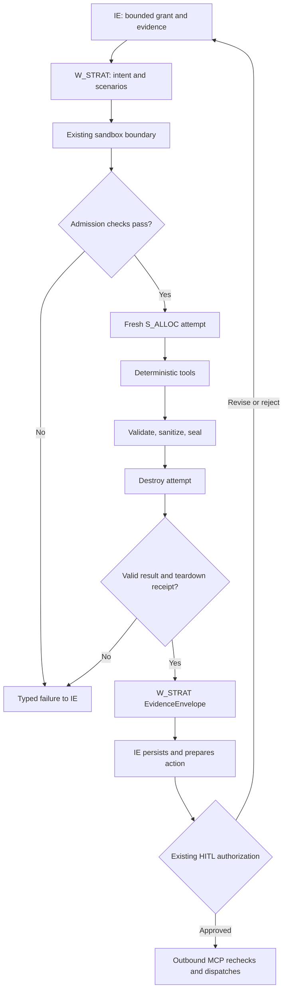

# Enterprise OS — Strategy Layer 6 implementation specification

Review date: 28 September 2026  
Scope: `W_STRAT`, its single `S_ALLOC` specialist, and the existing shared sandbox boundary  
Reviewed repository: [Maimoon-github/enterprise_os](https://github.com/Maimoon-github/enterprise_os/tree/8c1b548b90defd0937803bc39931552741dd435e)  
Pinned commit: `8c1b548b90defd0937803bc39931552741dd435e`

**Decision:** Keep one ephemeral Media & Budget Allocation specialist. Modify the existing Strategy, sandbox, schema, runner, and test files in place. No new authored source file, agent, database, repository, gateway, scheduler, inference service, or Strategy state machine is justified. Numerical calculations remain deterministic; Strategy owns the final plan. Production acceptance is currently **not established**.

**Review evidence:** All five supplied attachments were inspected, including the Mermaid graph embedded in the draw.io HTML. Earlier Strategy research was recovered. Twenty-one relevant repository files were read at the pinned commit. Five synthetic probes were run against each of the two existing numerical implementations; they reproduced the defects below. These were explicit local diagnostic executions, not hardened sandbox tests. No repository changes were committed. The application test suites and real container tests were not run; Docker is unavailable in this workspace.

## 1. Source authority and validated findings

### 1.1 Source precedence

| Source | Use in this specification |
|---|---|
| Current user requirements | Control Strategy scope, security, retention, responsibilities, and acceptance; supersede conflicting older proposals. |
| `File Tree-backend(20260928-093757).tree` | Authoritative requested backend hierarchy. Confirms the Strategy package, shared modules, and existing tests. |
| `File Tree-sandbox(20260928-092657).tree` | Confirms hardened Compose, seccomp, cleanup, proxy, and `s-alloc` skill/runner locations. |
| `Final-Level Full Architecture(20260928-092715).md` | Defines Model A, layers, grants, evidence, HITL, outbound authorization, and provenance ownership. |
| `Backend Hierarchy(20260928-092715).md` | Defines shared service ownership and the sandbox adapter seam; its flat Strategy layout is older. |
| `flowchart.drawio(20260928-092715).html` | Independently confirms W_STRAT→IE context requests, W_STRAT↔S_ALLOC in the sandbox, and IE/HITL/outbound routing. |
| `W_STRAT_Architecture_Review.md`, 25 September | Earlier structural review; explicitly did not inspect executable source. |
| `research findings(20260926-160018).md` | Earlier Layer-6 proposals, schemas, code examples, and security/test suggestions. Treat implementation claims as hypotheses until checked against live code. |
| Pinned GitHub source | Establishes the behavior and functions actually inspected. It does not certify deployed behavior or uncommitted local code. |
| External primary references, section 11 | Validate uncertain technical principles; do not override project authority or prove implementation compliance. |

The live repository and supplied trees agree on the relevant paths. A local branch newer than the pinned commit must be checked before applying this specification.

### 1.2 Confirmed findings and required resolution

Paths below are relative to `backend/` unless they start with `sandbox/`. Repository links are pinned to the reviewed commit.

| ID | Confirmed observation | Implementation requirement |
|---|---|---|
| F01 | `strategy_engine/`, `subagents/allocation.py`, `s_alloc_core.py`, Strategy tests, and the mounted runner already exist. | Modify existing locations. Retain the flat `app/agents/strategy.py` compatibility entrypoint; do not create a second Strategy package. |
| F02 | [`client.py`](https://github.com/Maimoon-github/enterprise_os/blob/8c1b548b90defd0937803bc39931552741dd435e/backend/app/integrations/sandbox/client.py) already invokes the mounted S_ALLOC runner through remote file/shell interfaces. `_execute_in_isolated_runtime`, `_execute_specialist`, and `dispatch_micro_tool` reject host S_ALLOC execution. | Preserve these fail-closed protections. The earlier assertion that implicit production S_ALLOC fallback still exists is outdated for this commit. |
| F03 | [`s_alloc_core.py`](https://github.com/Maimoon-github/enterprise_os/blob/8c1b548b90defd0937803bc39931552741dd435e/backend/app/integrations/sandbox/s_alloc_core.py) already implements a saturating response and its marginal derivative, and labels its model a non-causal planning proxy. | Retain the justified curve family. The earlier description of a purely proportional base allocator is outdated. Fix its inputs, optimizer, constraints, and diagnostics rather than introducing a new MMM service. |
| F04 | The core and [`skills/s-alloc/scripts/run.py`](https://github.com/Maimoon-github/enterprise_os/blob/8c1b548b90defd0937803bc39931552741dd435e/sandbox/docker/hardened/skills/s-alloc/scripts/run.py) contain separate numerical implementations. | Make `s_alloc_core.py` the single source of deterministic math. Turn `run.py` into strict I/O, validation, dispatch, and optional bounded interpretation glue. |
| F05 | Both implementations invent a budget/channels when absent, use channel ROAS defaults, infer saturation and uncertainty, apply unvalidated claim/objection multipliers, and emit fixed funnel targets and confidence bounds. | Remove undocumented business defaults and fabricated precision. Require supplied evidence or explicit scenario assumptions; otherwise return an evidence gap. Technical defaults such as serialization version remain allowed. |
| F06 | The core scales infeasible minima down, raises a maximum to a conflicting minimum, and normalizes alternate scenarios without checking original caps. | Reject infeasible mandates. Optimize and independently validate every scenario against the same authoritative constraints. Never repair constraints silently. |
| F07 | `strategy.py` calls `StrategyAllocationAgent.reason` before sandbox execution; `main.py` creates its provider client on the host. `allocation.py` has no direct parent Strategy import, but imports `LlmClient`. | Preserve the no-parent-import rule. Make `allocation.py` the typed dispatch bridge. Optional specialist reasoning must execute inside the same isolated attempt; remove host S_ALLOC provider wiring. W_STRAT retains its own strategic reasoning. |
| F08 | The numerical core generates channel roles, funnel hypotheses, scenario recommendations, and a complete `strategy_plan`. | Move strategic interpretation and final plan assembly to W_STRAT. S_ALLOC returns calculations, diagnostics, and bounded advisory conclusions only. |
| F09 | [`docker-compose.hardened.yaml`](https://github.com/Maimoon-github/enterprise_os/blob/8c1b548b90defd0937803bc39931552741dd435e/sandbox/docker/hardened/docker-compose.hardened.yaml) has long-running named workers on an internal bridge connected to an egress proxy; proxy variables and all skills are mounted. The worker lacks `read_only: true`. Its image digest is only a comment. | Use a fresh Strategy compute instance with network disabled, no proxy, least-privilege mounts, read-only root, effective limits, and an actual pinned image digest. Do not use the Chromium service or grant SYS_ADMIN to S_ALLOC. |
| F10 | The ALLOC remote branch creates `/workspace/{execution_id}` but does not provision a fresh runtime. `teardown_session` removes bookkeeping; the reviewed control-plane `provision/destroy` manage local objects/workspaces rather than an OCI runtime. | Connect the existing controller to real runtime creation, inspection, termination, and destruction. A unique directory, Python object, or local lifecycle flag is not runtime isolation evidence. |
| F11 | `asyncio.wait_for(asyncio.to_thread(...))` bounds host waiting. No corresponding remote kill is visible in the reviewed ALLOC path. | Enforce the deadline in the execution perimeter and kill the attempt process group/container; cancelling the waiter alone is insufficient. |
| F12 | `strategy.py` uses `grant.token_budget` as seconds. `SandboxInvocationMandate.timeout_seconds` and `resource_limits.timeout_seconds` can diverge. | Separate token and time quotas. Compute one effective deadline from the grant and profile; enforce that deadline remotely. |
| F13 | Existing schemas include `StrategyDirective`, `StrategyResultEnvelope`, sandbox identity/grants, and sealed-output facilities. ALLOC nevertheless sends a loose payload without a complete mandate/input/output/attempt digest round trip. | Extend and reuse these contracts. Add strict S_ALLOC models inside `schemas/strategy.py`; reuse the shared outer envelope and sealing types. |
| F14 | The adapter treats parsed object output as execution success; the allocator can emit success together with model-health FAIL. Strategy consumes stringified plan JSON and constructs `strategy:{task_id}` artifact labels. | Validate domain status separately from transport success. Recheck correlations, constraints, and all scenarios. Distinguish candidate handles from durable IE-created artifact IDs. |
| F15 | Auditing in `SandboxClient` is conditional on an injected recorder. Existing security tests rely on mocks/static imports; one network test only asserts an enum value. | Require trusted audit wiring for production S_ALLOC and real runtime containment tests. Keep useful mocks, but never use them as deployment certification. |

### 1.3 Reproduced numerical defects

Both the core and mounted runner produced the same outcomes below. Inputs are synthetic regression fixtures, not business evidence. These probes exercise the numerical boundary directly; they do not assert that every malformed input passes all upstream validation.

| Probe | Observed result | Required result |
|---|---|---|
| Empty input `{}` | Success; invented budget 10,000; invented four channels and allocations. | `INVALID_INPUT` or `EVIDENCE_GAP`; no fabricated plan. |
| Budget 100; two channel minima of 80 each | Success at 50 + 50, violating both minima. | `INFEASIBLE`; no allocation accepted. |
| Budget 100; channel minimum 80, maximum 20 | Success with 80; alternative scenarios allocate 100. | `INFEASIBLE`; no maximum expansion. |
| Budget 100; caps meta=20, google=80 | Base 20/80; aggressive 29.41/70.59; conservative 11.48/88.52. | Every scenario respects 20/80 caps or returns infeasible. |
| Explicit zero budget | Success with zero spend but health FAIL. | A defined zero-spend result when minima are zero; ROI undefined, or a clear domain rejection when the requested operation requires positive spend. No contradictory statuses. |

### 1.4 Resolved documentary inconsistencies

1. **Persistence versus ephemerality:** the current instruction overrides the architecture's universal retention of every prompt/scratchpad. Destroy intermediate workspaces. Retain only policy-permitted, sanitized evidence, approved artifacts, hashes, diagnostics, provenance, and execution/audit metadata through existing trusted owners. Do not retain private model reasoning.
2. **Worker/specialist return arrows:** the logical return is S_ALLOC→sandbox adapter→W_STRAT→EvidenceEnvelope→IE. It is a serialized result, not a specialist callback or import into W_STRAT. The simplified sandbox→IE drawing does not bypass W_STRAT synthesis.
3. **AIO versus the security perimeter:** upstream tools and local filenames do not establish effective confinement. The existing hardened controller/OS perimeter must enforce the boundary.
4. **Network-disabled runtime versus HTTP control:** `network_mode: none` cannot be combined with reliance on an externally reachable worker HTTP port. Use the trusted management transport described in section 4; do not reopen networking to make the current endpoint work.
5. **Reasoning versus computation:** current source has an advisory specialist LLM; prior research alternately describes S_ALLOC as deterministic-only. Current requirements permit bounded interpretation but require deterministic calculations. A separate provider-backed reasoning process is not required by this specification.
6. **Hill curves and optimality:** a general Hill curve with exponent above one is not globally concave. Do not claim diminishing marginal returns everywhere or a global optimum from marginal equalization for that case. The existing concave response family is sufficient for the minimal change.
7. **HITL:** diagnostics labeled REVIEW are information for existing Strategy review and spend approval; they do not introduce an additional Strategy approval workflow.
8. **Unrelated architecture contradictions:** the direct CDB→W_LEARN arrow conflicts with universal Model A, but correcting that engine is outside this change. Do not broaden this specification into Layers 3/4 or other workers.

## 2. Responsibilities and I/O/tool matrix

| Component | Owns | Input | Output | Authority and denied access |
|---|---|---|---|---|
| IE with existing PAB/CTS | Grants, current authorization, scoped evidence, canonical task state, persistence, HITL routing, outbound dispatch | Owner directive, policy, existing evidence | Bounded Strategy grant/context; later accepted evidence and action preview | Existing authority only; verifies scope before delegation and action. |
| W_STRAT | KPI definitions, funnel/channel roles, strategic assumptions, campaign architecture, scenario intent, risks, recommendation and final synthesis | IE grant and cited context; validated S_ALLOC results | Strategy proposal/EvidenceEnvelope, evidence-gap requests, proposed state deltas | No direct stores/RAG/CMS/memory/outbound. Cannot enlarge IE scope or self-approve spend. |
| `subagents/allocation.py` | Specialist interface and validation bridge | A typed child mandate derived from trusted grant/context | Typed sanitized result or typed failure | No host calculations or host S_ALLOC provider invocation in production; no back-import/callback to W_STRAT. |
| S_ALLOC | Ephemeral Media & Budget Allocation task; bounded interpretation of authorized inputs/results when configured | Serialized mandate, authorized model/evidence snapshots, limits | Numerical results, feasibility, curve samples, uncertainty/diagnostics, optional concise advisory rationale | No enterprise clients, credential access, browser, network, arbitrary tools, additional agents, campaign mutation, or authority expansion. |
| `media_mix_modeler` | Evaluate supplied response models and marginal returns | Explicit curve parameters/model snapshot and supported spend domain | Response/mROI samples with units, model basis, limits | Deterministic operation under S_ALLOC; does not manufacture or fit causal MMM from missing evidence. |
| `budget_allocator_tool` | Constrained optimization for each authorized scenario | Budget, bounds, objective, curve inputs, tolerances | Allocations, residual, solver status and constraint diagnostics | No bound relaxation, new channels, new budget or external spend. |
| `funnel_simulator` | Arithmetic over the funnel designed by W_STRAT | Stage/channel mapping, supplied rates/counts, scenario assumptions | Stage volumes/costs and consistency checks | Missing rates remain missing; no fixed conversion targets or strategic role invention. |
| Response, optimizer, diagnostics, validation functions | Supporting mathematical operations | Typed tool input | Typed calculations and checks | Functions in the existing core, not new autonomous agents. |
| Existing sandbox controller/adapter | Physical containment, admission checks, fixed execution, result sanitation, cancellation, trusted audit interception | Validated grant, runtime profile, pinned code | Measured runtime receipt and sanitized result | Management authority stays outside specialist; no controller credentials in its environment or filesystem. |
| Existing HITL/outbound owners | Approve and execute exact spend/external actions | IE action preview and current authorization | Approval record, signed dispatch or rejection | Allocation output alone authorizes no action. Existing replay/revocation/TOCTOU checks remain. |

Keep the existing operation names `model_media_mix`, `optimize_budget`, `simulate_funnel`, `simulate_scenarios`, and `calculate_roas`. Bind each to the named deterministic tool. Existing aliases such as `allocation_solver` and `diminishing_returns_model` may remain aliases to these functions, not separate capabilities. Resolve the legacy `default` operation in the trusted compatibility adapter to one explicit operation; reject ambiguous operations at the runner.

### 2.1 Specialist reasoning deployment

For the minimal implementation, configure S_ALLOC as a deterministic tool specialist with optional bounded rule-based interpretation inside its runner. W_STRAT supplies strategic intent and performs final interpretation with its existing model. This satisfies the requested responsibilities without introducing another service.

If an independent S_ALLOC LLM is explicitly configured, its inference must run locally inside the same fresh, isolated attempt with pre-provisioned read-only weights/runtime and an independent profile/context. No cloud API, host Ollama endpoint, HTTP provider call, provider key, or runtime model download is permitted. Missing local inference capacity is a configuration failure; never silently replace a configured model run with host inference or deterministic fallback. Record `reasoning_mode` accurately. This optional mode is not a reason to add an inference service or unrelated model dependencies to the minimal patch.

The present host `create_s_alloc_llm_client` wiring must therefore be removed from production Strategy composition. Preserve useful profile identifiers and version/digest semantics. Advisory output cannot select capabilities or supply coefficients, raise ceilings, alter channels, override validation, or declare itself approved. Model self-confidence is not a statistical interval.

## 3. Typed contracts and authority attenuation

Reuse `TaskGrant`, `StrategyDirective`, `SandboxInvocationMandate`, `SandboxResult`, `SandboxIdentity`, `SandboxCapabilityGrant`, `SealedSandboxOutput`, and `StrategyResultEnvelope`. Put new S_ALLOC-specific model definitions in the existing `schemas/strategy.py`; do not create another schema file or package. Names below are proposed additions within that file, not claims about existing classes.

| Contract | Required fields/semantics |
|---|---|
| `SAllocMandate` identity | Schema version; tenant/brand/task; parent grant ID and version/hash; `execution_id`; existing `stage_attempt_id` as the canonical attempt ID; scenario IDs; policy/profile versions; source/model/code references. Avoid a competing attempt counter. |
| Authority | Authenticated W_STRAT identity and delegation binding; purpose; grant expiry; authorized channel set; currency and currency precision; authorized budget and cost basis; allowed operations/tools; stop rules; token and compute quotas separately. |
| Planning data | KPI name/unit, horizon and aggregation grain; each channel's response family and parameters or verified model snapshot; min/max spend/share; optional already-authorized grouped constraints; explicit W_STRAT scenario intent and objective; funnel inputs where requested. |
| Evidence | Version/hash/source references for supplied parameters and assumptions; observed/valid/retrieved times when relevant; declared `planning_proxy` or `validated_model_snapshot`; missing-input list. No auto-fetch URLs or storage credentials. |
| Numerical settings | Deterministic algorithm/version, supported constraint family, precision, tie-break rule, bounded iterations/tolerance, authorized mROI floor or risk objective, uncertainty method/inputs. |
| `SAllocResult` | Exact identity/input correlation; domain status; allocations for every requested scenario; totals, budget residual, per-bound residuals; response/mROI values and units; funnel calculations; model/evidence mode; uncertainty semantics; diagnostics; concise optional advisory conclusions. |
| Execution receipt in shared sandbox contracts | Trusted runtime/container ID, image digest, runtime/profile/skill/core/tool versions and hashes, effective resource/network/mount controls, timing/exit/termination data, sanitation version, output digest and teardown receipt. Untrusted output cannot establish these facts. |
| Final Strategy result | W_STRAT's strategy proposal plus validated results and evidence references, assumptions/risks/gaps, proposed CTS delta, unapproved action status and sandbox provenance; convert through the existing Strategy/EvidenceEnvelope seam. |

Use explicit domain statuses: `OK`, `EVIDENCE_GAP`, `INVALID_INPUT`, `INFEASIBLE`, `UNSUPPORTED_MODEL`, `UNSUPPORTED_CONSTRAINT`, `SOLVER_FAILED`. Execution statuses such as timeout, security denial, isolation unavailable, and audit failure remain in the shared sandbox failure contract. A valid JSON object or exit code zero does not imply domain success. Reuse existing exception classes with stable error codes; do not add a new exception hierarchy merely to match older research names.

Validation is repeated at trusted dispatch, inside the runner, and when accepting results:

- Derive tenant/caller authority from trusted grant context, never from payload labels alone. Child channels/tools/resources must be subsets; expiry, budgets, token/time/CPU/memory/PID/output quotas may only decrease.
- Budget is an exact decimal or integer minor-unit amount. Reject nonfinite, negative, missing, malformed and mixed-unit money. Preserve explicit zero; do not use truthiness defaults for authority values.
- Require nonempty authorized channels for operations that use channels. Normalize documented aliases once before sealing; reject duplicate canonical channels, unsupported constraints and unauthorized requested channels. Do not silently replace an invalid request with all tenant channels.
- All monetary costs covered by the planning cap use its declared cost basis; fees/taxes cannot be hidden outside it. IE supplies available headroom. Alternative scenarios are mutually exclusive proposals, not additive commitments.
- Validate combined share and spend bounds per channel, total minima, group constraints if supported, horizon/currency/KPI consistency, and model parameter domains. Do not discard unknown constraints.
- Freeze/deep-copy the validated input snapshot. Unknown fields fail at the S_ALLOC boundary; arbitrary Python objects, pickle, callbacks, executable expressions and user-selected entrypoints are forbidden.
- Reject result identity, scenario, currency, input-hash, tool or channel mismatch; nonfinite metrics; extra allocations; hidden costs; bound violations; malformed or oversized artifacts; and unsupported success/optimality claims.
- Missing product/customer/competitor inputs are required only when the task's existing dependencies require them. An allocation-only task must not invent those inputs or acquire a new mandatory research workflow. W_STRAT asks IE for missing evidence through its existing interface.

## 4. Execution, security and failure flow

The logical sequence remains:

`IE → W_STRAT → S_ALLOC → AIO Sandbox tools → sanitized result → W_STRAT → EvidenceEnvelope → IE → HITL → outbound MCP`

The downward specialist call enters the sandbox before specialist execution. The upward arrow is a return value through the trusted adapter, never a callback capability.



### 4.1 Required runtime transport

The shared HTTP AIO endpoint currently used by the ALLOC branch is not evidence of attempt isolation. Select the existing hardened Docker/OCI execution perimeter as the concrete implementation target. Add an S_ALLOC compute task profile in the existing Compose file and connect real lifecycle operations through existing `SandboxClient`/`SandboxControlPlane` methods. This is a runtime profile within existing infrastructure, not a new Strategy service.

For this profile, trusted management creates a fresh AIO-image instance with `network_mode: none`, starts the fixed mounted `s-alloc/scripts/run.py` command, streams the sealed JSON input via controlled stdin/files, and collects bounded output via controlled stdout/files. The controller's runtime exec/attach transport supplies shell/filesystem management; the specialist receives only the named calculation tools. It cannot invoke a generic AIO shell or API client.

Do not combine network-none with a published worker port or pretend the current HTTP SDK call remains reachable. If the deployed AIO SDK only exposes HTTP file/shell methods, implement the fixed management exec/attach bridge inside the existing adapter/controller. It must enter the AIO runtime, not execute calculations on the backend. Do not invent upstream SDK provisioning methods. If this lifecycle/transport cannot be implemented and demonstrated in the installed runtime, return `ISOLATION_UNAVAILABLE` and block release.

The trusted runtime controller may own management authentication; the workload may not receive its daemon socket, token, API key or generic container-control handle. A remote controller's authenticated management channel is not an egress grant to S_ALLOC. A long-running shared AIO server plus a new directory is not an acceptable substitute.

### 4.2 Enforced profile

| Control | S_ALLOC requirement |
|---|---|
| Identity/isolation | Fresh runtime and workspace for each tenant/task/attempt; separate PID, mount and network namespaces; no retry/sibling reuse. Existing CTS owns retry state and budgets. |
| Network | `network_mode: none`; no proxy configuration, DNS egress, host networking, published service port or attached internal bridge. Deny network tool grants even if another worker has them. |
| AIO services | Browser/Chromium/CDP/VNC, Jupyter, code-server and MCP surfaces unavailable to the workload. Use compute-only entrypoint and verify actual processes/endpoints; do not rely on invented environment toggles. |
| OS privilege | Non-root UID/GID, drop all capabilities, no-new-privileges, effective reviewed seccomp, no privileged mode, host namespaces or SYS_ADMIN. Preserve other workers' policies. |
| Filesystem | Read-only root; attempt-scoped tmpfs scratch with size cap and `nosuid,nodev,noexec`; no writable host checkout, home, credentials, Docker socket, sibling workspace or enterprise store mounts. `noexec` alone does not prevent an interpreter reading a script: fixed entrypoint/tool policy remains necessary. |
| Code/model mounts | Only approved read-only runner/core/schema/profile/dependency closure and explicitly configured offline model assets. Mount no other skills. Pin actual image digest and record code digests; no package/model download during execution. |
| Limits | Enforce the smaller of grant and profile limits for CPU quota, memory, swap, PIDs, elapsed time, input/output bytes, workspace bytes and solver iterations. Thread counts must fit PID/CPU bounds. Read effective values, not just requested configuration. |
| Secrets | Construct a minimal environment from scratch. No enterprise/provider credentials, cloud identity mounts, signed storage URLs, inherited proxy variables, shell startup files or service-account tokens. |
| Audit | Trusted admission/start, execution, denial, termination, sanitation and teardown events; bounded, scrubbed logs. Mandatory audit unavailable means no successful acceptance. |

Retain existing resource contract defaults only where they satisfy the effective grant. Earlier research's 256 MiB/32 PIDs/64 MiB scratch/15-second example is not a measured capacity guarantee, especially for offline inference. Do not equate one CPU quota with a dedicated physical core. Determine and record the deployable profile through the required runtime tests without loosening the caller's grant.

### 4.3 Invocation lifecycle

1. IE supplies an authorized Strategy grant and bounded evidence. W_STRAT defines the scenario intent and required calculations.
2. `allocation.py` constructs the typed child mandate, validates attenuation, seals its canonical input, and calls only the existing adapter.
3. The adapter verifies caller/grant/expiry/current policy, operation/tool allowlist, audit availability, and effective runtime capabilities. Persist an authorized start/admission event through the injected trusted audit owner.
4. The existing controller creates a fresh actual runtime/attempt workspace, applies isolation before inputs enter, and records a trusted admission receipt. Abort and destroy on partial setup failure.
5. Stage only the sealed authorized data and approved code. `run.py` checks schema, input hash, IDs and operation, then calls the canonical core. Optional specialist reasoning follows section 2.1.
6. Enforce the deadline remotely. Stop on expiration, cancellation, grant stop rule, resource exhaustion, output overflow or policy violation. A host timeout must terminate the actual attempt, then wait for termination acknowledgment.
7. Collect a bounded result into trusted transient memory; check its schema/correlation/domain status/constraints; sanitize allowed evidence fields and artifact types; compute the accepted output hash. Do not promote arbitrary workspace files.
8. Terminate all attempt processes and destroy the runtime/tmpfs on success and failure. Confirm removal. Cleanup failure produces `TEARDOWN_FAILED`, quarantines the runtime through the existing controller, and prevents a success result. Never reuse it.
9. Trusted services record terminal evidence and teardown outcome. W_STRAT receives only sanitized validated data/receipts, performs synthesis, and returns the existing EvidenceEnvelope to IE.
10. IE controls durable evidence/artifact registration and task state. Spend/external actions enter the existing HITL and outbound path. No additional Strategy approval gate is introduced.

Use the existing exception and cancellation paths. Remove the controller's fabricated success response when no real runner is provided for S_ALLOC. A lifecycle enum becoming DESTROYED does not prove the remote process stopped. Do not run the current broad cleanup script against a shared host or shared runtime; restrict it to the owned attempt, with runtime destruction as the authoritative cleanup action.

### 4.4 Local/test execution

Keep production remote-only behavior. Tests may explicitly call the pure core/runner or inject a dedicated local test adapter. If a local development mode is exposed, it must require both a non-production environment and an explicit trusted startup setting, be labeled `local_test`, and have no spend/dispatch authority. A configured remote failure must never switch modes. Payload fields, user prompts or environment claims inside the mandate cannot enable fallback.

## 5. Deterministic allocation and model requirements

### 5.1 Model evidence and terminology

Retain `measurement_mode=planning_proxy` and `causal_mmm=false` for the current deterministic model. Missing coefficients or saturation assumptions cause `EVIDENCE_GAP`; W_STRAT may supply explicit, labeled scenario assumptions within its mandate, but S_ALLOC cannot invent them. Historical average ROAS is not automatically a zero-spend slope. Claims, objections, competitor signals and presence of a dictionary do not justify numerical lift multipliers or `incrementality_calibrated=true`.

For a supplied validated model snapshot, preserve source/version/hash, training/calibration scope, KPI units, time/grain, permitted spend domain and model-health results. Consume it only through IE-provided content, never direct model-store retrieval. Reject executable serialized model objects. Supporting a new response family or fitting method requires explicit implementation and tests; unsupported snapshots fail clearly. This patch does not add an MMM training or attribution engine.

### 5.2 Minimal response model

Keep the existing concave family, but give its parameters accurate names and units:

\[
R_i(x)=\frac{a_i x}{1+x/s_i},\quad
R_i'(x)=\frac{a_i}{(1+x/s_i)^2},\quad
R_i''(x)=-\frac{2a_i}{s_i(1+x/s_i)^3}.
\]

Require finite `a_i >= 0`, `s_i > 0`, and `x >= 0`. `a_i` is initial marginal response, not an unexplained historical ROI prior; `s_i` is a supplied saturation-scale assumption/estimate. This family is the exponent-one Hill form. If an observed average return at positive reference spend is used to derive `a_i`, document the supplied saturation and the transformation rather than silently reusing the average as the slope.

Average modeled return is `R_i(x)/x` for positive spend. Marginal modeled return is `R_i'(x)` or the documented finite difference for a spend quantum. For a non-monetary KPI report KPI units per currency unit. For incremental revenue report modeled incremental revenue per spend (incremental ROAS); do not call it net profit ROI. Net profit requires an explicit margin/cost model. At zero spend, average ROI/ROAS is null/undefined; the derivative may still exist. Proxy outputs must retain the word modeled and must not imply experimentally established incrementality. Meridian supports the distinction between average ROI and mROI for incremental decisions [R3].

### 5.3 Constrained optimizer

For the minimal supported case, maximize `sum_i R_i(x_i)` subject to:

- `L_i <= x_i <= U_i` for exactly the authorized channels;
- `sum_i x_i <= B`, with an optional explicit fixed-total equality only when the mandate requires it;
- `L_i = max(min_spend_i, min_share_i * B)` and `U_i = min(max_spend_i, max_share_i * B)` for specified bounds;
- exact currency quantization: minimum rounds upward and maximum downward to feasible minor-unit amounts, followed by another feasibility check.

Reject `L_i > U_i` and `sum L_i > B`. For fixed-total mandates also reject `sum U_i < B`. For capped budgets, unused funds are valid and reported as residual. An mROI floor must have an explicit meaning: either a hard constraint checked for all relevant spend, or a stopping criterion for discretionary allocation above mandatory floors. If mandatory floors already exceed the stopping threshold, report that fact; do not silently lower those floors.

For positive slopes and continuous box-plus-budget constraints, implement bounded water-filling/bisection in the existing core:

\[
x_i(\lambda)=\operatorname{clip}\left(s_i\left(\sqrt{a_i/\lambda}-1\right),L_i,U_i\right).
\]

Handle zero slope, all-upper-bound, zero budget, residual budget, and positive lambda limits explicitly. Interior channels share the budget shadow price; bound-constrained channels need not have equal marginal returns. The current arbitrary subtraction of `0.25 * uncertainty` is not the derivative of a declared risk objective and must be removed. A risk-adjusted objective must be explicitly specified and solved consistently, otherwise it is unsupported.

After the continuous solution, quantize allocations conservatively, then allocate feasible residual quanta by the largest **finite incremental gain** `R_i(x_i+q)-R_i(x_i)`, with stable channel-ID tie-breaking. Respect every bound and the stopping rule at each step. Recompute totals from final money values. Bound iterations and return a solver failure if tolerances are not achieved. Only claim optimality for the implemented, verified constraint family; otherwise return a feasible/approximate status with an error bound or gap where available.

Do not silently ignore campaign/period/group/coupled constraints. If required by the mandate but unsupported by this solver, return `UNSUPPORTED_CONSTRAINT`. A justified grouped-constraint solver belongs in the same core and must be packaged/tested before enabling that contract. Do not add SciPy, SLSQP, a general solver service or a nonconvex Hill family merely because prior research mentioned it.

### 5.4 Scenarios, funnel and uncertainty

- W_STRAT supplies scenario intent and any permitted objective/assumption differences. S_ALLOC solves each scenario under the original authoritative cap and channel constraints; it cannot normalize a weighted tilt into a full-budget plan afterward.
- Scenario recommendation and campaign architecture remain with W_STRAT. An alternate scenario's totals and model metrics must describe that scenario, not the balanced allocation.
- Funnel arithmetic consumes W_STRAT's stage definitions, channel-stage mapping and supplied rates/counts. Validate rates in [0,1], units, population and horizon; distinguish sequential from branching stages. Stage amounts are a decomposition of the same allocated money, never another independent budget. Unknown conversion rates yield an explicit incomplete funnel, not defaults.
- Report `uncertainty_method=none`, `scenario_range`, `sensitivity`, or a supported statistical method. Scenario min/max are not confidence intervals. Preserve model-based intervals only with their method, evidence and probability/coverage semantics. Do not assign fixed confidence bounds based on how many evidence fields are nonempty.
- For model snapshots, carry applicable convergence, plausibility, predictive-fit and calibration checks. Do not calculate or fabricate R-hat for a deterministic proxy. Meridian's checks motivate the distinction, but numerical thresholds come from the versioned model policy [R4]. A failed model-health gate prevents trusted model use; REVIEW carries caveats into existing review, not a new approval subsystem.

Required diagnostics: feasibility, solver/algorithm version, model mode, unit definitions, parameter/source coverage, iteration count, stop reason, objective value, exact allocated/residual totals, max constraint residual, active bounds, marginal/finite-gain checks where applicable, extrapolation distance/flag, uncertainty method, sensitivity results when requested, warnings and health status. Return null/not-applicable with a reason when a metric cannot be computed.

## 6. Provenance, persistence and sanitization

Use the existing provenance schema/service/repository and artifact contracts. PROV provides lineage semantics, not cryptographic integrity, authorization or immutable storage by itself [R5].

| PROV type/relation | Strategy mapping |
|---|---|
| Entity | Grant/context snapshot, evidence version, model/parameters, mandate, runner/core/profile/image manifest, sanitized numerical result, Strategy proposal, policy-permitted artifact, approval and dispatch payload. |
| Activity | Mandate validation, runtime admission, specialist interpretation if configured, each deterministic tool execution, sanitation/validation, teardown, W_STRAT synthesis, IE acceptance, HITL and outbound dispatch. |
| Agent | IE, authenticated W_STRAT instance, task-scoped S_ALLOC identity, trusted sandbox controller, approving human, existing outbound actor. |
| `used` | An activity consumes the exact mandate/model/tool/input entities. |
| `wasGeneratedBy` / `wasDerivedFrom` | Results are generated by execution and derived from the recorded inputs; Strategy proposal derives from validated evidence/results. |
| `wasAssociatedWith` / `actedOnBehalfOf` | Activities bind to responsible actors and recorded delegation. These edges do not themselves confer authority. |

Every attempt binds tenant, brand, task, parent grant/version, execution ID, attempt ID, actual sandbox/runtime ID, model/profile/prompt version, deterministic tool/algorithm version, input/output hashes, image/skill/core digests, policy version, timestamps, outcome, resources and teardown evidence. Record an LLM model ID only when inference occurred; otherwise use explicit not-used metadata.

Define a versioned canonical serialization: UTF-8 JSON, deterministic object key order and separators, canonical normalized decimal strings/minor-unit integers, rejection of duplicate JSON keys and NaN/Infinity, and stable list semantics. Compute `input_sha256` over the validated mandate body excluding its digest/signature fields. Compute `output_sha256` over the accepted sanitized result body excluding self-referential digest/signature fields. The body includes the input digest and correlation identities. Use the existing signing/authorization boundary for authenticated bindings; a hash alone does not authenticate a sender.

The trusted adapter recomputes hashes; never trust the subprocess's claimed input/output hashes or resource measurements. If sanitation changes bytes, preserve separate raw-transient and sanitized digests and a sanitation activity linking them; persist raw digest metadata only where policy permits, never the sensitive raw content. Invalid numeric/security data is rejected rather than edited into a valid result. Hashes of secret material can themselves be sensitive and are not a substitute for retention policy.

Sanitize parsed structured objects, error paths, logs and nested JSON fields. Apply strict size/depth/type allowlists, remove secrets and active content, reject traversal/symlink/archive escape attempts, and retain only expected artifact types. Do not treat a regex-redacted string with an unvalidated parallel structured payload as safe. Export no arbitrary workspace directory.

Scratch data, model scratch state and intermediate outputs disappear with the attempt. IE-controlled services may persist the allowed evidence, approved artifacts and audit metadata, including failure/denial/teardown outcomes. A candidate hash/handle returned by W_STRAT is not a registered artifact UUID. Only trusted registration produces durable references. No worker imports or calls persistence. Audit interception may use existing injected trusted services without giving the workload a ledger client or creating a parallel audit store.

## 7. Exact minimal change specification

`MODIFY` below means a required behavior change at an existing path, not an already applied patch. Preserve correct shared behavior for other workers. `KEEP` means retain unchanged unless interface compatibility requires a mechanical adjustment. `REUSE` means consume the existing shared owner/interface, with no Strategy-owned duplicate. No authored `ADD` is required.

| Existing path | Action and exact change |
|---|---|
| `app/agents/strategy_engine/strategy.py` | MODIFY `run`, `build_payload`, dependency normalization and result interpretation. Use authoritative typed budget/channel/model inputs; remove missing-value business defaults, invented evidence and token-to-seconds mapping. Call the allocation bridge; validate all returned scenarios; own strategic roles, campaign/funnel intent, recommendations and plan assembly. Return failures/gaps without a successful spend proposal. |
| `app/agents/strategy_engine/subagents/allocation.py` | MODIFY in place into the bounded typed mandate/result bridge. Remove production host `LlmClient` execution and fallback reasoning that fabricates assumptions/confidence. Preserve concise advisory output semantics as a schema; any configured specialist interpretation runs through the runner. No imports/callbacks to parent Strategy. |
| `app/agents/strategy_engine/profiles.py` | MODIFY S_ALLOC profile to distinguish deterministic/offline-inference execution, allowed operations, prompt/profile digest and quotas. Remove production provider fallback/credential inheritance. Keep W_STRAT strategic model ownership unchanged. |
| `app/agents/strategy_engine/subagents/__init__.py` | MODIFY only public exports/signatures needed for the existing bridge and advisory schema; retain compatibility where it does not retain a bypass. |
| `app/integrations/sandbox/capabilities.py` | MODIFY existing ALLOC profile/validation: bind operation→tool subset, fixed runner, zero egress/browser, compute profile and resource bounds. Reject unknown/ambiguous operations and tool expansion. Preserve other capabilities. |
| `app/integrations/sandbox/client.py` | MODIFY ALLOC dispatch and its lifecycle: actual fresh runtime, trusted management transport, attestation checks, canonical seals/correlation, bounded I/O, strict domain status, real timeout termination and verified teardown. Require production audit dependency. Retain existing host-dispatch denial and remote-error fail-closed behavior. |
| `app/integrations/sandbox/sandbox_policy.py` | MODIFY existing controller to enforce actual runtime admission/inspection/create/kill/destroy for ALLOC. No fabricated success runner. Compare effective controls with policy, bind identities/grants/attempts and verify teardown. Reuse its current lifecycle model; CTS remains authoritative for task/retry state. |
| `app/integrations/sandbox/s_alloc_core.py` | MODIFY into pure deterministic tool implementations and invariant checks. Retain the concave curve family; add explicit inputs, bounded optimizer, exact money, all-scenario constraints, funnel arithmetic, honest diagnostics and domain failures. Remove strategic plan prose, defaults, evidence multipliers and fabricated intervals. |
| `app/integrations/sandbox/micro_tools.py` | KEEP current ALLOC host-dispatch rejection. Reuse existing registry interfaces; introduce no second math implementation. |
| `app/schemas/strategy.py` | MODIFY existing directive/result schemas and add SAllocMandate/SAllocResult definitions within this file. Enforce strict finite typed data, currency, source/model mode, scenario constraints, gaps and diagnostic semantics. Keep conversion helpers compatible with the public Strategy interface. |
| `app/schemas/sandbox.py` | MODIFY shared fields narrowly for input/output seals, attempt/result correlation and trusted execution/teardown receipts. Reuse existing identity, grant, limits and sealed-output definitions. Preserve other worker compatibility. |
| `app/schemas/agent_contracts.py` | MODIFY Strategy-related confidence/plan/evidence representation only where required: distinguish evidence-qualified confidence from statistical intervals, model mode and unapproved proposal state. Reuse existing provenance/metadata slots before adding fields. |
| `app/main.py` | MODIFY Strategy composition: inject only the bounded bridge and hardened controller; stop constructing a host S_ALLOC provider client. Require trusted runtime/audit configuration in production. Leave other worker wiring intact. |
| `sandbox/docker/hardened/docker-compose.hardened.yaml` | MODIFY by adding a compute-only S_ALLOC task profile within this existing file. Fresh unnamed task instances, no restart loop, network none, read-only root, reviewed seccomp, dropped capabilities, quotas, minimal mounts/environment, actual image digest. Do not change other workers' proxy/browser access. |
| `sandbox/docker/hardened/skills/s-alloc/scripts/run.py` | MODIFY to read bounded strict serialized input, validate canonical schema/identity/hash, dispatch one allowed operation to mounted canonical core, emit typed result and fail on invalid input. Delete the duplicated allocation body. Implement optional offline interpretation only when explicitly configured. |
| `sandbox/docker/hardened/skills/s-alloc/SKILL.md` | MODIFY documentation to match real I/O, tools, evidence requirements, proxy labeling, failure codes, no egress/credentials, lifecycle and prohibited actions. A skill document is not enforcement. |
| `sandbox/docker/hardened/scripts/cleanup.sh` | MODIFY its S_ALLOC use to target only the owned runtime/workspace. Remove reliance on broad process-name kills/shared directory wipes for Strategy. Return a verifiable teardown outcome through the controller. |
| Existing test files in section 9 | MODIFY tests in place; replace permissive assertions that accept constraint warnings as success; preserve regression coverage for other workers. |

**Canonical code packaging:** mount the exact existing `s_alloc_core.py` read-only at a fixed path beneath the mounted S_ALLOC skill, such as `/home/gem/skills/s-alloc/s_alloc_core.py`. This is a deployment mount destination, not a second source file. With Compose's current directory, the source is `../../../backend/app/integrations/sandbox/s_alloc_core.py`. `run.py` imports only this approved core and its approved dependency closure; never the whole backend package. The trusted packaging step may export versioned validation schema data from existing Pydantic models as a generated build artifact. Core invariants and boundary checks must agree with that schema, with contract tests proving agreement. Do not add handwritten duplicate schemas or runtime package installs. Resolve the installed validation dependency during packaging; inability to validate is a failure, not a permissive path.

Keep the existing worker seccomp profile where it already meets the compute allowlist; use the existing `worker-seccomp.json`, not the Chromium profile. Tighten it only after checking other users of that shared profile. Workload-specific additional syscall restrictions may be enforced by the existing controller without weakening peers. Do not claim `socket/connect` denial from a profile that actually allows them; test external and local-control access separately.

Reuse the existing settings and exception mechanisms. An optional local/test adapter can be injected without adding a production fallback setting. No dependency change is needed for the proposed pure-Python concave optimizer. Any offline LLM or more general solver dependency is separately justified by an enabled workload and its tests, not included speculatively.

## 8. Final annotated hierarchy

Relevant existing paths only; all unrelated files remain in place. Directory labels describe the scope of edits, not replacement of the directory. `ADD: none` refers to authored repository files; a task profile and new schema classes live in existing files.

```text
backend/
├── app/
│   ├── agents/
│   │   ├── strategy.py                         [KEEP] Compatibility entrypoint
│   │   └── strategy_engine/                    [MODIFY]
│   │       ├── __init__.py                     [KEEP]
│   │       ├── profiles.py                     [MODIFY]
│   │       ├── strategy.py                     [MODIFY]
│   │       └── subagents/                      [MODIFY]
│   │           ├── __init__.py                 [MODIFY] Export adjustments only
│   │           └── allocation.py               [MODIFY] Existing bounded bridge
│   ├── integrations/
│   │   ├── llm/client.py                       [REUSE] W_STRAT only; no S_ALLOC network client
│   │   └── sandbox/                            [MODIFY]
│   │       ├── __init__.py                     [KEEP]
│   │       ├── capabilities.py                 [MODIFY]
│   │       ├── client.py                       [MODIFY]
│   │       ├── micro_tools.py                  [KEEP] Host S_ALLOC denial
│   │       ├── s_alloc_core.py                 [MODIFY] Sole math implementation
│   │       └── sandbox_policy.py               [MODIFY] Existing lifecycle/controller
│   ├── schemas/                               [MODIFY]
│   │   ├── strategy.py                         [MODIFY]
│   │   ├── sandbox.py                          [MODIFY]
│   │   ├── agent_contracts.py                  [MODIFY] Strategy fields only
│   │   ├── governance.py                      [REUSE]
│   │   ├── artifact.py                        [REUSE]
│   │   └── provenance.py                      [REUSE]
│   ├── core/{settings.py,exceptions.py}        [REUSE]
│   ├── orchestration/                         [REUSE] IE, context, evidence, CTS, HITL preview
│   ├── security/                              [REUSE] Existing authorization/signing owners
│   ├── services/{hitl.py,provenance.py}         [REUSE]
│   ├── mcp/                                   [REUSE] IE-owned access and outbound
│   ├── persistence/                           [REUSE] Trusted owners only
│   └── main.py                                [MODIFY]
└── tests/
    ├── strategy_engine/                       [MODIFY]
    │   ├── __init__.py                         [KEEP]
    │   ├── test_allocation.py                  [MODIFY]
    │   ├── test_contracts.py                   [MODIFY]
    │   ├── test_ie_roundtrip.py                [MODIFY]
    │   ├── test_provenance.py                  [MODIFY]
    │   └── test_sandbox_security.py            [MODIFY]
    ├── unit/
    │   ├── test_strategy_allocation_verification.py [MODIFY]
    │   ├── test_strategy_contracts.py          [MODIFY]
    │   └── test_specialist_micro_tools.py      [REUSE] Keep host-dispatch denial
    ├── integration/
    │   ├── test_strategy_integration.py        [MODIFY]
    │   ├── test_worker_sandbox_boundary.py     [MODIFY]
    │   ├── test_model_a_data_access.py         [MODIFY] Strategy runtime cases
    │   ├── test_security_boundaries_negative.py [MODIFY] Strategy cases only
    │   ├── test_provenance_persistence.py      [REUSE]
    │   └── test_outbound_after_approval.py     [REUSE]
    └── acceptance/test_governed_end_to_end_flow.py [REUSE]
sandbox/docker/hardened/                        [MODIFY]
├── docker-compose.hardened.yaml                [MODIFY] S_ALLOC task profile
├── egress-proxy/                               [REUSE] Other workers; inaccessible to S_ALLOC
├── seccomp/                                   [REUSE]
│   ├── worker-seccomp.json                    [REUSE] Verify effective compute restrictions
│   └── chromium-seccomp.json                  [KEEP] Not selected for S_ALLOC
├── scripts/cleanup.sh                         [MODIFY] Owned-attempt cleanup
└── skills/s-alloc/                             [MODIFY]
    ├── SKILL.md                               [MODIFY]
    └── scripts/run.py                         [MODIFY]
```

## 9. Required tests and release gates

Extend the existing suites. Synthetic fixtures must be marked as test data. A mocked transport test verifies dispatch logic; only a real hardened runtime test verifies process, network, filesystem and teardown enforcement. A skipped mandatory test is not a pass.

| ID / existing test location | Required assertions |
|---|---|
| T01 — `strategy_engine/test_contracts.py`, `unit/test_strategy_contracts.py` | Strict round-trip serialization; unknown/duplicate keys; missing authority/model/currency; explicit zero; negative/NaN/Infinity; duplicate/unknown channels; mixed currency/horizon; combined share/spend bounds; stale/expired grant; unsupported constraints. Invalid mandates spawn zero runtimes. |
| T02 — `strategy_engine/test_allocation.py` | Every scenario respects original minima/maxima, total cap, currency quantization and residual. Budget 100 with minima 80+80 is INFEASIBLE; min80/max20 is INFEASIBLE; caps20/80 remain intact across all scenarios. No silent scaling, maximum increase, or invented defaults. |
| T03 — `unit/test_strategy_allocation_verification.py` | Independent derivative/finite-difference checks, monotonic response, concavity of the supported family, decreasing marginal return, and average-versus-marginal units. Reject unsupported/nonconcave curve assumptions without claiming global optimality. |
| T04 — same allocation suites | Analytical symmetric optimum; bound-active optimum; compare small integer-budget cases against exhaustive enumeration; zero slope/spend; all channels capped; mROI floor semantics; stable ties; exact rounding; deterministic repeated results for the same numerical inputs/version; bounded iteration failure. Never accept cap violations within a loose currency tolerance. |
| T05 — same allocation suites | Each scenario recomputes its metrics; unsupported risk objective fails; uncertainty ranges labeled accurately; no fabricated confidence intervals; no claims/objections→lift multiplier; missing coefficients give EVIDENCE_GAP; imported model health and spend-domain violations are enforced. |
| T06 — `strategy_engine/test_allocation.py`, `unit/test_specialist_micro_tools.py` | Tool-to-operation mapping; runner and explicit local-test core produce equal numerical results from one source version; production host dispatch remains forbidden. Different wrapper timestamps do not imply a numerical mismatch. |
| T07 — `strategy_engine/test_ie_roundtrip.py`, `integration/test_strategy_integration.py` | IE supplies context; W_STRAT defines intent; typed S_ALLOC result returns through adapter; W_STRAT owns synthesis and requests gaps through IE. Specialist cannot invoke parent callbacks or mutate the grant/plan. No fabricated artifact IDs or completed state on failed execution. |
| T08 — `strategy_engine/test_sandbox_security.py` | Endpoint/runtime unavailable, malformed output, missing schema validator, bad attestation, wrong image/code/profile hash, startup partial failure, missing audit and remote exception all fail closed; host calculator/provider spies show zero fallback calls. Local-test mode cannot be selected by payload or used in production. |
| T09 — `integration/test_worker_sandbox_boundary.py` | Run the actual mounted runner in a fresh hardened AIO runtime; independently observe runtime ID/PID/cgroup/mount/network facts; prove the backend did not execute math. Attempts A/B and tenants A/B cannot read each other's workspace/processes; retries obtain a new runtime. |
| T10 — `integration/test_security_boundaries_negative.py` | Inside the real workload, deny DNS, IPv4/IPv6 HTTP, raw sockets where policy requires, direct IP, proxy, metadata, DB, RAG/CMS/MCP endpoints, localhost AIO controls, browser/CDP and arbitrary shell/SDK tool grants. Test attempts, not merely `NetworkPolicy.DISABLED` equality. No secret/provider/daemon credential visible through environment, mounts, process metadata or returned logs. |
| T11 — same negative/security suites | Deny host/sibling paths, `..`, shell metacharacters in IDs, absolute-path override, symlink escape, malicious model serialization, unauthorized code mount, seccomp/namespace escape, fork/resource abuse, oversized/deep output and nested credential leaks. Error strings must not expose secrets. |
| T12 — `integration/test_model_a_data_access.py` | Strategy and specialist imports/handles contain no enterprise access clients; runtime access fails even with forged IE labels or tenant IDs. IE-mediated permitted read remains usable. No worker/specialist store writes, artifact registration, campaign calls or outbound requests occur. |
| T13 — sandbox boundary/security suites | Deadline/cancellation actually kills a deliberately long-running attempt and all its children, removes runtime/workspace, and rejects late output. Check success, exception, crash, OOM, output overflow and cleanup-failure paths. Host-wait cancellation alone cannot pass. Cleanup failure prevents success and reuse. |
| T14 — `strategy_engine/test_provenance.py` | Tampered input/output, self-referential hash mistakes, reordered canonical maps, missing/mismatched tenant/task/attempt/runtime/model/tool identity, replayed result and spoofed resource receipt rejected. Verify Entity/Activity/Agent relationships, sanitation hashes and teardown link using trusted receipts. |
| T15 — `integration/test_provenance_persistence.py` with Strategy fixtures | Only trusted owner persists allowed evidence/metadata; raw scratch/private reasoning/credentials not retained. Audit outage prevents acceptance; failure/denial records remain attributable. Existing immutable-chain verification remains green. |
| T16 — `integration/test_outbound_after_approval.py`, existing governed end-to-end acceptance | Proposal alone, rejection, expiry, revocation, modified amount/channel/payload, replay and aggregate over-budget requests never invoke outbound deployment. Exact current approval can use existing outbound flow. No new Strategy approval stage. |
| T17 — Strategy profile/round-trip tests | Production creates no host S_ALLOC provider client. Deterministic mode identifies itself. If offline inference is configured, prove separate profile/context and in-sandbox inference; no credentials/network, correct token/time limits, and missing model fails without downgrade. |

Strengthen existing permissive tests rather than preserving incorrect behavior: `test_allocation_impossible_constraints_fail_closed` must not accept a warning plus an invalid allocation as success. Correct the zero-budget contract consistently. Expand the existing network-enum check into real containment tests. Retain valid shared Strategy/Model-A/security regressions.

Release requires all existing relevant Strategy, micro-tool, worker boundary, Model-A, negative-security, provenance and HITL suites to pass, plus the real runtime cases above. Use the repository's established test runner/fixtures; do not claim these tests passed from this review. Record commit, image digest, effective runtime policy, test results and remaining skips in the existing validation/reporting mechanism.

## 10. Implementation sequence and operating review

Follow the requested progression without creating another workflow/state machine:

| Phase | Required output / owner |
|---|---|
| Understand → Decompose | Strategy + platform owners reconcile the pinned source with the deployment branch, inspect applicable repository instructions and retain this ownership/scope split. |
| Research → Design | This specification resolves the source conflicts. Platform owner confirms the real OCI/AIO management transport and immutable image identity; Strategy owner fixes the supported model/constraint contract. |
| Implement | First strict contracts and core math; then thin runner/bridge and W_STRAT synthesis; then actual sandbox lifecycle/transport, production composition and audit binding. Modify existing paths only. |
| Validate → Test | Contract/math regressions, followed by real runtime isolation/termination, provenance, Model-A and existing HITL/outbound integration. Resolve every mandatory failure; mocks do not substitute for runtime proof. |
| Review | Inspect the diff for duplicated math, widened authority, hidden defaults, host provider/fallback paths, new state ownership or unrelated worker changes. Record the tested commit/profile. |
| Observe → Improve | Use existing telemetry/audit to track failures, infeasible/evidence-gap rates, runtime/teardown failures, solver residuals and model caveats. Refine only evidence-backed defects within the same files and authority boundaries. No new Strategy monitor, scheduler or memory writer. |

Concrete release blockers: effective per-attempt runtime isolation and network-none management transport; actual pinned-image/skill/core packaging; valid model/assumption inputs; removal of default/funnel/confidence fabrication; all-scenario constraints; mandatory audit and hash/correlation checks; verified remote termination/teardown; required tests passing. Deployment facts and workload capacity remain to be measured. They are not grounds to invent production credentials, curve coefficients, inference availability or passing test results.

## 11. External validation register

These sources were checked on 28 September 2026. The implementation choices above are project-specific applications of the references, not claims that the references require Enterprise OS's exact files, quotas, models or topology.

| ID | Primary source | Limited conclusion used |
|---|---|---|
| R1 | [Anthropic — Building effective agents](https://www.anthropic.com/research/building-effective-agents) | Prefer simple, composable workflows; deterministic calculations do not justify additional autonomous agents. Keeping only S_ALLOC is the project decision. |
| R2 | [AIO Sandbox README](https://github.com/agent-infra/sandbox/blob/main/README.md) | Broad browser/terminal/files/Jupyter/API capabilities and `seccomp=unconfined` quick-start examples do not establish the required hardened perimeter. The live upstream README is not proof of the locally pinned 1.11.0 deployment. |
| R3 | [Meridian — Treatment prior types](https://developers.google.com/meridian/docs/advanced-modeling/how-to-choose-treatment-prior-types) | ROI and mROI differ; mROI supports incremental allocation decisions, and non-revenue outcomes need explicit units. The optimizer and proxy family in this specification are project choices. |
| R4 | [Meridian — Model health checks](https://developers.google.com/meridian/docs/post-modeling/health-checks) | Fitted models require applicable convergence, plausibility and fit diagnostics; predictive fit alone does not establish causal validity. No MMM diagnostics are fabricated for a deterministic proxy. |
| R5 | [W3C PROV-O](https://www.w3.org/TR/prov-o/) | Use Entity, Activity, Agent and typed derivation/association/delegation relationships. Security and immutable persistence remain Enterprise OS responsibilities. |
| R6 | [Docker — None network driver](https://docs.docker.com/engine/network/drivers/none/) | None networking leaves loopback; it removes normal external networking but is not a complete protection against local services or filesystem/credential exposure. |
| R7 | [Docker — Seccomp](https://docs.docker.com/engine/security/seccomp/) | Seccomp filters system calls; do not use an unconfined example as a hardening policy or confuse syscall filtering with destination-aware network authorization. |

**Completion state:** implementation-ready design and source reconciliation complete; numerical defects reproduced; code changes and production/runtime acceptance remain to be implemented and tested.
