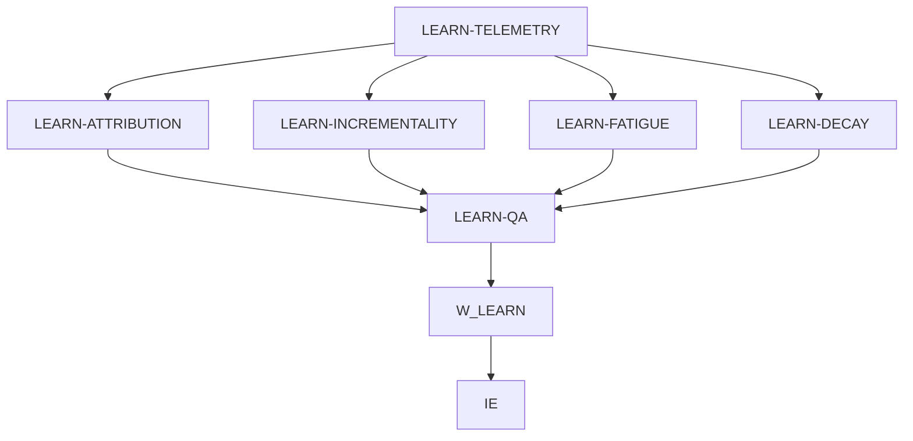

# W_LEARN — Learning & Performance Engine

Implementation specification • 23 September 2026

**Status: architecture and implementation contract specified; repository implementation and runtime verification blocked.** The supplied files are architecture/tree documents, not the backend source. No application code has been patched, no existing tests have been run, and no sandbox security property has been verified at runtime. This document identifies the exact intended changes and the evidence required before release.

## 1. Validated architecture decisions

### 1.1 Inspection findings and source precedence

Primary inputs read locally:

1. `Backend Hierarchy(7).md`: complete tree, module briefs, sandbox boundary and TBDs.
2. `Final-Level Full Architecture(20260923-100724).md`: architecture, component/access tables, Model-A rules and sandbox requirements.
3. `flowchart.drawio(20260923-100722).html`: decoded its embedded graph XML and Mermaid source; verified the W_LEARN, S_ATTR, telemetry and governance edges.

Precedence: this task's explicit W_LEARN overrides → Model-A governance invariants → supplied architecture/tree descriptions → implementation details verified when source becomes available. Diagram shorthand cannot authorize direct store access.

| Finding | Evidence in supplied material | Implementation decision |
|---|---|---|
| Worker currently documented as a flat module | Backend tree lists `app/agents/learning_performance.py` | Inspect actual checkout before relocation. If the flat module is real, retain it as a compatibility re-export after moving implementation into the requested package. |
| Requested engine package is not documented | No `learning_performance_engine/` in supplied tree | Target package is a justified requested change, not a verified existing directory. |
| Direct parent sandbox access | Architecture Mermaid line 142; decoded diagram line 132; backend boundary section | Remove W_LEARN's S_ATTR mapping. Authorize six specialist principals instead. Apply only to Learning. |
| Direct database feed conflicts with Model A | Architecture line 175; decoded diagram line 165 | Replace the logical `CDB → W_LEARN` feed with existing governed retrieval through IE and scoped materialization into specialist attempts. Parent receives references and typed summaries only. |
| ROAS optimization wording exceeds scope | W_LEARN diagram label | Interpret and document W_LEARN as ROAS/performance measurement. W_STRAT retains allocation and strategy. |
| Universal persistence and ephemeral computation coexist | Architecture requires both | Existing trusted collection/persistence owners capture required artifacts and audit lineage. Sandboxes have temporary storage only and never write enterprise stores. |
| Several named implementation files are not shown | `micro_tools.py`, `attribution_coordinator`, T31 tests and hardened sandbox tree omitted | Omission is not proof of absence. Resolve each in the checkout before deciding REUSE, MODIFY or ADD. |

The first repository step remains mandatory: inspect the worker/package, import callers, LLM factory, sandbox mappings/client/micro-tools/core, actual `attribution_coordinator`, telemetry/provenance schemas, composition root, existing attribution/ROAS tests and hardened S_ATTR runner. Record KEEP/REUSE, MODIFY MINIMALLY, RELOCATE WITH SHIM, or ADD FOR VERIFIED GAP for each. Do not infer callable signatures from a tree.

### 1.2 Ownership and authority

W_LEARN remains a Layer-5 feedback worker. Its six purpose-scoped specialists execute within Layer-6 containment. `S_ATTR` is the capability/tool family; it is not a seventh Learning specialist or a new orchestration layer.

| Owner | Retained authority |
|---|---|
| IE + existing PAB | Grants, approved data retrieval, attenuation, authorization, scheduling, retry budgets, cancellation, input/output collection and promotion routing |
| Existing CTS and DAG scheduler | Authoritative task state, dependency barriers, checkpoints and idempotency |
| Existing sandbox controller/adapter | Fresh attempt allocation, runtime enforcement, fixed tool dispatch, materialization, bounded result collection and teardown |
| W_LEARN | Typed evidence synthesis and return to IE; no runtime handle, telemetry resolver or sandbox client |
| Learning specialists | Their bounded analysis and independent LLM interpretation within their own attempt |
| Existing provenance/artifact/memory services | Audit, durable artifacts and governed learning promotion |
| W_STRAT / existing actuation owners | Strategy, budgets and any approved external changes |

**Resolve the authority paradox explicitly:** the parent's sandbox invocation allowlist is empty. IE issues specialist-specific grants beneath its authorized Learning task envelope; these are attenuated from IE's task authority, not manufactured by W_LEARN. Organizational parentage does not imply that W_LEARN can mint S_ATTR grants. If current PAB hard-codes every child's tool set as a subset of the immediate worker's invocation tools, this is a verified integration blocker; do not quietly broaden W_LEARN's powers or weaken attenuation globally.

W_LEARN may receive the task grant at intake without starting a synthesis call. The existing scheduler runs the fixed task graph and invokes the parent only after QA. No LLM chooses branches, authorizes execution, creates attempts or commits state.

### 1.3 Fixed execution DAG



The graph is registered in the existing scheduler through composition wiring. There is no Learning state machine or private queue. A normal successful evaluation uses six distinct specialist sandboxes. Retries use new attempts; never reuse a failed attempt's workspace or LLM session.

The QA barrier waits for every branch's typed terminal outcome. Missing experiment data can produce an explicit `INSUFFICIENT_EVIDENCE` result, with no numerical substitute. Unsafe telemetry stops analysis before fan-out; existing scheduler failure propagation records dependency failures. QA can review the safe failure manifest only if safe execution remains available. If the hardened boundary itself is unavailable, no specialist executes and IE records failure directly. Do not fabricate six successful executions on failure paths.

### 1.4 Parallel analysis and calibration

Attribution, incrementality, fatigue and decay start from the same immutable normalized dataset version and approved method inputs. They cannot read each other's live outputs.

Attribution may consume **previously validated** calibration and decay artifacts included in the input grant. Incrementality emits a new, scoped calibration proposal; decay emits new parameter evidence. QA compares these with attribution's assumptions. W_LEARN returns validated proposals without silently recomputing attribution or changing its weights.

If an approved new calibration must affect numerical attribution, IE starts a new versioned invocation of the same DAG with that calibration as input. A QA `REVISE` can identify the need, but cannot create a hidden back-edge, self-rerun or unbounded loop. Reuse of immutable prior artifacts must be recorded; any re-executed specialist receives a fresh attempt.

### 1.5 Research checks informing this design

- The official [AIO repository](https://github.com/agent-infra/sandbox) documents broad browser, shell, file, code and MCP surfaces, and its quick start uses `seccomp=unconfined`. Therefore stock AIO is not evidence that the project's stricter boundary exists. Enforce and test the project runtime policy independently.
- [Advertising measurement research](https://www.kellogg.northwestern.edu/academics-research/research/detail/2019/a-comparison-of-approaches-to-advertising-measurement-evidence-from/) found that observational estimates often differed from randomized experimental results. This supports separate claim types rather than treating attribution as lift.
- [Meridian's lag/saturation specification](https://developers.google.com/meridian/docs/advanced-modeling/media-saturation-lagging) provides explicit adstock and Hill transformations. The implementation must record its chosen form, order, horizon and units; it must not assume fitted curves are reliable beyond observed support.
- [Meridian calibration guidance](https://developers.google.com/meridian/docs/advanced-modeling/roi-priors-and-calibration) emphasizes differences between experimental and MMM estimands, populations and windows, with added transport uncertainty. A calibration proposal needs these mappings, not a universal lift multiplier.
- [W3C PROV-O](https://www.w3.org/TR/prov-o/) supplies entity/activity/agent relationships. Cryptographic integrity, append-only storage and authorization remain project enforcement responsibilities.

These sources validate methodological choices. They do not verify the unseen repository, mandate a new analytics dependency, or authorize new access.

## 2. Specialist, tool and access matrix

Tool labels below are proposed S_ATTR operation names to map onto existing implementations after inspection, not claims that these APIs exist today. Reuse actual equivalents.

| Principal / profile | Inputs made available | S_ATTR operations | Output | Access boundary |
|---|---|---|---|---|
| W_LEARN / `learn.parent.v1` | IE grant, safe dataset manifests, typed results and QA-approved claim IDs | None | Evidence envelope and candidate learning delta | No sandbox, raw rows, resolver, DB, RAG, MCP or outbound tools |
| LEARN-TELEMETRY / `learn.telemetry.v1` | Authorized raw snapshots, KPI dictionary and source metadata | `validate_telemetry`, `normalize_telemetry`, `summarize_quality` | Immutable dataset manifest, quality findings, availability by method | Fresh S_ATTR attempt; read-only input, attempt-local output |
| LEARN-ATTRIBUTION / `learn.attribution.v1` | Normalized paths/aggregates, approved model and prior references | `estimate_attribution`, `fit_mmm`, `calculate_roas` | Credit/model contribution estimates, reconciliation, diagnostics and uncertainty | Fresh S_ATTR attempt; no experiment launch or allocation |
| LEARN-INCREMENTALITY / `learn.incrementality.v1` | Supplied assignment/outcome/design artifacts and scoped spend | `validate_experiment`, `estimate_lift`, `propose_calibration` | Design-qualified lift and calibration proposal, or insufficiency | Fresh S_ATTR attempt; supplied evidence only |
| LEARN-FATIGUE / `learn.fatigue.v1` | Creative/cohort trajectories, reach/frequency and supplied controls | `analyze_wearout`, `analyze_saturation` | Supported wearout/saturation findings, alternatives and uncertainty | Fresh S_ATTR attempt; no creative generation/research |
| LEARN-DECAY / `learn.decay.v1` | Time series, approved lookback data and transform specifications | `estimate_adstock`, `estimate_half_life`, `diagnose_decay` | Kernel/lag parameters, half-life and carryover diagnostics | Fresh S_ATTR attempt; no sibling parameter reads |
| LEARN-QA / `learn.quality.v1` | All sanitized branch results, manifests, and separately authorized immutable verification data | `validate_learning_bundle`, `reconcile_estimates`, `verify_provenance` | PASS/REVISE/BLOCK, claim allowlist, findings and evidence-bundle digest | Fresh S_ATTR attempt; own LLM and independent validation code path |

For every specialist: `DENY_ALL` networking; no browser/GUI, arbitrary shell endpoint, runtime package installation, bearer credentials, enterprise stores, MCP, IE-internal endpoints, host mounts or sibling process/workspace access. Read/write within isolated temporary computation is allowed; enterprise write authority is not.

### 2.1 Independent LLM identities

`profiles.py` defines seven distinct role/profile identities, system-instruction hashes, output schemas and purpose limits. Model/provider names may match. Each invocation allocates a new client/session/context identity; each retry allocates new identities again. Do not use one client with seven role strings, a shared assistant/thread, shared mutable conversation state or a parent transcript copied into child contexts.

Required identity fields: principal, profile ID/version/hash, client instance ID, session ID, context ID, provider/model identifier, resolved model version when available, request ID and attempt ID. A missing provider model revision is recorded as unavailable; never invented. A task-wide correlation ID is shared for lineage, not used as session identity. QA receives analytical evidence but no sibling hidden reasoning or conversation history.

**Credential-free inference with DENY_ALL:** specialist code and its client facade run inside the specialist attempt. Reuse the existing trusted LLM integration and sandbox transport to service a bounded inference exchange over controller-owned IPC/stdin/stdout, with provider credentials retained outside the sandbox. The exchange exposes only that specialist's fixed profile and allowed prompt/result schema; it is not a general URL proxy, shell tool, MCP endpoint or IE RPC. No sandbox TCP/HTTP access to the provider is opened. Only approved aggregates enter LLM prompts by default.

This is an integration requirement, not an asserted existing feature. If the current boundary has no safe credential-free inference transport, production is blocked until the existing shared integration supports it. Do not add a Learning-specific LLM gateway or pass an API key into the container. Distinct identities must exist on both the in-attempt facade and the trusted provider session.

### 2.2 Hardened attempt requirements

Before materialization, the trusted controller checks actual runtime configuration and bound workload identity: approved immutable image/tool digests; restricted seccomp and enforced isolation; unprivileged execution; dropped capabilities; no new privileges; no host PID/network namespaces, Docker socket or enterprise mounts; read-only root; isolated scratch; bounded CPU, memory, PIDs, wall time, input/output bytes and model budget.

Disable or make inaccessible stock browser, GUI, IDE, generic shell and MCP surfaces. Only the fixed S_ATTR runner may invoke installed analytics internally. Block DNS, IPv4/IPv6 egress, cloud metadata, host services and sibling endpoints. Control-plane materialization, result collection and bounded inference mediation are trusted out-of-band operations, not sandbox network exemptions.

Bind the server-authorized identity to tenant/task/specialist/attempt, operation, input hashes, scope, expiry, nonce and policy version. Caller-supplied `agent_id` is not proof of authority. Unknown operations, extra authority, unsigned/expired grants and reused nonces fail closed. Reject path traversal, symlink escapes, archive expansion abuse, dynamic imports, pickle/object deserialization and oversized/nonfinite results.

No production fallback to local Python, an unsandboxed subprocess, shared notebook, stock/unconfined container or mock result. Destroy attempts on completion, timeout and cancellation; record cleanup outcome. Do not promise physical memory erasure merely because tmpfs was unmounted.

## 3. Exact target hierarchy and change classification

`MODIFY` means intended minimal change if the named source exists. `REUSE` means use existing verified behavior without a duplicate layer. Conditional files must be resolved against the actual checkout before a patch is made. Only the attached documentation's paths are presently verified.

```text
backend/
├── app/
│   ├── main.py                                      [MODIFY]
│   ├── agents/
│   │   ├── learning_performance.py                   [MODIFY: compatibility re-export only, if existing]
│   │   └── learning_performance_engine/
│   │       ├── __init__.py                           [REUSE if present; ADD if creating package]
│   │       ├── learning_performance.py               [MODIFY if present; otherwise RELOCATE existing implementation]
│   │       ├── profiles.py                           [ADD]
│   │       └── subagents/
│   │           ├── __init__.py                       [ADD]
│   │           ├── telemetry.py                     [ADD]
│   │           ├── attribution.py                   [ADD]
│   │           ├── incrementality.py                [ADD]
│   │           ├── fatigue.py                       [ADD]
│   │           ├── decay.py                         [ADD]
│   │           └── quality.py                       [ADD]
│   ├── schemas/
│   │   ├── learning_performance.py                  [ADD]
│   │   ├── agent_contracts.py                       [REUSE]
│   │   ├── governance.py                           [REUSE]
│   │   ├── telemetry.py                            [REUSE]
│   │   ├── sandbox.py                              [REUSE]
│   │   ├── artifact.py                             [REUSE]
│   │   └── provenance.py                           [REUSE]
│   ├── integrations/
│   │   ├── llm/client.py                            [REUSE; verify fresh-client factory and inference bridge]
│   │   └── sandbox/
│   │       ├── capabilities.py                      [MODIFY]
│   │       ├── client.py                            [REUSE; MODIFY only for verified incomplete remote S_ATTR dispatch]
│   │       ├── micro_tools.py                       [MODIFY if present; verify omitted path before ADD decision]
│   │       └── s_attr_core.py                       [ADD only if equivalent backend core is verified absent]
│   ├── orchestration/
│   │   ├── intelligence_engine.py                   [REUSE]
│   │   ├── context_assembly.py                      [REUSE]
│   │   ├── dag_scheduler.py                         [REUSE]
│   │   └── task_state_machine.py                    [REUSE]
│   ├── security/
│   │   ├── authorization_boundary.py                [REUSE]
│   │   ├── cryptographic_validator.py               [REUSE]
│   │   └── scope_evaluator.py                       [REUSE]
│   └── services/
│       ├── telemetry.py                            [REUSE]
│       ├── provenance.py                           [REUSE]
│       ├── memory_promotion.py                     [REUSE]
│       └── hitl.py                                 [REUSE]
└── tests/
    ├── learning_performance_engine/
    │   ├── test_contracts.py                        [ADD]
    │   ├── test_llm_isolation.py                    [ADD]
    │   ├── test_learning_dag.py                     [ADD]
    │   ├── test_telemetry.py                        [ADD]
    │   ├── test_analytics.py                        [ADD]
    │   ├── test_quality.py                          [ADD]
    │   └── test_sandbox.py                          [ADD]
    ├── unit/
    │   └── test_attribution_decay_roas_t31.py        [MODIFY/EXTEND after source inspection]
    └── integration/
        ├── test_worker_sandbox_boundary.py          [MODIFY/EXTEND]
        ├── test_model_a_data_access.py              [REUSE/run]
        ├── test_telemetry_learning_loop.py          [REUSE/run]
        ├── test_provenance_persistence.py           [REUSE/run]
        └── test_outbound_after_approval.py          [REUSE/run]

sandbox/docker/hardened/skills/s-attr/
├── SKILL.md                                         [REUSE; MODIFY only for contract/allowlist changes]
└── scripts/run.py                                   [REUSE; MODIFY only for required operation dispatch]
```

Existing `attribution_coordinator`: **REUSE at the path found in the checkout**. No exact path is provided by the attachments, so none is invented here. Reuse compatible pure computation inside S_ATTR; retain orchestration, data access and persistence portions with their current authorized owners. Never import a credentialed/service-connected coordinator into a sandbox.

Existing persistence repositories, RAG controller, MCP gateways, task-state/HITL services and unrelated engines are reused without change. If wiring cannot satisfy a security requirement without changing a shared module, document the exact failed contract and minimal shared fix before expanding this patch. Do not claim the constrained hierarchy alone can guarantee unseen infrastructure features.

## 4. Minimal code changes by file

| File | Required change and acceptance boundary |
|---|---|
| Engine `__init__.py` | Export existing public worker names; no singleton clients, registration side effects or runtime allocation at import. |
| `learning_performance.py` in engine | Remove direct AIO/SDK/client calls and raw telemetry parameters. Accept the existing grant plus typed, QA-bound results. Build only a candidate delta, retaining metric IDs, values, intervals, scope, limitations and evidence references. No analytics recomputation, grant minting, persistence or state commits. |
| Legacy flat worker module | If migration is needed, re-export the same public symbols. Keep import compatibility; reject legacy raw telemetry invocation with a clear migration error rather than unsafe forwarding. Preserve external IE-facing behavior where possible. |
| `profiles.py` | Seven immutable role profiles and per-invocation client factory calls through the shared integration; no client cache/singleton. Fixed instruction/schema hashes, purpose restrictions and profile validation. |
| `subagents/__init__.py` | Explicit exports/registry only; no auto-discovered plugins or import-time agents. |
| `subagents/telemetry.py` | Typed adapter for validation and deterministic normalization. Return manifest and quality outcome, not rows to parent. Reuse ingestion semantics without re-ingesting or changing source data. |
| `subagents/attribution.py` | Invoke approved attribution/MMM/ROAS routines via fixed operations. Preserve estimand, inference category, reconciliation and model limitations. No allocation tool. |
| `subagents/incrementality.py` | Validate supplied design; compute design-compatible lift; emit mapped calibration proposal with uncertainty and evidence-overlap ledger. No experiment creation or external research. |
| `subagents/fatigue.py` | Analyze longitudinal exposure and response, eligible comparison cohorts and alternative explanations; report wearout separately from saturation. |
| `subagents/decay.py` | Fit/test approved lag kernels and estimate half-life; record transform order, lag support, boundary sensitivity and uncertainty. |
| `subagents/quality.py` | Independent LLM critique plus deterministic validation/reconciliation. Emit strict QA decision, finding severity, accepted/rejected claim IDs and digest. No automatic refit or promotion. |
| `schemas/learning_performance.py` | Compose existing grants, scope, artifact and provenance types into versioned, immutable Learning contracts. Reject unknown fields, nonfinite values, invalid discriminators and scope mismatches. |
| `sandbox/capabilities.py` | Explicit empty W_LEARN capability set; six distinct specialist principals mapped to narrow S_ATTR operation subsets. Default-deny unknown IDs; no wildcard `LEARN-*` authorization. Leave other workers unchanged. |
| `sandbox/client.py` | Inspect first. Only if incomplete: make remote dispatch carry the authenticated principal, scoped references, operation and attempt policy; validate returned identity/hashes/schema and prohibit local fallback. Reuse controller allocation/transport. |
| `sandbox/micro_tools.py` | Fixed S_ATTR operation registry and input/output validators. Route numerical execution into sandbox runtime. Do not execute analytics in host request handlers. |
| `sandbox/s_attr_core.py` | Conditional only: shared pure numerical/validation functions packaged into the hardened runner. No orchestrator, SDK, network, DB or credential imports; no duplicate of an existing core. |
| `main.py` | Composition only: register fixed DAG, role profiles, fresh client factories, specialist grant bindings, existing controller/collector and final synthesis. Parent dependencies must not include sandbox client, raw-data resolver or stores. Readiness must prevent Learning execution if required protections are unavailable. |
| `s-attr/SKILL.md` | If needed, describe six allowed role subsets, supplied-data-only operation, strict schemas and failure behavior. Documentation is not the enforcement mechanism. |
| `s-attr/scripts/run.py` | If needed, fixed entrypoint/operation switch; process only authorized local inputs, initialize that attempt's role/client, validate outputs and return bounded manifest. No shell-string interpolation or arbitrary Python execution supplied by LLMs. |
| Focused/new and existing tests | Add cases in section 6, preserving existing regression coverage and baseline behavior of unrelated workers. |

### 4.1 Deterministic control contract

The following is behavioral pseudocode, **not an implementation of unknown repository APIs**:

```text
existing IE scheduler:
    verify task grant and required capabilities
    freeze dataset references, method plan and policy versions
    execute TELEMETRY under its IE-issued specialist grant
    require authorized immutable normalized dataset acknowledgment
    execute ATTRIBUTION, INCREMENTALITY, FATIGUE, DECAY in parallel
    join typed terminal results without dropping failed branches
    execute QA in a fresh attempt against exact result digests
    if QA is not PASS: return blocked/revision evidence through W_LEARN to IE
    otherwise invoke W_LEARN with the QA-approved typed bundle
    validate that candidate delta uses only approved claims, unchanged
    submit through existing IE policy/HITL/promotion path

existing trusted attempt controller, for each specialist execution:
    verify identity, grant attenuation, input hashes and runtime policy
    allocate new isolated attempt and independent LLM identity
    materialize authorized immutable data into private read-only input
    dispatch fixed S_ATTR operation within resource limits
    collect and validate bounded output; record required lineage
    acknowledge durable artifacts through existing authorized owners
    always terminate and tear down the attempt; audit cleanup failures
```

A transport failure is not `INSUFFICIENT_EVIDENCE`. Failed audit/artifact acknowledgment prevents advancement or promotion. Teardown still runs if persistence fails; the controller records failure through its existing recovery mechanism. Do not retain a live sandbox indefinitely or invent successful evidence after an infrastructure fault.

## 5. Contracts, measurement, data flow and provenance

### 5.1 Versioned contract requirements

Names below are proposed contract names; shared fields reuse project types rather than redefine them.

| Contract | Required fields / invariants |
|---|---|
| `LearningTaskInput` | Contract version, existing IE grant reference, tenant/brand/task, requested claims, channel/cohort scope, analysis window, allowed lookback, conversion maturity/as-of timestamp, dataset/artifact refs, KPI dictionary version, method-plan and QA-policy refs, retry/resource limits. No row payload, signed download URL or credential. |
| `LearningDatasetManifest` | Existing artifact ID + content hash + version, source refs/versions, immutable snapshot time, event-time/ingestion-time meaning, timezone, grain, authorized window and lookback, identity coverage, row/duplicate/quarantine counts, missingness summaries, KPI/currency/unit definitions, transform lineage and readiness by method. |
| `LearningAttemptInput` | Existing scoped sandbox mandate plus principal/profile identity, attempt/nonce/expiry, S_ATTR operation, input hashes, parameters/method version, required runtime policy and resource budget. Trusted controller resolves references; specialist cannot retrieve arbitrary artifacts. |
| `LearningEstimate` | Estimate ID; metric and estimand; observational/model-based/experimental/quasi-experimental evidence type; population, comparator, channels/window; method/version; nullable point estimate; units/currency; uncertainty object; evidence refs; diagnostics; assumptions; exclusions; support/extrapolation flag. Causal claim permission is explicit and validated. |
| `LearningUncertainty` | `kind = confidence_interval | credible_interval | sensitivity_range | unavailable | not_applicable`, method, bounds when available, declared level where meaningful, sampling/cluster unit, seed/replicates or posterior artifact, limitations and reason for unavailable values. Never equate an LLM score with statistical confidence. |
| `LearningSpecialistResult` | Role, run/attempt/dataset version, status `COMPLETE | INSUFFICIENT_EVIDENCE | FAILED`, estimates, diagnostic refs, findings and provenance refs. A failed result includes an error category and no substitute metrics. Execution state remains CTS-owned. |
| `CalibrationProposal` | Source experiment/version and QA evidence, source/target estimands, channel/cohort/window mapping, target prior/model version, distribution/weight proposal, uncertainty/transport rationale, overlap and prior-use ledger, applicability/expiry and limitations. `applied=false` for new same-run proposals. |
| `LearningQAResult` | `PASS | REVISE | BLOCK`, input bundle digest, QA profile/client/attempt refs, deterministic gate results, issue codes/severity, accepted/rejected claim IDs, remediation requests and provenance refs. No bare unexplained confidence score. |
| `LearningDeltaCandidate` | Idempotency key, base memory/model version, scoped claim IDs and values, limitations/uncertainty, QA digest, evidence/provenance refs, applicable window and expiry, proposed update kind. Status is candidate, never promoted by the worker. |

Every output is bounded by the input grant. Enforce tenant/brand/task/channel/cohort/window agreement, including the authorized lookback period. Unknown optional evidence remains unknown. Late data produces a new dataset version and linked superseding result; old results are not overwritten.

A computationally exact statistic over observed data can use `not_applicable` for sampling uncertainty only with the explanation that it is descriptive, conditional on the observed records. Measurement/coverage limitations still apply. Inferential estimates without defensible uncertainty cannot be promoted as reliable effect claims.

### 5.2 Immutable data movement and parent exclusion

1. Existing telemetry ingestion and storage remain unchanged. IE retrieves or stages authorized snapshots through its Model-A data path.
2. W_LEARN gets opaque artifact references and policy-safe metadata, without authority to dereference raw data.
3. The trusted controller materializes the authorized snapshot inside LEARN-TELEMETRY's attempt. Validate hashes before use. The original dataset stays read-only.
4. Telemetry normalization writes a new attempt-local dataset and manifest. Existing collection services validate and persist them via authorized owners, returning immutable registry references.
5. Each parallel specialist receives its own read-only copy/mount of authorized immutable input. There is no shared writable directory, notebook, process namespace, Python object cache or cross-specialist session.
6. The collector persists results and passes only sanitized typed summaries/references onward. QA receives its own separately authorized verification inputs; it cannot browse sibling files.
7. W_LEARN's synthesis context includes typed summaries and QA-approved claims. Raw rows, unrestricted logs, source attachments and user-level telemetry are excluded by serialization and prompt-construction tests. Tool output text is data, never executable instructions.
8. IE revalidates the final structured candidate against the QA digest and existing policy. Existing memory promotion commits only approved changes and appends promotion lineage. Existing HITL rules remain binding; QA PASS is not human approval.

No parent function signature accepts a DataFrame/raw-record array or a generic callback that could retrieve one. Do not place raw values in exception strings, tracebacks or free-text metadata handed to the parent.

### 5.3 Measurement rules implemented inside S_ATTR

**Telemetry.** Validate schema versions, timestamp parseability/timezone, event time versus ingestion time, conversion maturity, observation windows and authorized lag history. Validate source-scoped event IDs and conversion deduplication across sources; quarantine conflicting duplicates instead of arbitrarily keeping one. Record identity coverage, unmatched paths, missingness and source completeness. Do not silently interpret missing as zero or join identities across tenants. Treat observed zero, absent record and unavailable source as different states. Freeze KPI definitions, numerator/denominator, gross versus net revenue, refund timing, tax inclusion, currency and supplied FX reference if conversion is authorized. Never fetch FX or manufacture missing revenue.

**Attribution and MMM.** Report conversion credit and attributed ROAS as observational. Selected touchpoint rules require eligible events preceding conversions, a defined attribution window and an unattributed bucket. Reconcile each eligible conversion's credit under the selected rule; do not add overlapping platform-reported conversions as if deduplicated. MMM uses observed aggregates with declared seasonality/trend and authorized pre-treatment controls. Fit lag and saturation explicitly, diagnose identifiability/collinearity and residual behavior, assess held-out temporal performance, and report uncertainty and prior sensitivity. Fit quality alone does not establish causality. Model-based counterfactual contributions are labeled as model-based; only separately justified identification permits conditional causal interpretation. Calibration does not turn all path-level attribution into experimental evidence. MMM contributions need not behave like nonnegative touchpoint shares; record baseline/residual and do not clamp inconvenient estimates.

**Incrementality.** Require supplied design, assignment mechanism/unit, eligibility, treatment contrast, outcome, window and analysis plan. For valid randomized assignments, prefer intention-to-treat and design-consistent inference. For equal-probability assignment, a difference in arm means estimates the arm contrast; scaled totals require a stated target population. Unequal assignment and cluster experiments require appropriate weighting and uncertainty. Validate sample-ratio issues where applicable, attrition, contamination/spillovers, pre-treatment balance, multiple testing and analysis timing. Non-random holdouts need explicit identification assumptions and diagnostics; a passed pre-trend test alone does not prove identification. Relative lift is undefined when its control baseline is zero. Preserve negative effects and intervals crossing zero. Underpowered or inconclusive is not equivalent to no effect.

**Calibration.** Map supplied experimental lift to the exact channel, population, spend contrast, period and outcome of the target model. Reconcile revenue/conversion and marginal/total effect differences; decline incompatible mappings. Preserve experimental uncertainty and justify any added transport uncertainty. Track shared samples and evidence previously used as a prior or fit input to avoid treating the same evidence as independent twice. Do not force negative/near-zero experimental effects into a positive-only prior; mark model incompatibility for revision. New proposals are applied only in a subsequent IE-authorized run.

**Lag and saturation.** A supported starting family is a finite geometric adstock followed by Hill response:

\[
a_t = \frac{\sum_{l=0}^{L}\alpha^l x_{t-l}}{\sum_{l=0}^{L}\alpha^l},\qquad
h(a_t)=\frac{a_t^s}{k^s+a_t^s},\quad 0\leq\alpha<1,\ k>0,\ s>0.
\]

Record whether adstock is normalized, the bin duration and maximum lag, the transform order, parameter sources and observed support. Other response/kernel families are allowed only when present in the approved method plan and justified by evidence. Deterministic fitting/selection uses predeclared diagnostics, not LLM preference. Do not fill unavailable prehistory with invented zeros; obtain authorized history or restrict interpretation. Apply saturation to the declared exposure/frequency scale; do not mistake declining marginal response for declining absolute response.

**Decay.** For geometric weights and `0 < alpha < 1`, weight half-life is `log(0.5) / log(alpha)` time bins, multiplied by bin duration for calendar units. At `alpha = 0`, carryover is absent and the continuous limiting half-life is zero; report that convention. `alpha = 1` has no finite geometric half-life and is outside the declared model. Non-geometric kernels require their own definition; report undefined/multiple crossings if necessary. Separate carryover from outcome-reporting delay and creative wearout. Examine lag truncation, initialization, parameter identifiability and stability. Estimate half-life intervals from valid parameter draws or a documented inference method; do not invent confidence bounds. A weakly identified decay is explicitly unresolved.

**Fatigue.** Analyze creative/audience cohorts longitudinally using repeated exposure, reach development and outcome trajectories, with exposure-adjusted rates and uncertainty. Distinguish audience saturation, creative wearout and simple delivery changes. Consider supplied evidence of seasonality, targeting/placement changes, auction costs, tracking drift and conversion lag. A frequency threshold or raw CTR decline alone never supports fatigue. Aggregate reach cannot automatically be summed across periods/platforms; preserve source deduplication semantics. Report evidence-supported association unless the supplied design identifies a fatigue effect. Missing cohort/frequency evidence produces a limited or insufficient result, not a fabricated fatigue score.

**ROAS.** Attributed ROAS is attributed revenue divided by positive matched spend for the same currency, scope and accounting window. It is not profit or causal return. Incremental ROAS uses an identified incremental revenue numerator and an explicitly compatible incremental spend denominator. Conversion-only data do not support revenue ROAS without an approved value-per-conversion source. Zero or invalid denominators produce null with a reason, never infinity, arbitrary epsilon or a made-up value. Use ratio inference or joint draws where uncertainty is required; do not divide unrelated interval endpoints. Report no budget or bid recommendation.

The formulas define methods, not measured business results. All production estimates require supplied observations and successful diagnostics.

### 5.4 Independent QA and promotion rules

QA combines deterministic validation with its separate purpose-scoped LLM critique. The LLM may identify concerns and propose remediation; it cannot waive a failed hard gate, change tolerances or decide workflow transitions. Final disposition follows a versioned, deterministic severity policy. Ambiguous critique results in REVISE rather than automatic PASS.

| Decision | Rule | Result at IE |
|---|---|---|
| PASS | Valid lineage/scope/data and uncertainty; required claims supported; no unresolved blocking conflict; accepted claims enumerated | Candidate may enter existing promotion policy. PASS with no supported claim yields no effect delta. |
| REVISE | Repairable method/definition mismatch, immature data, missing required diagnostics, unresolved analytical disagreement or incompatible calibration | No promotion; return exact remediation and evidence needs. IE decides whether to authorize a new bounded run. |
| BLOCK | Scope/security violation, tampering, leaked raw data, unsupported causal claim, invalid design asserted as causal, unusable required evidence or unresolvable provenance | Reject candidate; quarantine through existing owners and record failure. |

Absence of optional experimental evidence can still allow a narrowly observational PASS if the task contract permits it. Absence of evidence required for the requested claim cannot. Do not suppress a failed required branch to achieve PASS.

Compare methods only after aligning estimand, units, population and window. Observational attribution and experimental lift naturally answer different questions; numerical disagreement alone is not a reason to average them or declare one wrong. If compatible analyses materially conflict beyond predeclared uncertainty/diagnostic rules, block the affected claim from promotion and issue REVISE or BLOCK according to severity. No generic hand-set conflict threshold is introduced here.

QA seals the exact evidence bundle and accepted claims. Parent synthesis can organize/explain them, but cannot change estimates, intervals, claim types or applicability. Canonical promoted statements come from QA-approved structured claims. Any new substantive claim or altered number fails final validation and requires another authorized evaluation. Parent narrative remains an unpromoted explanation unless it passes the same binding checks.

### 5.5 W3C PROV lineage

| PROV object / relation | Learning mapping |
|---|---|
| `prov:Entity` | Grant/policy versions; raw and normalized dataset versions; KPI dictionary; model/profile/method parameters; tools/image digests; prompts and sanitized context references; diagnostics; specialist results; QA decision; candidate and promoted delta |
| `prov:Activity` | Data staging/normalization, each specialist attempt and tool/model call, QA reconciliation, parent synthesis, IE validation and memory promotion |
| `prov:Agent` | IE/PAB, authenticated specialist execution identities, independent LLM client/profile identities, trusted sandbox controller and promotion service |
| `prov:used` | Activity consumed exact immutable input/version/hash |
| `prov:wasGeneratedBy` | Output/dataset/QA/delta entity generated by recorded activity |
| `prov:wasDerivedFrom` | Normalized data from source snapshots; estimates from datasets; calibration from experiment; candidate from approved evidence; promoted delta from candidate |
| `prov:wasAssociatedWith` / qualified association | Activity tied to agent, role and method/plan entity |
| `prov:actedOnBehalfOf` | Actual authorized IE-to-specialist delegation; do not assert parent-granted powers W_LEARN never possessed |

Add existing project attributes for tenant/task/channel/window, timestamps, request/attempt IDs, seeds, resolved model identifiers, tool versions, parameters, policy decisions, diagnostics, grant expiry and cleanup outcome. Missing required lineage blocks advancement/promotion. Connect retries to prior attempt entities without overwriting them.

The trusted collector appends audit records; workers only emit bounded evidence. Keep sensitive telemetry, prompts and traces in the existing protected artifact/audit storage according to policy, with references/hashes in the lineage graph. Neither an artifact hash nor PROV alone grants read access. A provenance event saying “PASS” is not proof of valid runtime isolation.

## 6. Focused test matrix and release blockers

Tests below are required, not reported as executed. Use deterministic, explicitly labeled test-only fixtures and approved de-identified integration data; never publish test values as measured telemetry. Real sandbox tests are required in addition to mocks. Skip/unavailable must not count as a production security pass.

| Test location | Focus | Required assertion |
|---|---|---|
| `test_contracts.py` | Strict schemas and scope | Unknown fields, NaN/Inf, invalid uncertainty, wrong tenant/window/hash and unsigned grants fail validation. |
| `test_contracts.py` | Claim discrimination | Observational credit cannot be serialized/promoted as experimental lift; unavailable estimates remain null with reason. |
| `test_llm_isolation.py` | Seven identities | Distinct client/session/context/profile identity; same underlying model allowed; no singleton or shared transcript. |
| `test_llm_isolation.py` | Retry isolation | Fresh IDs and context on retry; no cross-task/tenant prompt or mutable cache contamination. |
| `test_llm_isolation.py` | Safe inference transport | No provider secret/network route inside sandbox; bounded bridge rejects arbitrary destinations/profiles; parent never receives raw rows. |
| `test_learning_dag.py` | Scheduling | Four branches begin only after normalized artifact acknowledgment; QA waits for all terminal results; synthesis waits for QA. |
| `test_learning_dag.py` | Calibration versioning | No same-run incrementality/decay-to-attribution back-edge; a later authorized run uses the exact approved calibration version. |
| `test_learning_dag.py` | Failure/cancellation | No silently dropped branch, failed attempt reuse or unbounded retry; cancellation tears down all live attempts. |
| `test_telemetry.py` | Event semantics | Timestamp/timezone, dedup conflict, coverage, mature outcomes, cohort scope and missing-versus-zero cases handled correctly. |
| `test_telemetry.py` | Immutability | Source remains unchanged; normalized output gets new hash/version; late data cannot mutate a previous result. |
| `test_analytics.py` | Attribution/ROAS | Credit reconciliation and unattributed bucket; no cross-platform double count; currency/refund/window consistency; zero spend is undefined. |
| `test_analytics.py` | Incrementality | Hand-checkable valid randomization contrast; cluster/unequal assignment handling; invalid design blocked; negative/null effects retained. |
| `test_analytics.py` | Calibration | Scope/estimand mismatch, sample reuse, prior-evidence double counting and positive-only prior incompatibility trigger revision. |
| `test_analytics.py` | Lag/saturation | Geometric impulse and no-carryover cases, finite horizon, Hill zero/half-saturation behavior and transform order match independent expectations. |
| `test_analytics.py` | Decay | Half-life units/boundaries and interval propagation; missing prehistory and unidentifiable kernels produce limitations/insufficiency. |
| `test_analytics.py` | Fatigue | Single-threshold or one-period decline cannot trigger supported fatigue; stable controls and confounded trajectories produce appropriate findings. |
| `test_quality.py` | Decision gates | Hard fail cannot be waived by LLM PASS; optional evidence absence versus required evidence failure follows task contract. |
| `test_quality.py` | Final binding | Tampered estimates, altered intervals, stronger causal language or extra parent claim IDs fail QA digest/claim validation. |
| `test_sandbox.py` | Real isolation | Separate attempts, private scratch/PID isolation, read-only inputs, no sibling/host mounts; attempted escape paths denied. |
| `test_sandbox.py` | Network/tool denial | DNS, IPv4/IPv6, metadata, internal APIs, browser/GUI/MCP and arbitrary shell endpoints denied; identity spoof/replay fails. |
| `test_sandbox.py` | Runtime failure | Missing runtime, unconfined/wrong policy, bad image, timeout, OOM, malformed output and failed cleanup yield failure; no local fallback. |
| `test_attribution_decay_roas_t31.py` | Existing numerical regressions | Preserve verified attribution/decay/ROAS semantics except documented defects; extend lag, units, negative results and undefined denominators. |
| `test_worker_sandbox_boundary.py` | Parent prohibition | W_LEARN cannot acquire/call sandbox adapter, even via spoofed child role; six children have only their operation subsets; other mappings unchanged. |
| Existing Model-A integration test | Governance | Workers cannot use RAG/DB/MCP directly; grants remain attenuated and dataset resolution stays controlled. |
| Existing learning-loop/provenance tests | Promotion and audit | Full lineage and acknowledgments required; REVISE/BLOCK never promoted; idempotent retry produces at most one promotion. |
| Existing HITL/outbound/acceptance tests | Compatibility | No Learning-originated outbound write or bypass; existing approval and governed end-to-end flow remain valid. |

Numerical checks should use independently calculated expectations, not assertions that copy the implementation. Use distribution/coverage checks where appropriate without brittle expectations that every randomized run yields a significant result. Pin seeds and method versions for reproducibility while preserving uncertainty about the underlying effect.

### Release blockers

1. **Current: source checkout absent.** Worker implementations, `attribution_coordinator`, dependency versions, dispatcher, telemetry schemas, `main.py`, hardening configuration and existing tests cannot be inspected. Supply the repository/commit or source archive before source changes can be safely completed.
2. **Current: runtime guarantees unverified.** No evidence yet of enforced restricted isolation, fresh attempts, DENY_ALL egress or complete remote-only S_ATTR dispatch. Fail closed until real integration tests pass.
3. **Current: independent inference transport unverified.** Fresh client/session construction and credential-free sandbox inference need inspection. Missing support is a shared-boundary gap, not permission to weaken DENY_ALL.
4. **Current: specialist grant semantics unverified.** PAB must support IE-issued specialist grants while W_LEARN has no sandbox authority. Identity strings or caller-controlled roles are insufficient.
5. **Before production learning: method/data readiness.** Required KPI definitions, source snapshots, design records, appropriate lookback and approved method/diagnostic policies must exist. Missing evidence must produce limited findings, not replacement metrics.
6. **Before promotion: QA and lineage.** Failures in uncertainty, identifiability, conflict handling, evidence binding, artifact acknowledgment or provenance block the affected delta.
7. **Before release: compatibility gates.** Existing imports, Model-A access, telemetry loop, HITL/outbound boundary and numerical regressions must pass against the real checkout. No success or production-readiness claim is justified by this specification alone.

### Implementation order

Inspect/classify actual source → add strict contracts and isolated profiles → narrow capability mapping and verify remote execution → implement/reuse S_ATTR analytical operations → wire fixed DAG and parent-only synthesis → enforce independent QA and promotion binding → run focused and existing boundary tests. Reuse verified shared behavior throughout; expand the patch only for a demonstrated integration gap.

## Validation performed for this deliverable

- Read both supplied Markdown documents and decoded the HTML diagram's XML/Mermaid content.
- Confirmed the direct W_LEARN sandbox edge, direct CDB feed conflict, flat worker path and absent documentation of several requested modules.
- Checked primary AIO, measurement, Meridian and W3C sources listed above.
- Reviewed this specification for the six specialist roles, fixed DAG, seven independent LLM identities, immutable dataset flow, claim/uncertainty separation, QA sealing and fail-closed requirements.
- **Not performed:** repository patching, analytics execution, test-suite execution, live data analysis, deployment or hardened-runtime validation.
