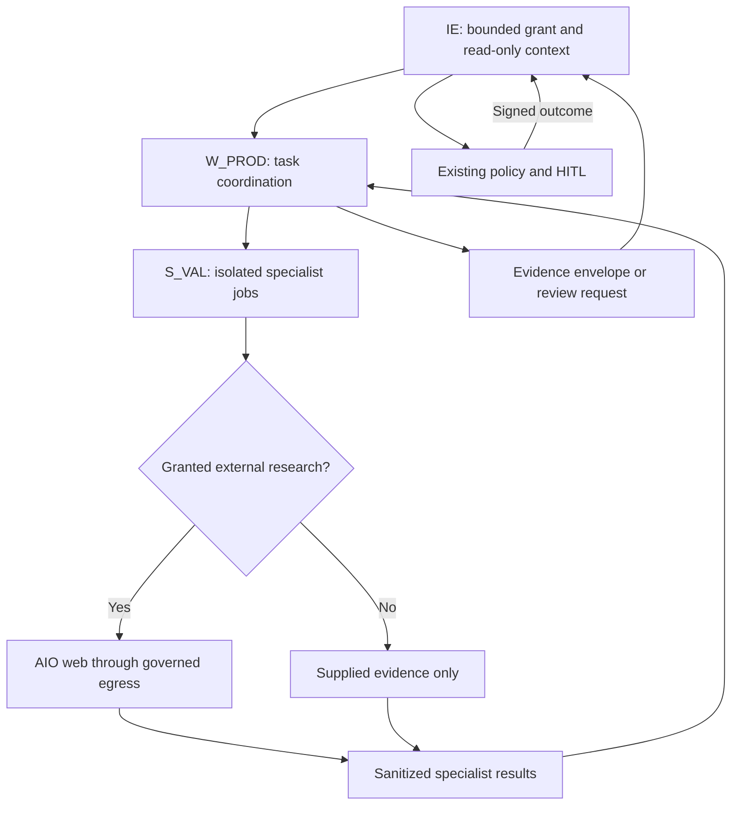

# Product / Evidence Engine — W_PROD

Research and architecture specification • Version 1.0 • Research cut-off: 21 September 2026 (UTC)

Decision: extend the existing Layer-5 W_PROD with **six bounded specialist roles**, all executing under **S_VAL**, plus deterministic evidence validation, provenance construction and dossier assembly. Preserve Model A and the existing Enterprise OS control plane. This is a specification, not an implemented patch or a product safety/legal approval.

## 1. Research Findings

### 1.1 Architecture inspected and evidence limits

All six attachments were inspected before selecting the extension. The three complete tree inventories were parsed; the HTML's embedded draw.io XML was extracted, including its 94 cells and its named architecture nodes and edges. Paths below are relative to the supplied `enterprise_os/` repository root, not to this document's workspace.

| Input | What it establishes | Consequence |
|---|---|---|
| `Backend Hierarchy(2).md` | Model-A backend responsibilities; neutral LLM client; sandbox adapter; bounded grants; evidence, artifact and PROV contracts | Reuse those interfaces; do not introduce a second data gateway, policy service or ledger |
| `Final-Level Full Architecture(6).md` | W_PROD is Layer 5; S_VAL is its existing Layer-6 capability; IE owns orchestration and data mediation; HITL governs material claims | W_PROD produces research findings and proposed state changes, never approvals or direct writes |
| `flowchart.drawio(6).html` | The same worker/capability relationship and upward evidence/downward grants | Preserve `W_PROD ↔ S_VAL`; no W_PROD link to S_SCRAPE or stores |
| `File Tree-backend(4).tree` | Existing `product_evidence_engine/`, compatibility-level `agents/product_evidence.py`, shared clients and existing product tests | Extend the package already present; do not replace its public import path |
| `File Tree-enterprise_os(3).tree` | Backend and sandbox coexist; research documents live under `Agentic System Research/` | Place domain code under backend and skill entrypoint changes under the existing hardened sandbox skill |
| `File Tree-sandbox(3).tree` | S_VAL `SKILL.md` and `scripts/run.py`, hardened compose, egress proxy, seccomp profiles and browser/SDK surfaces exist | Reuse deployment and controller surfaces; presence in a tree does not prove enforcement |

The backend and enterprise inventories agree on the backend paths relevant here. The sandbox inventories likewise agree on the S_VAL and hardening paths. Minor environment-example listing differences do not justify architecture changes. Research/patch copies elsewhere in the enterprise tree are not the live implementation location.

**Verification limit:** these are architecture documents and directory listings, not implementation source. No claim is made that an existing function is missing, insecure, correctly wired or passing tests. Section 8 separates intended domain changes from conditional shared-interface changes. No code has been changed.

**Source conflicts resolved narrowly:**

1. The architecture prose sometimes permits “worker/sub-agent → IE” context requests. The task's stricter rule wins: specialist → bounded result → W_PROD → IE. Specialists receive no IE client or callback.
2. The diagram includes a `CDB → W_LEARN` edge inconsistent with the general Model-A text. It is outside this scope and must not be copied into W_PROD. No unrelated W_LEARN refactor is proposed.
3. Universal persistence and ephemeral sandbox storage coexist by returning audit/intermediate artifacts through the existing supervised result channel for IE ingestion. Specialists do not persist anything. Deletion of task scratch follows controller-owned collection/acknowledgement policy; failed collection yields an incomplete run.
4. Existing “full prompt/context” auditing means governed input/output messages, tool transcripts, versions and decision summaries. It does not require access to provider-private reasoning traces.

### 1.2 Research findings and design implications

Source identifiers R01–R25 resolve to URLs, jurisdiction, evidence class, retrieval date, access status and freshness in section 12. “Design” statements are proposed engineering choices, not regulatory requirements.

| Topic | Sourced finding | Design implication |
|---|---|---|
| Ingredient identity | CosIng is informative; an INCI inventory entry is not permission or approval to use an ingredient [R08] | Resolve names, botanical species/part, extraction method, concentration basis and identifiers before linking evidence; evaluate restrictions separately |
| Evidence discovery | PubMed E-utilities exposes biomedical records; Crossref supports bibliographic identity and update/retraction relationships [R12–R14] | Record database, query, filters, time, pagination and access limits; deduplicate publications and underlying studies separately |
| Systematic synthesis | PRISMA 2020 describes reporting of systematic reviews; Cochrane provides conduct guidance for study selection and extraction [R09, R11] | Predefine a question/protocol and retain exclusion reasons. Default to a clearly labelled rapid evidence assessment unless full systematic-review requirements are met |
| Methodological appraisal | Cochrane separates result-level risk of bias from certainty across a body of evidence; GRADE considers bias, inconsistency, indirectness, imprecision and publication bias [R10] | Appraise by study design and outcome. Do not assign a credibility score from domain name or publication count alone |
| Claims | FTC guidance addresses both express and implied messages, the overall advertisement and the relevance of evidence to the advertised product [R01] | Capture wording, imagery, qualifications, audience, medium and likely interpretations as versioned claim records |
| EU cosmetic claims | Regulation 655/2013 establishes common criteria; the Commission-hosted technical document provides application guidance, including evidence relevance [R04–R05] | Link each claim to a scoped rule and a separate scientific support assessment. Guidance is not binding legislation |
| Finished-product relevance | FTC guidance specifically discusses when isolated-ingredient research may not substantiate the marketed combination [R01] | Use an explicit ingredient-to-product bridge assessment; no automatic promotion from ingredient evidence to product efficacy |
| Safety | FDA states responsible persons must maintain adequate cosmetic safety substantiation; its MoCRA overview does not prescribe one universal set of product tests [R02] | Assess available safety evidence and missing exposure/formulation information; do not invent universal mandatory tests |
| Safety methodology | SCCS guidance addresses exposure and modern safety assessment approaches, with published corrigenda [R07] | Store method/version, assumptions, applicability and uncertainty. Toxicological interpretation remains subject to qualified review |
| Laboratory evidence | ISO/IEC 17025 concerns laboratory competence; ILAC G8 addresses decision rules and conformity statements; OECD addresses GLP data integrity [R15–R17] | Verify the report, sample, method, scope, units and decision rule; a certificate image alone cannot establish test validity |
| Jurisdictions | FDA classification depends on intended use; GB guidance distinguishes its market requirements; Pakistan official records show a repeal process that must not be mistaken for completed commencement [R03, R06, R23–R25] | Resolve product class, territory and effective date before assessing obligations; unresolved status produces `unknown` and escalation |
| Freshness | Crossref carries corrections/retraction metadata; legal documents and scientific studies have different update semantics [R13–R14] | Track retrieval age, effective-law interval, source updates and formulation version separately |
| Provenance | W3C PROV models entities, activities, agents and their relationships [R18–R19] | Export compatible lineage through the existing PROV contracts; do not create a separate ledger |
| Sandbox | Upstream AIO exposes broad browser, shell and file capabilities; its quick-start configuration is not proof of the enterprise hardening described in the attachments [R20] | Verify the supplied hardened deployment and restrict each job's operations; a prompt-level prohibition is insufficient |

### 1.3 Evidence assessment method

Use three separate assessments; none substitutes for another:

- **Scientific assessment:** study quality, applicability to the product/claim, precision and consistency.
- **Safety assessment:** hazards, actual/foreseeable exposure, susceptible populations and missing safety information.
- **Regulatory assessment:** applicable jurisdiction, product category, effective rules and proposed compliance findings.

Proposed assessment dimensions are categorical and reasoned, not a fabricated probability:

| Dimension | Stored assessment | Rule |
|---|---|---|
| Source identity/integrity | `verified / partial / unresolved / compromised` | DOI resolution, issuer identity and document authenticity are independent of scientific quality |
| Methodological quality | Tool name, version, domain judgements and cited reasons | Use an appropriate design-specific method; RoB 2 for eligible randomized results, an appropriate nonrandomized method for those designs; do not force every study into RoB 2 |
| Relevance | `direct / bridge_required / indirect / not_applicable / unknown` | Compare formulation, dose, route, population, comparator, endpoint, duration and setting |
| Recency/freshness | Publication date, retrieval time, checked-through date, rule validity and refresh status | Old foundational evidence can remain relevant; a newly retrieved superseded rule is still superseded |
| Consistency | `consistent / explainable_difference / unresolved_conflict / too_sparse / not_assessed` | Reconcile endpoint and design differences before declaring contradiction |
| Certainty | `high / moderate / low / very_low / not_assessed` plus method/version/reasons | Use formal GRADE only when its method has actually been applied; otherwise label a domain rubric explicitly |
| Extraction reliability | `human_verified / cross_checked / single_pass / unresolved` | A model's self-rated confidence is not evidence strength |
| Coverage | Required sources, searched sources, inaccessible items, excluded items, stopping reason | No percentage called “complete” without a defined denominator |

For material findings, Discovery extracts and Appraisal independently checks the source location and relevant result. For lab records, Product/Lab extracts and Appraisal or Safety checks critical values. Different model configurations help operational independence but do not establish statistically independent errors. Unresolved material differences go to HITL. [Method background: R10–R11; review procedure here is a design proposal.]

Never average a critical authenticity failure, an irrelevant formulation, or unresolved law into a passing score. Preserve separate `supports`, `refutes`, `mixed`, `inconclusive` and `not_applicable` evidence edges. A nonsignificant result is not automatically proof of no effect; a claim of no meaningful effect needs a suitable design, precision and justified threshold.

### 1.4 Discovery and synthesis protocol

Before research, define product version, atomic questions, relevant outcomes, population, exposure route, comparator, study designs, languages, time range, sources, exclusions and stopping rules. Record protocol amendments before interpreting the changed search.

Search ingredient synonyms and exact formulation identifiers; include neutral, negative and safety queries. Look for registries, primary articles, supplements and corrections, not only positive reviews. PubMed, Crossref and ClinicalTrials.gov are discovery/metadata routes, not automatic endorsements of the deposited findings [R12–R14, R21]. Use reviews as discovery aids and appraise them when synthesizing them; link primary studies to prevent counting a review and its included study as independent support.

Retain source locations, original and normalized values, endpoint timing, denominators, effect measures, uncertainty intervals, adverse events, registration identifiers and funding/conflict disclosures where available. Missing values remain explicitly unknown. Full text inaccessible means `abstract_only` or `metadata_only`, never “full text reviewed.” Do not bypass access restrictions. Do not perform quantitative pooling when studies are unsuitable; provide a structured narrative synthesis with the incompatibilities.

### 1.5 Initial jurisdiction coverage

This specification uses cosmetics as the principal worked domain because formulation, safety and claims are central to the task. The engine is category-configurable. No target product category or launch territory was supplied; the following are researched examples, not an assertion that every territory has a production-ready rule pack.

| Territory | Verified research basis | Implementation decision |
|---|---|---|
| US | FDA intended-use classification; MoCRA safety-record obligation; FTC claims guidance [R01–R03] | Separate FDA product classification/safety and FTC advertising assessments. A hair-growth presentation can raise drug classification; escalate it, do not “approve with a disclaimer” |
| EU | 1223/2009 and 655/2013 identified; Commission claims guidance and SCCS guidance retrieved [R04–R05, R07, R22] | Rule IDs may be drafted, but latest consolidated law/annexes and applicable amendments need authoritative verification before a release decision |
| Great Britain | Official PIF, safety assessment and claims guidance retrieved [R06] | Separate GB from Northern Ireland; qualified assessor findings cannot be signed by an LLM |
| Northern Ireland | GB official guidance identifies distinct arrangements [R06b] | Requires its own confirmed applicability profile; never silently use a GB-only checklist |
| Pakistan | DRAP rules/categorization located in official search results; National Assembly repeal proceedings retrieved [R23–R25] | Require current Gazette/commencement and product-category verification. Neither a bill nor committee support establishes operative repeal. Set `legal_status_unverified` until resolved |
| Other markets/categories | Not assessed here | Return `unsupported_jurisdiction` or `unsupported_product_class`; IE may authorize a new research task |

No blanket legal-compliance conclusion, ingredient limit, mandatory test panel or launch approval is supplied in this report.

## 2. Recommended W_PROD Architecture

### 2.1 Keep the existing worker and capability

The parent at `backend/app/agents/product_evidence_engine/product_evidence.py` remains the bounded Layer-5 interface. It validates incoming task shape and scope, decomposes the research task, invokes S_VAL through the existing sandbox client, checks returned results, and returns an evidence envelope to IE. It holds only transient coordination state. Global scheduling, CTS transitions, policy authorization, HITL, persistence and publication remain with existing owners.

All specialist cognition, document parsing, browser research, OCR, calculations, appraisals and dossier assembly execute in controller-isolated S_VAL jobs. Parent-side checks are limited to control/contract verification; they are not a host fallback for research or untrusted execution.

Retain six specialist roles:

1. **Discovery & Source Capture** (`discovery`).
2. **Evidence Appraisal & Conflict/Gap Analysis** (`appraisal`).
3. **Product/Formulation & Lab Evidence** (`product_lab`).
4. **Safety Evidence** (`safety`).
5. **Claim Mapping & Interpretation** (`claims`).
6. **Regulatory Applicability & Compliance Research** (`regulatory`).

S_VAL also provides deterministic validation/assembly operations. These are functions, not additional LLM agents. Run only the specialists required for a task; disabling a required specialist yields an incomplete result, not a successful shortcut.

### 2.2 Why six is the smallest justified set

| Candidate role requested | Treatment | Architectural reason |
|---|---|---|
| Research Discovery | Retain | Owns reproducible acquisition and source capture; kept separate from judging its own findings |
| Evidence Appraisal | Retain | Owns methodological assessment and cross-checking |
| Product/Formulation | Retain jointly with Lab/Test | Both establish exactly what material/product was studied and whether tests concern the submitted formulation |
| Safety Evidence | Retain | Hazard/exposure interpretation needs a distinct task, source policy and review path from benefit evidence |
| Claim Mapper | Retain | Consumer-facing express/implied meaning differs from study appraisal and legal applicability |
| Regulatory/Compliance | Retain | Legal status/effective-date interpretation must remain separate from scientific support |
| Lab/Test Validation | Merge into Product/Lab | Shared sample, formula, batch, method and specification context; independent checking still performed by another role |
| Conflict & Gap Analysis | Merge into Appraisal | Evidence comparison is part of synthesis, with a final pass after claim/regulatory work |
| Dossier Synthesis | Deterministic S_VAL assembly | Compose already assessed records; no new LLM adjudicator capable of smoothing away conflicts |
| Provenance/Citation | Cross-cutting deterministic functions | Every operation must produce lineage; a final “citation agent” cannot repair missing acquisition provenance |

Do not merge Safety with Regulatory: “scientifically concerning” and “legally restricted” are different findings. Do not merge Claims with Appraisal: the same reliable experiment can be irrelevant to the message a consumer receives.

### 2.3 Permission and runtime boundaries

- IE supplies immutable, tenant-scoped snapshots, not database handles, signed storage URLs, RAG search tools or a live parent object.
- A specialist accepts serialized input and writes a bounded result to the controller-owned output channel. It cannot invoke parent methods, inspect parent process memory, read parent environment variables, import the parent runtime, or call IE.
- No specialist-to-specialist RPC or shared mutable filesystem. W_PROD validates and redistributes selected previous results in a new scoped task.
- Each task gets its own controller-enforced process/filesystem/network scope. Merely using different directories in one unrestricted AIO container does not satisfy isolation.
- Sub-grant scope must be a subset of parent scope for tenant, product version, allowed operations, domains, source types, model profiles, budget, deadline and data classification. Sub-grants cannot extend expiry.
- The controller owns lifecycle, credentials, egress enforcement, result sanitization and audit transport. W_PROD requests execution through the existing adapter; it does not become a sandbox controller.
- The existing provider-neutral LLM client is packaged as an approved runtime dependency, with request-local profile parameters. No direct vendor SDK appears inside specialist modules. Only authorized model endpoints are reachable for cognition; research traffic uses AIO browser/web operations.
- Never mount the whole backend, repository, host filesystem or Docker socket into specialist jobs. Package only the approved specialist code, contracts, pure validation helpers and neutral LLM dependency. No persistence credentials enter the image or grant.

### 2.4 What “verified dossier” means

`validation_status=verified` means schema, citations, lineage, scope, evidence edges and specified review checks passed for the supplied version. It does not mean proven efficacy, universally safe, regulator-approved, or cleared for publication.

Store separate axes: `validation_status`, `scientific_status`, `safety_status`, `regulatory_status`, `review_status`. W_PROD can return a structurally verified dossier whose conclusion is insufficient evidence. Only the existing HITL service produces signed review decisions; IE owns their binding to the dossier and any later dispatch.

## 3. Sub-Agent Responsibility Matrix

All six use the bounded contracts in section 9. Shared exclusions: no RAG/IE/store/CMS access; no persistent writes; no publication, external submission, ordering laboratory work or contacting people; no privilege changes; no legal/medical sign-off. `needs_context` and `needs_capability` are result data, never executable callbacks.

| Role / purpose | Responsibilities and exclusions | Inputs → outputs |
|---|---|---|
| **Discovery** — acquire a traceable body of sources | Execute authorized protocol; search positive/negative evidence; capture documents/metadata; screen with reasons; identify duplicate study families. Does not assign final certainty or claim approval | Questions, protocol, sanitized ingredient terms, jurisdictions, IE-supplied sources → search log, source records, initial extracts, selection reasons, unresolved acquisition gaps |
| **Appraisal** — assess reliability and disagreements | Check extraction; appraise design/outcome; assess relevance/precision/consistency; detect double counting, contradictions and coverage gaps; final gap pass. Does not issue safety certificates or legal decisions | Source bytes/locators, extracts, bridge assessments, claim maps, safety/regulatory findings → study/outcome appraisals, body-of-evidence assessments, conflicts, prioritized gaps, reviewer questions |
| **Product/Lab** — establish the tested product and test validity | Normalize formula/material identity and units; link batch/sample; inspect COA/report/raw-data consistency, method and scope; compare studied vs marketed formulation; propose specs. Does not invent missing concentration, certify a lab, prescribe a new formula, or release a batch | Formula snapshots, supplier specs, reports, raw data if available, approved limits/methods → versioned specification, identity gaps, test-validation results, relevance bridges, proposed test needs |
| **Safety** — assess safety evidence sufficiency | Identify hazard/exposure evidence; evaluate route, dose, duration, foreseeable use, interactions and vulnerable groups; identify adverse signals and missing endpoints. No diagnosis, human dosing advice, autonomous animal/human testing or legal safety sign-off | Formula and use scenarios, lab validation, literature appraisals, adverse-event context → safety evidence assessment, assumptions, uncertainty, candidate precautions, urgent flags and qualified-review requests |
| **Claims** — map consumer messages to evidence | Atomize express claims; infer plausible implied claims from words/images/layout/testimonials; distinguish measured outcomes from marketing language; link eligible evidence; propose narrower wording separately. Does not decide lawful status or rewrite the source evidence | Exact copy/assets and locale, product version, extracted/appraised outcomes, relevance assessments → claim inventory, interpretation records, evidence mappings, unsupported aspects and proposed alternatives |
| **Regulatory** — establish applicable requirements | Research product classification, authority, rule type, effective dates and scoped obligations; compare dossier facts to authoritative rules; surface ambiguities and candidate nonconformities. Does not edit policy rules, act as counsel or sign a CPSR | Territories, dates, intended use, claims, product/safety/test records, IE-supplied approved rule snapshots → applicability matrix, cited rules, pass/fail/unknown/not-applicable findings, mandatory-review reasons |

Each retained role has a separate model profile and source/assessment policy:

| Role | Reasoning profile | Sandbox tools / source policy | Assessment and escalation |
|---|---|---|---|
| Discovery | `w_prod.discovery`: reasoning + structured extraction; bounded query planning | AIO read-only browser/web, approved metadata APIs, safe document extraction. Prefer primary publications, registries, official authorities; secondary material only labelled leads/background | Source identity/access and coverage; no efficacy score. Escalate inaccessible pivotal source, exhausted search budget, suspected forged source, or needed unapproved domain |
| Appraisal | `w_prod.appraisal`: high-depth methodological comparison; independent checking input | Offline S_VAL parsing/statistical micro-tools over supplied bytes; no research egress. Uses full methods/results where available, registry and correction records supplied by Discovery | Design-specific bias and outcome certainty; unresolved conflict/critical error blocks affected material claim. Missing full text cannot become “low risk” |
| Product/Lab | `w_prod.product_lab`: technical reasoning; units/tables; optional vision for report inspection | Offline parsers/OCR, deterministic unit arithmetic and schema checks. Prioritize controlled formula, signed lab report, raw results, method and accreditor scope supplied by IE/Discovery | Sample/formula identity, authenticity, method fit and uncertainty, plus bridge relevance. Escalate batch mismatch, unknown concentration, altered report, unit discrepancy or unsupported limit |
| Safety | `w_prod.safety`: high-depth hazard/exposure reasoning | Offline approved calculation/extraction tools; regulatory toxicology assessments, relevant primary safety studies and adverse evidence supplied in context | Endpoint coverage, exposure relevance and uncertainty. Escalate serious signals immediately, vulnerable-use gaps, unknown exposure and unsupported extrapolation; no model-only “safe” output |
| Claims | `w_prod.claims`: semantic and multimodal interpretation for languages/assets in scope | Offline text/OCR/image inspection; exact packaging/ad bytes and assessed evidence. Marketing references are claim inputs, not proof | Record evidence status and interpretation uncertainty independently. Ambiguous net impression, absent assets, unreviewed translation or therapeutic implication triggers review |
| Regulatory | `w_prod.regulatory`: high-depth rule/applicability analysis | AIO read-only official-law/regulator retrieval when granted; offline rule checks. Law, official gazette and authoritative legal text first; guidance and standards separately tagged | Rule authenticity, territory/class match, temporal applicability and completeness. Missing/changed/contested law, classification ambiguity or apparent prohibition always escalates |

Specialists return `SpecialistResult` only. Results may contain source-backed findings, proposed gaps and explicit reasons. W_PROD may forward a context request to IE; specialists cannot choose the retrieval backend or directly resolve artifact IDs. A second pass uses a new bounded task with lineage linking it to the first.

## 4. Workflow and Data Flow



The graph's returning IE node represents completion/resumption through existing services. It does not grant specialists an IE route.

| Stage | Owner and mechanism | Output / stop condition |
|---|---|---|
| 1. Intake | W_PROD verifies grant, tenant, context hashes, formula version, categories, territories, claim assets, budgets and review requirements | Accepted task or missing-context result; no product assessment without required scope |
| 2. Decompose | W_PROD creates a local stage plan, not a global scheduler. Product/Lab normalizes intake; Claims performs an initial atomic-claim pass; Regulatory screens classification | Questions and bounded specialist grants; initial classification hold may narrow subsequent research |
| 3. Research | Discovery acquires literature; Regulatory acquires authoritative rules via AIO | Search/selection log, captured sources, research limitations |
| 4. Extract | Discovery extracts study fields; Product/Lab extracts formula/test records; Claims extracts exact creative messages | Structured records with source locations and original values |
| 5. Appraise | Appraisal assesses bias/precision; Product/Lab establishes formulation relevance; Safety assesses safety evidence coverage | Domain findings with explicit unknowns |
| 6. Cross-check | Separate role verifies critical extracted values and source entailment; deterministic checks compare identifiers/units/versions | Agreed values or preserved discrepancy; no silent majority vote |
| 7. Claim-map | Claims links atomic interpretations to relevant appraised outcomes | Supporting, contrary and missing evidence; ingredient-only limitations |
| 8. Compliance-check | Regulatory evaluates category/territory/effective-date scoped rules against the mapped claims and product facts | Candidate findings and review triggers; no policy edits |
| 9. Gap/conflict analysis | Appraisal reruns across the complete assessment set | Conflict records, missing work, consequence, priority and suggested owner |
| 10. Synthesize | Deterministic S_VAL assembly composes the dossier from approved record types | Product spec, source register, claim matrix, safety/compliance sections, limitations, gaps and provenance |
| 11. Validate | S_VAL deterministic validators and parent boundary checks verify schema, lineage, source pointers and status invariants | Verified structural result or `validation_failed`; invalid result cannot be relabelled as approved |
| 12. HITL/escalate | W_PROD returns a review-needed evidence envelope; IE routes it through existing policy/HITL and persists it | Signed approve/reject/revise/hold through existing services; reviewer qualification matched to issue |
| 13. Evidence envelope | IE may resume W_PROD with signed review context; W_PROD returns a finalized reference set or records the hold | Final researched dossier envelope; IE alone commits state/persistence or requests approved outward action |

There is necessarily an interim envelope before HITL: IE cannot review an invisible local dossier. That hand-off implements the requested logical sequence without giving W_PROD ownership of HITL or permitting a specialist to call IE.

**Retry and recovery design:** use deterministic task IDs/idempotency keys for the same stage inputs, independent attempt IDs, explicit deadlines and bounded retry/repair counts supplied by IE policy. A malformed result is rejected; repair does not gain tools. On budget exhaustion return coverage gaps and partial status. IE owns durable checkpoints and rehydrates a new task; W_PROD keeps no private database. Never overwrite a previous attempt or erase contrary findings.

**Mandatory review triggers:** material express/implied claims, compliance conclusions, externally intended dossiers, classification ambiguity, unresolved source conflicts, material lab discrepancies, serious safety signals, unsupported ingredient-to-product bridges and stale critical rules. Human decisions are scoped to exact dossier/claim/formulation/asset/locale/territory versions. Changed inputs invalidate the applicable approval binding and require IE review. Researching a requirement or recommending a test does not authorize submitting a regulatory filing or commissioning the test.

## 5. LLM + Tool/Sandbox Access Matrix

### 5.1 Enforced access

“Web” below means the existing AIO browser/web capability under S_VAL's per-task egress policy, never arbitrary host HTTP. LLM transport is a separate approved cognition route through the existing client, not a research-browser replacement.

| Actor | Own reasoning profile | Literature web | Official-rule web | Offline evidence tools | Sandbox lifecycle | IE / enterprise data | Writes |
|---|---|---|---|---|---|---|---|
| W_PROD parent | Existing worker profile if needed; decomposition may be deterministic | No | No | Contract checks only | Invoke via existing client only | Bounded IE context/result contract only; no stores | Proposed results/state deltas only |
| Discovery | `w_prod.discovery` | Granted subset | Granted subset for source capture | Yes | No | No | Task scratch/result channel |
| Appraisal | `w_prod.appraisal` | No | No | Yes | No | No | Task scratch/result channel |
| Product/Lab | `w_prod.product_lab` | No | No | Yes | No | No | Task scratch/result channel |
| Safety | `w_prod.safety` | No | No | Yes | No | No | Task scratch/result channel |
| Claims | `w_prod.claims` | No | No | Yes, vision only if granted | No | No | Task scratch/result channel |
| Regulatory | `w_prod.regulatory` | No | Granted subset | Yes | No | No | Task scratch/result channel |
| Deterministic S_VAL validators/assembler | None | No | No | Schema, arithmetic, reference, lineage checks | No | No | Task scratch/result channel |

Discovery can fetch an accreditor record for Product/Lab; Product/Lab cannot grant itself network access. Claims can request missing packaging imagery only in its bounded result. Internet acquisition never uses W_COMP or borrows S_SCRAPE authority.

### 5.2 Independently configurable model profiles

Each role has its own complete immutable configuration record, even if several initially choose the same provider/model. Independent configuration does not require six vendors or six different model names.

Required profile fields: `profile_id`, `profile_version`, `provider_adapter`, `model_id`, `model_revision`, `reasoning_mode`, `capabilities_required`, `context_limit`, `max_output_tokens`, `sampling_parameters`, `timeout_ms`, `max_attempts`, `budget_limit`, `data_classification_allowlist`, `endpoint_policy_ref`, `credential_ref`, `fallback_profile_ids`, `prompt_version`, `output_schema_version`.

These are requested semantics, not invented vendor API parameters. The existing neutral client maps supported options, records effective settings and rejects unsupported mandatory capabilities. Credentials are resolved by existing trusted infrastructure, never embedded in task JSON or model prompts. Provider master keys must not be handed to specialist code. Use existing scoped credential/transport facilities; if unavailable, block live specialist cognition until a minimal secure integration is verified, rather than creating an unreviewed gateway.

Routing rules:

1. IE-authorized task names an allowed role/profile version; W_PROD cannot accept a role or model dictated by a retrieved document.
2. S_VAL verifies the resolved profile digest and role binding. No mutable global `default_model` substitution.
3. Each LLM call records role, requested and effective model/revision, prompt/template hash, input/output hashes, usage, endpoint-policy version and attempt ID. Unknown provider revision is reported as unknown, not fabricated.
4. Missing vision for an image claim, insufficient context, disallowed data residency or unsupported structured output yields a capability error. No silent text-only or cloud fallback.
5. Fallbacks are explicit per role, preserve schema/security requirements and are logged. Retries use that role's configuration only.
6. Structured outputs are validated independently of model output mode. Temperature zero, a seed, or a “reasoning” label is not a guarantee of deterministic inference.

**Deterministic means:** stable contracts, normalized identifiers, versioned rules, content hashing, validation outcomes and replay over captured records. It does not promise that two live LLM/web runs produce identical research.

### 5.3 Governed egress

Default deny. Effective egress is the intersection of deployment policy, IE grant and specialist operation policy. Proposed source domains are examples to authorize, not a wildcard allowlist: NCBI/PubMed/PMC, Crossref, ClinicalTrials.gov, the relevant regulator/legislation domains, standards/accreditor sites and specifically approved publisher hosts.

Require approved schemes/methods/endpoints; inspect redirect destinations, DNS resolution and subresource requests; block private/link-local/metadata addresses, alternate encodings and direct-IP bypass. Do not allow unrestricted CONNECT, arbitrary proxy selection, package installation, shell networking, external uploads, mailbox access, arbitrary MCP servers, or a browser's access to parent/controller administration. Use read-only retrieval operations; query-style POST is permitted only for a documented read-only endpoint expressly granted by policy.

Search terms must be disclosure-safe. Do not send confidential full formulas, supplier secrets, customer records or lab attachments to public search services. Discovery receives sanitized terms; the approved model route receives only context allowed for its data classification. Web pages, PDFs and metadata are untrusted data and cannot alter grants or tool permissions.

Blocked source → `source_inaccessible` plus reason, not broadened egress. A controller-owned allowlist change follows existing governance outside the specialist. No running AIO deployment was supplied for this report; the authoring research is not an AIO isolation test or a W_PROD execution trace.

## 6. Product/Evidence File/Folder Hierarchy

The following hierarchy is the **proposed domain delta and its immediate existing integration points**, not a replacement Enterprise OS tree. `EXISTING` means present in the supplied inventories, not implementation-verified. `ADD` entries are absent from those inventories. No per-role provider adapter, new worker base class, global workflow framework, new database or dedicated citation agent is proposed.

```text
backend/
  app/
    agents/
      product_evidence.py                         EXISTING compatibility entry
      product_evidence_engine/
        __init__.py                               EXISTING
        product_evidence.py                       EXISTING parent worker
        subagents/
          __init__.py                             ADD
          discovery.py                            ADD
          appraisal.py                            ADD
          product_lab.py                          ADD
          safety.py                               ADD
          claims.py                               ADD
          regulatory.py                           ADD
    schemas/
      product_evidence.py                         ADD domain contracts
      agent_contracts.py                          EXISTING outer contracts
      sandbox.py                                  EXISTING invocation/result
      artifact.py                                 EXISTING artifact references
      provenance.py                               EXISTING PROV contracts
    integrations/
      llm/client.py                               EXISTING neutral client
      sandbox/
        s_val_core.py                             ADD pure S_VAL operations
        client.py                                 EXISTING adapter
        capabilities.py                           EXISTING S_VAL registration
        micro_tools.py                            EXISTING tool routing
        sandbox_policy.py                         EXISTING sandbox policy
    core/settings.py                              EXISTING settings owner
  tests/
    product_evidence_engine/
      __init__.py                                 ADD
      test_contracts.py                           ADD
      test_claim_mapping.py                       ADD
      test_product_lab.py                         ADD
      test_appraisal_safety.py                     ADD
      test_regulatory.py                          ADD
      test_provenance.py                          ADD
      test_llm_routing.py                         ADD
      fixtures/
        evidence_cases.json                       ADD synthetic fixtures
    unit/test_product_evidence_verification.py    EXISTING
    integration/
      test_product_evidence_integration.py        EXISTING
      test_worker_sandbox_boundary.py             EXISTING
      test_model_a_data_access.py                 EXISTING
      test_provenance_persistence.py              EXISTING
      test_outbound_after_approval.py             EXISTING
sandbox/
  docker/hardened/
    skills/s-val/
      SKILL.md                                    EXISTING capability instructions
      scripts/run.py                              EXISTING sandbox entrypoint
    egress-proxy/allowed-domains.txt               EXISTING governed deployment list
    egress-proxy/tinyproxy-allowlist.conf           EXISTING enforcement configuration
    docker-compose.hardened.yaml                  EXISTING deployment configuration
Agentic System Research/
  Product & Evidence Engine Research/
    research findings.md                          ADD specification destination
```

`s_val_core.py` follows the visible `s_alloc_core.py` and `s_copy_core.py` convention. Its proposed functions perform input/result validation, evidence/reference checks, unit/threshold checks, provenance transformation and deterministic dossier assembly. It has no database, IE, network, CMS, global scheduler or model-provider dependency. Its runtime use is inside S_VAL; host-side use is restricted to pure contract checks and tests.

The six specialist modules contain role-specific instructions, extraction/assessment logic and bounded calls to the existing neutral LLM interface. They must be loadable without importing the parent worker or backend composition root. New `__init__.py` files must not create side-effectful imports. Code location under `agents/` is an organizational convention, not authorization to execute it on the host.

## 7. Current vs Proposed Gap Analysis

| Requirement | Current evidence | Gap that can be established | Smallest response |
|---|---|---|---|
| W_PROD identity | Package and top-level module exist | No new engine identity needed | Extend existing package; preserve import compatibility |
| Specialist set | Product package lists only `__init__.py` and `product_evidence.py`; other engines already use `subagents/` | No named product specialist modules in tree | Add six modules and package initializer; verify no equivalent embedded logic before implementation |
| S_VAL | Skill entrypoint and worker mapping already specified | Product research sub-operations are not documented in supplied content | Extend S_VAL operations; retain capability ID |
| Product evidence contracts | Generic contracts and development-specific schemas exist | No product-specific schema module in tree | Add one domain schema module reusing outer contracts and artifact/PROV types |
| Deterministic validator | Alloc/copy core modules exist; no `s_val_core.py` listed | No similarly located product core | Add a pure product validation/assembly module; reuse any equivalent existing function found in source |
| Independent model profiles | Neutral LLM client exists | Per-role configurability, concurrent routing and sandbox availability are unverified | Pass six explicit profiles through existing task/settings interfaces; modify shared client only if a failing contract test proves necessary |
| Governed research | Browser APIs, egress proxy and sandbox policy files exist | Actual per-job browser grants and network enforcement unverified | Test current boundary first; authorize a narrow S_VAL research operation through existing policy |
| Lab/formulation relevance | W_PROD purpose mentions product specs and evidence | Detailed identity, batch, method, uncertainty and bridging behavior not supplied | Add domain assessment records and fixtures; do not build a LIMS |
| Claim semantics | S_VAL described as claim/schema validator | Express/implied, asset-version and ingredient/product distinction unverified | Extend domain mapping and acceptance fixtures |
| Rules and legal status | Policy engine exists | Domain research findings need rule/source/effective-date links | W_PROD proposes cited assessments; policy ownership stays unchanged |
| Provenance | Generic schema/service/repository and tests exist | Product-specific trace coverage unverified | Use existing entities/activities/agents with additional domain records; no new ledger |
| HITL/publication | Existing HITL and outbound boundary are specified | Dossier-version/claim-scope binding unverified | Extend tests; integrate using existing preview/artifact contracts if sufficient |
| Persistence | Existing governed repositories and artifact registry | No evidence of a schema migration requirement | Use existing generic artifact/JSON payload mechanisms after source verification; no migration proposed |
| Product testing | Product unit/integration files already exist | Required negative and semantic cases not visible in tree | Extend relevant existing integration tests; add focused domain tests |

**Important distinction:** “not visible in the supplied tree” is not “absent in code.” The proposed module organization is justified by the responsibilities, but implementation must inspect existing function bodies before adding duplicate logic. The confirmed deficiencies of the attachment set are missing behavioral detail and missing product-specific named modules; runtime defects are not yet established.

## 8. Minimal Codebase Modification Plan — Exact Paths

Status semantics: `ADD` is a proposed new path absent from the supplied inventories; `MODIFY` is a planned change to an existing domain/integration test path when implementing this specification; `NO CHANGE` is the default for shared infrastructure. Conditional changes below are explicitly **not yet authorized as necessary by code evidence**. This plan makes no claim that source changes have been applied.

### 8.1 Proposed additions

| Action | Exact repository-relative path | Rationale |
|---|---|---|
| ADD | `backend/app/agents/product_evidence_engine/subagents/__init__.py` | Product specialist package, with no runtime side effects |
| ADD | `backend/app/agents/product_evidence_engine/subagents/discovery.py` | Protocol-led discovery/capture |
| ADD | `backend/app/agents/product_evidence_engine/subagents/appraisal.py` | Appraisal, independent checks, conflict/gap synthesis |
| ADD | `backend/app/agents/product_evidence_engine/subagents/product_lab.py` | Formula/sample/test identity and evidence relevance |
| ADD | `backend/app/agents/product_evidence_engine/subagents/safety.py` | Safety evidence assessment and escalations |
| ADD | `backend/app/agents/product_evidence_engine/subagents/claims.py` | Express/implied claim interpretation and mapping |
| ADD | `backend/app/agents/product_evidence_engine/subagents/regulatory.py` | Jurisdiction, classification and rule research |
| ADD | `backend/app/schemas/product_evidence.py` | Typed domain task/results, sources, claims, evidence, rules and dossier payload |
| ADD | `backend/app/integrations/sandbox/s_val_core.py` | Pure validation/assembly using existing contracts and capability |
| ADD | `backend/tests/product_evidence_engine/__init__.py` | Domain test package |
| ADD | `backend/tests/product_evidence_engine/test_contracts.py` | Schema and grant/status invariants |
| ADD | `backend/tests/product_evidence_engine/test_claim_mapping.py` | Claim-to-evidence and express/implied coverage |
| ADD | `backend/tests/product_evidence_engine/test_product_lab.py` | Formula bridge, batch identity and lab checks |
| ADD | `backend/tests/product_evidence_engine/test_appraisal_safety.py` | Bias, conflict, gaps, exposure and safety escalation |
| ADD | `backend/tests/product_evidence_engine/test_regulatory.py` | Scoped law, temporal validity and legal uncertainty |
| ADD | `backend/tests/product_evidence_engine/test_provenance.py` | Complete domain lineage and source-location validation |
| ADD | `backend/tests/product_evidence_engine/test_llm_routing.py` | Six independently configured profiles and fallback isolation |
| ADD | `backend/tests/product_evidence_engine/fixtures/evidence_cases.json` | Clearly synthetic, reproducible positive/negative evidence cases |
| ADD | `Agentic System Research/Product & Evidence Engine Research/research findings.md` | This design and its evidence/gap decisions; documentation only |

Total proposed additions: **18 Python/fixture files plus one specification**. If existing source already satisfies an addition's responsibility, reuse it and reduce this list; do not create an unused compatibility duplicate merely to match the tree.

### 8.2 Planned domain and test modifications

| Action | Exact repository-relative path | Smallest intended change |
|---|---|---|
| MODIFY | `backend/app/agents/product_evidence_engine/product_evidence.py` | Bound the research stages, distribute role profiles/context, invoke S_VAL and return review-needed/final evidence envelopes |
| MODIFY | `sandbox/docker/hardened/skills/s-val/scripts/run.py` | Dispatch approved product specialist/validation operations in isolation; strict input/output and operation allowlist; reuse existing launch machinery |
| MODIFY | `sandbox/docker/hardened/skills/s-val/SKILL.md` | Document new S_VAL operations, bounds, source handling, schemas and prohibited access |
| MODIFY | `backend/tests/unit/test_product_evidence_verification.py` | Preserve existing worker behavior and add product dossier/status invariants |
| MODIFY | `backend/tests/integration/test_product_evidence_integration.py` | Exercise bounded W_PROD → S_VAL → result → IE workflow and review resumption |
| MODIFY | `backend/tests/integration/test_worker_sandbox_boundary.py` | Cover every product specialist and deny host fallback/parent inspection |
| MODIFY | `backend/tests/integration/test_model_a_data_access.py` | Deny product specialist and parent direct store/RAG/CMS access |
| MODIFY | `backend/tests/integration/test_provenance_persistence.py` | Verify IE-mediated ingestion of product source/claim/rule lineage |
| MODIFY | `backend/tests/integration/test_outbound_after_approval.py` | Verify version-bound review and no unapproved claim-dossier dispatch |

These nine paths are the proposed domain implementation/test surface. Read their bodies before changing them; an existing passing implementation or test is reused instead of rewritten.

### 8.3 Shared-interface changes: default NO CHANGE, conditional MODIFY only

| Default action | Exact path | Verified requirement that would justify MODIFY |
|---|---|---|
| NO CHANGE | `backend/app/integrations/sandbox/capabilities.py` | S_VAL registration cannot express the approved operations, input/result schema or attenuated research scope |
| NO CHANGE | `backend/app/integrations/sandbox/micro_tools.py` | Explicit existing routing table needs S_VAL dispatch registration; do not add a second route if capability routing suffices |
| NO CHANGE | `backend/app/integrations/sandbox/client.py` | Existing wrapper cannot transport bounded product payloads, model profile refs or sanitized artifact results |
| NO CHANGE | `backend/app/integrations/sandbox/sandbox_policy.py` | Current policy cannot deny/permit required operations and enforce role-specific capability attenuation |
| NO CHANGE | `backend/app/integrations/llm/client.py` | A failing routing test proves profile selection is global, provider-bound, not sandbox-loadable, or silently ignores required capabilities |
| NO CHANGE | `backend/app/core/settings.py` | Current settings cannot hold six independent profile records/refs using existing configuration mechanisms |
| NO CHANGE | `backend/.env.example` | Profile configuration actually requires new documented environment keys; never add credentials |
| NO CHANGE | `backend/app/schemas/agent_contracts.py` | Existing task/evidence extension payload mechanism cannot carry typed product records and bounded context requests |
| NO CHANGE | `backend/app/schemas/sandbox.py` | Existing invocation/result cannot safely carry operation/profile refs, source artifacts or data classification |
| NO CHANGE | `backend/app/schemas/action_preview.py` | Existing preview cannot bind exact claim/dossier/formulation/territory/asset versions for HITL |
| NO CHANGE | `backend/app/orchestration/hitl_preview_generator.py` | Existing preview rendering demonstrably omits required product findings, conflicts or review scope |
| NO CHANGE | `backend/app/schemas/provenance.py` | Existing extensibility cannot encode necessary standard PROV relationships and domain metadata |
| NO CHANGE | `backend/app/agents/product_evidence.py` | Source inspection shows this is the active implementation instead of an import shim; update only the real owner and preserve compatibility |
| NO CHANGE | `backend/app/agents/product_evidence_engine/__init__.py` | Public exports demonstrably need adjustment; avoid exporting specialist runtimes to the host |
| NO CHANGE | `sandbox/docker/hardened/egress-proxy/allowed-domains.txt` | Approved sources/model endpoints required for the chosen task are absent; add exact authorized hosts only |
| NO CHANGE | `sandbox/docker/hardened/egress-proxy/tinyproxy-allowlist.conf` | Live deny tests prove required egress protections cannot be expressed/enforced by current configuration |
| NO CHANGE | `sandbox/docker/hardened/docker-compose.hardened.yaml` | Existing packaging/isolation cannot supply approved specialist code/LLM client or isolate each invocation; add only necessary mounts/image config with no parent runtime exposure |
| NO CHANGE | `backend/pyproject.toml` | Required parsing/schema dependencies are genuinely absent; first reuse installed dependencies |

A failure involving shared isolation/credential infrastructure is a release blocker, not permission for W_PROD to implement its own controller. Fix the existing owner narrowly in a separately justified patch if required.

### 8.4 Explicitly retained existing owners

The following exact existing paths remain **NO CHANGE** in the baseline plan:

| Paths | Responsibility preserved |
|---|---|
| `backend/app/orchestration/intelligence_engine.py`; `backend/app/orchestration/context_assembly.py`; `backend/app/orchestration/dag_scheduler.py`; `backend/app/orchestration/task_state_machine.py`; `backend/app/orchestration/rag_query_dispatch.py`; `backend/app/orchestration/evidence_synthesis.py` | IE control, context, global DAG, canonical state, RAG mediation and enterprise evidence synthesis |
| `backend/app/services/policy_engine.py`; `backend/app/services/hitl.py`; `backend/app/services/task_state.py`; `backend/app/services/provenance.py`; `backend/app/services/audit_validator.py`; `backend/app/services/memory_promotion.py` | Existing governance, signed approvals, state, audit persistence and memory promotion |
| `backend/app/services/rag/controller.py`; `backend/app/services/rag/hybrid_retriever.py`; `backend/app/services/rag/freshness.py`; `backend/app/services/rag/schema_validator.py` | Exclusive governed data retrieval/ingestion |
| `backend/app/mcp/host.py`; `backend/app/mcp/data_gateway.py`; `backend/app/mcp/outbound_gateway.py` | Existing MCP ownership and post-approval actuation |
| `backend/app/persistence/database.py`; `backend/app/persistence/repositories/artifact.py`; `backend/app/persistence/repositories/provenance.py`; `backend/app/persistence/repositories/operational.py`; `backend/app/persistence/repositories/memory.py`; `backend/app/persistence/repositories/vector.py`; `backend/app/persistence/repositories/task_state.py` | Systems of record and immutable artifact references |
| `backend/app/security/authorization_boundary.py`; `backend/app/security/cryptographic_validator.py`; `backend/app/security/scope_evaluator.py` | Existing authority and signature enforcement |
| `backend/app/integrations/cms/client.py`; `backend/app/agents/base.py`; `backend/app/main.py` | CMS adapter, shared worker abstraction and composition root |
| `sandbox/docker/hardened/seccomp/worker-seccomp.json`; `sandbox/docker/hardened/seccomp/chromium-seccomp.json`; `sandbox/docker/hardened/scripts/cleanup.sh` | Existing containment and teardown mechanisms; enforcement still must pass tests |

Do not modify unrelated workers, frontend, ads/social integrations, SDK-generated browser clients or schema migrations. If implementation uncovers a genuine contract incompatibility, record the failing requirement/test and extend the exact existing owner; do not infer permission for broad refactoring.

### 8.5 Implementation order after source inspection

1. Read actual W_PROD, base contracts, S_VAL entrypoint, client/registry/policy, LLM client, settings and existing tests. Record exact symbols and supported extension points. Pin the repository revision and sandbox image digest.
2. Run focused existing tests and verify hardening/routing behavior; record baseline failures. This specification has not run those tests.
3. Add domain contracts and synthetic cases. Reuse outer grants, artifact references and PROV types.
4. Implement pure S_VAL validators and the six role definitions. Add independent profile routing using current client/config interfaces.
5. Extend W_PROD/S_VAL dispatch without a new IE workflow service. Keep host-side execution out of specialist paths.
6. Run semantic, negative-boundary and integration tests; address only proven shared gaps from section 8.3.
7. Route a demonstration dossier through existing HITL; validate persisted lineage and stale-approval rejection. Live sources remain opt-in and sandbox-only; no outward publication is part of implementation validation.

## 9. Schemas and Contracts Required

### 9.1 Contract rules

Use existing outer grants, sandbox invocation/results, artifact refs and PROV contracts. The names below are **proposed domain types**, not claims about existing class names. Implement them in `backend/app/schemas/product_evidence.py` with the repository's actual validation library; emit versioned JSON Schema from that single authoritative type definition. Do not maintain a second hand-written schema implementation.

All messages require a schema version, tenant/run/task identifiers, input hash binding, bounded array/string sizes and a discriminated message type. Unknown fields are rejected unless an existing versioned extension field explicitly permits them. Dates are RFC 3339 UTC timestamps or ISO calendar dates as appropriate; units and numerical precision must be explicit. Unknown data is `null` plus a reason, never an empty string disguised as a value. IDs are opaque, tenant-scoped and immutable; returned IDs cannot grant lookup authority.

Use the existing hashing/canonicalization convention. If none exists, verify the need before selecting a canonical JSON format; hash captured bytes separately from normalized representations. A snapshot hash is calculated by trusted capture tooling, not accepted from model text. Model assertions of signature validity, accreditation or successful retrieval are not trusted attestations.

### 9.2 Boundary contracts

| Proposed domain type | Required fields | Producer → consumer / validation |
|---|---|---|
| `ProductEvidenceTask` | `task_id`, `tenant_id`, `run_id`, parent grant ref/hash, context version/hash, product/formula version, category hypothesis, jurisdictions, assessment date, intended use/populations, claim asset refs, objectives, protocol scope, allowed S_VAL operations, source/egress policy refs, six profile refs, budgets/deadline, stop/review rules | IE → W_PROD. Contains bounded snapshot content or controller-staged read-only refs; no open database or storage URL |
| `SpecialistTask` | Parent task/grant binding, specialist enum, operation enum, immutable input manifest, selected context slice, profile ref/version/digest, schema IDs, delegated limits, policy refs, deadline, output limits, idempotency key, attempt ID | W_PROD → existing sandbox client → S_VAL specialist. Must attenuate the parent grant; role cannot change its profile or operation |
| `SpecialistResult` | Task/attempt/tenant/input/profile binding, `completed / partial / needs_context / needs_capability / escalated / failed`, typed findings, source/extract/assessment refs, gaps/conflicts, sanitized artifact manifest, provenance fragments, usage, tool outcomes, error/review reasons | Specialist → supervised result channel → W_PROD. No callable, command, executable pickle, callback URL or raw host path |
| `ProductContextRequest` | Missing field/artifact/source, purpose, affected question/claim, minimum scope needed, blocking/nonblocking reason | Specialist embeds in result → W_PROD may send existing context request to IE. IE may deny; never a direct specialist request |
| `ProductEvidencePayload` | Product spec, protocol and coverage, claims/interpretations, evidence/assessments, mappings, safety findings, rule applications, gaps/conflicts, source register, artifact/PROV manifest, validation report, review requirements and limitations | W_PROD → existing evidence envelope → IE. Payload subtype, not a competing envelope protocol |
| `ProductReviewBinding` | Dossier hash, product/formula/claim/asset versions, territory/date/locale, reviewer role/qualification requirement, reasons, existing approval refs or `pending` | W_PROD proposes review scope; existing HITL service supplies signed decision. Worker cannot generate approval signatures |

### 9.3 Domain records

| Type | Required content and invariants |
|---|---|
| `ResearchProtocol` | Question/PICO or domain-equivalent framing; inclusion/exclusion criteria; sources; language/date limits; exact search syntax; planned methods; stopping rules; protocol version/amendments; `rapid / systematic / targeted / update` assessment type |
| `SearchRun` | Protocol/source-system IDs, exact disclosure-safe query, database/interface version where known, UTC start/end, filters, pagination/cursors, counts, screening outcomes, inaccessible/truncated results and reason; queries are auditable without leaking secrets |
| `SourceRecord` | Stable source ID; URL and/or DOI/PMID/registry/legal/report identifier; issuer/authors; title; source/evidence type; jurisdiction or `not_applicable`; publication/update/effective dates; retrieval event/time; actual access level; language; authenticity and correction/retraction status; freshness status/policy/check time; source-location and snapshot refs; rights/access limitations |
| `SourceSnapshot` | Exact captured representation/hash, media type, byte length, retrieval activity ID, requested/final URLs, redirect trace, response/access status, tool version, capture timestamp; full-text, abstract and metadata captures are different entities |
| `ExtractedEvidence` | Source/snapshot ID, document page/section/table/cell or selector/text offsets, minimal supporting excerpt or extract hash, original/normalized values, study-family ID, design, subject type, formula/batch/material, exposure, population, comparator, endpoint/timepoint, effect/uncertainty, adverse events, extraction method and checks |
| `EvidenceAssessment` | Evidence/outcome refs; assessor activity; method/version/domain judgements; source integrity, bias, relevance, precision, consistency and certainty; reason and cited supporting locations for each judgement; no unexplained percentage |
| `ProductSpecification` | Product/formula version and controlled input refs; ingredient identity including botanical/material details; composition units/basis, functions, supplier/spec refs, process/packaging/use details, target attributes and acceptance criteria where supplied; provenance per field; distinguish `supplied / normalized / proposed / missing` |
| `FormulationEvidenceBridge` | Studied vs proposed material/product; identity, concentration, vehicle, route, exposure, population, duration, endpoint and manufacturing/packaging comparability; each `match / mismatch / unknown / not_applicable`; overall relevance; scientific rationale, limits and required expert review |
| `LabValidation` | Report ID/version/hash; issuer/lab; authenticity and accreditation evidence/scope/date; method/version; sample/batch/product identity; sampling/receipt/test dates; chain of custody; analyte/endpoints; raw/normalized results, units, LOD/LOQ, uncertainty when relevant; specification/limit source; decision rule; deviations; report vs recalculated outcome; unknowns; reviewer needs |
| `ClaimRecord` | Claim ID/version, exact wording and asset hash/location, channel/locale/audience, product version, explicit/implicit classification, atomic proposition, quantified magnitude/duration/population, qualifiers and visual cues; every plausible material implied interpretation gets an ID and rationale |
| `ClaimEvidenceEdge` | Claim interpretation ID, evidence/outcome ID, assessment and bridge IDs, `supports / refutes / mixed / inconclusive / not_applicable`, precise support scope, limitations, mapping activity and cited source locations |
| `SafetyAssessment` | Product/use-scenario refs, relevant hazards, exposure assumptions/methods/input units, endpoint coverage, vulnerable populations, evidence refs, adverse signals, risk characterization limits, `concern_identified / insufficient / no_concern_identified_in_scope / not_assessed`; qualified reviewer required for material safety conclusion |
| `RegulatoryRule` | Authority, jurisdiction/subdivision, product class, source ID/location, instrument/section/annex, rule text summary, `law / regulation / guidance / standard / organizational_policy`, legal-force status, publication/adoption/commencement/applicability/transition/repeal dates where verified, version/supersession, capture/freshness and unresolved status |
| `RuleApplication` | Claim/product/use-scenario ID, rule ID, jurisdiction/date/class facts, `meets_checked_requirement / does_not_meet_checked_requirement / unknown / not_applicable`, reason, evidence refs, proposed-review severity; this is research output, not policy-engine authorization |
| `ConflictRecord` | Affected proposition/outcome/claim/rule, conflicting evidence IDs, incompatibility type, comparable/noncomparable dimensions, sensitivity or reconciliation method, unresolved impact and reviewer/next-action proposal |
| `EvidenceGap` | Affected object, missing evidence or source access, search scope/stopping reason, consequence, severity, proposed remediation/owner, blocking flag; distinguish no study found, no suitable study found, no effect demonstrated and evidence of no material effect |
| `DossierValidation` | Schema version, validator/tool versions, inputs/dossier digest, reference and lineage checks, evidence completeness, rule freshness, contradictions, warnings, blocking errors, structural status and all five status axes |

Lab-specific design rules: a not-detected result is not zero; do not infer a density conversion without density data; no universal acceptable contaminant limit; do not claim accreditor scope from a logo; do not reuse a result for another batch/formula without a justified bridge; a GMP certificate or COA is not proof of clinical efficacy. Validation of supplied records is not accreditation or on-site audit. Decision rules and uncertainty must be interpreted in context [R15–R17].

### 9.4 Minimal machine-validatable trace contract

The following JSON Schema is a self-contained **normative traceability slice** for claim-evidence-source-rule mappings. It intentionally does not replace the full domain schemas listed above. Reference resolution, tenant scope and scientific validity require semantic validators after shape validation.

```json
{
  "$schema": "https://json-schema.org/draft/2020-12/schema",
  "$id": "urn:enterprise-os:w-prod:trace-bundle:1.0",
  "type": "object",
  "additionalProperties": false,
  "required": ["schema_version", "tenant_id", "run_id", "product_version", "claims", "evidence", "sources", "rules", "mappings", "gaps"],
  "properties": {
    "schema_version": {"const": "1.0"},
    "tenant_id": {"$ref": "#/$defs/id"},
    "run_id": {"$ref": "#/$defs/id"},
    "product_version": {"$ref": "#/$defs/id"},
    "claims": {"type": "array", "maxItems": 1000, "items": {"$ref": "#/$defs/claim"}},
    "evidence": {"type": "array", "maxItems": 10000, "items": {"$ref": "#/$defs/evidence"}},
    "sources": {"type": "array", "maxItems": 10000, "items": {"$ref": "#/$defs/source"}},
    "rules": {"type": "array", "maxItems": 10000, "items": {"$ref": "#/$defs/rule"}},
    "mappings": {"type": "array", "maxItems": 20000, "items": {"$ref": "#/$defs/mapping"}},
    "gaps": {"type": "array", "maxItems": 10000, "items": {"$ref": "#/$defs/gap"}}
  },
  "$defs": {
    "id": {"type": "string", "minLength": 1, "maxLength": 200},
    "text": {"type": "string", "minLength": 1, "maxLength": 12000},
    "ids": {"type": "array", "uniqueItems": true, "maxItems": 10000, "items": {"$ref": "#/$defs/id"}},
    "claim": {
      "type": "object", "additionalProperties": false,
      "required": ["id", "version", "text", "kind", "asset_ref", "asset_location", "jurisdiction", "locale", "interpretation_reason", "status", "activity_ref"],
      "properties": {
        "id": {"$ref": "#/$defs/id"}, "version": {"$ref": "#/$defs/id"},
        "text": {"$ref": "#/$defs/text"}, "kind": {"enum": ["explicit", "implied"]},
        "asset_ref": {"$ref": "#/$defs/id"}, "asset_location": {"$ref": "#/$defs/text"},
        "jurisdiction": {"$ref": "#/$defs/id"}, "locale": {"$ref": "#/$defs/id"},
        "interpretation_reason": {"$ref": "#/$defs/text"},
        "status": {"enum": ["supported_in_scope", "qualified_support", "insufficient", "conflicted", "not_assessed"]},
        "activity_ref": {"$ref": "#/$defs/id"}
      }
    },
    "source": {
      "type": "object", "additionalProperties": false,
      "required": ["id", "url", "identifier", "jurisdiction", "evidence_type", "retrieved_at", "access", "freshness", "provenance_ref"],
      "properties": {
        "id": {"$ref": "#/$defs/id"},
        "url": {"type": ["string", "null"], "format": "uri", "maxLength": 4096},
        "identifier": {"type": ["string", "null"], "minLength": 1, "maxLength": 300},
        "jurisdiction": {"$ref": "#/$defs/id"},
        "evidence_type": {"enum": ["primary_study", "systematic_review", "lab_report", "legal_text", "official_guidance", "standard", "metadata", "secondary_commentary", "other"]},
        "retrieved_at": {"type": "string", "format": "date-time"},
        "access": {"enum": ["full_text", "abstract_only", "metadata_only", "indexed_extract", "unavailable"]},
        "freshness": {"enum": ["current_checked", "refresh_due", "superseded", "unknown"]},
        "provenance_ref": {"$ref": "#/$defs/id"}
      },
      "anyOf": [
        {"properties": {"url": {"type": "string", "format": "uri", "minLength": 1}}},
        {"properties": {"identifier": {"type": "string", "minLength": 1}}}
      ]
    },
    "evidence": {
      "type": "object", "additionalProperties": false,
      "required": ["id", "source_id", "snapshot_ref", "location", "subject", "outcome", "assessment_ref", "activity_ref"],
      "properties": {
        "id": {"$ref": "#/$defs/id"}, "source_id": {"$ref": "#/$defs/id"},
        "snapshot_ref": {"$ref": "#/$defs/id"}, "location": {"$ref": "#/$defs/text"},
        "subject": {"enum": ["ingredient", "finished_product", "analog_product", "other"]},
        "outcome": {"$ref": "#/$defs/text"}, "assessment_ref": {"$ref": "#/$defs/id"},
        "activity_ref": {"$ref": "#/$defs/id"}
      }
    },
    "rule": {
      "type": "object", "additionalProperties": false,
      "required": ["id", "source_id", "location", "jurisdiction", "product_class", "force", "effective_from", "effective_to", "status", "activity_ref"],
      "properties": {
        "id": {"$ref": "#/$defs/id"}, "source_id": {"$ref": "#/$defs/id"},
        "location": {"$ref": "#/$defs/text"}, "jurisdiction": {"$ref": "#/$defs/id"},
        "product_class": {"$ref": "#/$defs/id"},
        "force": {"enum": ["law", "regulation", "guidance", "standard", "organizational_policy"]},
        "effective_from": {"type": ["string", "null"], "format": "date"},
        "effective_to": {"type": ["string", "null"], "format": "date"},
        "status": {"enum": ["verified_applicable", "pending", "superseded", "unverified", "not_applicable"]},
        "activity_ref": {"$ref": "#/$defs/id"}
      }
    },
    "mapping": {
      "type": "object", "additionalProperties": false,
      "required": ["id", "claim_id", "evidence_id", "rule_ids", "relation", "relevance", "bridge_ref", "limitations", "activity_ref"],
      "properties": {
        "id": {"$ref": "#/$defs/id"}, "claim_id": {"$ref": "#/$defs/id"},
        "evidence_id": {"$ref": "#/$defs/id"}, "rule_ids": {"$ref": "#/$defs/ids"},
        "relation": {"enum": ["supports", "refutes", "mixed", "inconclusive", "not_applicable"]},
        "relevance": {"enum": ["direct", "bridge_required", "indirect", "not_applicable", "unknown"]},
        "bridge_ref": {"type": ["string", "null"], "minLength": 1, "maxLength": 200},
        "limitations": {"type": "array", "maxItems": 100, "items": {"$ref": "#/$defs/text"}},
        "activity_ref": {"$ref": "#/$defs/id"}
      }
    },
    "gap": {
      "type": "object", "additionalProperties": false,
      "required": ["id", "affected_ids", "reason", "blocking", "activity_ref"],
      "properties": {
        "id": {"$ref": "#/$defs/id"}, "affected_ids": {"$ref": "#/$defs/ids"},
        "reason": {"$ref": "#/$defs/text"}, "blocking": {"type": "boolean"},
        "activity_ref": {"$ref": "#/$defs/id"}
      }
    }
  }
}
```

Array limits above are proposed application ceilings, not scientific standards. IE may attenuate them. An empty evidence array can be valid for an unsuccessful search, but semantic validation requires explicit gaps for affected claims. An empty `rule_ids` array never means no law applies: require a `rule_unresolved` gap or a cited, reasoned non-applicability finding in the full dossier.

### 9.5 Mandatory semantic invariants

1. Every external assertion resolves to a source ID and exact source location, with jurisdiction, retrieval date, evidence type, freshness and retrieval provenance. Original data findings also resolve to their supplied artifact provenance.
2. Every material claim interpretation has all relevant supporting and opposing edges, or an explicit evidence gap. Do not create a fake evidence ID to fill an empty mapping.
3. Every regulatory finding resolves to a rule record and authoritative source location. The rule's legal force is distinct from the credibility of the website.
4. Every mapping resolves claim, evidence, assessment and required bridge IDs inside the authorized manifest. Cross-tenant references are rejected even if an ID exists elsewhere.
5. Each claim has a jurisdiction/date/category rule-application result or a visible unresolved/applicability gap. Scientific `supported_in_scope` does not set legal compliance.
6. A material `supported_in_scope` finished-product claim cannot depend solely on ingredient evidence without an explicitly reviewed and applicable bridge. Some endpoints require direct product evidence; bridging is not always scientifically sufficient.
7. Claim magnitude, duration, population, endpoint and route cannot exceed the supporting evidence without an explicit qualification and review.
8. Implied interpretations keep their creative source asset, locale and location; a changed picture, translation or qualifier is a changed claim context.
9. An unverified/superseded/out-of-period rule cannot yield `meets_checked_requirement`. Unknown commencement is not assumed to equal publication date.
10. Abstract-only sources cannot support assessments of methods that were not available. Retracted sources are retained in audit history but excluded from active positive substantiation unless an explicit expert-reviewed exceptional purpose is documented.
11. Statistical independence uses study/cohort identity, not number of articles or database hits. Duplicate datasets cannot inflate consistency or sample size.
12. Authenticity, accreditation, significance and effect-size conclusions must cite their basis; no model confidence score can fill missing raw data.
13. Material unexplained conflicts remain in the dossier and validation report; assembly cannot delete them.
14. `no_concern_identified_in_scope` carries the scope and limitations; it is not an unrestricted “safe” label. Missing safety evidence prevents a model-only safety clearance.
15. Measurement conversions retain original value/unit, formula, assumptions and uncertainty. Missing LOD/LOQ, density or decision rule remains visible when material.
16. All source snapshots/extracts/calculations/mappings have generation and input-use lineage. Re-fetching a URL produces a new snapshot rather than replacing history.
17. An LLM-generated DOI, hash or signature is not accepted as verified until the appropriate deterministic tool or existing trusted service verifies it.
18. A result's task/profile/context/tenant bindings must match the invocation. A specialist cannot return a different model profile as if it were authorized.
19. A worker-produced `approved`, `legally_approved`, `medically_approved` or signed-clearance field is rejected. Review decisions come only from existing HITL contracts.
20. Publishability is assessed only downstream by IE/policy against signed, unexpired, scope-matching approval and verified artifacts. W_PROD produces no autonomous publish command.

### 9.6 Claim trace demonstration

**Synthetic scenario, not scientific evidence:** formula F1 contains ingredient I; a supplied study concerns I alone; packaging says “clinically proven hair regrowth in 14 days.” The study reports a laboratory endpoint, not finished-product hair growth. No real efficacy conclusion is implied by this example.

| Trace object | Contents | Required consequence |
|---|---|---|
| `claim:C1:v1` | Exact express claim, package asset hash, front-panel location, US/en locale, formula F1 | Clinical, efficacy and time-to-effect assertions atomized |
| `claim:C2:v1` | Possible additional implication from a before/after image, linked to the same asset | Plausible implied claim separately reviewed; no automatic assumption that text captures the whole message |
| `evidence:E1` | Supplied ingredient-only experiment, endpoint/timepoint, source/table locator, snapshot and extraction activity | `subject=ingredient`; formula and endpoint mismatch recorded |
| `bridge:B1` | I versus F1, concentration/vehicle/route/duration differences or unknowns | `bridge_required`; finished-product transfer not established |
| `mapping:M1` | C1 → E1 → source snapshot; assessment and B1 references | `inconclusive` for the product claim; no automatic substantiation |
| `rule:R-US-CLASS` | Candidate intended-use assessment linked to FDA classification guidance R03, its section on intended use, US jurisdiction and retrieval event | FDA identifies restored hair growth as a drug-claim example [R03]; classification escalates, not auto-approved |
| `rule_application:A1` | C1 → R-US-CLASS → regulatory source R03, with guidance/legal-text distinction | Legal category/rule-pack review needed; primary statutory requirements must be resolved for any final assessment |
| `gap:G1` | Missing directly relevant finished-product evidence; exact endpoint and 14-day duration not established | Visible blocking evidence gap |
| `gap:G2` | Applicable regulatory route and authorized wording unresolved | Mandatory human compliance review |

Traceability is complete when the system explains both support and non-support, with reachable records. It does not require every claim to pass. This example has complete explanation paths and an **insufficient/escalated** conclusion.

### 9.7 W3C-PROV-compatible lineage

Reuse existing PROV entities, activities and agents [R18–R19]. The following is the proposed domain mapping, not a new audit service:

| Domain object | PROV representation |
|---|---|
| Captured source, supplied formula, claim asset, extracted result, assessment, rule, mapping, dossier | `prov:Entity` with immutable ID/version/hash and tenant attributes |
| Retrieval, extraction, normalization, appraisal, rule application, assembly, validation, human review | `prov:Activity` with timestamps, used inputs, generated outputs and tool/model/policy versions |
| Specialist software instance, W_PROD, existing controller, human reviewer | `prov:SoftwareAgent` or `prov:Person`; actor identity is authenticated by infrastructure |
| Output provenance | `prov:wasGeneratedBy`; input dependencies via activity `prov:used`; entity lineage via `prov:wasDerivedFrom` |
| Accountability/delegation | `prov:wasAssociatedWith`, `prov:wasAttributedTo`, `prov:actedOnBehalfOf` bound to actual grants |
| Version change | `prov:wasRevisionOf` for new version; previous evidence kept. Superseded applicability is a domain state, not deletion of the original historical entity |

Example: retrieval activity uses a query/protocol and produces snapshot S1; extraction uses S1 and produces E1; appraisal uses E1 and its methods source and produces A1; mapping uses C1/E1/A1/B1/rule:1 and produces M1; assembly uses those records and produces dossier D1; validation generates V1; existing HITL generates signed review H1 bound to D1. Every activity records the effective specialist/model profile where applicable. Infrastructure identity/receipt data, not the model's narrative, attests execution.

Specialists emit lineage **fragments** through results. The existing controller captures execution telemetry and the existing IE/provenance services validate and persist it. A locally returned hash is not yet a durable registry ID: controller collects bytes, IE registers the artifact, then returns/resolves the canonical artifact ref through normal context mediation. If collection fails, do not label the dossier durably complete.

### 9.8 Freshness and invalidation

Use the existing IE/RAG freshness policy when supplied; W_PROD adds domain freshness facts, not a competing freshness scheduler. Proposed defaults for owner review: critical legal/retraction checks at dossier finalization and again before intended external use; refresh elapsed-time thresholds configurable by source/risk; preserve historic studies unless evidence status/applicability changes.

Independent clocks: (a) source retrieved at, (b) law effective during, (c) science correction/retraction checked at, (d) product/asset/formulation version, and (e) review approval expiry. Changing formula, supplier specification, test batch, use population, claim wording, imagery, territory or a relevant rule creates an impact-assessment task via IE. Changed claims do not inherit old approval automatically. New adverse evidence or retraction yields a proposed hold/invalidation delta; only IE applies canonical state changes.

## 10. Validation/Test Plan

These are release requirements for the proposed implementation. The actual backend, its dependencies and a running hardened AIO deployment were not provided, so **no backend integration, security or efficacy tests are reported as passed**. Validation performed on this deliverable covers all 12 section headings, the enumerated change-plan paths against the supplied inventories, source-register references, JSON parsing, local schema-reference resolution and required-property declarations. A full JSON Schema validator was unavailable in the authoring runtime, so schema-engine validation and the proposed runtime tests remain unexecuted.

### 10.1 Test cases and expected outcomes

Paths in this table use the exact directories introduced in section 8. Domain test filenames belong to `backend/tests/product_evidence_engine/`; named existing integration files belong to `backend/tests/integration/`.

| ID | Test / adversarial fixture | Required outcome | Test location |
|---|---|---|---|
| T01 | Unknown fields, malformed date, missing source identifier, oversized records, NaN/infinite numerical values | Reject deterministically; preserve structured error | `test_contracts.py` |
| T02 | Specialist substitutes tenant, task, product version, profile or input digest | Reject even if JSON is valid | `test_contracts.py` |
| T03 | Child expands domains, tools, token/cost limits, expiry or product scope | Monotonic attenuation rejects invocation | `test_contracts.py`; existing `test_worker_sandbox_boundary.py` |
| T04 | Prompt-injected PDF asks to query RAG, call IE or ignore restrictions | No corresponding capability; attack recorded; evidence treated as data | existing `test_model_a_data_access.py` |
| T05 | Specialist attempts DB/CMS/RAG/memory imports, credentials or network calls | Denied by actual runtime packaging/egress, not just mocked business logic | existing `test_model_a_data_access.py` |
| T06 | Inspect parent PID/memory/environment, attach debugger, open parent filesystem or administrative API | Isolation blocks all attempts; no parent object/client in context | existing `test_worker_sandbox_boundary.py` |
| T07 | Access sibling scratch/process or replay another tenant's artifact ID | Denied; no artifact resolution authority | existing `test_worker_sandbox_boundary.py` |
| T08 | Research job tries direct host HTTP, shell networking, private IP, DNS rebinding, metadata endpoint or redirect escape | All denied under hardened deployment; allowed public retrieval still succeeds | existing `test_worker_sandbox_boundary.py` |
| T09 | Browser subresource/file download points outside authorized hosts; arbitrary MCP or proxy command | Denied; source marked unavailable instead of broadening allowlist | existing `test_worker_sandbox_boundary.py` |
| T10 | S_VAL outage or timeout invites parent host-execution fallback | Partial/failed bounded result; zero research work on host | existing `test_product_evidence_integration.py` |
| T11 | Six sentinel role configurations used concurrently | Each observed call uses its own profile/version/model settings; no global-state leakage | `test_llm_routing.py` |
| T12 | Missing role profile; unsupported vision/reasoning/schema mode; unauthorized fallback | Explicit capability/config error; no silent default model | `test_llm_routing.py` |
| T13 | Approved fallback occurs | Role-specific alternate used; requested/effective versions and reason audited | `test_llm_routing.py`; `test_provenance.py` |
| T14 | Formula/lab data marked confidential and public query request includes it | Disclosure policy blocks/redacts query; secrets never appear in public request or logs | existing `test_worker_sandbox_boundary.py` |
| T15 | Ingredient-only in-vitro result offered for finished-product human efficacy | Unsupported bridge/endpoint mismatch surfaced; no `supported_in_scope` | `test_claim_mapping.py`; `test_product_lab.py` |
| T16 | Same formula name but changed supplier extract, concentration, vehicle or batch | Explicit mismatch/unknown and scope-limited evidence reuse; approval binding invalidated | `test_product_lab.py` |
| T17 | “Clinically tested,” before/after imagery, testimonial and small-print qualification differ in meaning | Explicit and plausible material implied claims mapped; ambiguous interpretation escalates | `test_claim_mapping.py` |
| T18 | Copy/imagery or translated claim changes after approval | New asset/claim version; old review cannot authorize it | `test_claim_mapping.py`; existing `test_outbound_after_approval.py` |
| T19 | Two publications and one review use the same study cohort | One study-family contribution; no three-study replication claim | `test_appraisal_safety.py` |
| T20 | Positive and negative comparable trials, or materially different populations | Preserve conflict or explain noncomparability; no selective positive-only summary | `test_appraisal_safety.py` |
| T21 | Search returns zero results, abstracts only, or rate-limited/truncated records | Coverage limitation and evidence gap; never “no risk/no effect” | `test_appraisal_safety.py` |
| T22 | Nonsignificant low-power study proposed as “proves no harm” | Reject inference; retain precision/exposure limitations | `test_appraisal_safety.py` |
| T23 | Severe adverse signal or missing vulnerable-population exposure | Immediate review-needed/hold proposal; no autonomous safety clearance | `test_appraisal_safety.py` |
| T24 | Forged COA/logo, unverifiable report signature or accreditation outside test scope | Authenticity/scope unresolved; no lab-validation pass from appearance | `test_product_lab.py` |
| T25 | Unit conversion, nondetect/LOQ confusion, missing density, boundary value with measurement uncertainty | Recalculate where justified; otherwise unknown; apply cited decision rule only | `test_product_lab.py` |
| T26 | Proposed bill treated as effective law; guidance treated as statute | Reject authority/effective-date inference; legal-status escalation | `test_regulatory.py` |
| T27 | EU/GB/NI or cosmetic/drug rule-pack mismatch; new market without pack | Scope mismatch or unsupported jurisdiction; no “global compliant” verdict | `test_regulatory.py` |
| T28 | Current retrieval of superseded rule, future commencement or stale decisive source | Unknown/not-applicable/refresh-needed assessment; no compliance pass | `test_regulatory.py` |
| T29 | Citation URL exists but source does not support the sentence; fabricated DOI or page locator | Citation/entailment failure; claim blocked until resolved | `test_provenance.py`; `test_claim_mapping.py` |
| T30 | Dangling evidence/rule/claim refs, missing snapshot, incorrect hash or PROV entity/activity type | Structural/lineage validation failure | `test_provenance.py` |
| T31 | Retraction/correction appears after review | New source snapshot; impact assessment and review hold proposal; historical dossier retained | `test_provenance.py`; existing `test_product_evidence_integration.py` |
| T32 | Specialist tries to append to ledger or register artifact directly | Denied; IE/controller-owned ingestion path succeeds | existing `test_provenance_persistence.py` |
| T33 | Artifact transfer fails or task crashes before collection acknowledgement | Incomplete durability state; no nonexistent durable artifact ref | existing `test_provenance_persistence.py` |
| T34 | Retry/resume with identical inputs versus changed formulation | Idempotent stage behavior for same bound inputs; new version for changed ones; no duplicate canonical writes | existing `test_product_evidence_integration.py` |
| T35 | Worker returns self-signed approval, or a valid signature for another dossier/territory | Reject; only existing HITL signature and scope can authorize downstream action | existing `test_outbound_after_approval.py` |
| T36 | Full material-claim workflow with insufficient evidence, then human request for revision | IE persists review-needed envelope; revision is a new scoped run; publication remains unavailable | existing `test_product_evidence_integration.py` |
| T37 | Valid synthetic dossier with complete trace and qualified human review | Existing IE/HITL flow accepts the correct artifact/version; no specialist data-store access | existing `test_product_evidence_integration.py`; existing `test_provenance_persistence.py` |

### 10.2 Test execution tiers

**Deterministic unit/contract tests:** synthetic fixtures, fixed model outputs and frozen source snapshots. Assert actual status transitions and graph invariants rather than matching generated prose. Property-based cases are useful for unit conversions, privilege attenuation and reference integrity if the repository already supports them.

**Hardened sandbox integration tests:** run the actual supplied hardened configuration and record image/config digests. Prove unauthorized actions fail from inside specialist runtime while authorized retrieval and model calls work. Mocking a `deny()` response is not isolation evidence. Test parent/sibling denial, not just database denial.

**Model-assisted evaluation:** blinded examples scored by domain reviewers, including false support, missed implied claims, citation entailment, unsafe reassurance and jurisdiction mistakes. Report measured precision/recall and error examples only after evaluation. Model-simulated reviewers do not substitute for qualified human review or the human duplicate-extraction requirements of formal methods [R11].

**Live acquisition smoke tests:** optional, explicitly bounded source queries through S_VAL/AIO, using existing policies and no confidential product data. Record real access failures and API policy compliance. These do not replace frozen repeatable tests.

### 10.3 Release gates

- Every material claim has complete source/evidence/rule trace or a visible blocking gap.
- Every specialist has an independently tested profile; no ambient/global model fallback.
- No specialist or parent worker accesses enterprise stores/RAG/CMS directly.
- Actual parent/sibling/egress negative tests pass in the hardened deployment.
- Every externally intended dossier carries required HITL review scope and cannot bypass existing publication authorization.
- Critical rule status, formulation mismatches and safety signals cannot be hidden by an aggregate confidence score.
- Audit/provenance records resolve through existing services; unknown or uncollected artifacts prevent a durable-completion claim.

No production performance, security or scientific-quality percentages are claimed before these gates are measured.

## 11. Assumptions / TBDs

| Item | Current assumption or open question | Resolution owner / effect |
|---|---|---|
| Actual repository implementation | Only hierarchy/documentation supplied; source signatures, installed dependencies and behavior unknown | Implementation reviewer reads actual code before patching shared files |
| Product category and territories | Cosmetics provide the worked example; actual launch class/markets not specified | IE directive must supply them; unknown class/territory blocks compliance conclusion |
| Formula and lab evidence | No real formula, COA, raw data or proposed claim pack supplied with this task | Architecture can be specified; no real product dossier or safety decision can be verified |
| Existing worker shim | Both top-level and package product modules exist | Inspect imports/entrypoints; keep public API compatible and avoid two implementations |
| S_VAL operation support | Existing skill present; concrete dispatch and research operations unverified | Prefer its current extension mechanism; no new capability unless a verified incompatibility proves necessity |
| AIO deployment | No runnable service or authenticated AIO tool exposed for validating the supplied deployment | This report's public-source research is authoring research; it does not attest that W_PROD's sandbox egress works |
| Model client in sandbox | Client exists in backend tree, but runtime packaging/routing/credentials are unknown | Verify secure loading and request-local profiles before enabling specialist LLM work |
| Local model endpoints | Private networking normally denied | If an existing approved internal model service is used, grant only that authenticated cognition endpoint through existing policy; never open general internal access or parent/control APIs |
| Effective legal texts | Some EUR-Lex pages challenged access; DRAP bodies were not retrievable through this research interface; Pakistan repeal status not established | Acquire/verify current primary instruments through permitted runtime sources or IE-supplied approved snapshots; preserve `unverified` meanwhile |
| Standards content | ISO public abstract/status read, not purchased full clauses | Do not claim clause-complete ISO compliance; obtain licensed relevant methods/clauses via IE if needed |
| Accredited lab status | No actual lab/scope supplied | Verify accreditor scope and relevant dates per task; an uploaded certificate is only an input |
| Human qualifications | Reviewer roster and competency requirements not supplied | Existing governance assigns qualified safety/regulatory/methodology reviewers; “human clicked approve” alone may not satisfy required competence |
| Formal systematic reviews | Two LLM passes are not two independent human reviewers | Use a rapid/targeted label unless the chosen formal method, coverage and human review requirements are met |
| Confidence calibration | No evaluated task dataset supplied | Use explicit qualitative domains; do not invent success probability or model reliability percentages |
| Canonical JSON/hash convention | Existing implementation unknown | Reuse verified convention; decide one format only if absent; test replay and hashing |
| Streaming audit/artifacts | Architecture calls for universal governed persistence; transport details unknown | Existing controller/IE must collect intermediate outputs and prompts/tool logs with redaction; lack of collection is a release blocker |
| Data retention and rights | Task-specific privacy, licensed content, model routing and retention policy not supplied | Existing policy governs what is captured, redacted and retained; store locations/hashes/limited extracts when full retention is not permitted |
| Performance budgets | No SLA, token/cost limits, maximum literature size or concurrency budget supplied | IE task grants provide limits; budget exhaustion is partial evidence, not evidence completion |
| Other categories/markets | Food, supplements, medicines, devices, Canada, Australia, UAE, Saudi Arabia and other territories not researched into rule packs here | Add approved task-specific research and reviewed data, not a redesign or invented generic legal rules |

The current task does not require new communication tools, deployment, production access, a new data store or autonomous research sub-agents in this authoring session. The six specialists above describe the proposed W_PROD runtime.

## 12. Authoritative Sources

### 12.1 Source register and reading status

**All records below were retrieved or retrieval-attempted on 2026-09-21 UTC.** `PAGE` means relevant official/document page text retrieved; `PDF` means relevant PDF text retrieved; `INDEX` means only indexed official-source material was available for the cited point; `BLOCKED` means full source could not be inspected. These labels describe this research session, not the proposed runtime's artifact registry. A current retrieval date does not establish current legal applicability.

Provenance for this report: each R-ID identifies the stated publisher/URL and retrieval route/status below. No raw-source byte hashes, authenticated AIO tool receipts or legal-status attestations are invented. A production dossier must capture those additional records through the specified S_VAL workflow. Secondary commercial commentary was not used to establish the findings.

| ID | Authoritative source and stable identifier | Jurisdiction / evidence type | Access and freshness / exact use |
|---|---|---|---|
| R01 | FTC, [Health Products Compliance Guidance](https://www.ftc.gov/business-guidance/resources/health-products-compliance-guidance), 20 December 2022 | US; regulator guidance, not a new statute | PAGE; retrieved at cut-off; sections on ad meaning, substantiation, relevance and expert assessment; recheck for external use |
| R02 | FDA, [Modernization of Cosmetics Regulation Act of 2022](https://www.fda.gov/cosmetics/cosmetics-laws-regulations/modernization-cosmetics-regulation-act-2022-mocra), “Safety Substantiation” | US; official explanation of law | PAGE; live overview includes 2026 updates; supports recordkeeping and scientifically robust safety support, not an exhaustive product checklist |
| R03 | FDA, [Is It a Cosmetic, a Drug, or Both?](https://www.fda.gov/cosmetics/cosmetics-laws-regulations/it-cosmetic-drug-or-both-or-it-soap), intended-use section / FD&C Act section 201 references | US; regulator classification guidance | PAGE; page identified as September 2024; classification examples retrieved; statutory applicability still requires task-specific review |
| R04 | [Commission Regulation (EU) No 655/2013](https://eur-lex.europa.eu/legal-content/EN/TXT/?uri=CELEX:32013R0655), CELEX 32013R0655 | EU; binding regulation, subject to applicable version | INDEX / full text BLOCKED by browser challenge; indexed evidence provision plus R05 corroboration used; current consolidated validity not attested |
| R05 | European Commission-hosted Working Group, [Technical document on cosmetic claims](https://ec.europa.eu/docsroom/documents/24847/attachments/1/translations/en/renditions/native), 3 July 2017, Annexes I–IV | EU; nonbinding application guidance | PDF; relevant classification/common-criteria/evidence sections retrieved; historical dated guidance, not proof of current consolidated law |
| R06 | GOV.UK/OPSS, [Making cosmetic products available to consumers in Great Britain](https://www.gov.uk/guidance/making-cosmetic-products-available-to-consumers-in-great-britain), PIF/CPSR/claims sections | GB; official regulatory guidance | PAGE; current page retrieved; supports PIF and qualified-assessor handling; recheck applicability before release |
| R06b | GOV.UK/OPSS, [Regulation 1223/2009 and the Cosmetic Products Enforcement Regulations 2013: Great Britain](https://www.gov.uk/government/publications/cosmetic-products-enforcement-regulations-2013/regulation-20091223-and-the-cosmetic-products-enforcement-regulations-2013-great-britain) | GB with NI interface; official regulatory guidance | PAGE; market distinctions and safety-assessment sections retrieved; not a complete NI rule pack |
| R07 | SCCS, [Notes of Guidance, 12th revision](https://health.ec.europa.eu/publications/sccs-notes-guidance-testing-cosmetic-ingredients-and-their-safety-evaluation-12th-revision_en), SCCS/1647/22; adopted 15 May 2023; corrigenda 26 October and 21 December 2023 | EU; scientific committee methodology/opinion | PAGE; official version/corrigenda and methodological summary verified; no new ingredient-specific toxicology verdict drawn |
| R08 | European Commission, [Cosmetic ingredient database — CosIng](https://single-market-economy.ec.europa.eu/sectors/cosmetics/cosmetic-ingredient-database_en), “Important notice” | EU; official informative database explanation | PAGE; current disclaimer retrieved; INCI/database inclusion is not legal approval |
| R09 | PRISMA, [2020 checklist](https://www.prisma-statement.org/prisma-2020-checklist); Page et al., [BMJ 2021;372:n71](https://www.bmj.com/content/372/bmj.n71), DOI 10.1136/bmj.n71 | International; reporting guideline / peer-reviewed methods paper | PAGE checklist; INDEX paper; versioned reporting method, not a risk-of-bias certificate |
| R10 | Cochrane Handbook, [Chapter 14](https://www.cochrane.org/authors/handbooks-and-manuals/handbook/current/chapter-14) and [Chapter 8](https://www.cochrane.org/authors/handbooks-and-manuals/handbook/current/chapter-08), v6.5 / 2024 as cited on retrieved chapter | International; evidence-synthesis methods | PAGE Ch14 / INDEX Ch8; certainty and risk-of-bias distinction; methods version must be pinned per review |
| R11 | Cochrane Handbook, [Chapter 4: Searching/selecting studies](https://www.cochrane.org/authors/handbooks-and-manuals/handbook/current/chapter-04) and [Chapter 5: Collecting data](https://www.cochrane.org/authors/handbooks-and-manuals/handbook/current/chapter-05) | International; evidence-synthesis methods | INDEX Ch4 / PAGE Ch5; protocol/extraction and independent human checking; agents are not presumed equivalent to human reviewers |
| R12 | NCBI, [A General Introduction to E-utilities](https://www.ncbi.nlm.nih.gov/books/NBK25497/), Bookshelf NBK25497; [NCBI APIs](https://www.ncbi.nlm.nih.gov/home/develop/api/) | US-hosted/international use; official database/API documentation | INDEX; Bookshelf open challenged; API role identified, no live API integration tested; usage rules must be checked at implementation |
| R13 | Crossref, [REST API filters](https://www.crossref.org/documentation/retrieve-metadata/rest-api/rest-api-filters/), `has-update` / `is-update` / relation filters | International; official metadata API documentation | PAGE; current page retrieved; metadata supports discovery/update checks, not source quality certification |
| R14 | Crossref, [Version control, corrections, and retractions](https://www.crossref.org/documentation/principles-practices/best-practices/versioning) | International; official scholarly metadata policy | PAGE; current documentation retrieved; correction/retraction identity relationships; absence of update metadata is not proof none exists |
| R15 | ISO, [ISO/IEC 17025:2017](https://www.iso.org/standard/66912.html), edition 3 | International; laboratory competence standard | PAGE public abstract/status only; page says confirmed in 2023 and current; full paid clauses not reviewed |
| R16 | ILAC, [Guidance Series](https://ilac.org/publications-and-resources/ilac-guidance-series/), G8:09/2019 and G17:01/2021 | International; accreditation/measurement guidance | PAGE descriptions; version identifiers verified; detailed conformity method must use applicable controlled text |
| R17 | OECD, [GLP Data Integrity](https://www.oecd.org/en/publications/glp-data-integrity_45779212-en.html), Series No. 22 (2021), DOI 10.1787/45779212-en | International/OECD; GLP guidance | PAGE abstract/metadata; life-cycle/risk-based data-integrity basis; not universal legal applicability or a study GLP certificate |
| R18 | W3C, [PROV-DM](https://www.w3.org/TR/prov-dm/), Recommendation, 30 April 2013 | Jurisdiction not applicable; technical recommendation | PAGE; stable versioned provenance model; mappings in section 9 are this design's application |
| R19 | W3C, [PROV-O](https://www.w3.org/TR/prov-o/), Recommendation, 30 April 2013 | Jurisdiction not applicable; technical recommendation | PAGE; ontology classes/relations inspected; no new provenance storage service proposed |
| R20 | agent-infra, [AIO Sandbox repository](https://github.com/agent-infra/sandbox), README/browser/shell/file capabilities and quick-start | Jurisdiction not applicable; maintainer technical documentation | PAGE; moving upstream reference; local commit/image not supplied, so no runtime security guarantee inferred |
| R21 | ClinicalTrials.gov, [Study data structure](https://clinicaltrials.gov/data-api/about-api/study-data-structure) and [How to read study results](https://clinicaltrials.gov/study-basics/how-to-read-study-results) | US-hosted/international studies; official registry documentation | INDEX / app-shell open; study identity/results discovery basis only; no specific clinical record used |
| R22 | [Regulation (EC) No 1223/2009](https://eur-lex.europa.eu/eli/reg/2009/1223/oj/eng), CELEX 32009R1223; [identified consolidation dated 1 September 2025](https://eur-lex.europa.eu/legal-content/EN/TXT/?uri=CELEX:02009R1223-20250901) | EU; binding cosmetics regulation | INDEX / full text BLOCKED; instrument identity established; 2025 consolidation is not asserted to be latest in September 2026; annex/version verification pending |
| R23 | DRAP, [Rules](https://www.dra.gov.pk/about-us/legislation/rules/) and [Alternative medicine product categories](https://www.dra.gov.pk/therapeutic-goods/alternative-medicine/product-categories/), Alternative Medicines and Health Products (Enlistment) Rules 2014 | Pakistan; official rules index/category guidance | INDEX / full pages unavailable in open attempts; discovery leads only; no complete operative classification rule inferred |
| R24 | National Assembly, [Acts of Parliament, 2018–2023 tenure](https://www.na.gov.pk/en/acts-tenure.php?tenure_id=20), Pakistan General Cosmetics Act 2023 listing dated 4 August 2023 | Pakistan; official historical legislation index | INDEX; evidence of historical listing, not proof of present force, amendments or repeal |
| R25 | National Assembly, [Standing Committee press release, 25 November 2025](https://www.na.gov.pk/en/pressrelease_detail.php?id=7430); [Order of the Day, 3 April 2026](https://na.gov.pk/uploads/documents/Orders%20of%20the%20Day%2003-04-2026.pdf), Pakistan General Cosmetics (Repeal) Bill 2025 | Pakistan; official parliamentary proceedings, not operative legislation | PAGE committee release / INDEX April agenda; establishes repeal proceedings only; assent/Gazette/commencement unresolved |

### 12.2 Attachment provenance

The following SHA-256 values were calculated from the complete local copies supplied for this task. They bind this design to the inspected inputs; they are not repository commit hashes.

| Input | SHA-256 |
|---|---|
| `Backend Hierarchy(2).md` | `424119c488551351bc52db761a0101eab0eec38981cca1626b3ddad07f1baf95` |
| `File Tree-backend(4).tree` | `36dce090e07970cb3c2b924c3c8ef4e5974101e7f8c39f7f866db3594bdac81f` |
| `File Tree-enterprise_os(3).tree` | `40726fe2803f72c5d6f5387a41fa6035104f9a7f1d01dcf8a10e9b2f75ee7875` |
| `File Tree-sandbox(3).tree` | `9d1934a0f7203888e44add7cec0fc61ded0f3a37b4267c438fae318f73064b90` |
| `Final-Level Full Architecture(6).md` | `73e78a655977dd16b8c7779c03a0621510dd29cc2f3a101826c28f8b5c866ca1` |
| `flowchart.drawio(6).html` | `88101497a0c9495615408b359b7f8f7c529476096e4bf0b13b16167de274082a` |

Research boundary: this is a targeted authoritative-methods and architecture assessment, not a systematic review of a real product, a full legal survey, or a validated deployment. Its operative deliverable is the minimal W_PROD extension, the explicit evidence gaps, and the contracts/tests required to implement it without altering Model A.
