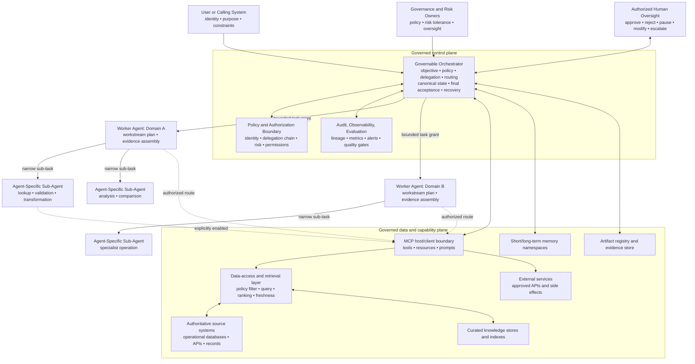
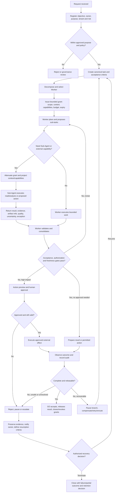
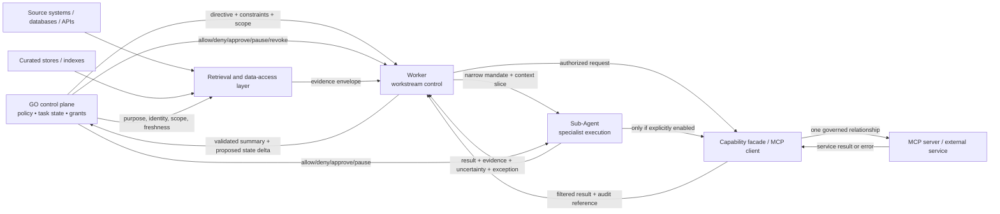
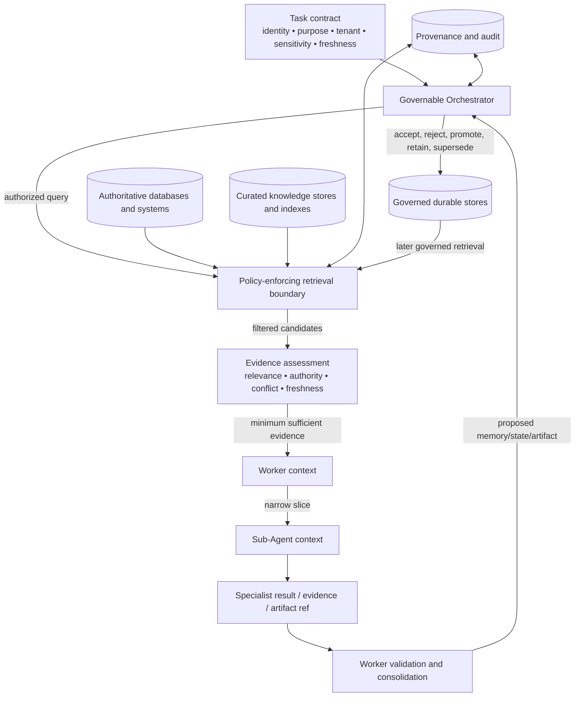

# Governed Multi-Level Agentic AI Architecture

## Governable Orchestrator → Worker Agents → Agent-Specific Sub-Agents

## Executive summary

This report defines a surface architecture for a governed multi-level Agentic AI system composed of a **Governable Orchestrator (GO)**, **Worker Agents**, and **Agent-Specific Sub-Agents**. The architecture separates organizational authority from delegated execution: the GO owns the end-to-end objective, policy envelope, delegation, canonical state, approval routing, final acceptance, audit, interruption, and recovery; Workers own bounded domains or workstreams; and Sub-Agents perform narrow specialist activities under further-attenuated authority. The hierarchy is a design synthesis rather than a protocol-mandated model.

The governing invariant is **monotonic delegation**: a child may receive only a subset of the authority approved for its parent and may not create new authority through deeper delegation, recommendations, retrieved content, skills, events, or tool descriptions. Proposal, authorization, human approval, execution, and completion remain distinct control states and audit events. This distinction prevents an agent recommendation from being mistaken for permission or a claimed result from being mistaken for a completed action. Governance is cross-cutting rather than an after-the-fact review function, consistent with NIST’s emphasis on defined responsibilities, risk tolerance, monitoring, and accountability across the AI lifecycle [1][2].

The recommended default is a **hybrid governed hierarchy**. Central policy, identity, risk controls, final release, and high-impact decisions remain at the GO boundary. Workers retain autonomy for low-risk domain execution within their grants. Event-driven notifications, blackboard-like evidence spaces, parallel fan-out/fan-in, and selectively mediated peer collaboration may be used inside those boundaries. All consequential state changes, cross-domain disclosures, capability expansions, external effects, and recovery decisions return to an accountable control boundary.

## 1. Architectural scope and principles

The architecture addresses responsibility, authority, boundaries, communication, context, data, state, governance, and lifecycle behavior. It remains at architecture level: it does not prescribe implementation code, deployment topology, model internals, proprietary products, or hidden reasoning. “Agent” denotes a governed execution actor, not an independent legal or organizational principal.

The design follows these principles:

1. **Governance is a control plane, not a monitoring add-on.** Purpose, risk tier, identity, authorization, approval, delegation, budgets, escalation, audit, and revocation must be established before and during execution.
2. **Accountability is human and organizational.** A hierarchy improves traceability but does not transfer responsibility to a Worker or Sub-Agent. Named owners retain responsibility for the use case, controls, source data, and approved risk.
3. **Authority narrows monotonically.** At every parent-child edge, the child’s authority is the intersection of the parent grant, task scope, data scope, capability scope, policy, and service-side authorization.
4. **Control and data are distinct.** Commands and policy decisions are not equivalent to observations, evidence, results, prompts, tool descriptions, events, or retrieved content.
5. **Context is bounded and intentionally lossy; authority is not.** A context window is working memory. Canonical task state, audit, provenance, permissions, and artifacts must live outside it and be reintroduced only through governed retrieval.
6. **Source truth is distinct from indexes and generated context.** Authoritative systems own business meaning and correction; curated stores and indexes support access; agents consume approved views.
7. **Least privilege and isolation are defaults.** Agents receive only the identity, context, tools, resources, data, and time required for their task. Sibling and cross-tenant access is denied unless explicitly mediated.
8. **Evidence and uncertainty propagate upward.** Lower layers return decision-relevant results, evidence references, quality indicators, conflicts, exceptions, and proposed state changes rather than silently changing global truth.
9. **Human intervention is risk-adaptive and action-specific.** High-impact, irreversible, financial, administrative, security-sensitive, externally visible, or rights-affecting actions require an appropriately authorized human decision-maker.
10. **Every loop has a budget and stop condition.** Retries, retrieval refinement, delegation depth, tool calls, cost, duration, and external effects require bounded limits and circuit breakers.

## 2. Reference architecture

The GO is the authoritative governance and coordination boundary. It may call policy, identity, memory, retrieval, artifact, evaluation, and audit services, but these services remain conceptually distinct from the agent execution layers. Workers and Sub-Agents do not receive ambient access to the GO’s full conversation, credentials, global state, or unrelated workstreams.



### Architectural roles and ownership

| Layer or component | Primary responsibility | Allowed access | Must not decide or change independently |
|---|---|---|---|
| **Governable Orchestrator** | Admit the objective; bind purpose, owner, risk and tenant; decompose and route; issue attenuated grants; own canonical state; enforce policy; route HITL; aggregate and release; pause, revoke, recover and close | Approved policies, workers, services, memory/artifact registries and global task state | Source meaning, source-owner permissions, or unrecorded expansion of authority |
| **Worker Agent** | Own a bounded domain/workstream; plan local execution; route approved capabilities; delegate narrow subtasks; validate evidence; consolidate results; report status and exceptions | Task-scoped objective slice, workstream state, approved resources, tools and sub-agent classes | Global objective changes, cross-domain disclosure, policy changes, approval of its own high-impact actions |
| **Agent-Specific Sub-Agent** | Perform a narrow specialist task; inspect approved inputs; return a bounded result, evidence, artifact reference, uncertainty or failure | Minimum necessary delegated context, data slice and capability scope | New delegation authority, global state changes, shared-memory publication, approval or concealment of failure |
| **Policy and authorization boundary** | Evaluate identity, delegation, purpose, action, target, sensitivity, risk, approval, validity, limits and revocation | Policy, identity, resource and action metadata | Treating role labels, prompts, skills, or capability negotiation as authorization |
| **MCP host/client/server surface** | Connect governed agent contexts to focused tools, resources and prompts; maintain server isolation; mediate discovery and invocation | Only the capability projection approved for the task | Assuming a listed tool, skill, or protocol capability is an enterprise permission |
| **Data-access/retrieval layer** | Apply query, tenant, document/row, sensitivity, freshness, provenance and output filters; expose approved evidence | Authorized source views, indexes, databases and APIs | Becoming the owner of source truth or relying on prompts to enforce access |
| **Source and data owners** | Own data meaning, classification, retention, correction, authoritative versions and business permissions | Their governed systems and stewardship controls | Delegating source authority to an agent merely because it can retrieve data |
| **Artifact/evidence authority** | Register, version, validate, expose, supersede, retain and release artifacts and evidence packages | Approved artifact references and metadata | Silent overwrite, provenance loss, or treating draft output as an approved deliverable |
| **Human oversight function** | Approve, reject, modify, pause, override, terminate, accept residual risk or confirm recovery within assigned authority | Action preview, evidence, risk, uncertainty, delegation chain and relevant context | Rubber-stamping without practical ability, competence or authority to intervene |

## 3. End-to-end governed workflow

The workflow is a controlled lifecycle. The system must distinguish **proposal**, **authorization**, **approval**, **execution**, **validation**, and **completion**. An output can be valid data without being an authorized action; an approval can be valid without proving execution; and a completion claim can be rejected if quality gates or evidence requirements fail.



### 3.1 Admission and task registration

The request enters the GO with the requesting principal, purpose, audience, tenant or organizational scope, data sensitivity, desired freshness, deadline, budget, and requested external effects. The GO creates a task identity and canonical record, assigns an accountable human or organizational owner, classifies risk, and checks whether the objective lies within an approved use. An ambiguous or prohibited objective is rejected or routed to governance review before delegation.

The canonical task record includes lifecycle status, acceptance criteria, assigned Worker, dependencies, delegation relationships, approvals or holds, artifact references, unresolved exceptions, policy version, and closure/retention decision. It is the source of truth for end-to-end status; lower-level status is evidence or a proposed state transition until accepted by the GO.

### 3.2 Planning and delegation

The GO selects a Worker based on domain responsibility, capability eligibility, risk, data scope and current capacity. It issues a task grant containing the objective slice, constraints, permitted resources and capabilities, output contract, context budget, time and quantity limits, approval requirements, escalation path, and expiry. The Worker may plan locally, but cannot widen the grant.

A Worker may request a Sub-Agent for a narrow operation such as lookup, comparison, validation, transformation, or independent review. The Sub-Agent receives a strict subset of the Worker’s scope and only the minimum context required. Delegation depth, fan-out, retry count, and cross-branch communication are bounded. A request to access a new data class, use a new tool, cross a tenant boundary, contact an external party, or change permissions returns to policy evaluation.

### 3.3 Decision and authorization

Authorization is contextual and action-specific. The policy boundary evaluates at material boundaries: principal and delegation chain, purpose, action class, target, resource, data sensitivity, risk, validity, approval state, separation of duties, rate/volume limits, and current revocation state. Outcomes are **allow**, **allow with conditions**, **require human approval**, **deny**, or **pause/escalate**.

Capability negotiation is not authorization. A tool advertised by an MCP server, a retrieved resource, a prompt, or a skill may inform routing but cannot grant permission. A useful routing invariant is:

> **Sub-Agent effective route = GO-approved capabilities ∩ Worker task grant ∩ Sub-Agent task scope ∩ server-side authorization.**

The intersection is checked both when capabilities are discovered and when they are invoked. A capability that becomes available dynamically, or a skill that recommends it, does not bypass policy.

### 3.4 Execution and propagation

Workers and Sub-Agents execute within their grants and return structured outcomes. A result should identify status, relevant evidence, provenance, artifact references, quality or validation state, uncertainty, conflicts, policy/approval references, and any exception. The receiving parent treats child output as untrusted data and validates it before incorporating it into task-local or canonical state.

The default propagation chain is:

```text
Sub-Agent observation / recommendation
        → Worker validation and consolidation
        → GO reconciliation against objective and acceptance criteria
        → approved result, governed action, revision, or escalation
```

Sequential delegation is appropriate for explicit dependencies. Fan-out/fan-in is appropriate for independent analyses or checks, provided the Worker or GO owns aggregation and disagreement handling. A child’s “done” event is not sufficient to advance the parent task; the owner of each state scope must accept the transition.

### 3.5 Completion

The GO determines completion after checking acceptance criteria, evidence quality, authorization, freshness, artifact integrity, unresolved exceptions, and release audience. It may return a result, publish an approved artifact, perform a separately authorized external action, provide a qualified partial outcome, or require review. On closure, the GO records accepted outputs and provenance, decides whether candidate memories may be promoted, marks transient context for retention or deletion, and closes or revokes downstream grants.

### 3.6 Failure and recovery

Failures are explicit states, not silent retries. The architecture distinguishes policy denial, unauthorized evidence, no matching evidence, stale evidence, conflicting evidence, unavailable source, invalid output, timeout, exceeded budget, suspected compromise, and external side-effect failure. The system must not convert a missing or denied result into an apparently certain answer.

On a material exception, the GO pauses the affected branch, blocks additional delegation, preserves evidence and audit lineage, and routes the matter to a named domain, security, privacy, legal, operational, or human approver. Recovery may include bounded retry, alternate Worker, authoritative-source revalidation, compensation/rollback where feasible, or controlled termination. Resumption requires explicit criteria such as restored authorization, fresh evidence, corrected input, human approval, or confirmed containment. Circuit breakers prevent retry storms and cascading failures.

## 4. Communication, control, and data flow

Communication is bidirectional but asymmetric. Downward messages carry goals, constraints, selected context, acceptance criteria, budgets, stop conditions, and attenuated authority. Upward messages carry evidence, results, status, quality indicators, artifact references, proposed state deltas, uncertainty, exceptions, and completion claims. Control authority flows downward only as a bounded grant; data and accountability flow upward for validation and acceptance.



### Communication boundaries

The GO-to-Worker boundary carries a task contract and delegation grant. The Worker-to-Sub-Agent boundary carries a narrower task contract and context projection. Lateral Worker communication is denied by default and, when required, is mediated by the GO or a governed shared artifact/event channel. MCP maintains a dedicated client relationship with each server; the server should not see the whole conversation or other servers [3][4]. Cross-server joins and forwarding are coordinated above individual client-server links.

Every inter-agent call is a trust-boundary crossing. The receiver validates sender identity, delegation relationship, recipient, freshness, scope, message/action type, and input safety. It rejects stale, overbroad, or unauthorized requests. Self-reported agent names are useful for display and audit but are not security identities. External services perform their own server-side authentication, authorization, parameter validation, and data minimization.

### State, task, artifact, and result propagation

| Propagated object | Downward form | Upward form | Authority rule |
|---|---|---|---|
| **Task** | Bounded objective, constraints, deadline, acceptance criteria | Status, dependency condition, completion claim, exception | GO owns the canonical task and lifecycle |
| **State** | Read-only or task-scoped working view | Explicit proposed state delta or checkpoint | Parent accepts, rejects, or requests revision |
| **Context** | Minimum relevant messages, evidence, references and instructions | Summaries, evidence references and requests for more context | Context never grants authority and is filtered by policy |
| **Capability** | Attenuated tool/resource/skill projection | Request for capability or authorization decision | Child cannot widen the capability intersection |
| **Artifact** | Approved reference or explicitly authorized content | Draft/accepted artifact reference, lineage, quality and audience | GO controls registration, visibility, supersession and release |
| **Result** | Output contract and validation requirements | Bounded result, evidence, confidence/quality, uncertainty, conflict and error | Result is data, not permission or canonical truth |
| **Event** | Allowed subscription classes and event schema | Fact about observed transition or failure | Publication does not authorize downstream action |

## 5. MCP, tools, skills, APIs, and capability routing

The Model Context Protocol (MCP) defines a host-client-server surface: the host coordinates multiple clients, each client maintains a dedicated relationship with one server, and servers expose focused context and capabilities [3][4]. The clean governance mapping is to place the GO in the host/policy role, give Workers only approved MCP clients or mediated capability facades, and allow Sub-Agents independent MCP access only when explicitly granted. Being a Worker or Sub-Agent does not automatically confer host or server access.

MCP server primitives have different control loci. **Tools** expose callable actions or retrieval operations; **resources** expose contextual data controlled by the application; and **prompts** expose user-controlled templates or workflow guidance. None is an authorization grant. The GO filters discovery and invocation by task, caller, data sensitivity, action impact, approval mode, budget, trust classification, and revocation. A tool result is data that must be validated, not a new instruction to expand authority.

**Skills** are governed workflow guidance and provenance-bearing context. They may describe procedures, relevant resources, and candidate tools, but their activation cannot enlarge a grant. The skill owner owns content and version; the GO owns trust and availability; the Worker applies an authorized skill within its task; and the Sub-Agent receives only a necessary excerpt. Progressive disclosure—summary first, detailed instructions only when relevant—reduces context exposure and injection risk [5].

At the conceptual API surface, clients discover capabilities, retrieve resources or prompts, invoke tools, receive results and notifications, and support cancellation or progress where available. A protected HTTP MCP server is a resource server; the client obtains an audience-bound token and presents it to that intended server. An MCP server calling an upstream API uses separate upstream authorization rather than passing through the client token [6]. This preserves the server as an authorization boundary rather than a credential tunnel.

External APIs and services require the same separation of concerns. The GO authorizes the intended action and audience; the Worker plans within its domain; the Sub-Agent may prepare or validate a request; the service validates the request and enforces its own permissions; and the GO records the result and any external side effect. Read, write, export, bulk, cross-domain, permission-changing, and policy-changing capabilities are separate action classes. A read grant does not imply write or export authority.

## 6. Context, memory, knowledge, and Agentic RAG

A context window is bounded working memory, not durable memory or the system of record. Durable memory and canonical state live outside active model context and enter through explicit, budgeted retrieval or paging. Short-term memory is task- and delegation-scoped; long-term memory is GO-governed; and Sub-Agents normally have only ephemeral local context. Context compaction may be lossy, but it must not erase canonical events, accepted state, evidence, artifact lineage, or audit records [7][8].

The GO owns memory namespaces, authorization, promotion, retention, correction, deletion, and cross-task retrieval. A Worker may maintain a local working view and propose a durable memory or checkpoint, but cannot unilaterally publish organizational memory. A Sub-Agent returns observations, state deltas, or artifact references to its Worker and does not directly alter canonical state or shared long-term memory.



Agentic RAG is a controlled data-access loop: the GO authorizes retrieval; the Worker forms focused queries; the retrieval boundary applies identity-, purpose-, tenant-, domain-, sensitivity- and document/row-level filters; evidence is assessed for authority, completeness, conflict and freshness; and the GO decides whether the evidence is sufficient for release. Multiple focused subqueries or validation calls may be used, but loop count, source set, budget and termination condition are governed [9][10].

Authoritative databases and operational systems remain the source of business truth. Curated knowledge stores normalize approved content; indexes optimize discovery; and generated context is a transient evidence view. The data-access layer should preserve the link from every representation to the authoritative object and version. Agents consume approved views and do not overwrite source truth.

A conceptual retrieval schema should travel with every retrievable object or evidence envelope:

| Metadata | Architectural purpose |
|---|---|
| Stable object and version identifiers | Link chunks, indexes and artifacts to the authoritative object |
| Source authority, owner/steward and domain/tenant | Establish accountability and scope |
| Classification/sensitivity and policy reference | Enable retrieval-time filtering and release checks |
| Source location and representation/index status | Support traceability and re-indexing |
| Effective, observed and indexed timestamps | Distinguish business validity from observation and synchronization |
| Freshness target and quality/approval state | Determine whether evidence is current and fit for use |
| Retention status and provenance reference | Govern lifecycle, lineage and correction |
| Citation label and permitted excerpt | Produce user-facing support without unnecessary disclosure |

Permission filtering occurs before evidence enters an agent context and again when evidence is composed for a downstream audience. Retrieved text is untrusted data: it may contain instructions attempting to alter authority, but it cannot change policy, delegation, tool scope, or approval state. An empty result is not proof that no information exists; it may reflect authorization filtering, no match, stale indexing, or source unavailability.

Freshness is an explicit policy input. If source and index timestamps or effective versions do not meet the task requirement, the system revalidates, labels the result as historical, returns a qualified partial result, escalates to a source owner, or refuses to answer. Conflicting sources remain visible with a declared precedence rule or escalation. Grounding and citations improve traceability but do not guarantee correctness [9][10].

Provenance links the authoritative object and version to curation/indexing, retrieval request, Worker/Sub-Agent activity, selected evidence, artifact, and final response. W3C PROV’s entity/activity/agent model provides a useful conceptual vocabulary for this lineage [11]. User-facing citations are a projection of the fuller audit and provenance chain; the architecture does not require exposing hidden reasoning.

## 7. Governance, security, permissions, and HITL boundaries

### Authorization and delegation

Authorization must evaluate **who** is acting, **on whose behalf**, **for what purpose**, **against which target**, **using which data**, **with what action**, **under what risk and approval state**, and **for how long**. Parent authority is not inherited as an ambient credential. Grants should be short-lived, scoped to audience and task, revocable independently of execution state, and invalidated by owner suspension, policy change, expiry, suspected compromise, or changed sensitivity.

The GO retains non-delegable responsibilities: global policy, approval semantics, final acceptance, cross-domain release, revocation, and recovery coordination. Workers may own local planning and execution quality, but cannot approve their own high-impact actions or turn a child recommendation into authority. Sub-Agents have the lowest trust scope and must not approve, broaden, conceal, or rewrite.

### Isolation and security

Isolation applies to identity, context, memory, tools, data, artifacts, and communication. A Worker sees its own task state and approved references, not sibling working context. A Sub-Agent sees only its delegated slice. Cross-worker sharing passes through an authorized artifact, event, or GO-mediated retrieval. Tenant, domain, sensitivity and audience boundaries remain enforced during composition and release.

Security controls include receiver-side validation of inter-agent calls, prompt-injection and untrusted-content handling, parameter validation, rate and volume limits, circuit breakers, cancellation, credential separation, server-side authorization, tamper-evident audit, and revocation propagation. Security signals include repeated denials, attempted privilege expansion, unusual tool volume, unauthorized cross-boundary communication, unexpected data export, or external behavior inconsistent with the grant. OWASP highlights trust boundaries, least privilege, validation, approval for high-impact actions, logging, and circuit breakers as agent security concerns [12].

### HITL decision boundary

HITL is required where risk, impact, irreversibility or uncertainty exceeds the configured autonomy threshold. Typical mandatory categories are financial commitments, access or permission changes, security operations, regulated or rights-affecting decisions, external communications with material effect, destructive or irreversible changes, high-sensitivity data release, and actions where evidence is conflicting or stale.

The approval preview identifies the requesting principal, full delegation path, proposed action and target, relevant data, risk tier, material uncertainty, reversibility, safeguards, and expected external effect. The human may approve, reject, edit constraints, request evidence, pause, or escalate. Approval binds to the exact action and context, expires at a defined time, and is invalidated by material changes in target, parameters, policy, risk, data, or delegation. Notification without practical ability, competence, context and authority to intervene is not meaningful oversight [1][2][12].

Proposal, authorization and approval are separate. A Worker may propose an action; the policy boundary may authorize the class; a human may approve the specific instance; and only then may execution occur. The GO records each decision and its outcome. If the human is unavailable, the default for high-impact work is pause, deny, or an explicitly governed safe fallback—not silent autonomous continuation.

## 8. Observability, evaluation, and escalation

Observability must make the system reconstructable without retaining unnecessary sensitive content. The GO’s authoritative audit record links task identity, purpose, owner, agent identities, delegation path, scope, policy and approval versions, capability and data-access decisions, execution start/stop, result and artifact references, denials, exceptions, interruptions, escalations, overrides, revocations, recovery and closure. Agents may emit operational events but cannot rewrite authoritative governance records.

Evaluation operates at multiple boundaries. Admission evaluates purpose and risk classification. Delegation evaluates scope attenuation and capability eligibility. Retrieval evaluates access, authority, freshness, completeness and provenance. Workers evaluate specialist outputs against contracts. The GO evaluates cross-workstream consistency, acceptance criteria, release audience, policy compliance and residual uncertainty. External effects require outcome observation, not merely a successful tool response.

Useful architecture-level measures include unauthorized-call rate, policy-denial and attempted-escalation rate, delegation depth and fan-out, context and data exposure, retrieval precision/coverage, citation and provenance completeness, freshness compliance, conflict rate, human approval latency and override rate, retry/circuit-breaker activation, task completion quality, false completion rate, recovery time, and unresolved exception age. Metrics must be interpreted with data sensitivity and purpose limitations; optimization for throughput must not weaken control boundaries.

Escalation routes are named and risk-specific. Domain owners handle semantic or business conflicts; source owners handle data correctness and freshness; security handles compromise or privilege anomalies; privacy/legal handles sensitive disclosure and rights-impacting cases; operations handles availability and recovery; and authorized human approvers decide material actions or residual risk. Escalation freezes affected authority and preserves evidence before seeking resolution.

## 9. Coordination pattern comparison

The patterns below are not mutually exclusive. A system can be hierarchical in authority, event-driven in notification, blackboard-like in evidence sharing, and centralized at its final acceptance boundary.

| Pattern | Ownership and boundary | Control/data flow | Strengths | Governance and failure trade-offs | Appropriate use |
|---|---|---|---|---|---|
| **Centralized** | GO owns global state, policy, routing and final acceptance; Workers/Sub-Agents are subordinate execution boundaries | Top-down dispatch; bottom-up results, evidence and exceptions, mostly through GO | Strong policy visibility, consistent prioritization, clear audit and revocation | GO is throughput, availability and attack concentration point; local latency and over-centralization can grow | High-risk, tightly coupled workflows requiring one accountable decision boundary |
| **Hierarchical** | GO governs Workers; each Worker owns a bounded Sub-Agent subtree | Commands and constraints descend; validated summaries and escalations ascend; local detail stays local | Scalable decomposition, specialization, abstraction and local autonomy | Misdecomposition, stale summaries, cascading errors, authority ambiguity and parent failure can affect a subtree | Default structure for Governable Orchestrator → Worker → Sub-Agent |
| **Peer-to-peer** | Peers own local tasks and negotiate without a permanent superior; GO may provide policy or convening | Lateral proposals, commitments, direct data exchange and consensus | Responsiveness, resilience and no single coordination bottleneck | Many identity/authorization relationships; difficult global policy, convergence, conflict resolution and end-to-end audit | Bounded local collaboration where no single global ordering or final acceptance is required |
| **Blackboard** | Shared problem-space is the data boundary; GO or delegated controller owns admission, promotion and conflict policy | Agents publish observations, hypotheses and status; eligible agents react to state | Loose coupling, heterogeneous specialists and shared situational awareness | Contention, stale/conflicting contributions, unclear provenance and mistaken visibility for authority | Evidence assembly, incremental analysis and coordination around governed shared artifacts |
| **Event-driven** | Producers own events/facts; consumers own reactions; mediator may own workflow state | Asynchronous publish/subscribe, triggers, replay or notifications | Decoupling, fan-out, responsiveness and independent local views | Eventual consistency, duplicates/order/replay issues, weak transaction ownership and delayed visibility | Milestones, telemetry, exceptions and cross-boundary notifications; not sole authority for consequential commits |
| **Hybrid** | GO retains policy, safety, budgets and final acceptance; Workers own local plans; events/blackboards/peers support bounded execution | Strategic top-down control plus local negotiation, shared evidence and event triggers | Balances governability, resilience, specialization and fit-for-purpose coordination | Mixed synchronization and overlapping ownership can create policy gaps or contradictory state | Recommended general architecture, with explicit precedence, state ownership and escalation rules |

Centralized and hierarchical modes provide the strongest traceability. Peer-to-peer and broker-style event-driven modes improve local resilience but move complexity into identity, authorization, conflict resolution, convergence and audit. A mediator can restore workflow ownership and restart control but may recreate a bottleneck. Blackboard visibility must never be confused with authority to approve, overwrite or promote. Hybrid design is advantageous only when the precedence of GO policy over local decisions, the owner of shared state, and the boundary for external effects are explicit [13][14][15].

## 10. Design rules and decision checklist

The following rules should be treated as architecture acceptance criteria:

1. **Name an accountable owner** for the use case, each Worker domain, each Sub-Agent capability, each source, each artifact, each policy and each approval class.
2. **Register purpose, risk, audience, sensitivity, freshness, budget, deadline and stop conditions** before delegating work.
3. **Represent delegation as a chain** with explicit scope, expiry, parent, purpose, permitted actions, resources, data classes, approval gates and revocation state.
4. **Enforce attenuation at every edge**; a child’s scope is never the union of parent recommendations, tool catalogs, skill instructions, retrieved content or peer requests.
5. **Separate proposal, authorization, approval, execution, validation and completion** in both control flow and audit.
6. **Keep canonical task state at the GO**; accept child and Worker status only through explicit state transitions or quality gates.
7. **Treat memory, context, artifacts and evidence as different classes** with different owners, visibility, retention and promotion rules.
8. **Use mediated retrieval** with permission filters before context ingress and release filters after composition.
9. **Keep source systems, curated knowledge stores, indexes, databases, APIs and generated context distinct**; preserve stable IDs, versions, timestamps, freshness and provenance.
10. **Treat MCP capability negotiation, tools, resources, prompts and skills as routing/context mechanisms, not authorization grants.**
11. **Separate read, write, export, bulk, cross-domain, external-effect and policy-changing capabilities.**
12. **Default to isolation** for worker context, sub-agent context, memory namespaces, sibling communication, credentials and artifacts.
13. **Require human approval for high-impact or irreversible effects**, and bind approval to the precise action and current context.
14. **Make uncertainty, conflict, stale evidence, denial, unavailability and partial completion visible**; never silently fill governance gaps with generation.
15. **Instrument every material boundary** with policy decision, data-access, delegation, result, exception, approval, recovery and revocation events.
16. **Bound loops and failures** using deadlines, budgets, delegation depth, fan-out, retries, circuit breakers and cancellation.
17. **Define recovery before execution**: pause behavior, evidence preservation, owner notification, compensating action, revalidation, resumption criteria and termination outcome.
18. **Test the architecture adversarially** for prompt injection, confused deputy behavior, privilege escalation through delegation, data exfiltration, stale or conflicting retrieval, approval bypass, replay, duplicate events and false completion.
19. **Keep final release as a disclosure decision.** Permission to retrieve information does not automatically authorize sending it to the requested audience.
20. **Prefer the least complex coordination pattern that satisfies the need**, and document why any peer, blackboard or event-driven autonomy remains within the GO’s policy and accountability boundary.

## Conclusion

A governed multi-level Agentic AI system is not defined by how many agents it contains, but by how clearly it separates authority, context, data, state, execution and accountability. The GO supplies the durable control boundary; Workers provide bounded domain coordination; and Sub-Agents provide narrow specialist execution. MCP, tools, skills, APIs, retrieval systems, memory stores, databases and external services become safe architectural components when their capabilities are projected through explicit policy rather than inherited from hierarchy or inferred from content.

The resulting system can support sequential, parallel, event-driven, blackboard and selectively peer-based coordination without abandoning governance. Its essential properties are monotonic delegation, least privilege, mediated context, source-aware Agentic RAG, explicit state and artifact ownership, risk-adaptive HITL, complete but minimized provenance, observable quality gates, and recoverable failure. These properties preserve both useful autonomy and accountable human control.

## References

[1]: https://www.nist.gov/itl/ai-risk-management-framework "NIST, Artificial Intelligence Risk Management Framework"

[2]: https://nvlpubs.nist.gov/nistpubs/ai/NIST.AI.100-1.pdf "NIST, Artificial Intelligence Risk Management Framework (AI RMF 1.0), NIST AI 100-1"

[3]: https://modelcontextprotocol.io/specification/2026-07-28/architecture "Model Context Protocol, Architecture"

[4]: https://modelcontextprotocol.io/specification/2026-07-28/server "Model Context Protocol, Server Features: Overview"

[5]: https://modelcontextprotocol.io/community/working-groups/skills-over-mcp "Model Context Protocol, Skills Over MCP Charter"

[6]: https://modelcontextprotocol.io/specification/2025-06-18/basic/authorization "Model Context Protocol, Authorization"

[7]: https://arxiv.org/abs/2310.08560 "MemGPT: Towards LLMs as Operating Systems"

[8]: https://arxiv.org/abs/2304.03442 "Generative Agents: Interactive Simulacra of Human Behavior"

[9]: https://csrc.nist.gov/glossary/term/retrieval_augmented_generation "NIST Glossary, Retrieval-Augmented Generation"

[10]: https://proceedings.neurips.cc/paper_files/paper/2020/hash/6b493230-Abstract.html "Lewis et al., Retrieval-Augmented Generation for Knowledge-Intensive NLP Tasks"

[11]: https://www.w3.org/TR/prov-overview/ "W3C, PROV-Overview: An Overview of the PROV Family of Documents"

[12]: https://cheatsheetseries.owasp.org/cheatsheets/AI_Agent_Security_Cheat_Sheet.html "OWASP, AI Agent Security Cheat Sheet"

[13]: https://arxiv.org/html/2508.12683 "Moore, A Taxonomy of Hierarchical Multi-Agent Systems: Design Patterns, Coordination Mechanisms, and Industrial Applications"

[14]: https://ieeexplore.ieee.org/document/1425173/ "Dong, Chen, and Jeng, Event-based Blackboard Architecture for Multi-Agent Systems"

[15]: https://learn.microsoft.com/en-us/azure/architecture/guide/architecture-styles/event-driven "Microsoft Azure Architecture Center, Event-driven Architecture Style"

[16]: https://eur-lex.europa.eu/eli/reg/2024/1689/oj/eng "European Parliament and Council, Regulation (EU) 2024/1689 (Artificial Intelligence Act)"
