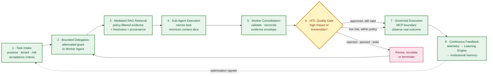

# Governed Multi-Brand Agentic AI System
## Surface Architecture & Specification

A tenant-agnostic reconstruction of the *Marketing Intelligence & Operating System* reference design, generalized from a single-brand marketing stack to a multi-brand operating system spanning e-commerce, product management, brand portfolios, headless CMS, marketing, social content, and website operations.

> **Central Invariant**
>
> Governed access and planning are centralized through the Intelligence Engine; execution is distributed across bounded Worker Agents and isolated Sub-Agents. Durable data remains centrally governed, and no agent may expand its authority or access data directly.

Three corollaries follow from that invariant and constrain everything below:

1. **Authority narrows monotonically.** At every parent–child edge the child's authority is the intersection of the parent grant, task scope, data scope, capability scope, policy, and server-side authorization. Depth of delegation never manufactures new permission.
2. **Control and data are distinct.** A recommendation is not an authorization. A retrieved document is not an instruction. A tool listing is not a business permission. A child's "done" claim is not a completed action.
3. **Context is bounded and lossy; authority is not.** Canonical task state, audit, provenance, permissions, and artifacts live outside the context window and re-enter only through governed retrieval.

---

## 1. Surface Architecture Flowchart

```mermaid
flowchart TB

%% ============ 1 · GOVERNANCE AND HUMAN AUTHORITY ============
subgraph L0["1 · Governance and Human Authority"]
    direction LR
    OWNER["Brand / Business Owner<br/>objective · tenant and brand scope · risk appetite"]
    POLRISK["Policy and Risk Authority<br/>approved purposes · autonomy tiers · prohibitions"]
    HITL{"HITL Quality Gate<br/>approve · revise · reject · pause · escalate"}
end

%% ============ 2 · CENTRAL CONTROL PLANE ============
subgraph L1["2 · Governable Intelligence Engine — Central Control Plane"]
    IE["Intelligence Engine (Orchestrator)<br/>brand persona resolution · global decomposition<br/>context assembly · dynamic capability routing<br/>synthesis · validation · final acceptance · recovery"]
    PAB["Policy and Authorization Boundary<br/>identity · delegation chain · monotonic attenuation · risk tier"]
    CTS[["Canonical Task State<br/>lifecycle · acceptance criteria · holds · exceptions"]]
end
IE <--> PAB
IE <--> CTS

OWNER -->|"objective + tenant / brand scope"| IE
POLRISK -->|"versioned policy envelope"| PAB
IE -->|"action preview · evidence dossier · uncertainty · delegation chain"| HITL
HITL -->|"approval bound to this action and context"| IE

%% ============ 3 · AGENTIC RAG AND GOVERNED DATA ACCESS ============
subgraph L2["3 · Agentic RAG and Governed Data Access Layer"]
    RAG["Agentic RAG Controller<br/>tenant / identity / sensitivity filtering · query · rank<br/>freshness · schema check · provenance capture"]
    MCPD["MCP Data Boundary<br/>read-scoped capability facades"]
end
RAG <--> MCPD
IE <-->|"authorized query · purpose · freshness target"| RAG

subgraph LDATA["4 · Systems of Record — single source of truth"]
    direction LR
    CDB[("Central Enterprise Database<br/>tenant ID · owner · schema version · lineage · retention")]
    CMS[("Headless CMS and Website<br/>content models · pages · catalog")]
    MEM[("Governed Memory Store<br/>long-term memory · brand books · claims registry")]
    ART[("Artifact and Evidence Registry<br/>versioned deliverables by URI / UUID")]
end
MCPD <--> CDB
MCPD <--> CMS
MCPD <--> MEM
MCPD <--> ART

%% ============ 5 · WORKER AGENTS ============
GRANT["Bounded Task Grant  ▼<br/>objective slice · data scope · approved tools and skills<br/>budget · stop conditions · expiry"]
EVID["Evidence Envelope  ▲<br/>findings · confidence and uncertainty · artifact refs<br/>exceptions · proposed state deltas"]

subgraph L3["5 · Worker Agents — bounded domain execution contexts"]
    W_PROD["Product / Knowledge<br/>and Evidence Engine"]
    W_VOICE["Customer Voice<br/>Engine"]
    W_COMP["Competitor Intel<br/>Engine"]
    W_STRAT["Strategy<br/>Engine"]
    W_CREAT["Creative and Content<br/>Engine"]
    W_DEV["Development<br/>Engine"]
    W_LEARN["Learning and<br/>Performance Engine"]
end

IE --> GRANT
GRANT --> L3
L3 --> EVID
EVID --> IE

subgraph L4["6 · Agent-Specific Sub-Agents — ephemeral least-privilege specialists"]
    S_PROD["Claim Verifier<br/>Dossier Validator"]
    S_VOICE["Ticket Classifier<br/>Sentiment Parser"]
    S_COMP["Price Scraper<br/>Ad Library Tracker"]
    S_STRAT["Funnel Analyst<br/>Budget Allocator"]
    S_CREAT["Copy Drafter<br/>Hook Critic"]
    S_DEV["Component Coder<br/>Schema Validator"]
    S_LEARN["Attribution Modeler<br/>Fatigue Detector"]
end

W_PROD <--> S_PROD
W_VOICE <--> S_VOICE
W_COMP <--> S_COMP
W_STRAT <--> S_STRAT
W_CREAT <--> S_CREAT
W_DEV <--> S_DEV
W_LEARN <--> S_LEARN

L3 -.->|"mediated retrieval request"| RAG
RAG -.->|"policy-filtered evidence + provenance"| L3
L4 -.->|"narrow route, only when explicitly enabled"| RAG

%% ============ 7 · GOVERNED EXECUTION PERIMETER ============
subgraph L5["7 · Governed Execution Perimeter"]
    MCPX["MCP Host / Client Boundary<br/>capability projection: tools · resources · prompts · skills<br/>discovery is not authorization"]
end
IE -->|"authorized execution directive, post-approval"| MCPX

subgraph LEXT["8 · External Channels and Services"]
    direction LR
    CHAN["Ad and Social Platforms<br/>Meta · TikTok · Google · marketplaces"]
    EAPI["Approved External APIs<br/>ad libraries · market data · repositories"]
end
MCPX -->|"staged then released changes"| CMS
MCPX -->|"approved campaign and content publication"| CHAN

CHAN -.->|"performance telemetry"| MCPD
CMS -.->|"site and content analytics"| MCPD
EAPI -.->|"external market signals"| MCPD
W_LEARN -.->|"continuous learning loop: validated optimisation signals"| IE

%% ============ 9 · AUDIT ============
subgraph LAUD["9 · Audit, Lineage and Provenance"]
    AUD[("Tamper-evident Audit and Provenance Registry<br/>W3C PROV: entities · activities · agents<br/>delegations · approvals · tool calls · releases")]
end
IE -.-> AUD
PAB -.-> AUD
HITL -.-> AUD
RAG -.-> AUD
MCPX -.-> AUD

%% ============ STYLING ============
classDef gov fill:#e8f0fe,stroke:#1a73e8,stroke-width:2px,color:#174ea6;
classDef gate fill:#fff4c2,stroke:#d97706,stroke-width:2.5px,color:#7c2d12;
classDef orch fill:#f3e8fd,stroke:#7b1fa2,stroke-width:2.5px,color:#4a148c;
classDef rag fill:#d7f2ee,stroke:#00796b,stroke-width:2px,color:#00443c;
classDef worker fill:#e6f4ea,stroke:#2e7d32,stroke-width:2px,color:#14532d;
classDef sub fill:#fff1e0,stroke:#e65100,stroke-width:1.5px,stroke-dasharray:4 3,color:#9a3412;
classDef store fill:#ece6f8,stroke:#512da8,stroke-width:2px,color:#2e1065;
classDef ext fill:#fce4ec,stroke:#c2185b,stroke-width:1.5px,color:#831843;
classDef bus fill:#ffffff,stroke:#4b5563,stroke-width:1.5px,stroke-dasharray:5 4,color:#111827;

class OWNER,POLRISK gov;
class HITL gate;
class IE,PAB,CTS orch;
class RAG,MCPD,MCPX rag;
class W_PROD,W_VOICE,W_COMP,W_STRAT,W_CREAT,W_DEV,W_LEARN worker;
class S_PROD,S_VOICE,S_COMP,S_STRAT,S_CREAT,S_DEV,S_LEARN sub;
class CDB,CMS,MEM,ART,AUD store;
class CHAN,EAPI ext;
class GRANT,EVID bus;
```

### How to read the diagram

| Visual | Meaning |
| :--- | :--- |
| **Solid arrow** | Authority and control flow — grants, directives, approvals, authorized execution. |
| **Dotted arrow** | Evidence, telemetry, provenance, and audit — data that must be validated, never obeyed. |
| **Layers 1–2** | Governance and the single accountable decision boundary. |
| **Layers 3–4** | The only sanctioned path to durable data. |
| **Layers 5–6** | Distributed execution under attenuated authority. |
| **Layer 7** | The only path to an external effect, and it opens only after Layer 1 clears it. |

Four structural facts are worth stating explicitly, because they are what make the design governable rather than merely modular:

- **No engine touches a system of record.** Every read and every write in Layer 4 is mediated by the Agentic RAG Controller, which applies tenant, identity, sensitivity, row/document, freshness, and schema filters *before* content enters any agent context, and applies release filters again after composition.
- **Sub-Agents never appear on an execution path.** Layer 6 has no edge into Layer 7. A sub-agent can propose, verify, draft, or measure; it cannot publish, spend, or commit.
- **The HITL gate is on the critical path, not adjacent to it.** For high-impact work the Intelligence Engine cannot reach Layer 7 without a returning approval edge that is bound to that specific action and context.
- **The learning loop returns as signal, not as instruction.** Channel telemetry re-enters through the same governed data boundary as any other evidence, is interpreted by the Learning Engine inside its grant, and reaches the control plane as a validated proposal.

### The three edges that carry all governance

**Downward — the Bounded Task Grant.** Every delegation carries an objective slice, scope boundary, data permissions, approved tools and skills, token/cost budget, approval requirements, escalation path, stop conditions, and expiry. A Worker may plan freely inside the grant; it cannot widen it.

**Upward — the Evidence Envelope.** Every return carries findings, provenance and citations, confidence and uncertainty intervals, candidate artifact references, conflicts, exceptions, and *proposed* state deltas. The receiving parent treats child output as untrusted data and validates it before it touches canonical state.

**Sideways — the Effective Route.** Capability discovery is not authorization. Effective authority is computed per invocation:

$$\text{Effective Route} = \text{IE Policy} \;\cap\; \text{Worker Task Grant} \;\cap\; \text{Sub-Agent Scope} \;\cap\; \text{Server Authorization}$$

The intersection is evaluated twice — when capabilities are discovered and again when they are invoked — so a capability that appears mid-task, or a skill that recommends one, cannot bypass a policy gate. Skills supply procedural guidance and context only; activating a skill never enlarges a grant.

---

## 2. Roles & Boundaries Matrix

### 2.1 Governance, control, and data plane

| Component | Primary ownership | Permitted access | Non-negotiable prohibitions |
| :--- | :--- | :--- | :--- |
| **Brand / Business Owner** | Defines the objective, tenant and brand scope, constraints, and accepted residual risk. Named accountable party for the use case. | Task intake, released outcomes, escalations within remit. | Cannot transfer accountability to an agent; cannot lower a risk tier to avoid an approval gate. |
| **Policy & Risk Authority** | Approved purposes, prohibited uses, autonomy tiers, approval classes, retention and review expectations, policy versioning. | Policy registry, agent/owner inventory, audit summaries. | Cannot execute work; cannot substitute itself for the designated per-action HITL reviewer. |
| **HITL Quality Gate** | Explicit human sign-off for high-impact, irreversible, financial, legal, security-sensitive, or production-release actions. | Full action preview: proposed effect, target, evidence dossier, uncertainty intervals, reversibility, safeguards, and the complete delegation chain. | Cannot be treated as passive notification. Approval is not transferable to another action, target, or later execution, and is void once material parameters, policy, risk, or evidence change. |
| **Intelligence Engine (Orchestrator)** | Global strategy, brand persona resolution, task decomposition, canonical state, capability routing, context assembly, validation, HITL routing, final acceptance, recovery. | Supervisory access to the Agentic RAG layer, policy boundary, memory and artifact registries, and audit log. | Cannot alter underlying business data definitions or source-owner permissions; cannot bypass HITL for high-impact actions; cannot grant authority it does not itself hold. |
| **Policy & Authorization Boundary** | Per-invocation evaluation of identity, delegation chain, purpose, action class, target, data sensitivity, risk, approval state, separation of duties, rate limits, expiry, and revocation. | Policy, identity, resource, and action metadata. | Cannot treat role labels, tool catalogs, skills, prompts, or retrieved text as authorization. Fails closed for high-impact actions. |
| **Canonical Task State** | Authoritative lifecycle state machine: status, acceptance criteria, dependencies, delegations, approvals, holds, artifact references, unresolved exceptions, closure. | Owned exclusively by the Intelligence Engine. | Cannot be advanced by a child's completion claim; Workers and Sub-Agents submit deltas that are accepted, rejected, or returned for revision. |
| **Agentic RAG & Access Layer** | Governed access to the Central Database and CMS: query filtering by identity, tenant, and sensitivity; ranking; freshness; schema checks; provenance capture. | Read/write access to the Central Database and CMS under strict schema and policy constraints. | Cannot set business strategy, delegate tasks, or approve actions. Cannot become the owner of source truth. Must not let an empty result be reported as an absence of information. |
| **MCP Capability Boundary** (data + execution) | Capability projection of tools, resources, prompts, and skills; server isolation; mediation of discovery and invocation; audience-bound tokens. | Only the capability projection approved for the specific task and caller. | Cannot treat an advertised capability as an enterprise permission; cannot tunnel client credentials to upstream APIs; cannot expose one server's context to another. |
| **Systems of Record** (Central DB, Headless CMS) | Record meaning, classification, retention, correction, and authoritative versions. Every record carries Tenant/Brand ID, Owner, Schema Version, Freshness Timestamp, Access Policy, Lineage, and Retention metadata. | Their own governed records. | Cannot delegate source authority to an agent merely because that agent can retrieve from them. Uncontrolled local duplication by any agent is prohibited. |
| **Governed Memory Store** | Long-term memory namespaces, promotion, retention, correction, and deletion. | Scoped retrieval through the RAG layer under Intelligence Engine authorization. | No agent writes directly. Promotion from session memory requires a governed review decision; correction and deletion must propagate to derived summaries and indexes. |
| **Artifact & Evidence Registry** | Registration, versioning, validation state, supersession, retention, and release of deliverables referenced by URI/UUID. | Approved artifact references and metadata. | Silent overwrite; provenance loss; treating a draft as an approved deliverable; embedding artifact bodies inline in context instead of by reference. |
| **Audit & Provenance Registry** | Tamper-evident W3C PROV record of entities, activities, agents, delegations, approvals, tool calls, denials, overrides, and releases. | Append-oriented event stream from every control point. | Agents may emit operational events but cannot rewrite authoritative governance records. |

### 2.2 Worker Engines and Sub-Agents

| Engine | Domain responsibilities | Permitted access & capabilities | Prohibitions |
| :--- | :--- | :--- | :--- |
| **Product / Knowledge & Evidence** | Canonical product specifications, formulation evidence, regulatory claims, brand rules, compliance dossiers. | Read-only product catalogs and compliance registries via the Intelligence Engine. | Cannot alter compliance rules; cannot communicate laterally with peer engines. |
| **Customer Voice** | Reviews, support tickets, survey feedback, sentiment, objections, and unmet desires. | Anonymized customer feedback datasets via the Intelligence Engine. | Cannot access or export unredacted PII; cannot execute customer communications. |
| **Competitor Intel** | Competitor pricing, ad libraries, creative trends, positioning shifts, market benchmarks. | External ad-library trackers and market data tools via a governed MCP client. | Cannot access internal customer records; cannot alter live pricing. |
| **Strategy** | Omnichannel roadmaps, funnel prioritization, campaign concepts, budget allocation proposals. | Analytical summaries and market signals via the Intelligence Engine. | Cannot self-approve spend; cannot commit live ad campaigns. |
| **Creative & Content** | Multi-channel copy, hooks, scripts, image/video briefs, social post proposals. | Brand kits, style guidelines, and generative tools via a governed MCP client. | Cannot publish directly to the CMS or to ad platforms. |
| **Development** | UI components, layout templates, responsive code, CMS schemas, technical website updates. | Staging schemas, sandbox preview environments, and linters via an MCP client. | Cannot push unapproved changes to production CMS or repositories. |
| **Learning & Performance** | Attribution modeling, performance decay analysis, creative fatigue detection, ROAS measurement. | Channel telemetry (Meta, TikTok, Google), CMS analytics, and historical conversion data. | Cannot execute live bid updates; cannot modify historical financial logs. |
| **Agent-Specific Sub-Agents** | One narrow task each — price scraping, copy drafting, schema validation, attribution modeling, claim verification, ticket classification. | Minimum necessary context slice and a single assigned micro-tool, for the duration of one execution cycle. | Cannot alter canonical state; cannot write to durable memory; cannot communicate across workers; cannot approve, broaden, conceal, or rewrite. |

**Shared Worker-layer rules.** Every engine owns its domain plan and evidence assembly, not the data itself. Lateral engine-to-engine communication is denied by default; where cross-domain input is genuinely needed it is mediated by the Intelligence Engine or passes through a registered artifact. No engine may approve its own high-impact proposal, and no engine may convert a sub-agent recommendation into authority.

---

## 3. End-to-End Workflow Walkthrough

**1 · Task Intake.** A brand owner or business process submits an objective. The Intelligence Engine binds it to a tenant/brand scope, an approved purpose, an accountable owner, a risk tier, a data sensitivity ceiling, a freshness requirement, and a budget, then creates the canonical task record with explicit acceptance criteria. An ambiguous or out-of-purpose objective is rejected or routed to governance review *before* any delegation occurs.

**2 · Bounded Delegation.** The Intelligence Engine decomposes the objective and selects engines by domain responsibility, capability eligibility, risk, and data scope. Each receives a bounded task grant. Authority narrows at this edge and at every edge below it; a request to reach a new data class, use a new tool, cross a tenant boundary, or contact an external party returns to policy evaluation rather than proceeding.

**3 · Mediated RAG Retrieval.** The engine forms focused queries; the Agentic RAG Controller applies identity, purpose, tenant, sensitivity, and row/document filters before any content enters an agent context, then returns candidates with provenance, version, and freshness metadata. Retrieved text is untrusted data — it may contain instructions, but it cannot change policy, delegation, tool scope, or approval state. Stale, conflicting, denied, or empty results are surfaced as control outcomes, never resolved by generation.

**4 · Specialist Sub-Agent Execution.** The engine spawns ephemeral sub-agents for narrow work, each receiving a strict subset of the engine's scope and only the minimum context required. Delegation depth, fan-out, retry count, and cross-branch communication are bounded. Each sub-agent returns a bounded result with evidence, uncertainty, and any exception — including an honest failure.

**5 · Worker Consolidation.** The engine validates sub-agent output against its output contract, reconciles disagreement between parallel specialists, and assembles a single evidence envelope with findings, confidence intervals, artifact references, conflicts, and proposed state deltas. It reports what it could not establish as clearly as what it could.

**6 · HITL Quality Gate.** The Intelligence Engine reconciles all envelopes against the acceptance criteria and classifies the resulting action. Low-risk, reversible outputs proceed under delegated authority. High-impact, irreversible, financial, legal, security-sensitive, or externally visible actions generate an action preview — proposed effect, target, evidence dossier, uncertainty, reversibility, safeguards, full delegation chain — for an authorized reviewer who may approve, reject, edit constraints, request more evidence, pause, or escalate. If no approver is reachable within the risk-defined deadline, the default is pause or deny, never silent continuation.

**7 · Governed Execution.** Only after authorization, and approval where required, does the Intelligence Engine issue an execution directive through the MCP boundary — publishing to the CMS, releasing a campaign, merging a staged schema change. The system observes the real outcome rather than trusting a successful tool response, and records the external effect, its approval reference, and its provenance in the audit registry.

**8 · Continuous Feedback Loop.** Downstream performance data from ad platforms, CMS analytics, and conversion systems re-enters through the same governed data boundary as any other evidence. The Learning & Performance Engine translates outcomes into attribution, decay, and fatigue signals; the Intelligence Engine decides what is reliable enough to promote into long-term institutional memory and what should adjust routing, budgets, or policy on the next cycle.

### Control-state separation

The lifecycle deliberately keeps six states distinct in both control flow and audit. Collapsing any pair is the most common way a governed system silently becomes an ungoverned one.

| State | Question it answers | Owner |
| :--- | :--- | :--- |
| **Proposal** | What does the system suggest doing? | Worker Agent |
| **Authorization** | Is this *class* of action permitted for this actor, target, and data? | Policy & Authorization Boundary |
| **HITL Approval** | Is this *specific instance* approved, right now, on this evidence? | Named human reviewer |
| **Execution** | Was the permitted action actually attempted? | MCP execution perimeter |
| **Validation** | Did the real-world outcome match the intent and quality bar? | Intelligence Engine |
| **Completion** | Is it accepted, released, and closed? | Intelligence Engine |

An output can be valid data without being an authorized action; an approval can be valid without proving execution; and a completion claim can be rejected when quality gates or evidence requirements fail.

---

## 4. Multi-Brand Tenant Isolation

Multi-brand support is a **configuration property of the control plane, not a structural variant of it**. Every brand — a DTC skincare line, a B2B portfolio account, a marketplace storefront, a headless-CMS microsite — runs through the same nine layers, the same delegation edges, and the same approval gates. What changes is the envelope bound at intake and enforced at retrieval.

| Dimension | Varies per tenant (configuration) | Architecturally fixed |
| :--- | :--- | :--- |
| **Brand persona** | Voice, claims posture, style rules, prohibited language, category conventions. | The persona is *data* resolved by the Intelligence Engine at intake — never branching logic. Engines inherit it through the grant. |
| **Data scope** | Tenant/Brand ID, schema namespace, sensitivity ceiling, catalog and CMS partitions. | The filter is applied at the RAG boundary before context ingress, and again at release. Never in a prompt. |
| **Policy envelope** | Autonomy tiers, approval thresholds, regulated-claim rules, spend limits. | The policy boundary evaluates per invocation against a versioned policy; a policy change re-opens pending approvals. |
| **Memory** | A dedicated long-term namespace per tenant, plus project and reference scopes. | Promotion requires governed review; cross-tenant retrieval is denied by default. |
| **Capabilities** | Per-tenant MCP server registrations, ad-account bindings, CMS endpoints, audience-bound tokens. | Discovery is not authorization; tokens are never reused across tenants or forwarded upstream. |
| **Human oversight** | Named approvers and escalation paths per brand and per risk class. | Approval binds to a specific action and context and expires. |
| **Artifacts** | A partitioned registry per tenant. | Versioned, referenced by URI/UUID, with lineage back to the generating task. |

**Isolation defaults to deny.** A Strategy Engine working on Brand A cannot see Brand B's working context, memory namespace, artifacts, or credentials — not because a rule forbids it downstream, but because the retrieval boundary never returns cross-tenant candidates in the first place. Tenant, domain, sensitivity, and audience boundaries are re-enforced during composition and again at release, so an engine that legitimately reads something is still not authorized to disclose it to an arbitrary audience.

**Portfolio and cross-brand work is an explicit, mediated exception.** Comparative analytics across a brand portfolio — shared category benchmarks, group-level ROAS, common supplier evidence — is not achieved by relaxing isolation. It is a separately authorized task with its own purpose registration, its own aggregation and de-identification rules, its own release audience check, and its own approval class. The Intelligence Engine is the only component that may compose across tenant scopes, and it does so under a grant that names the brands involved.

**Onboarding a brand is a registration event.** It requires a tenant record, a persona definition, a policy envelope, data-scope bindings, named approvers, and MCP registrations. It requires no new engines, no new control paths, and no changes to the delegation or approval model. That is the practical test of whether this architecture is genuinely multi-tenant: adding the tenth brand should look exactly like adding the second.

---

## 5. Architectural Acceptance Criteria

Ten checks that distinguish this design from a hierarchy of agents that merely *looks* governed:

1. Every use case, engine domain, data source, artifact, policy, and approval class has a **named accountable human owner**.
2. Purpose, risk tier, tenant scope, audience, sensitivity, freshness, budget, and stop conditions are **registered before delegation**, not inferred during it.
3. Delegation is represented as an **inspectable chain** with scope, parent, expiry, permitted actions, data classes, approval gates, and revocation state.
4. **Attenuation is enforced at every edge.** A child's scope is never the union of parent recommendations, tool catalogs, skill instructions, retrieved content, or peer requests.
5. Proposal, authorization, approval, execution, validation, and completion remain **separate in both control flow and audit**.
6. Canonical task state stays at the Intelligence Engine; child status is accepted only through **explicit state transitions** that pass a quality gate.
7. Retrieval applies **permission filters before context ingress and release filters after composition** — never prompt-level instructions to "not reveal" restricted content.
8. MCP capability negotiation, tools, resources, prompts, and skills are treated as **routing and context mechanisms, not authorization grants**; read, write, export, bulk, cross-domain, external-effect, and policy-changing capabilities are separate action classes.
9. Uncertainty, conflict, stale evidence, denial, unavailability, and partial completion are **visible outputs**; governance gaps are never filled with generation.
10. Every loop has a **budget and a stop condition** — retries, retrieval refinement, delegation depth, fan-out, tool calls, cost, duration, and external effects — with circuit breakers and a defined recovery path decided before execution begins.

---

*Scope note: this specification is deliberately surface-level. It defines authority, boundaries, ownership, data flow, and lifecycle. It does not prescribe deployment topology, frameworks, model selection, service decomposition, or implementation code — all of which can vary beneath these boundaries without changing the governance properties described here.*
